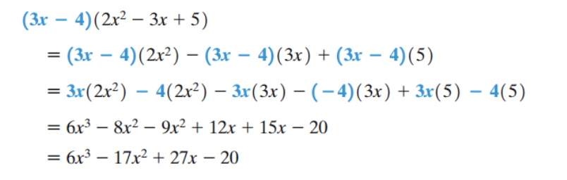
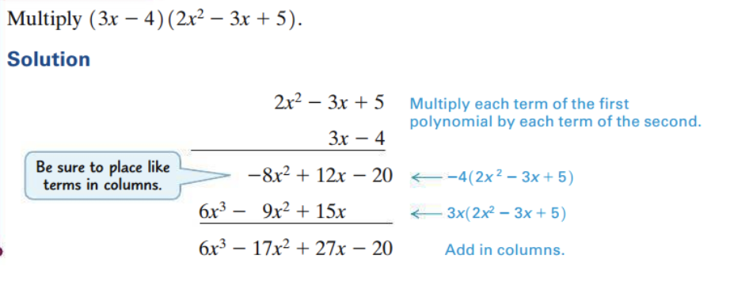
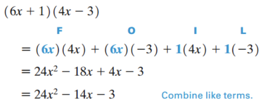
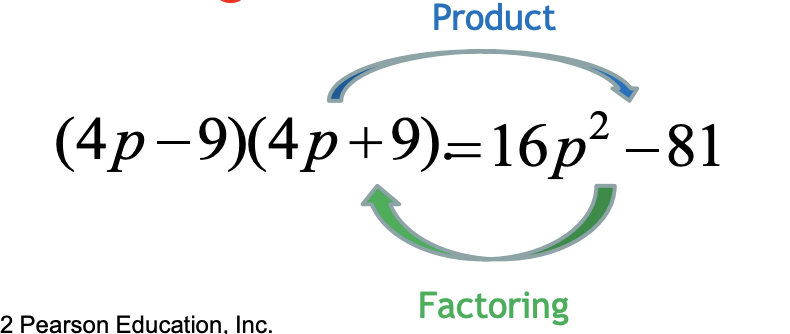

<!-- 

📋 This is the tech-news archives to help me keep track of what I am interested in!

- Reference tech news link: <https://thenextweb.com/news/blockchain-development-tech-career>
  

{{ notice-2 | markdownify }}
 -->

📋 This is my note-taking from what I learned in the class "Math175-002 Functions & Number Systems"
{: .notice--danger}

> ## Objectives
>
> 1. Identify polynomials using the basic terminology of polynomials.
> 2. Add and subtract polynomials.
> 3. Multiply polynomials.
> 4. Multiply two binomials using the FOIL method.
> 5. Find special products of binomials.
> 6. Factor the greatest common factor from a polynomial.
> 7. Factor a trinomial using the FOIL method in reverse.
> 8. Factor a perfect square trinomial and a difference of squares.

 

## Polynomials and Factoring

1. Basic Terminology
2. Addition and Subtraction
3. Multiplication
4. Special Products
5. Factoring
6. Factoring Out the Greatest Common Factor
7. Factoring by Grouping
8. Factoring Trinomials
9. Factoring Special Binomials

 

## 1. Basic Terminology

- A term, or monomial, is defined to be a number, a variable, or a product of numbers and variables.
  : Examples: 7, and 8r
- A polynomial is a term, or a finite sum or difference of terms, with only nonnegative integer exponents permitted on the variables. If the terms of a polynomial contain only the variable x, then the polynomial is called a polynomial in x. (Polynomials in other variables are defined similarly.)
  : Example: 3x5 + 4x – 1
- The expression 9x2 - 4x -
  $$ {6} \over {x} $$
  is not a polynomial because of the presence of -
  $$ {6} \over {x} $$
  &rarr; The terms of a polynomial cannot have variables in a denominator.
- The greatest exponent in a polynomial in one variable is the degree of the polynomial. A non-zero constant is said to have degree 0. (The polynomial 0 has no degree.)
  : Examples: 3x6 - 5x2 + 2x + 3 is a polynomial of degree 6 .
- A term containing more than one variable has degree equal to the sum of all the exponents appearing on the variables in the term.
  : Example: 4x2y3z + 3x2y2z has degree 6.
- A polynomial containing exactly three terms is called a trinomial and one containing exactly two terms is a binomial.

  | Polynomial                                       | Degree | Type      |
  | :----------------------------------------------- | :----- | :-------- |
  | 9x4 - 4x3 + 8x2 | 4      | Trinomial |
  | 29x3 + 8x2                 | 3      | Binomial  |
  | -10x                                             | 1      | Monomial  |

 

## 2. Addition and Subtraction

- Because the variables used in polynomials represent real numbers, a polynomial represents a real number. This means that all the properties of the real numbers hold for polynomials. Here is an application of the distributive property.
  : Combine like terms: 3x5 - 7x5 = (3 - 7)x5 = -4x5
- "Like terms" are terms that have the exact same variable factors. Thus, polynomials are added by adding coefficients of like terms and are subtracted by subtracting coefficients of like terms.

### <u>Example: Adding and Subtracting Polynomials</u>

Add or subtract as indicated.

a) (4x4 - x2 - 7x + 9) - (3x4 - m2 + x - 3) = 4x4 - x2 - 7x + 9 - 3x4 + m2 - x + 3 = x4 - 8x + 12

> As shown in Example, polynomials are often written with their terms arranged in "descending powers." The term of greatest degree is first, the one with the next greatest degree is second, and so on.

 

## 3. Multiplication

The associative and distributive properties, together with the properties of exponents, can also be used to find the product of two polynomials.

### <u>Example: Multiplication of Polynomials</u>

> Such a product can be written vertically, as shown in Example 2.

## 3. Multiplication &rarr; FOIL Method

The memory aid “FOIL” is a convenient way to find the product of two binomials. FOIL (for First, Outside, Inside, Last) gives the pairs of terms to be multiplied to get the product.

### <u>Example: Multiplication Using the FOIL Method</u>

 

## 4. Special Products

As shown in Examples 3(b) and (c), the product of two binomials of the forms x + y and x − y is always a binomial. Check that the following is true.

### <u>Product of the Sum and Difference of Two Terms</u>

The product x2 - y2 is called a difference of two squares

> (x + y)(x - y) = x2 - y2

### <u>Squares of Binomials</u>

Squares of binomials are also special products. These are verified by first writing as two factors and then using the FOIL method.

> (x + y)2 = x2 + 2xy + y2
>
> (x - y)2 = x2 - 2xy + y2

 

## 5. Factoring

The process of finding polynomials whose product equals a given polynomial is called factoring. For example, since 4x + 12 = 4(x + 3), both 4 and x + 3 are called factors of 4x + 12. Also, 4(x + 3) is called a factored form of 4x + 12.

A polynomial that cannot be written as a product of two polynomials with integer coefficients is a prime polynomial. A polynomial is factored completely when it is written as a product of prime polynomials with integer coefficients.

Factoring is the inverse of multiplying, so a check requires that the product of the factored form yields the original polynomial.

 

## 6. Factoring Out the Greatest Common Factor (GCF)

When factoring a polynomial, we first look for a monomial that is the greatest common factor (GCF) of all the terms of the polynomial.

Some polynomials are factored using the distributive property. We look for a monomial that is the greatest common factor (GCF) of all the terms of the polynomial.

### <u>Example: Factoring Out the Greatest Common Factor (GCF)</u>

Factor out the greatest common factor (GCF) from each polynomial.

a) m3(m + 2) − 3m2(m + 2) + m(m + 2) = <u>m(m + 2)</u>(m2(1) - 3m(1) + 1) = <u>m(m + 2)</u>(m2 - 3m + 1)

 

## 7. Factoring by Grouping

When a polynomial has more than three terms, it can sometimes be factored by a method called factoring by grouping.

### <u>Example: Factoring by Grouping</u>

Factor by grouping.

mp2 + 4m + 3p2 + 12

| mp2 + 4m | 3p2 + 12 |
| :------------------ | :------------------ |
| factor of m         | factor of 3         |

\= m(p2 + 4) + 3(p2 + 4)
\= (p2 + 4)(m + 3)

 

## 8.Factoring Trinomials

Factoring trinomials requires using the FOIL method in reverse.

- Factoring is the inverse of multiplying.
- Since the product of two binomials is usually a trinomial, we can expect factorable trinomials (with no GCF of the terms) to have two binomial factors.
- Thus factoring trinomials requires using FOIL in an inverse manner.

### <u>Example 1: Factoring Trinomials</u>

Factor 6x2 - 7x - 5

1. To factor this, we must find integers a, b, c, and d such that
   : 6x2 - 7x - 5 = (ax + b)(cx + d)
2. After a few attempts, using FOIL to check, we find
   : 6x2 - 7x - 5 = (3x - 5)(2x + 1)

### <u>Example 2: Factoring Trinomials</u>

Factor 6x2 - 7x - 5

6x2 - 7x - 5 = ax2 + bx + c
  &rarr; a = 6, b = -7, c = -5

1. Find two numbers such that their:
   : - Product = ac = 6 \* (-5) = -30
   : - Sum = b = -7
2. The two numbers are 3 and -10
   : 6x2 - 7x - 5 = 6x2 + 3x - 10x - 5
3. Now having 4 terms, factor by grouping:
   : (6x2 + 3x) + (-10x - 5)
   : \= 3x(2x + 1) - 5(2x + 1)
   : \= (3x - 5)(2x + 1)

### <u>Perfect Square Trinomials</u>

- x2 + 2xy + y2 = (x + y)2
- x2 - 2xy + y2 = (x - y)2

 

## 9. Factoring Special Binomials

### <u>Difference of Squares</u>

x2 - y2 = (x + y)(x - y)

### <u>Example: Difference of Squares</u>

Factor each polynomial.

a) 4x2 - 9
\= (2x)2 - 32
\= (2x + 3)(2x - 3)

b) 256x4 - 625
\= (16x2)2 - 252
\= (16x2 + 25)(16x2 - 25)
\= (16x2 + 25)(4x + 5)(4x - 5)

### <u>Sum and Difference of Cubes</u>

- Sum of Cubes:
  : x3 + y3 = (x + y)(x2 - xy + y2)
- Difference of Cubes:
  : x3 - y3 = (x - y)(x2 + xy + y2)

### <u>Example: Sum and Difference of Cubes</u>

Factor each of the following.

a) 8y3 - 125z6 = (2y)3 - (5z2)3
  &rarr; x3 - y3 = (x - y)(x2 + xy + y2)
  \= (2y - 5z2)(4y2 + 10yz2 + 25z4)

b) m3 + 27 = m3 + 33
  &rarr; x3 + y3 = (x + y)(x2 - xy + y2)
  \= (m + 3)(m2 - 3m + 9)

 

## Exercise

### <u>Section 7.6: 1 ~ 29 (odds)</u>

### <u>Section 7.6: 31 ~ 81 (odds)</u>

### <u>Section 7.6: 89 ~ 93, 99 (odds)</u>

 

---

 

    🖋️ This is my self-taught blog! Feel free to let me know
    if there are some errors or wrong parts 😆

[Back to Top](#){: .btn .btn--primary }{: .align-right}
