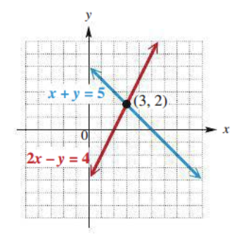
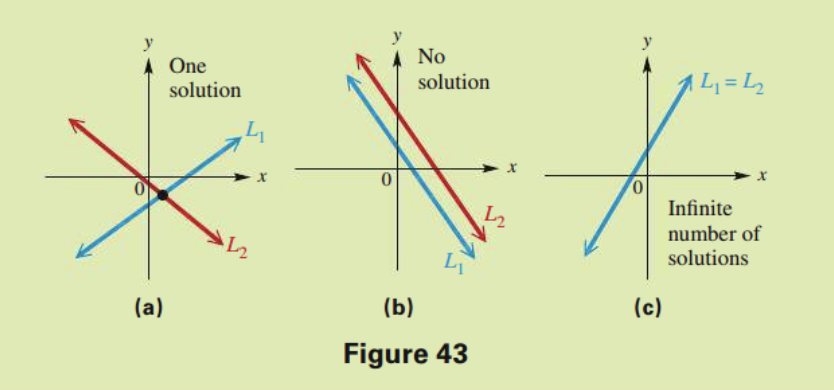

<!-- 

📋 This is the tech-news archives to help me keep track of what I am interested in!

- Reference tech news link: <https://thenextweb.com/news/blockchain-development-tech-career>
  

{{ notice-2 | markdownify }}
 -->

📋 This is my note-taking from what I learned in the class "Math175-002 Functions & Number Systems"
{: .notice--danger}

> ## Objectives
>
> 1. Interpret the use of system of linear equations in mathematical exposition.
> 2. Identify the solution of a system of linear equations from a graph, and classify the system.
> 3. Solve a system of two linear equations in two variables using the elimination method.
> 4. Solve a system of two linear equations in two variables using the substitution method.

 

## 1. Linear System in Two Variables

When multiple equations are considered together, the set of equations is called a system of equations.

For example, x + y = 5 and 2x - y = 4

The point where the graphs intersect is a solution of each of the individual equations. It is also the solution of the system of equations.

 

## 2. Graphical Solution of Linear System of Equations (Three Possibilities)

1.  The two graphs intersect in a single point. The coordinates of this point give the only solution of the system. In this case, the system is consistentand the equations are independent. This is the most common case. See Figure 43(a).
2.  The graphs are parallel lines. In this case, the system is inconsistent and the equations are independent. That is, there is no solution common to both equations of the system, and the solution set is ∅. See Figure 43(b).
3.  The graphs are the same line. In this case, the system is consistent and the equations are dependent, because any solution of one equation of the system is also a solution of the other. The solution set is an infinite set of ordered pairs representing the points on the line. See Figure 43(c).

[MyLab Math Graphing](https://www.youtube.com/watch?v=T-j5v2uKQlc)

 

## 3. Algebraic Solution of Linear System of Equations (Three Possibilities)

1. Single Solution; Consistent-Independent Equations.
2. No Solution; Inconsistent-Independent Equations.
   : Result is false (e.g. 0=15)
3. Infinite Solutions; Consistent-Dependent Equations.
   : Result for example 0 = 0

<u>Two algebraic methods</u> can be used to solve a system of linear equations; <u>Elimination and Substitution</u>

### <u>Algebraic Solution of Linear System of Equations- Elimination Method</u>

We can use algebraic methods to solve systems. One method is called the elimination method. The elimination method involves combining the two equations of the system in such a way that one variable is eliminated.

> This is done using the following rule.
>
> If a = b and c = d then a + c = b + d.

### <u>Solving Linear Systems by Elimination</u>

1. <u>Write both equations in standard form Ax + By = C.</u>
2. <u>Make the coefficients of one pair of variable terms opposites.</u> Multiply one or both equations by appropriate numbers so that the sum of the coefficients of either x or y is zero.
3. <u>Add</u> the new equations to eliminate a variable. The sum should be an equation with just one variable.
4. <u>Solve</u> the equation from Step 3 for either x or y.
5. <u>Find the other value.</u> Substitute the result of Step 4 into either of the given equations, and solve for the other variable.
6. <u>Find the solution set.</u> Check the solution in both of the given equations. Then write the solution set.

### <u>Example: Solve by Elimination</u>

- 3x - 2y = 4 (1)
- 2x + y = 5 (2)

| Solution                                                     |                                                       |
| :----------------------------------------------------------- | :---------------------------------------------------- |
| Both equations are in standard form                          |                                                       |
| Multiply equation (2) by 2 to get opposite coefficients on y | 3x - 2y = 4 (1), 4x + 2y = 10 (2)                     |
| Add the equations to eliminate y                             | 7x = 14                                               |
| Solve to find x = 2                                          | x = 2                                                 |
| Substitute in one of the original equations to find y        | 2(2) + y = 5 &rarr; y = 1                             |
| The result                                                   | The solution (2, 1) checks in both original equations |

 

## 4. Algebraic Solution of Linear System of Equations- Substitution Method

- Linear systems can also be solved by the substitution method.
- This method is useful for solving linear systems in which one variable has coefficient 1 or –1.
- It is also the best choice for solving many nonlinear systems in advanced algebra courses.

### <u>Solving Linear Systems by Substitution</u>

1. <u>Solve for one variable in terms of the other.</u> Solve one of the equations for either variable. (If one of the variables has coefficient 1 or -1, choose it, since the substitution method is usually easier this way.)
2. <u>Substitute</u> for that variable in the other equation. The result should be an equation with just one variable.
3. <u>Solve</u> the equation from Step 2.
4. <u>Find the other value.</u> Substitute the result from Step 3 into the equation from Step 1 to find the value of the other variable.
5. <u>Find the solution set.</u> Check the solution in both of the given equations. Then write the solution set.

### <u>Example: Solve by Substitution</u>

- 3x - 2y = 4 (1)
- 2x + y = 5 (2)

| Solution                                 |                                                       |
| :--------------------------------------- | :---------------------------------------------------- |
| Solve equation (2) for y                 | y = -2x + 5                                           |
| Substitute –2x + 5 for y in equation (1) | 3x - 2(-2x + 5) = 4                                   |
| Solve the equation                       | 3x + 4x - 10 = 4 &rarr; 7x = 14 &rarr; x = 2          |
| Substitute to find y                     | y = -2(2) + 5 = 1                                     |
| The result                               | The solution (2, 1) checks in both original equations |

 

## 5. Inconsistent-Independent System

Solve the system

- 3x - 2y = 4
- -6x + 4y = 7

The equations above leads to a false statement such as 0 = 15. This indicates that

- No solution
- Inconsistent-independent
- Empty set ∅

as the solution set.

 

## 6. Consistent-Dependent System

Solve the system

- 3x - 2y = 4
- -6x + 4y = -8

The equations above leads to a true statement such as 0 = 0. This indicates that

- Infinite solutions
- Consistent-dependent
- All real numbers

as the solution set.

 

## Exercise

### <u>Section 8.7: 3~37 (odds)</u>

 

---

 

    🖋️ This is my self-taught blog! Feel free to let me know
    if there are some errors or wrong parts 😆

[Back to Top](#){: .btn .btn--primary }{: .align-right}
