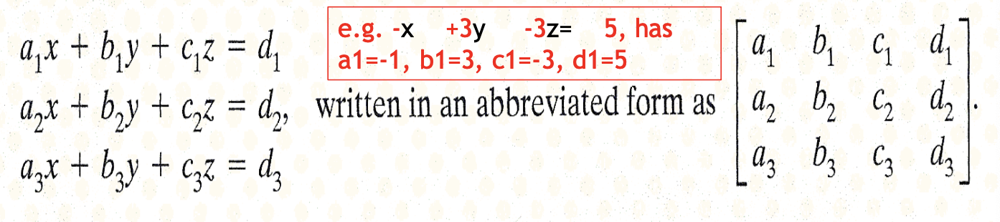
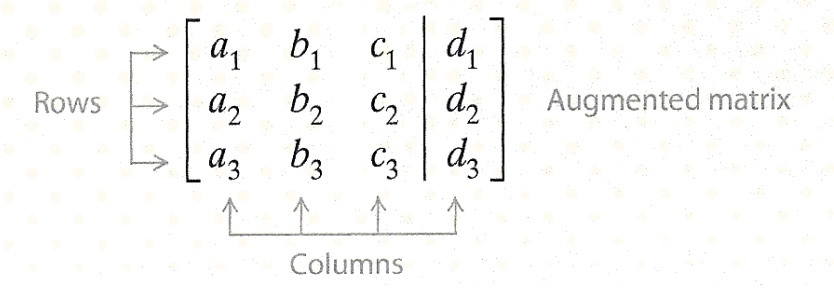
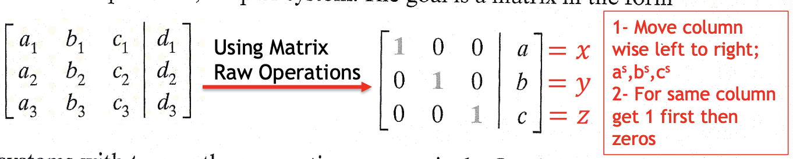
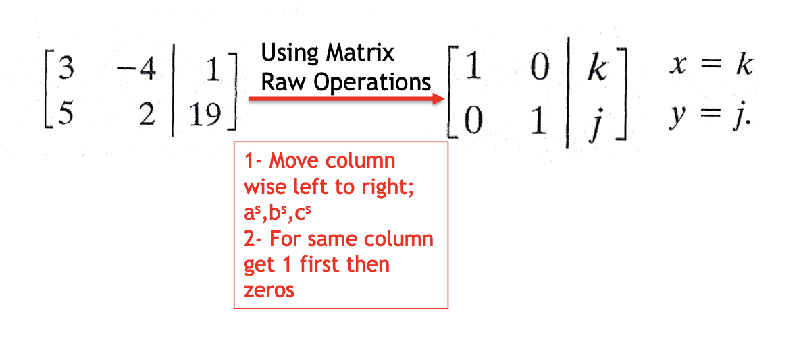
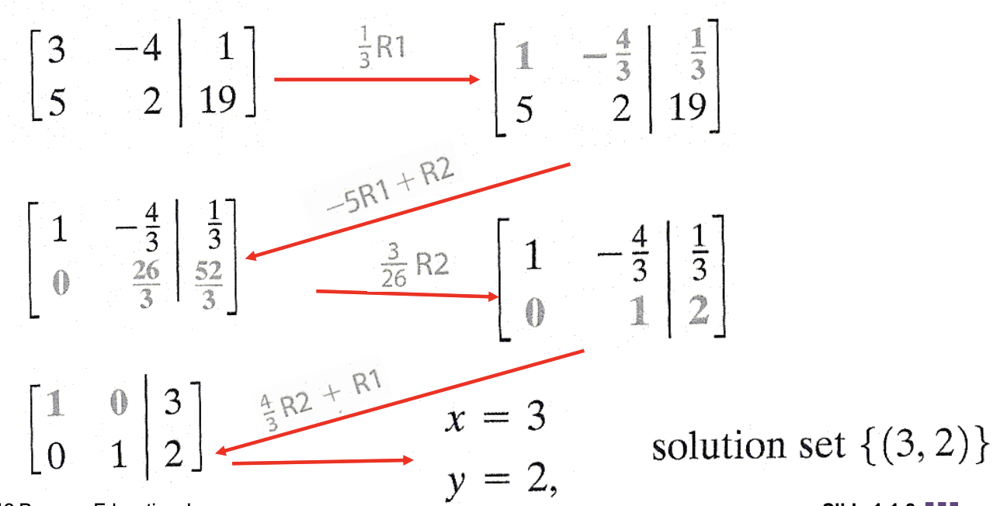

<!-- 

📋 This is the tech-news archives to help me keep track of what I am interested in!

- Reference tech news link: <https://thenextweb.com/news/blockchain-development-tech-career>
  

{{ notice-2 | markdownify }}
 -->

📋 This is my note-taking from what I learned in the class "Math175-002 Functions & Number Systems"
{: .notice--danger}

# Extension Using Matrix Row Operations to Solve Systems

## 1. Matrix Terminology

Matrices can be used to solve linear systems, and matrix methods are particularly suitable for computer solutions of large systems of equations having many unknowns.

To begin, consider a system of three equations and three unknowns such as

> Example
>
> -x + 3y - 3z = 5, has a1 = -1, b1 = 3, c1 = -3, d1 = 5

Such a rectangular array of numbers enclosed by brackets is called a matrix. Each number in the array is an element or entry. The matrix above has three rows (horizontal) and four columns (vertical) of entries, and is called a 3 ✕ 4 (read "3 by 4") matrix.

The constants in the last column of the matrix can be set apart from the coefficients of the variables by using a vertical line, as shown in the following augmented matrix.

 

## 2. Matrix Row Operations

For any real number k and any augmented matrix of a system of linear equations, the following operations will produce the matrix of an equivalent system - that is, another system with the same solution set.

1. Interchange any two rows of a matrix.
2. Multiply the elements of a row of a matrix by the same nonzero number k.
3. Add a common multiple of the elements of one row to the corresponding elements of another row.

 

## 3. Gauss-Jordan Method

[연립 일차방정식과 가우스-조던 소거법](https://m.blog.naver.com/PostView.naver?isHttpsRedirect=true&blogId=qio910&logNo=221506757644)

If the word "row" is replaced by "equation," it can be seen that the three row operations also apply to a system of equations, so that a system of equations can be solved by transforming its corresponding matrix into the matrix of an equivalent, simpler system. The goal is a matrix in the form for systems with two or three equations respectively.

On the left of the vertical bar there are ones down the diagonal form upper left to lower right and zeros elsewhere in the matrices. When these matrices are rewritten as systems of equations, the values of the variables are known. The "Gauss-Jordan method" is a systematic way of using the matrix row operations to change the augmented matrix of a system into the form that shows its solution.

### <u>Example: Solving a Linear System Using Gauss-Jordan (Two Unknowns)</u>

Solve the linear system.

- 3x - 4y = 1
- 5x + 2y = 19

 

## Exercise

 

---

 

    🖋️ This is my self-taught blog! Feel free to let me know
    if there are some errors or wrong parts 😆

[Back to Top](#){: .btn .btn--primary }{: .align-right}
