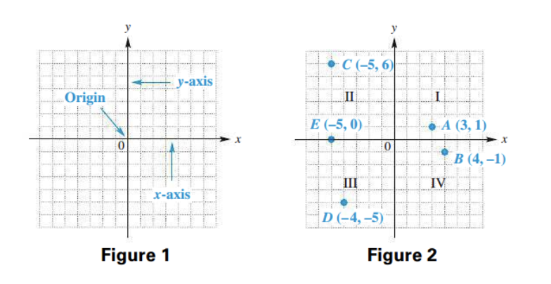
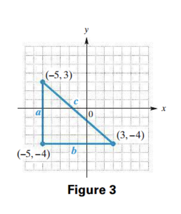
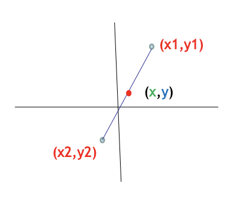
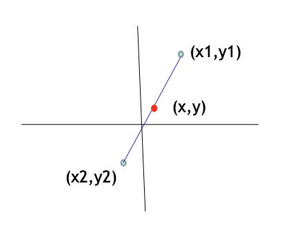
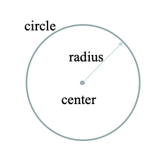
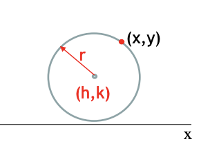
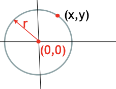

<!-- 

📋 This is the tech-news archives to help me keep track of what I am interested in!

- Reference tech news link: <https://thenextweb.com/news/blockchain-development-tech-career>
  

{{ notice-2 | markdownify }}
 -->

📋 This is my note-taking from what I learned in the class "Math175-002 Functions & Number Systems"
{: .notice--danger}

> OBJECTIVES
>
> 1. Plot ordered pairs in a rectangular coordinate system.
> 2. Find the distance between two points using the distance formula.
> 3. Find the midpoint of a segment using the midpoint formula.
> 4. Find the equation of a circle given the coordinates of the center and the radius.
> 5. Find the center and radius of a circle given its equation.
> 6. Apply the midpoint formula.
> 7. Apply the definition of a circle to locating a geographical point.

# The Rectangular Coordinate System and Circles

1. Rectangular Coordinates
2. Distance Formula
3. Midpoint Formula
4. Circles

 

## 1. Rectangular Coordinates

Each pair of numbers (1, 2), (-1, 5), and (3, 7) is an example of an ordered pair —- a pair of numbers written within parentheses in which the positions of the numbers are relevant. The two numbers are the components of the ordered pair. Two ordered pairs are equal if and only if their first components are equal and their second components are equal.

An ordered pair is graphed using two number lines that intersect at right angles at the zero points, as shown in Figure 1. The common zero point is called the origin. The horizontal line, the x-axis, represents the first number in an ordered pair, and the vertical line, the y-axis, represents the second. The x-axis and the y-axis make up a rectangular (or Cartesian) coordinate system. The axes form four quadrants, numbered I, II, III, and IV as shown in Figure 2. (A point on an axis is not considered to be in any of the four quadrants.)

We locate, or plot, the point on the graph that corresponds to the ordered pair (3, 1) by moving three units from zero to the right along the x-axis, and then one unit up parallel to the y-axis; this point is labeled A in Figure 2. The phrase “the point corresponding to the ordered pair (3, 1)” is abbreviated “the point (3, 1).” The numbers in an ordered pair are called the coordinates of the corresponding point.

The symbolism for an ordered pair may also represent an open interval (introduced earlier in this text). The context of the discussion tells us whether we are discuss-ing points in the Cartesian coordinate system or an open interval on a number line.

 

## 2. Distance Formula

> ### Distance Formula
>
> The distance d between the points (x1, y1) and (x2, y2) is given by the following formula.
>
> d = sqrt {(x2 - x1)2 + (y2 - y1)2}

### <u>Example: Distance Formula</u>

To find the distance between two points, say (3, -4) and (-5, 3), we use the Pythagorean theorem. In Figure 3, we see that the vertical line through (-5, 3) and the horizontal line through (3, -4) intersect at the point (-5, -4). Thus, the point (-5, -4) becomes the vertex of the right angle in a right triangle. By the Pythagorean theorem, the square of the length of the hypotenuse, c, in Figure 3 is equal to the sum of the squares of the lengths of the two legs a and b.

> Equation of the Pythagorean theorem
>
> c2 = a2 + b2
>
> > c2 = (x2 - x1)2 + (y2 - y1)2

The length a is the distance between the endpoints of that leg. Because the
x-coordinate of both points is -5, the side is vertical, and we can find a by finding the difference between the y-coordinates. Subtract -4 from 3 to get a positive value of a. Similarly, find b by subtracting -5 from 3.

> - a = 3 - (-4) = 7
> - b = 3 - (-5) = 8

| Solution                                      |                             |
| :-------------------------------------------- | :-------------------------- |
| c2 = a2 + b2 |                             |
| c2 = 72 + 82 | Let a=7 and b=8             |
| c2 = 49 + 64                       | Apply the exponents         |
| c2 = 113                           | Add                         |
| c = sqrt {113}                                | Square root property, c > 0 |

Therefore, the distance between (3, -4) and (-5, 3) is sqrt 113.

 

## 3. Midpoint Formula

> ### Midpoint Formula
>
> 
>
> The coordinates of the midpoint M (x, y) of the line segment with endpoints (x1, y1) and (x2, y2) are given by the following formula.
>
> M (x, y) = (
> $$ {x_1 + x_2} \over {2} $$
> ,
> $$ {y_1 + y_2} \over {2} $$
> )

The midpoint (x,y) of a line segment is the point on the segment that is equidistant from both endpoints.

### <u>Example: Midpoint Formula</u>

Find the coordinates of the midpoint of the line segment with endpoints (1, –2) and (5, 7).

(
$$ {1 + 5} \over {2} $$
,
$$ {-2 + 7} \over {2} $$
) = (3, 
$$ {5} \over {2} $$
)

 

## 4. Circles

- A circle is the set of all points in a plane that lie a fixed distance from a fixed point.
- The fixed point is called the center and the fixed distance is called the radius.

> Equation of a Circle
>
> - The equation of a circle of radius r with center at (h, k) is
>   : 
>   : (x - h)2 + (y - k)2 = r2
> - In particular, a circle of radius r with center at the origin has equation
>   : 
>   : x2 + y2 = r2

### <u>Example: Circles</u>

Find an equation of the circle with center at (2, –5) and radius 4.

| Solution                                                     |
| :----------------------------------------------------------- |
| (x - h)2 + (y - k)2 = r2    |
| (x - 2)2 + (y - (-5))2 = 42 |
| (x - 2)2 + (y + 5)2 = 16               |

### <u>Example: Circle Centre and Radius</u>

What are the centre coordinates (h, k) and radius r for:
x2 + y2 - 10x + 18y - 15 = 0

| Solution                                                                                                                             |
| :----------------------------------------------------------------------------------------------------------------------------------- |
| x2 + y2 - 10x + 18y - 15 = 0                                                                                   |
| x2 - 10x + (-10/2)2 + y2 + 18y + (18/2)2 = 15 + (-10/2)2 + (18/2)2 |
| x2 - 10x + (-5)2 + y2 + 18y + (9)2 = 15 + (-5)2 + (9)2             |
| x2 - 10x + 25 + y2 + 18y + 81 = 15 + 25 + 81                                                                   |
| (x - 5)2 + (y + 9)2 = 121                                                                                      |
| (x - 5)2 + (y + 9)2 = 112                                                                           |

(x - h)2 + (y - k)2 = r2

Therefore, The circle has center (5, -9) and radius 11.

 

## Exercise

### <u>Section 8-1: 7~47 (odds)</u>

 

---

 

    🖋️ This is my self-taught blog! Feel free to let me know
    if there are some errors or wrong parts 😆

[Back to Top](#){: .btn .btn--primary }{: .align-right}
