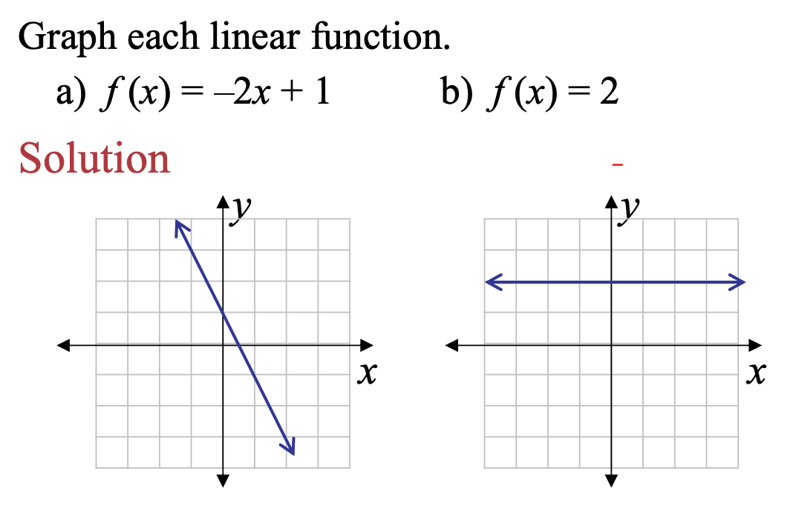

<!-- 

📋 This is the tech-news archives to help me keep track of what I am interested in!

- Reference tech news link: <https://thenextweb.com/news/blockchain-development-tech-career>
  

{{ notice-2 | markdownify }}
 -->

📋 This is my note-taking from what I learned in the class "Math175-002 Functions & Number Systems"
{: .notice--danger}

> OBJECTIVES
>
> 1. Interpret the terms relation, function, domain, range, independent variable, and dependent variable in mathematical exposition.
> 2. Use function notation.
> 3. Identify a linear function and graph it.
> 4. Perform cost analysis using linear functions.
> 5. Construct a linear model from a set of data points

# Linear Functions, Applications, and Models

1. Relations and Functions
2. Domain and Range
3. Graphs of Relations
4. Graphs of Functions
5. Function Notation
6. Linear Functions
7. Modeling with Linear Functions

 

# Terminology

If the value of the variable y depends on the value of the variable x, the y is the dependent variable and x the independent variable.

 

# 1-1. Relations

A relation is a set of ordered pairs.

For example, the sets

- F = {(1, 2), (–1, 5), (4, 3)}
- G = {(1, 5), (9, 0), (9, 8)}

&rarr; Both F and G are relations!

 

# 1-2. Functions

A function is a relation in which for each value of the first component of the ordered pairs there is exactly one value of the second component.

Of the two sets,

- F = {(1, 2), (–1, 5), (4, 3), (2, 5)}
- G = {(1, 5), (9, 0), (9, 8)}

&rarr; Only F is a function and G is a just relation!

- Because only F is a function because each x value has only one y value. G is a relation since x = 9 is having more than one y value; y = 0 and 8.
- Note for function F, two x = -1 and 2 have y = 5. So, in a Function multiple x can have same y, but a single x can’t have multiple y.

## Example: Determining Independent and Dependent Variables

Determine the independent and dependent variables for the following. The procedure by which someone uses a calculator that finds square roots; y =
$$ \sqrt {x} $$

<u>Solution</u>

- The independent variable (input) is a nonnegative real number; x.
- The dependent variable (output) is the positive principal square root; y.
- y value DEPENDS on our selected value for x.
- For example (81, 9) belongs to this function.

 

# 2. Domain and Range

In a relation, the set of all values of the independent variable (x) is the domain.

The set of all values of the dependent variable (y) is the range.

## Example: Determining Domain and Range

Give the domain and range of y =
$$ \sqrt {x} $$

<u>Solution</u>

- The domain (x) is restricted to the nonnegative numbers: [0, ∞)
- The range (y) also is only the principal positive root: [0, ∞)

 

# 3. Graphs of Relations

- The graph of a relation is the graph of its ordered pairs.
- The graph gives a picture of the relation, which can be used to determine its domain and range.

## Example: Determining Domain and Range 1

## Example: Determining Domain and Range 2

> Agreement on Domain
>
> The domain of a relation is assumed to be all real numbers that produce real numbers when substituted for the independent variable.

 

# 4. Graphs of Functions

- In a function, each value of x leads to only one value of y, so any vertical line drawn through the graph of a function must intersect the graph in at most one point.
- This is called the vertical line test for a function.
- If a vertical line intersects the graph of at more than one point, then it is for a relation not for a function.

## Example: Vertical Line Test

| Vertical Line Test                                                 |                                                                         |
| :----------------------------------------------------------------- | :---------------------------------------------------------------------- |
|  | Not a function &rarr; The same x-value corresponds to multiple y-values |
|  | Function &rarr; each x-value corresponds to only one y-value            |

## Example: Determining Whether a Relation is a Function 1

Determine whether each equation defines a function and give the domain and range. &rarr; y =
$$ \sqrt {x + 1} $$

Note that for square root function, Domain of x values must have what is under the root ≥ 0
{: .notice--info}

<u>Solution</u>

- Yes, it is a function
- To find the domain note that x + 1 >= 0.
- The domain is [-1, ∞) and The range is [0, ∞)

## Example: Determining Whether a Relation is a Function 2

Determine whether each equation defines a function and give the domain and range. &rarr; y2 = x

<u>Solution</u>

- No, it is not a function
- (16, 4) and (16, -4) both work. (In a Function, multiple x can have same y, but a single x can’t have multiple y.)
- The domain is [0, ∞) and The range is (-∞, ∞)

## Example: Determining Whether a Relation is a Function 3

Determine whether each equation defines a function and give the domain and range. &rarr; y <= 2x

<u>Solution</u>

- No, it is not a function
- For example, if x = 1, then any y value less than or equal to 2 would satisfy the inequality, so there are infinitely many possible y values for x = 1.
- The domain and range are (-∞, ∞)

## Example: Determining Whether a Relation is a Function 4

Determine whether each equation defines a function and give the domain and range. &rarr; y =
$$ {3} \over {x - 2} $$

Note that for fractional function, Domain of x values must have "denominator ≠ 0"
{: .notice--info}

<u>Solution</u>

- Yes, it is a function
- The domain is (-∞, 2] U [2, ∞), since we avoid 0 in the denominator.
- The range is (-∞, 0] U [0, ∞)

 

# Variations of the Definition of Function

1. A function is a relation in which for each value of the first component of the ordered pairs there is exactly one value of the second component.
2. A function is a set of distinct ordered pairs in which no first component is repeated.
3. A function is a rule or correspondence that assigns exactly one range value to each domain value.

 

# 5. Function Notation

When a function f is defined with a rule or an equation using x and y for the independent and dependent variables, we say “y is a function of x” to emphasize that y depends on x. We use the notation y = f (x), called function notation, to express this and read f (x) as “f of x.” For example if y = 3x + 1, we write f(x) = 3x + 1.

- Note that f (x) is just another name for the dependent variable y.
- If f (x) = 3x + 1, we find f(2) by replacing x with 2, f(2) = 3(2) + 1 = 7
  : - Read f(2) as “f of 2” or “f at 2.”

## Example: Using Function Notation

Let f(x) = x2 + 3x – 1. Find the following.

- a) f(2) = 22 + 3(2) -1 = 9
- b) f(0) = 0 + 0 - 1 = -1
- c) f(2x) = (2x)2 + 3(2x) - 1 = 4x2 + 6x - 1

 

# 6. Linear Functions

A function that can be written in the form f(x) = mx + b for real numbers m and b is a linear function.

## Example: Graphing Linear Functions

Graph each linear function.

 

# 7. Modeling with Linear Functions

## Example: Modeling with Linear Functions 1

A company produces DVDs of live concerts. The company pays $200 for advertising the DVDs. Each DVD costs $12 to produce and the company charges $20 per disk.

- a) Express the cost C as a function of x, the number of DVDs produced.

The fixed cost is $200 and for each DVD produced, the variable cost is $12. The cost C can be expressed as a function of x, the number of DVDs produced: C(x) = 12x + 200.

## Example: Modeling with Linear Functions 2

A company produces DVDs of live concerts. The company pays $200 for advertising the DVDs. Each DVD costs $12 to produce and the company charges $20 per disk.

- b) Express the revenue R as a function of x, the number of DVDs sold.

Each DVD sells for $20, so revenue R is given by: R(x) = 20x.

## Example: Modeling with Linear Functions 3

A company produces DVDs of live concerts. The company pays $200 for advertising the DVDs. Each DVD costs $12 to produce and the company charges $20 per disk.

- c) When will the company break-even? That is, for what value of x does revenue equal cost?

The company will just break even (no profit and no loss) as long as revenue just equals cost, or C(x) = R(x).

This is true whenever

- 12x + 200 = 20x
- 200 = 8x
- 25 = x.

If 25 DVDs are produced and sold, the company will break even.

 

# Exercise

## Section 8-4: 11~27, 33~51 (odds)

 

---

 

    🖋️ This is my self-taught blog! Feel free to let me know
    if there are some errors or wrong parts 😆

[Back to Top](#){: .btn .btn--primary }{: .align-right}
