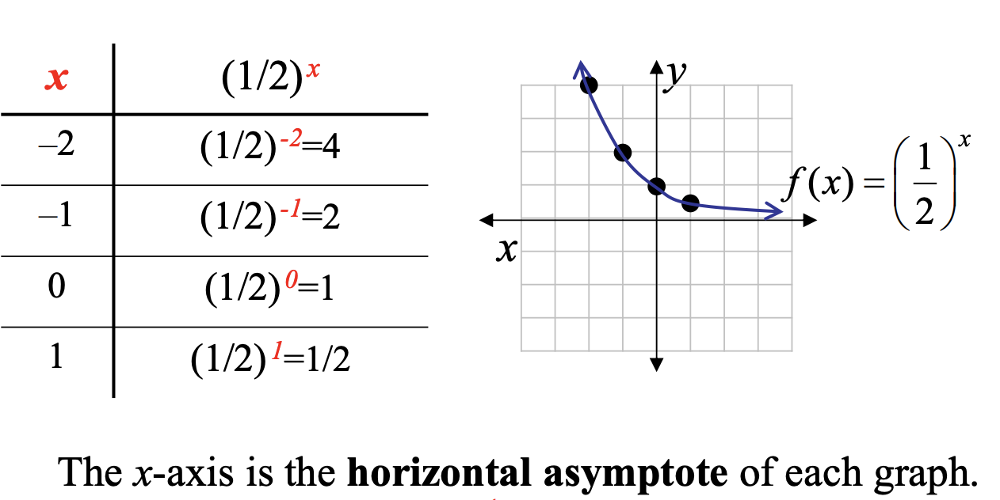
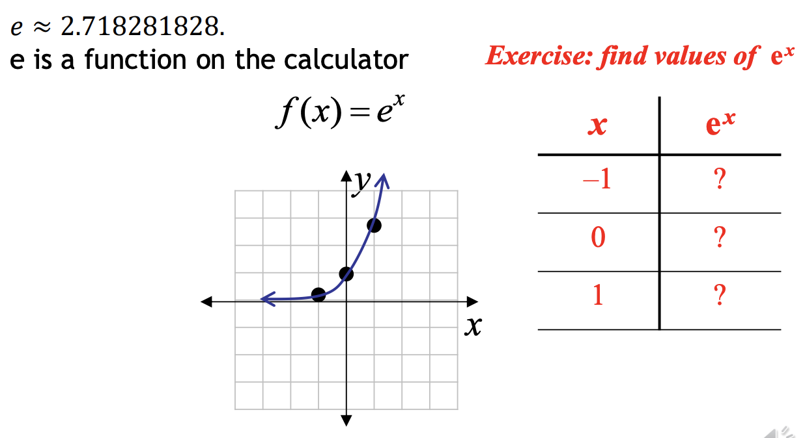
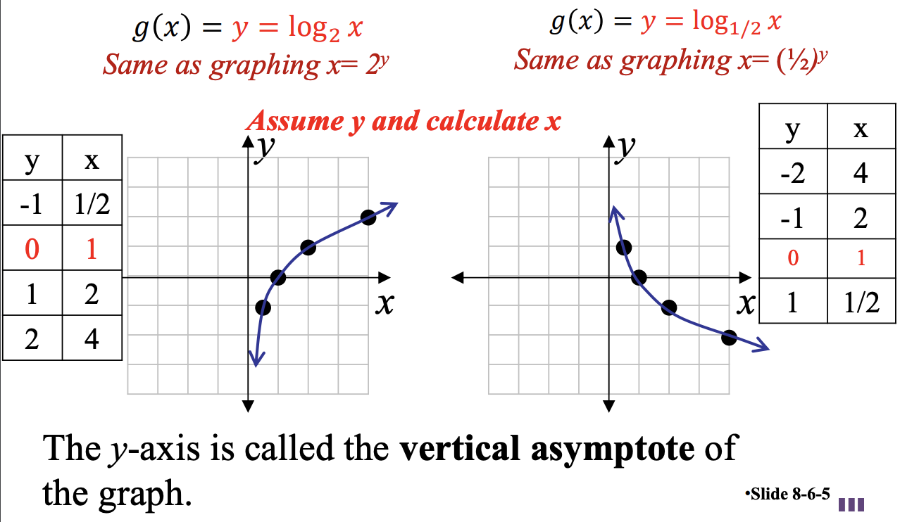
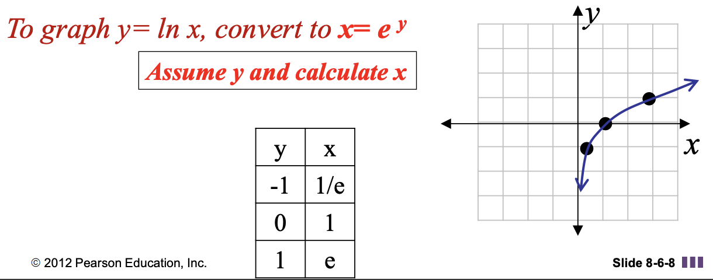
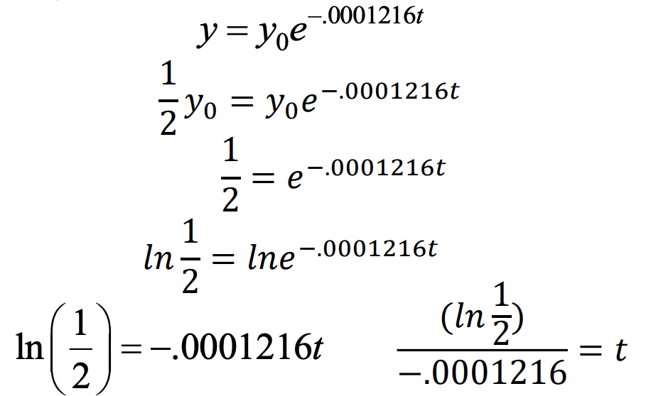
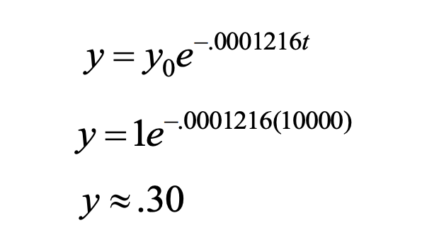

<!-- 

📋 This is the tech-news archives to help me keep track of what I am interested in!

- Reference tech news link: <https://thenextweb.com/news/blockchain-development-tech-career>
  

{{ notice-2 | markdownify }}
 -->

📋 This is my note-taking from what I learned in the class "Math175-002 Functions & Number Systems"
{: .notice--danger}

# Exponential and Logarithmic Functions, Applications, and Models

1. Exponential Functions and Applications
2. Logarithmic Functions and Applications
3. Exponential-Logarithmic Applications

 

# 1. Exponential Functions and Applications

An exponential function with base b, where b > 0 and b != 1, is a function of the form f(x) = bx, where x is any real number.

## Example: Graph of Exponential Function (b > 1)

## Example: Graph of Exponential Function (0 < b < 1)

 

# 1 - A. Graph of f(x) = bx

1. The graph always will contain the point (0, 1).
2. When b > 1, the graph will rise from left to right.
   When 0 < b < 1, the graph will fall from left to
   right.
3. The x-axis is the horizontal asymptote.
4. The domain is (-∞, ∞) and the range is (0, ∞).

 

# 1 - B. Exponential with Base e

 

# 1 - C. Compound Interest Formula

Suppose that a principal of P dollars is invested at an annual interest rate r (in percent, expressed as a decimal), compounded n times per year. Then the amount A accumulated after t years is given by the formula

A = P(1 +
$$ {r} \over {n} $$
)nt

## Example: Compound Interest Formula

Suppose that $2000 dollars is invested at an annual rate of 8%, compounded quarterly. Find the total amount in the account after 6 years if no withdrawals are made.

| Solution                                              |
| :---------------------------------------------------- |
| A = P(1 + $$ {r} \over {n} $$)nt           |
| A = 2000(1 + $$ {0.08} \over {4} $$)4(6)   |
| A = 2000(1.02)24 ≈ 2000(1.60844) = 3216.88 |

There would be $3216.88 in the account at the end of six years.

 

# 1 - D. Continuous Compound Interest Formula

Suppose that a principal of P dollars is invested at an annual interest rate r (in percent, expressed as a decimal), compounded continuously. Then the amount A accumulated after t years is given by the formula

A = Pert.

## Example: Continuous Compound Interest Formula

Suppose that $2000 dollars is invested at an annual rate of 8%, compounded continuously. Find the total amount in the account after 6 years if no withdrawals are made.

| Solution                                           |
| :------------------------------------------------- |
| A = Pert                                |
| A = 2000e0.08(6)                        |
| A = 2000e0.48 ≈ 2000(1.61607) = 3232.14 |

There would be $3232.14 in the account at the end of six years.

 

# 1 - E. Doubling Time Formula

Time needed to double an initial amount as an exponential function: A = Pert

- A: is present amount
- P: is future amount after t years
- r: is annual compounding rate

## Example: Doubling Time

Suppose that a certain amount P is invested at an annual rate of 5% compounded continuously. How long will it take for the amount to double (doubling time)?

| Solution                             |                          |
| :----------------------------------- | :----------------------- |
| A = Pert                  | Formula                  |
| 2P = Pe0.05t              | Sub in 2P for A (double) |
| 2 = e0.05t                | Divide by P              |
| ln2 = ln e0.05t           | Take ln of both sides    |
| ln2 = 0.05t                          | Simplify                 |
| t = $$ {ln 2} \over {0.05} $$ ≈ 13.9 | Divide by 0.05           |

Therefore, it would take about 13.9 years for the initial investment P to double.

 

# 2. Logarithmic Functions and Applications

A logarithmic function with base b, where b > 0 and b ≠ 1, is a function of the form

g(x) = logbx, where x > 0.

 

# 2 - A. Graph of g(x) = logbx

The graph of y = logbx can be found by interchanging the roles of x and y in the function as shown x = by (Exponential Function)

## Example: Logarithmic Functions

 

# 2 - B. Characteristics of Graph g(x) = logbx

1. The graph always will contain the point (1, 0).
2. When b > 1 the graph will rise from left to right. When 0 < b < 1, the graph will fall from left to right.
3. The y-axis is the vertical asymptote.
4. The domain is (0, ∞) and the range is (-∞, ∞).

 

# 2 - C. Natural Logarithmic Function (y = ln x)

"g(x) = y = ln x" is called the natural logarithmic function.

ln x = logex, where base e = 2.71828...

The expression ln ek is the exponent to which the base e must be raised in order to obtain ek. There is only one such number that will do this, and it is k. Thus for all real numbers k, ln ek = k. (e = 2.71828…)

 

# 2 - D. Models in Nature

Radioactive materials disintegrate according to exponential decay functions. The half-life of a quantity that decays exponentially is the amount of time it takes for any initial amount to decay to half its initial value.

## Example : Half-Life

Carbon 14 is a radioactive form of carbon that is found in all living plants and animals. After a plant or animal dies, the radiocarbon disintegrates. The amount of carbon 14 present after t years is modeled by the exponential equation y = y0e-0.0001216t

<u>a) What is the half-life of carbon 14?</u>

t ≈ 5700 &rarr; The half-life of carbon 14 is about 5700 years.

<u>b) If an initial sample contains 1 gram of carbon 14, how much will be left in 10,000 years?</u>

There will be about 0.30 grams remaining.

 

# 3. Exponential-Logarithmic Applications (Exponential and Logarithmic Equivalents)

For b > 0 and b ≠ 1, by = x, then y = logbx

| Exponential Equation | Logarithmic Equation |
| :------------------- | :------------------- |

 

## Exercise

## Section 8-1: 7~47 (odds)</u>

 

---

 

    🖋️ This is my self-taught blog! Feel free to let me know
    if there are some errors or wrong parts 😆

[Back to Top](#){: .btn .btn--primary }{: .align-right}
