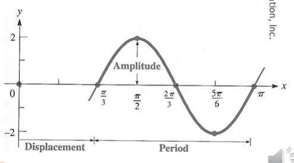
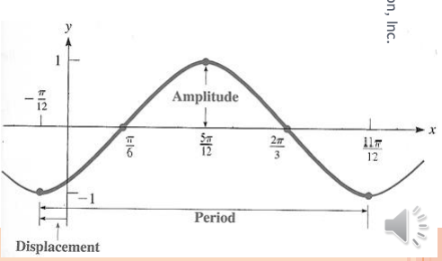
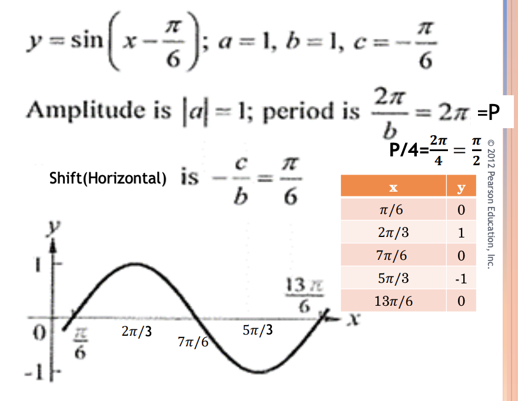
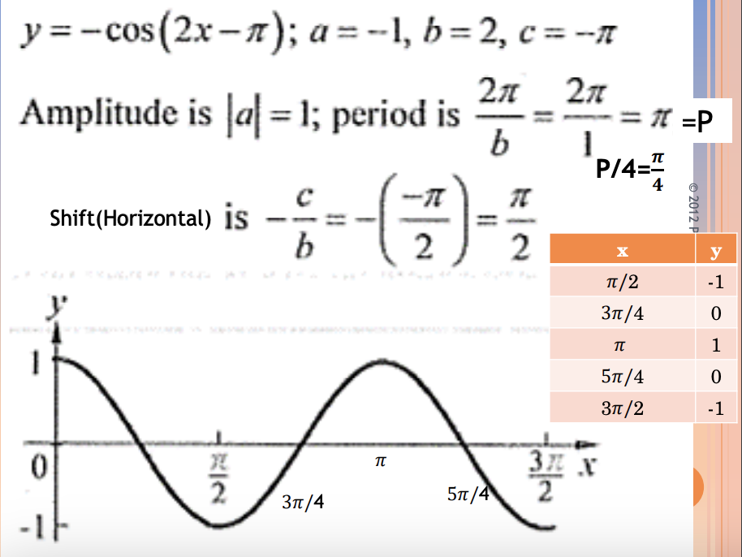
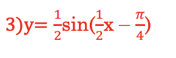
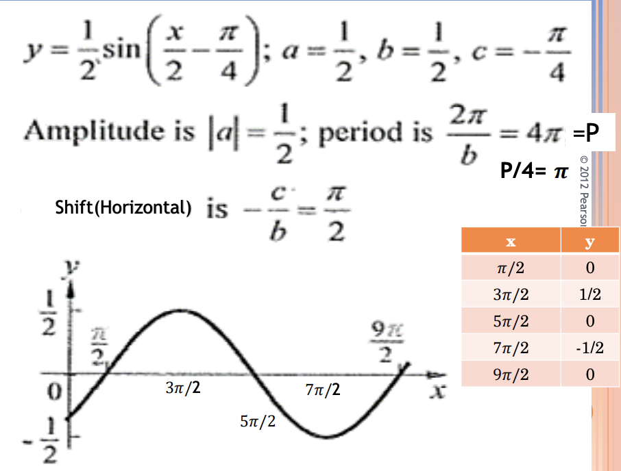
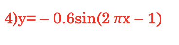
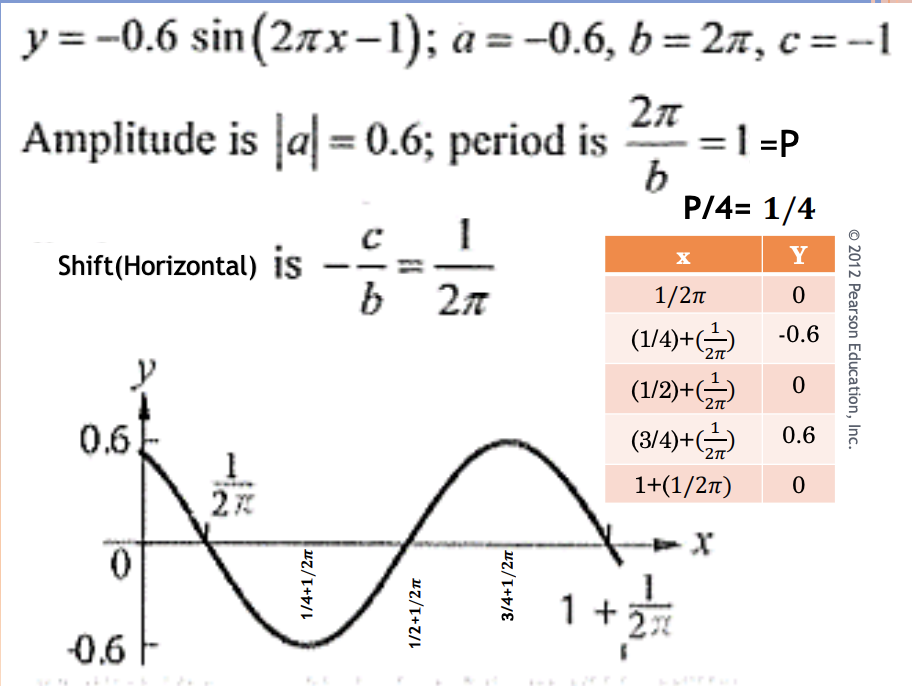
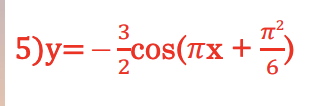
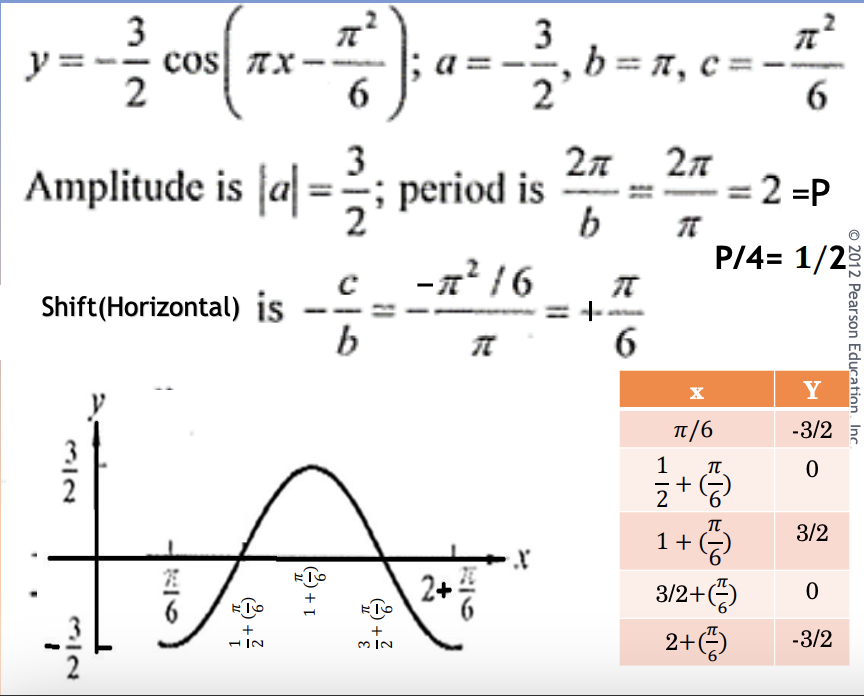

<!-- 

📋 This is the tech-news archives to help me keep track of what I am interested in!

- Reference tech news link: <https://thenextweb.com/news/blockchain-development-tech-career>
  

{{ notice-2 | markdownify }}
 -->

📋 This is my note-taking from what I learned in the class "Math175-002 Functions & Number Systems"
{: .notice--danger}

# Graphs of "y = a sin(bx + c)" and "y = a cos(bx + c)"

1. Amplitude
   : ymax = \|a\|
   : ymin = -\|a\|
2. Period &rarr; P = 2π/b
   : P/4 = step on x-axis (five x values needed on x-axis to have graph for one period)
3. Shift or Displacement = -c/b
   : -c/b = Starting x value (c is called phase angle)

Note: You must have your Calculator on Radians
{: .notice--info}

 

# Example

## Example 1: Sketching graph of "y = a sin(bx + c)"

Sketch the graph y = 2 sin(3x - π).

| Solution                                                       |                                                                         |
| :------------------------------------------------------------- | :---------------------------------------------------------------------- |
| a = 2                                                          | Amplitude = ymax = \|a\| = 2, ymin = -\|a\| = -2  |
| b = 3                                                          | Period(cycle) = P = 2π/b = 2π/3, P/4 = 2π/12 = π/6 = Step on x-axis     |
| c = -π                                                         | Shift(Displacement) = -c/b = -(-π)/3 = π/3 = Starting x value on x-axis |
| x starts at π/3 and have five values on x-axis at a step = π/6 |                                                                         |

<u>Sample Calculation: Calculator on Radians</u>

- x = π/3 &rarr; y = 2 sin(3(π/3)-π) = 0

| x   | $$ {π} \over {3} $$ | $$ {π} \over {2} $$ | $$ {2π} \over {3} $$ | $$ {5π} \over {6} $$ | π   |
| :-- | :------------------ | ------------------- | -------------------- | -------------------- | --- |
| y   | 0                   | 2                   | 0                    | -2                   | 0   |

 

## Example 2: Sketching graph of "y = a cos(bx + c)"

Sketch the graph y = -cos(2x + π/6).

| Solution                                                         |                                                                            |
| :--------------------------------------------------------------- | :------------------------------------------------------------------------- |
| a = -1                                                           | Amplitude = ymax = \|a\| = 1, ymin = -\|a\| = -1     |
| b = 2                                                            | Period(cycle) = P = 2π/b = 2π/2 = π, P/4 = π/4 = Step on x-axis            |
| c = π/6                                                          | Shift(Displacement) = -c/b = -(π/6)/2 = -π/12 = Starting x value on x-axis |
| x starts at -π/12 and have five values on x-axis at a step = π/4 |                                                                            |

<u>Sample Calculation: Calculator on Radians</u>

- x = -π/12 &rarr; y = -cos(2(-π/12) + π/6) = -1

| x   | $$ {-π} \over {12} $$ | $$ {π} \over {6} $$ | $$ {5π} \over {12} $$ | $$ {2π} \over {3} $$ | $$ {11π} \over {12} $$ |
| :-- | :-------------------- | ------------------- | --------------------- | -------------------- | ---------------------- |
| y   | -1                    | 0                   | 1                     | 0                    | -1                     |

 

# Exercise

## Exercise 1

For the function below:

- a) What is amplitude , ymax and ymin.
- b) What is the period?
- c) What is the shift (horizontal)?
- d) Graph one period and show values at 1/4th of the period, the shift and the amplitude.

y = sin(x - π/6)

 

## Exercise 2

For the function below:

- a) What is amplitude , ymax and ymin.
- b) What is the period?
- c) What is the shift (horizontal)?
- d) Graph one period and show values at 1/4th of the period, the shift and the amplitude.

y = -cos(2x - π)

 

## Exercise 3

For the function below:

- a) What is amplitude , ymax and ymin.
- b) What is the period?
- c) What is the shift (horizontal)?
- d) Graph one period and show values at 1/4th of the period, the shift and the amplitude.

 

## Exercise 4

For the function below:

- a) What is amplitude , ymax and ymin.
- b) What is the period?
- c) What is the shift (horizontal)?
- d) Graph one period and show values at 1/4th of the period, the shift and the amplitude.

 

## Exercise 5

For the function below:

- a) What is amplitude , ymax and ymin.
- b) What is the period?
- c) What is the shift (horizontal)?
- d) Graph one period and show values at 1/4th of the period, the shift and the amplitude.

 

---

 

    🖋️ This is my self-taught blog! Feel free to let me know
    if there are some errors or wrong parts 😆

[Back to Top](#){: .btn .btn--primary }{: .align-right}
