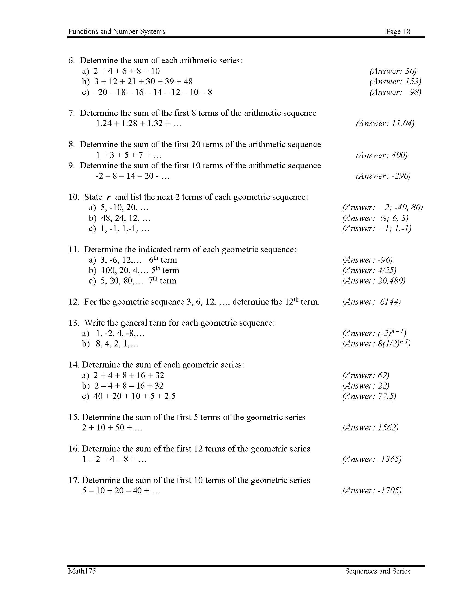

<!-- 

📋 This is the tech-news archives to help me keep track of what I am interested in!

- Reference tech news link: <https://thenextweb.com/news/blockchain-development-tech-career>
  

{{ notice-2 | markdownify }}
 -->

📋 This is my note-taking from what I learned in the class "Math175-002 Functions & Number Systems"
{: .notice--danger}

 

# Formulas Used for Exercise

> d = tn + 1 - tn
>
> tn = a + (n - 1)d

> Sn =
> $$ {n} \over {2} $$
> (a + tn)
>
> Sn =
> $$ {n} \over {2} $$
> [2a + (n - 1)d]

> r =
> $$ {t\_{n+1}} \over {t_n} $$
>
> tn = a rn - 1

> Sn =
> $$ {a(r^n - 1)} \over {r - 1} $$

 

# Exercise

 

---

 

    🖋️ This is my self-taught blog! Feel free to let me know
    if there are some errors or wrong parts 😆

[Back to Top](#){: .btn .btn--primary }{: .align-right}
