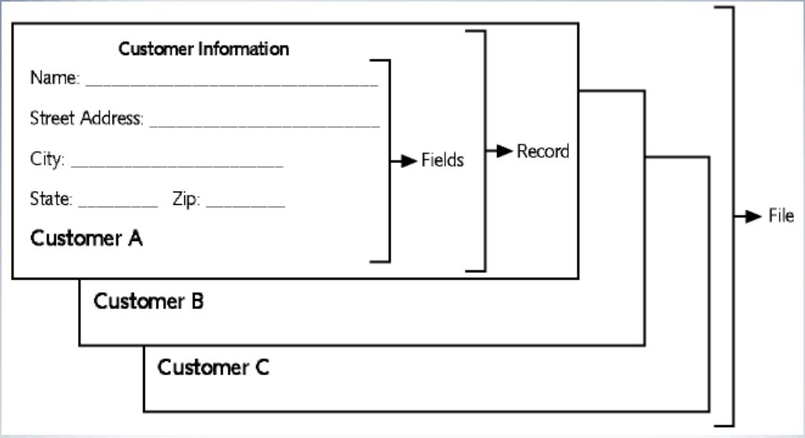
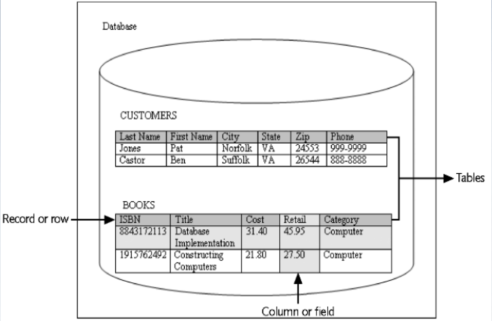
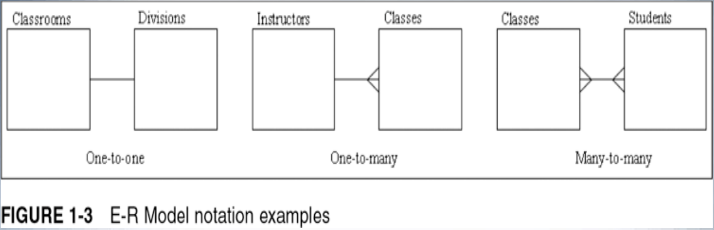
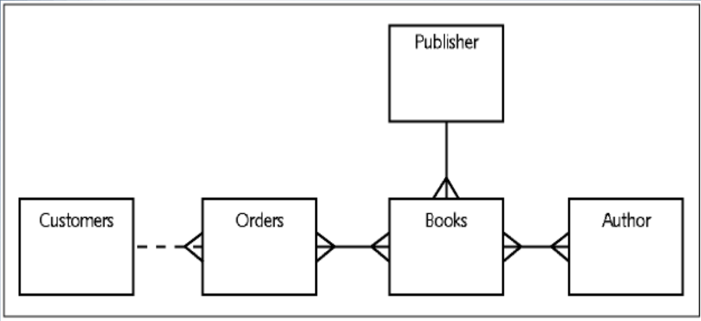
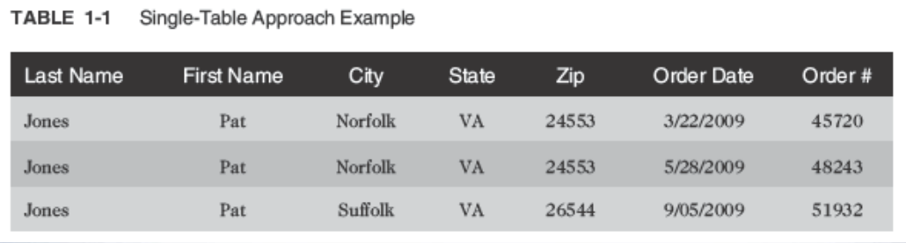
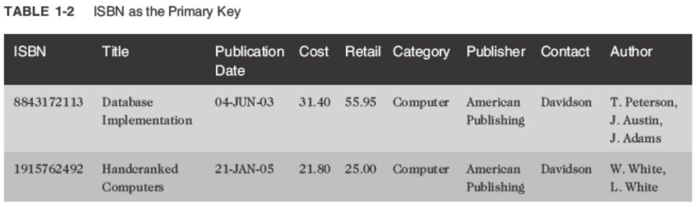
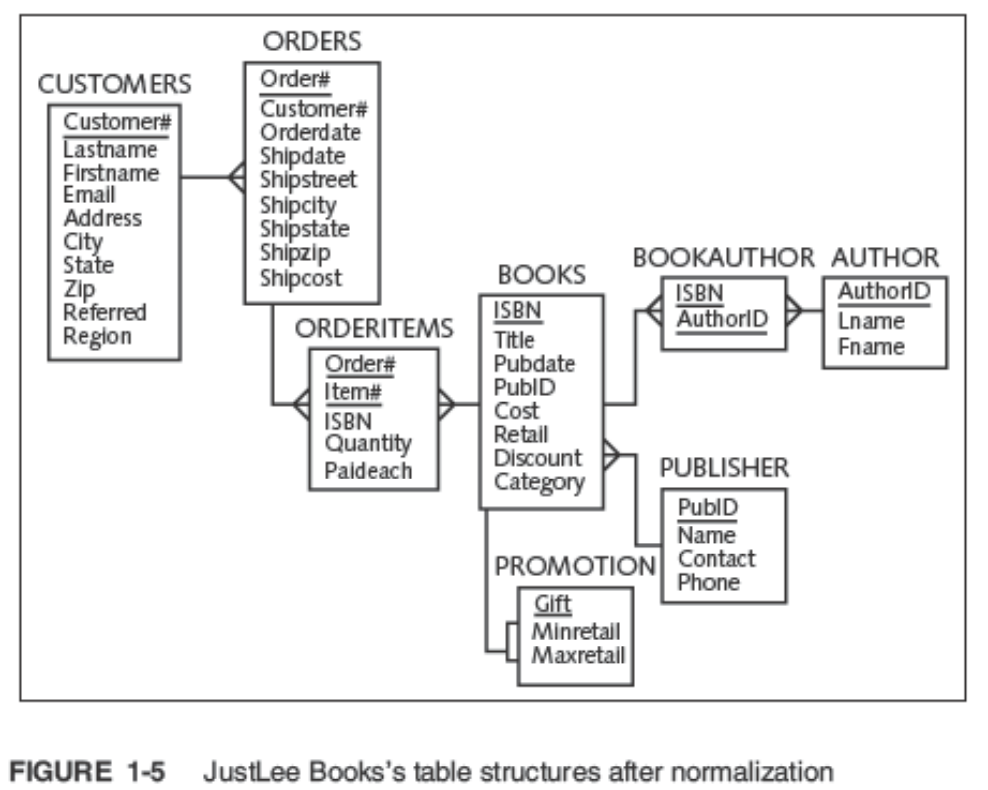

<!-- 

📋 This is the tech-news archives to help me keep track of what I am interested in!

- Reference tech news link: <https://thenextweb.com/news/blockchain-development-tech-career>
  

<div class="notice--danger">{{ notice-2 | markdownify }}</div> -->

📋 This is my note-taking from what I learned in the class "Introduction To Database Concept"
{: .notice--danger}

<br>

# Objectives

- Define database terms
- Identify the purpose of a database management system (DBMS)
- Explain database design using entity- relationship models and normalization
- Explain the purpose of a Structured Query Language (SQL)
- Understand how this textbook’s topics are sequenced and how the two sample databases are used

<br>

# Database Terminology

- Database &rarr; logical structure to store data
- Database management system (DBMS) &rarr; software used to create and interact with the database

<br>

# Database Components




## Character

- Basic unit of data
- Can be a letter, number, or special symbol

## Field

- A group of related characters
- Represents an attribute or characteristic of an entity
- Corresponds to a column in the physical database

## Record

- A collection of fields for one specific entity
- Corresponds to a row in the physical database

## File

- A group of records about the same type of entity

<br>

# Database Management System

- Data storage: manage the physical structure of the database
- Security: control user access and privileges
- Multi-user access: manage concurrent data access
- Backup: enable recovery options for database failures
- Data access language: provide a language that allows database access
- Data integrity: enable constraints or checks on data
- Data dictionary: maintain information about database structure
- Metadata: Data about data

<br>

# Database Design

## Systems Development Life Cycle (SDLC)

- Systems investigation &rarr; understanding the problem
- Systems analysis &rarr; understanding the solution
- Systems design &rarr; creating the logical and physical components
- Systems implementation &rarr; placing completed system into operation
- Systems maintenance and review &rarr; evaluating the implemented system

## Entity-Relationship Model (E-R Model)



- Used to depict the relationship that exists among entities
- The following relationships can be included in an E-R model:
  : - One-to-one
  : - One-to-many
  : - Many-to-many

One-to-One Relationship:

- Each occurrence of data in one entity is represented by only one occurrence of data in the other entity
- Example: Each individual has just one Social Security number (SSN) and each SSN is assigned to just one person

One-to-Many Relationship:

- Each occurrence of data in one entity can be represented by many occurrences of the data in the other entity
- Example: A class has only one instructor, but each instructor can teach many classes

Many-to-Many Relationship:

- Data can have multiple occurrences in both entities
- Example: A student can take many classes, and each class is composed of many students
- Can not be included in the physical database

JustLee Example E-R Model:



## Normalization

Database Normalization:



- Determines required tables and columns for each table
- Multi-step process
- Used to reduce or control data redundancy
- Data redundancy &rarr; refers to having the same data in different places within a database
- Data anomalies &rarr; refers to data inconsistencies

Unnormalized Data:



- Contains repeating groups in the Author column in the BOOKS table

First-Normal Form (1NF):


- Primary key is identified
- Repeating groups are eliminated
- ISBN and Author columns together create a composite primary key

Composite Primary Key:

- More than one column is required to uniquely identify a row
- Can lead to partial dependency &rarr; a column is only dependent on a portion of the primary key

Second-Normal Form (2NF):


- Partial dependency must be eliminated
  : Break the composite primary key into two parts, each part representing a separate table
- BOOKS table in 2NF

Third-Normal Form (3NF):


- Publisher contact name has been removed



Summary of Normalization Steps

- 1NF: eliminate repeating groups, identify the primary key
- 2NF: table is in 1NF, and partial dependencies are eliminated
- 3NF: table is in 2NF, and transitive dependencies are eliminated
  

<div class="notice--danger">{{ notice-2 | markdownify }}</div>

<br>

# Relating Tables within the Database



- Once tables are normalized, make certain tables are linked
- Tables are linked through a common field
- A common field is usually a primary key in one table and a foreign key in the other table

<br>

# Lookup Table


- Common reference for descriptive data tables referenced in a foreign key

<br>

# Structured Query Language (SQL)

- Data sub-language
- Used to:
  : - Create or modify tables
  : - Add data to tables
  : - Edit data in tables
  : - Retrieve data from tables
- ANSI and ISO standards

<br>

# Databases Used in this Textbook - JustLee Books Database

Assumptions:

- No back orders or partial shipments
- Only U.S. addresses
- Completed orders are transferred to the annual SALES table at the end of each month to enable faster processing on the ORDERS table

<br>

# Topic Sequence

- The first half of the text will focus on creating a database
- The second half of the text will focus on querying or retrieving data from a database

<br>

# Week 01 Demo

```
SELECT * FROM DUAL;

DESC DUAL;

--STUDENT TABLE CREATION
CREATE TABLE STUDENT
( SID NUMBER(6),
  FNAME VARCHAR2(20),
  LNAME VARCHAR2(20),
  PRG VARCHAR2(5)
);

-- CHECK THE STRUCURE
SELECT * FROM STUDENT;

-- INSERT VALUES
INSERT INTO STUDENT VALUES (300123,'SHIRISH','BHUSAL','SET');
INSERT INTO STUDENT VALUES (300111,'SI','XU','SETAI');
INSERT INTO STUDENT VALUES (300222,'ASHISH','SHARMA','SET');

-- DELETE A TABLE
DROP TABLE STUDENT;

create table DEPARTMENTS (
  deptno        number,
  name          varchar2(50) not null,
  location      varchar2(50),
  constraint pk_departments primary key (deptno)
);

DESC DEPARTMENTS;
SELECT * FROM STUDENT;
```

<br>



Summary

- A DBMS is used to create and maintain a database
- A database is composed of a group of interrelated tables
- A file is a group of related records; a file is also called a table in the physical database
- A record is a group of related fields regarding one specific entity; a record is also called a row
- A record is considered unnormalized if it contains repeating groups
- A record is in first-normal form (1NF) if no repeating groups exist and it has a primary key
- Second-normal form (2NF) is achieved if the record is in 1NF and has no partial dependencies
- After a record is in 2NF and all transitive dependencies have been removed, then it is in third-normal form (3NF), which is generally sufficient for most databases
- A primary key is used to uniquely identify each record
- A common field is used to join data contained in different tables
- A foreign key is a common field that exists between two tables but is also a primary key in one of the tables
- A lookup table is a common term for a table referenced in a foreign key
- A Structured Query Language (SQL) is a data sub-language that navigates the data stored within a database’s tables
  

<div class="notice--danger">{{ notice-2 | markdownify }}</div>

<br>

# C.1 Demo

```
-- Week 01 --

SELECT * FROM DUAL;
DESC DUAL;

-- CREATE 'STUDENT' TABLE
CREATE TABLE STUDENT
(
SID NUMBER(6),
FNAME VARCHAR2(20) NOT NULL,
LNAME VARCHAR2(20),
PRG VARCHAR2(5), --> PRG VARCHAR2(5) CONSTRAINT PK_STUDENT PRIMARY KEY -> NOT NULL VALUE: FNAME, PRG
CONSTRAINT PK_STUDENT PRIMARY KEY (SID) --> NOT NULL VALUE: SID, FNAME
);
SELECT * FROM STUDENT;
DESC STUDENT;

-- INSERT A VALUE
INSERT INTO STUDENT VALUES (300123,'SEYEON','JO','SET');

-- DELETE A TABLE
DROP TABLE STUDENT;
```

<br>

---

<br>

    🖋️ This is my self-taught blog! Feel free to let me know
    if there are some errors or wrong parts 😆

[Back to Top](#){: .btn .btn--primary }{: .align-right}
