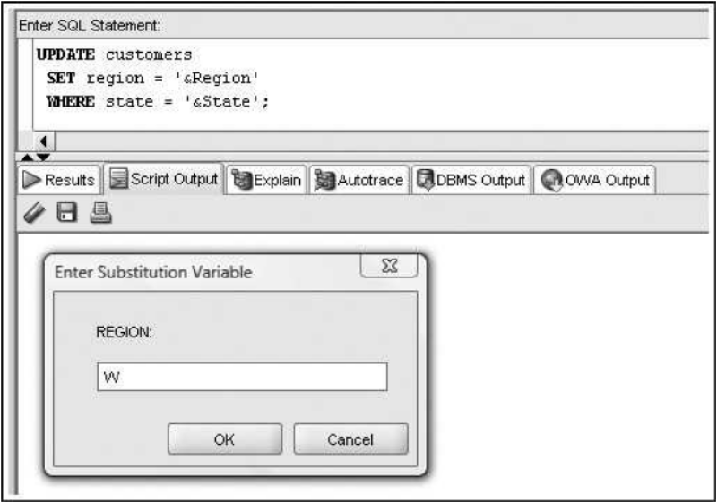

<!-- 

📋 This is the tech-news archives to help me keep track of what I am interested in!

- Reference tech news link: <https://thenextweb.com/news/blockchain-development-tech-career>
  

<div class="notice--danger">{{ notice-2 | markdownify }}</div> -->

📋 This is my note-taking from what I learned in the class "Introduction To Database Concept"
{: .notice--danger}

<br>

# DML and Transaction Control Commands

| Command               | Description                                                                                               |
| :-------------------- | :-------------------------------------------------------------------------------------------------------- |
| INSERT                | Adds new rows to a table; can include a subquery to copy rows from an existing table                      |
| UPDATE                | Adds data to, or modifies data in, existing rows                                                          |
| DELETE                | Removes rows from a table                                                                                 |
| COMMIT                | Saves changed data in a table permanently                                                                 |
| ROLLBACK              | Allows “undoing” uncommitted changes to data                                                              |
| SAVEPOINT             | Enables setting markers in a transaction                                                                  |
| LOCK TABLE            | Prevents other users from making changes to a table                                                       |
| SELECT ... FOR UPDATE | Creates a shared lock on a table to prevent another user from making changes to data in specified columns |

<br>

# INSERT command

- Used to add rows to existing tables
- Identify the table in the INSERT INTO clause
- Specify data in the VALUES clause
- Can only add one row at a time to a table

## INSERT command syntax

- Enclose nonnumeric data in single quotes
- If a column list is not provided, a value must be assigned to each column in the table

No Column List:

```
INSERT INTO ACCTMANAGER VALUES ('T500', 'NICK', 'TAYLOR', '05-SEP-23', 42000, 3500, 'NE');
```

Column List:

```
INSERT INTO ACCTMANAGER (AMID, AMFIRST, AMLAST, AMSAL, AMCOMM, REGION) VALUES ('T500', 'NICK', 'TAYLOR', 42000, 3500, 'NE');
```

## Inserting NULL Value

- Omit column name from INSERT INTO clause column list
- Substitute two single quotation marks
- Use NULL keyword

```
INSERT INTO ACCTMANAGER VALUES ('L500', 'SEYEON', 'JO', '28-JUN-23', 47000, 1500, NULL);
```

## ON NULL Clause

- Introduced in Oracle 12c
- Option with a DEFAULT setting

```
ALTER TABLE ACCTMANAGER MODIFY (AMSAL DEFAULT ON NULL 0);

INSERT INTO ACCTMANAGER (AMID, AMFIRST, AMLAST, AMEDATE, AMSAL, AMCOMM, REGION) VALUES ('T500', 'NICK', 'TAYLOR', NULL, NULL, 3500, 'NW');

SELECT * FROM ACCTMANAGER;

-- OUTPUT
| AMID | AMFIRST | AMLAST | AMEDATE | AMSAL | AMCOMM | REGION |
| T500 | NICK    | TAYLOR | (null)  |     0 |   3500 | NW     |
```

## Manage Virtual Column Input

```
INSERT INTO ACCTMANAGER (AMID, AMFIRST, AMLAST, AMSAL, AMCOMM, REGION, AMEARN) VALUES ('T500', 'NICK', 'TAYLOR', 53000, 6000, 'SE', 59000);

-- Error: INSERT operation disallowed on virtual columns
-- Error indicating that an INSERT isn't allowed on a virtual column
```

## Constraint Violations

When you add or modify table data, the data is checked for compliance with any applicable constraints

## Activating the DEFAULT option

- Include a column list in the INSERT statement ignoring the column to use the DEFAULT option
- Use the DEFAULT keyword as the value for the column

## Inserting Data from an Existing Table

Substitute sub-query for VALUES clause

```
INSERT INTO ACCTBONUS (AMID, AMSAL, REGION) SELECT AMID, AMSAL, REGION FROM ACCTMANAGER;

-- Sub-query: 'SELECT AMID, AMSAL, REGION FROM ACCTMANAGER'
```

<br>

# UPDATE Command

- UPDATE clause identifies table
- SET clause identifies column(s) being changed and new value(s)
- Optional WHERE clause specifies row(s) to be changed – if omitted, all rows will be updated!

## Update Command Syntax

```
UPDATE ACCTMANAGER SET AMEDATE = '10-OCT-23', REGION = 'S' WHERE AMID = 'L500';
```

## Modifying Existing Rows

- Modify rows using UPDATE command
- Use UPDATE command to:
  : - Add values to an existing row (replace NULL values)
  : - Change existing values

## Substitution Variables

- Prompts user for value
- Identified by ampersand (&) preceding variable name
- Can be used to create interactive scripts

```
UPDATE CUSTOMERS SET REGION = '&REGION' WHERE STATE = '&STATE';
```



<br>

# DELETE command

DELETE command

## Deleting Rows

DELETE command removes a row from a table

```
DELETE FROM ACCTMANAGER WHERE AMID = 'J500';

-- WHERE clause determines which row(s) are removed
```

## Omitting WHERE Clause

- Omitting WHERE clause removes all rows
- Example below removes all rows from the acctmanager table

```
DELETE FROM ACCTMANAGER;
```

<br>

# Transaction Control Statements

- Results of data manipulation language (DML) are not permanently updated to a table until explicit or implicit COMMIT occurs
- Transaction control statements can:
  : - Commit data through COMMIT command
  : - Undo data changes through ROLLBACK command

## COMMIT Command

- Explicit COMMIT occurs by executing COMMIT;
- Implicit COMMIT occurs when DDL command is executed or user properly exits system
- Permanently updates table(s) and allows other users to view changes

## ROLLBACK Command

- Used to “undo” changes that have not been committed
- Occurs when:
  : - ROLLBACK; is executed
  : - System restarts after a crash

## SAVEPOINT Command

- SAVEPOINT marks a specific spot within the transaction
- Can ROLLBACK to a SAVEPOINT to undo part of the transaction

## Transaction Control Example

```
UPDATE ACCTMANAGER SET REGION = 'E' WHERE AMID = 'M500';
-- 1 rows updated
COMMIT; --> Permanent save with COMMIT
-- COMMIT succeeded

UPDATE ACCTMANAGER SET REGION = 'E' WHERE AMID = 'T500';
-- 1 rows updated
UPDATE ACCTMANAGER SET REGION = 'E' WHERE AMID = 'L500';
-- 1 rows updated
SAVEPOINT ONE; --> Create a SAVEPOINT
-- SAVEPOINT ONE succeeded

UPDATE ACCTMANAGER SET AMCOMM = 6600 WHERE AMID = 'T500';
-- 1 rows updated

ROLLBACK TO ONE; --> Only undo DML actions after SAVEPOINT
-- ROLLBACK TO succeeded
```

<br>

# Table Locks

- Prevent users from changing same data or objects
- Two types:
  : - Shared – prevents DML operations on a portion of table
  : - Exclusive – locks table preventing other exclusive or shared locks

## LOCK TABLE Command Shared Lock

- Locks portion of table affected by DML operation
- Implicitly occurs during UPDATE or DELETE operations
- Explicitly occurs through LOCK TABLE command with SHARE MODE option
- Released when COMMIT (implicit or explicit) or ROLLBACK occur

## LOCK TABLE Command Exclusive Lock

- Implicitly locks table for DDL operations – CREATE or ALTER TABLE
- Explicitly locked through LOCK TABLE command with EXCLUSIVE MODE option
- Released after execution of DDL operation or after user exits system

## SELECT…FOR UPDATE Command

- Creates shared lock on retrieved portion of table
- Prevents one user from changing a row while another user is selecting rows to be changed
- Released through implicit or explicit commit

```
SELECT columnname, ... FROM tablename, ... [WHERE condition] FOR UPDATE;
```

<br>

# Summary

- Data manipulation language (DML) includes the INSERT, UPDATE, DELETE, COMMIT, and ROLLBACK commands
- The INSERT INTO command is used to add new rows to an existing table
- The column list specified in the INSERT INTO clause must match the order of data entered in the VALUES clause
- A virtual column must be ignored in all DML actions because the database system generates this column value automatically
- You can use a NULL value in an INSERT INTO command by including the keyword NULL, omitting the column from the column list of the INSERT INTO clause, or entering two single quotes (without a space) in the position of the NULL value
- To assign a DEFAULT option value, a column must be excluded from the column list in an INSERT statement or the keyword DEFAULT must be included as the value for the column
- In a DML statement, two single quotes together must be used to represent a single quote in a value
- If rows are copied from a table and entered in an existing table by using a sub-query in the INSERT INTO command, the VALUES clause must be omitted because it’s irrelevant
- You can change the contents of a row or group of rows with the UPDATE command
- You can use substitution variables to allow you to execute the same command several times with different data values
- DML operations aren’t stored permanently in a table until a COMMIT command is issued implicitly or explicitly
- A transaction consists of a set of DML operations committed as a block
- Uncommitted DML operations can be undone by issuing the ROLLBACK command
- A SAVEPOINT serves as a marker for a point in a transaction and allows rolling back only a portion of the transaction
- Use the DELETE command to remove records from a table; if the WHERE clause is omitted, all rows in the table are deleted
- Table locks can be used to prevent users from mistakenly overwriting changes made by other users
- Table locks can be in SHARE mode or EXCLUSIVE mode
- EXCLUSIVE mode is the most restrictive table lock and prevents any other user from placing any locks on the same table
- A lock is released when a transaction control statement is issued, a DDL statement is executed, or the user exits the system by using the EXIT command
- SHARE mode allows other users to place shared locks on other portions of the table, but it prevents users from placing an exclusive lock on the table
- The SELECT ... FOR UPDATE command can be used to place a shared lock for a specific row or rows; the lock isn’t released unless a DDL command is issued or the user exits the system

<br>

# C.6 Demo

```
-- Week 06 --> DATA MANIPULATION AND TRANSACTION CONTROL

-- CREATE TABLE
CREATE TABLE ACCTMANAGER
(
AMID CHAR(4),
AMFIRST VARCHAR2(12) NOT NULL,
AMLAST VARCHAR2(12) NOT NULL,
AMEDATE DATE DEFAULT SYSDATE,
AMSAL NUMBER(8,2),
--> TOTAL 8 DIGITS, WITH 2 DIGITS ALLOWED TO THE RIGHT OF THE DECIMAL POINT
--> 12345.67(VALID), 123456789.12(NOT VALID)
AMCOMM NUMBER(7,2) DEFAULT 0,
--> DEFAULT VALUE IS '0'
REGION CHAR(2),
CONSTRAINT ACCTMANAGER_AMID_PK PRIMARY KEY (AMID),
CONSTRAINT ACCTMANAGER_REGION_CK CHECK (REGION IN ('ON', 'BC', 'SE'))
);

-- CREATE TABLE & PK, FK TO MULTIPLE COLUMNS AT ONCE
CREATE TABLE REP_CONTRACTS
(
Store_ID NUMBER(8),
Name NUMBER(5),
Quarter CHAR(3),
Rep_ID NUMBER(5),
PRIMARY KEY (Rep_ID, Store_ID, Quarter),
FOREIGN KEY (Rep_ID) REFERENCES STORE_REPS (Rep_ID),
FOREIGN KEY (Store_ID) REFERENCES BOOK_STORES (Store_ID)
);

-- INSERT NEW ROW INTO ACCTMANAGER TABLE WITH SPECIFIC VALUES
INSERT INTO ACCTMANAGER VALUES ('T500','NICK','TAYOR','05-SEP-09',42000,3500,'NE');
-- INSERT NEW ROW INTO ACCTMANAGER TABLE WITH 'NULL' VALUE
INSERT INTO ACCTMANAGER VALUES ('L500','MANDY','LOPEZ','01-OCT-09',47000,1500,NULL);
-- INSERT NEW ROW INTO ACCTMANAGER TABLE USING 'SYSDATE' AS DATE VALUE
INSERT INTO ACCTMANAGER (AMID,AMFIRST,AMLAST,AMEDATE,AMSAL,AMCOMM,REGION) VALUES ('J500','SAMMIE','JONES',SYSDATE,39500,2000,'NW');

-- INSERT DATA FROM EXISTING TABLE
CREATE TABLE ACCTMANAGER7
(
AMID CHAR(4),
AMSAL NUMBER(8,2),
REGION CHAR(2)
);
INSERT INTO ACCTMANAGER7 (AMID, AMSAL, REGION) SELECT AMID, AMSAL, REGION FROM ACCTMANAGER5;
SELECT * FROM ACCTMANAGER7;

-- HAVE DEFAULT VALUE OF '0' WHEN A 'NULL' VALUE IS ENTERED
ALTER TABLE ACCTMANAGER MODIFY (AMSAL DEFAULT ON NULL 0);
--> SO IF 'NULL' VALUE IS ENTERED IN 'AMSAL', IT WILL SHOW '0' VALUE
INSERT INTO ACCTMANAGER (AMID,AMFIRST,AMLAST,AMEDATE,AMSAL,AMCOMM,REGION) VALUES ('J600','SAM','JAMES',NULL,NULL,2000,'NW');

-- UPDATE 'AMEDATE' TO '15-SEP-20' SPECIFICALLY FOR ROW THAT MATCH THE CONDITION 'AMID'='L500'
UPDATE ACCTMANAGER SET AMEDATE='15-SEP-20' WHERE AMID='L500';
-- UPDATE 'AMSAL' BASED ON 'AMID' VALUE
UPDATE ACCTMANAGER SET AMSAL=50000 WHERE AMID='J600';

-- SUBSTITUTE VARIABLES -> USER ENTER VALUES OF REGION AND STATE
UPDATE CUSTOMERS SET REGION ='&REGION' WHERE STATE='&STATE';
SELECT * FROM CUSTOMERS;

-- DELETE ROW FROM ACCTMANAGER TABLE WHERE AMID IS 'L500'
DELETE FROM ACCTMANAGER WHERE AMID='L500';
-- DELETE ALL ROWS FROM TABLE
DELETE FROM ACCTMANAGER;

-- TRANSACTION CONTROL EXAMPLE
UPDATE ACCTMANAGER SET AMSAL=60000 WHERE AMID='J600';
COMMIT; --> PERMANENTLY SAVE CHANGES MADE IN THE CURRENT TRANSACTION UP TO THAT POINT
UPDATE ACCTMANAGER SET AMSAL=50000 WHERE AMID='J600';
UPDATE ACCTMANAGER SET AMSAL=40000 WHERE AMID='J600';
SAVEPOINT ONE; --> CREATE SAVEPOINT 'ONE' AND ROLLBACK IN A TRANSACTION
UPDATE ACCTMANAGER SET AMSAL=30000 WHERE AMID='J600';
ROLLBACK TO ONE; --> UNDO ANY CHANGES MADE AFTER THE SAVEPOINT
--> IN THIS CASE, THE UPDATE TO 'AMSAL=40000'
--> ONLY UNDO DML ACTIONS AFTER AFTER SAVEPOINT

-- ROLL BACK THE ENTIRE TRANSACTION, UNDOING ANY CHANGES MADE SINCE THE TRANSACTION STARTED
ROLLBACK;

-- TABLE LOCKS EXAMPLE
-- 1. LOCK TABLE SHARED LOCK
LOCK TABLE CUSTOMERS IN SHARE MODE;
--> STILL CAN READ DATA BUT CANNOT MAKE ANY MODIFICATIONS UNTIL LOCK IS RELEASED
-- 2. LOCK TABLE EXCLUSIVE LOCK
LOCK TABLE CUSTOMERS IN EXCLUSIVE MODE;
--> CANNOT READ OR MODIFY TABLE
-- 3. SELECT ... FOR UPDATE
SELECT COST FROM BOOKS WHERE CATEGORY='COMPUTER' FOR UPDATE;
--> SELECT ROW 'COST' FROM TABLE 'BOOKS' WHERE CATEGORY='COMPUTER'
--> ACQUIRE SHARED LOCK ON THOSE ROW
--> CANNOT MODIFY THE SELECTED ROW UNTIL THE CURRENT TRANSACTION IS COMPLETED

-- THE RELEASE OF LOCKS CAN BE ACHIEVED THROUGH IMPLICIT AND EXPLICIT COMMIT
-- 1. IMPLICIT COMMIT: WHEN TRANSACTION IS COMPLETED OR REACH THE END OF SCRIPT
-- 2. EXPLICIT COMMIT: EXPLICITLY ISSUE COMMIT TO END THE CURRENT TRANSACTION AND RELEASE THE LOCKS HELD BY IT
```

<br>

---

<br>

    🖋️ This is my self-taught blog! Feel free to let me know
    if there are some errors or wrong parts 😆

[Back to Top](#){: .btn .btn--primary }{: .align-right}
