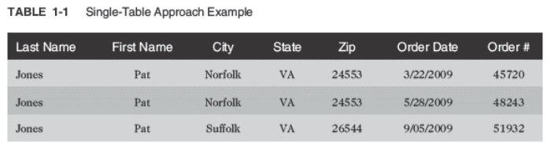
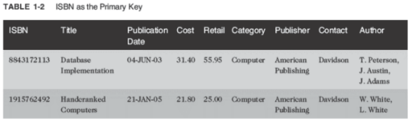
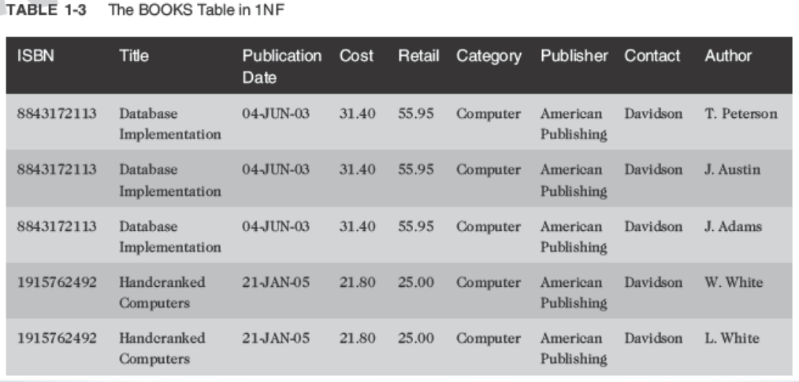
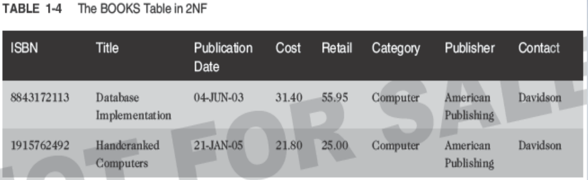
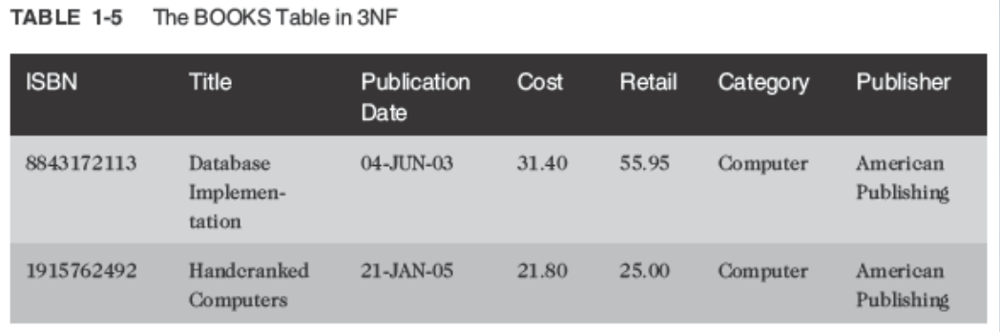
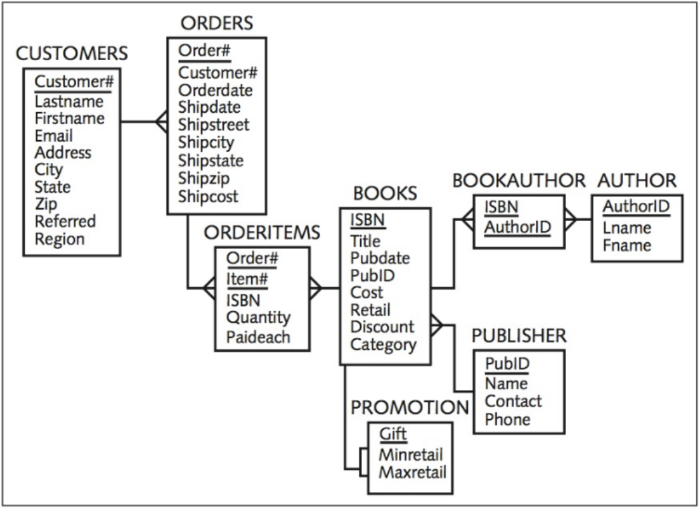
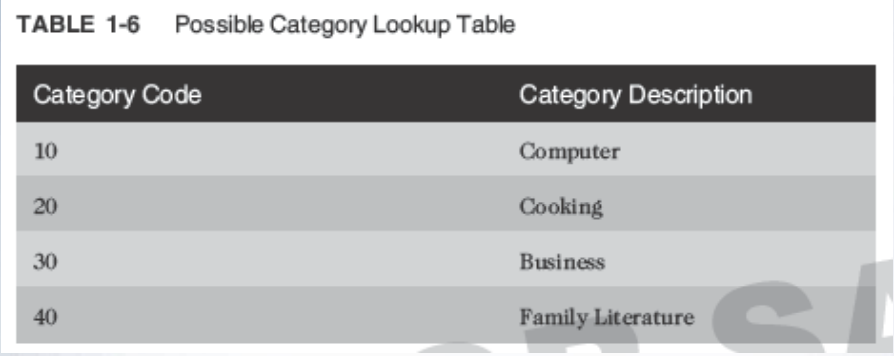
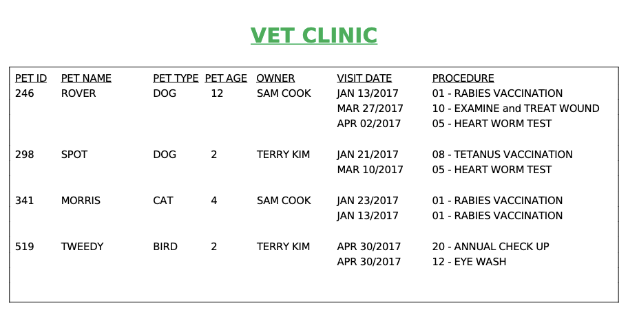

<!-- 

📋 This is the tech-news archives to help me keep track of what I am interested in!

- Reference tech news link: <https://thenextweb.com/news/blockchain-development-tech-career>
  

<div class="notice--danger">{{ notice-2 | markdownify }}</div> -->

📋 This is my note-taking from what I learned in the class "Introduction To Database Concept"
{: .notice--danger}

<br>

# Entity-Relationship Model (E-R Model)

- Used to depict the relationship that exists among entities
- The following relationships can be included in an E-R model:
  : - One-to-one
  : - One-to-many
  : - Many-to-many


## Relationships

- One-to-one
  : Each occurrence of data in one entity is represented by only one occurrence of data in the other entity
  : - Example: Each individual has just one Social Security number (SSN) and each SSN is assigned to just one person
- One-to-many
  : Each occurrence of data in one entity can be represented by many occurrences of the data in the other entity
  : - Example: A class has only one instructor, but each instructor can teach many classes
- Many-to-many
  : Data can have multiple occurrences in both entities
  : - Example: A student can take many classes, and each class is composed of many students
  : Can not be included in the physical database

## JustLee Example E-R model


<br>

# Database Normalization

Many people unfamiliar with database design principles often ask, “Why not just put all the data in one big table?” This single-table approach leads to problems of data redundancy (duplication) and data anomalies (data inconsistencies).

For example, review the order data recorded in Table 1-1. The customer information is repeated for each order a customer places (redundancy). Also, the city data in the last row is different from the first two rows.

Under these circumstances, it isn’t clear whether the last row actually represents a different customer, whether the previous customer had an address change, or whether the city information is incorrect (data anomaly).

To avoid these data issues, database normalization is used to create a design that reduces or eliminates data redundancy and, therefore, avoids data anomalies. In general, normalization helps database designers determine which attributes, or fields, belong to each entity. In turn, this information helps determine which fields belong in each table.

Normalization is a multistage process that enables designers to take the raw data to be collected about an entity and develop the data into a structured, normalized form that reduces the risks associated with data redundancy.

Data redundancy poses a special problem in databases because storing the same data in different places can cause problems when updates or changes to data are required. Most novices have difficulty understanding the impact of storing unnormalized data— data that hasn’t been designed by using a normalization process.

Here’s an example. Suppose you work for a large company and submit a change-of-address form to the Human Resources (HR) Department. If all the data HR stores is normalized, a data entry clerk needs to update only the EMPLOYEES master table with your new address.

However, if the data is not stored in a normalized format, the data entry clerk likely needs to enter the change in each table containing your address—the EMPLOYEE RECORD table, the HEALTH INSURANCE table, the SICK LEAVE table, the ANNUAL TAX INFORMATION table, and so on—even though all this data is stored in the same database.

As a result, if your mailing address is stored in several tables (or even duplicated in the same table) and the data entry clerk fails to make the change in one table, you might get a paycheck showing one address and, at the end of the year, have your W-2 form mailed to a different address! Storing data in a normalized format means only one update is required to reflect the new address, and it should always be the one that appears whenever your mailing address is needed.

- Determines required tables and columns for each table
- Multi-step process
- Used to reduce or control data redundancy
- Data redundancy – refers to having the same data in different places within a database
- Data anomalies – refers to data inconsistencies



## Unnormalized Data

- Contains repeating groups in the Author column in the BOOKS table



## First-Normal Form (1NF)

- Primary key is identified
- Repeating groups are eliminated
- ISBN and Author columns together create a composite primary key

Composite Primary Key:

- More than one column is required to uniquely identify a row
- Can lead to partial dependency – a column is only dependent on a portion of the primary key



## Second-Normal Form (2NF)

- Partial dependency must be eliminated
  : Break the composite primary key into two parts, each part representing a separate table
- BOOKS table in 2NF



## Third-Normal Form (3NF)

- Remove transitive dependencies
- A transitive dependency means at least one value in the record isn’t dependent on the primary key but on another field in the record. In this case, the contact person from the publisher’s office is actually dependent on the publisher, not on the book
- To remove the transitive dependency, remove the contact information and place it in a separate table.





Summary of Normalization Steps:

- 1NF: eliminate repeating groups, identify the primary key
- 2NF: table is in 1NF, and partial dependencies are eliminated
- 3NF: table is in 2NF, and transitive dependencies are eliminated
  

<div class="notice--danger">{{ notice-2 | markdownify }}</div>

<br>

# Relating Tables within the Database

- Once tables are normalized, make certain tables are linked
- Tables are linked through a common field
- A common field is usually a primary key in one table and a foreign key in the other table



## Lookup Table

Common reference for descriptive data tables referenced in a foreign key



<br>

# Structured Query Language (SQL)

- Data sub-language
- Used to:
  : - Create or modify tables
  : - Add data to tables
  : - Edit data in tables
  : - Retrieve data from tables
- ANSI and ISO standards

<br>

# Databases used in this course - JustLee Books Database

Assumptions:

- No back orders or partial shipments
- Only U.S. addresses
- Completed orders are transferred to the annual SALES table at the end of each month to enable faster processing on the ORDERS table

<br>

# Topic Sequence

- The first half of the text will focus on creating a database.
- The second half of the text will focus on querying or retrieving data from a database.

<br>

# Summary

- A record is considered unnormalized if it contains repeating groups
- A record is in first-normal form (1NF) if no repeating groups exist and it has a primary key
- Second-normal form (2NF) is achieved if the record is in 1NF and has no partial dependencies
- After a record is in 2NF and all transitive dependencies have been removed, then it is in third-normal form (3NF), which is generally sufficient for most databases
- A primary key is used to uniquely identify each record
- A foreign key is a common field that exists between two tables but is also a primary key in one of the tables
- A lookup table is a common term for a table referenced in a foreign key
- A Structured Query Language (SQL) is a data sublanguage that navigates the data stored within a database’s tables

<br>

# C.9 Demo



UNF: Pet [pet_id, pet_name, pet_type, pet_age, owner, (visit_date, procedure_no, procedure_name)]

```
-- Week 09

-- 1NF
CREATE TABLE VETCLINIC_1NF
(
    PETID NUMBER(3) PRIMARY KEY,
    PETNAME VARCHAR2(20),
    PETTYPE VARCHAR2(20),
    PETAGE NUMBER(2),
    OWNER VARCHAR2(20),
    VISITDATE DATE,
    PROCEDURE VARCHAR2(50)
);

-- 2NF
CREATE TABLE APPOINTMENT_2NF
(
    APPOINTMENT_ID NUMBER(10),
    VISITDATE DATE,
    PETID NUMBER(3),
    CONSTRAINT PK_APPOINTMENT PRIMARY KEY (APPOINTMENT_ID),
    CONSTRAINT FK_APPOINTMENT_PET FOREIGN KEY (PETID) REFERENCES VETCLINIC_1NF (PETID)
);

-- 3NF
CREATE TABLE PROCEDURE_3NF
(
    PROCEDURE_ID NUMBER(10),
    PROCEDURE_NAME VARCHAR2(50),
    PETID NUMBER(3),
    CONSTRAINT PK_PROCEDURE PRIMARY KEY (PROCEDURE_ID),
    CONSTRAINT FK_PROCEDURE_PET FOREIGN KEY (PETID) REFERENCES VETCLINIC_1NF (PETID)
);

```

<br>

---

<br>

    🖋️ This is my self-taught blog! Feel free to let me know
    if there are some errors or wrong parts 😆

[Back to Top](#){: .btn .btn--primary }{: .align-right}
