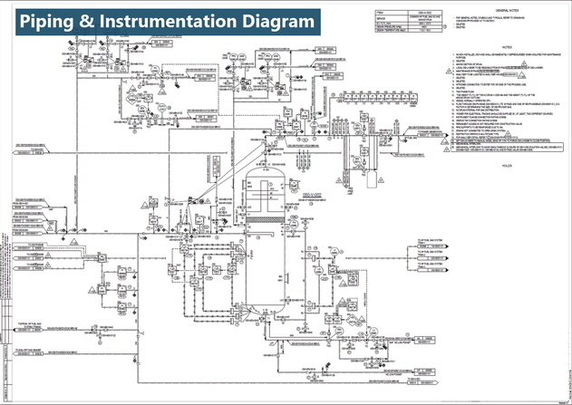
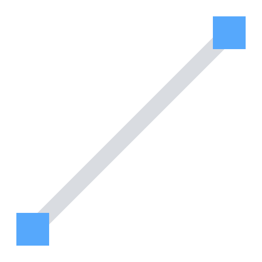

최근 몇 년 동안 인공지능(AI) 기술은 다양한 산업 분야에서 혁명적인 변화를 가져왔습니다. 그 중에서도 AI를 사용한 시각 분야의 발전은 특히 높은 관심을 받고 있습니다. 여기서는 AI 기반 P&ID(공정 배관 계장도) 인식 프로젝트에 주목하여, P&ID의 개념과 프로젝트의 배경 및 목적을 알아보겠습니다.

## 📋 Table of Contents

1. [P&ID 정의](#1-pid란-무엇인가요)
2. [프로젝트 배경](#2-프로젝트-배경)
3. [프로젝트 목표](#3-프로젝트-목표)
4. [프로젝트 구축 계획](#4-프로젝트-구축-계획)

## 1. P&ID란 무엇인가요?

[P&ID 설계 도면 예시]

*출처: [이미지 링크](https://upmation.com/tag/how-to-read-pid-tutorial/){:target="_blank"}* 

P&ID(Piping and Instrumentation Diagram)는 기본 설계 정보를 포함한 중요한 설계 도면입니다. 
이 도면은 설계자가 의도한 공정 설비의 흐름, 조작, 및 설비 운영 지침을 나타내며, 모든 장비, 배관, 그리고 제어 기기를 표현합니다.

- **프로세스 흐름**: 시설 내의 다양한 단계와 장치 간의 연결과 흐름을 나타냅니다.
- **장치 및 장비**: 밸브, 펌프, 센서 등과 같은 장치와 장비의 위치와 역할을 표시합니다.
- **제어 시스템**: 제어 패널 및 인터페이스, 자동화 시스템과 관련된 정보를 포함합니다.

P&ID는 설계, 건설, 운영, 유지 보수, 안전 관리 등 다양한 단계에서 사용되며, 정확하고 명확한 P&ID 인식은 공정의 원활한 운영을 지원합니다.

## 2. 프로젝트 배경

P&ID는 프로세스 흐름과 제어 시스템을 시각적으로 나타내는 중요한 역할을 합니다.
그러나 P&ID를 작성하고 관리하는 작업은 복잡하며, 오류를 유발할 수 있는데요. 
기존에는 P&ID를 수작업으로 작성하고 유지하는 것이 일반적이었습니다. 이로 인해 **휴먼 에러, 비용 증가, 시간 소요 등**의 문제가 발생했습니다. 
이러한 문제를 해결하기 위해 AI 기술을 도입한 프로젝트를 수행하게 되었습니다.

## 3. 프로젝트 목표

AI 기반 P&ID 인식 프로젝트는 이러한 P&ID를 자동으로 인식하고 이해할 수 있는 기술을 개발하는 것을 목표로 합니다. 이 프로젝트는 다음과 같은 이점을 제공합니다.

- **자동화**: 인간의 수작업을 최소화하고, 비정형 P&ID 를 자동으로 인식하여 디지털 도면으로 변환합니다.
- **정확성**: AI는 고정밀 데이터를 기반으로 작동하므로 인식 및 분석의 정확성을 향상시킵니다.
- **시간과 비용 절감**: 수작업 작업을 줄이고, 빠른 업데이트 및 수정이 가능해 시간과 비용을 절감합니다.

이러한 AI 기반 설계도면 자동 인식 프로젝트는 *입찰 단계*에서 설계에 필요한 구성요소를 단시간 내 정확하게 추출하여 후속부서에 연계할 수 있으며, *실행 단계*에서는 디지털 도면으로 자동 변환 및 설계 구성요소를 체계적으로 관리하는 설계 선진화 도입이 가능합니다.

## 4. 인식 모델 구축 계획

설계 도면(P&ID)을 구성하는 주요 요소는 심볼, 텍스트, 라인입니다. 이러한 구성 요소를 정확하게 인식하기 위해 구성 요소마다 최적의 딥러닝 모델 프레임워크를 설계하고, 모델이 학습하고 추론할 수 있는 환경을 도커 컨테이너로 구축할 것입니다.

###  &nbsp; 심볼 인식 모델 설계 

심볼은 P&ID에서 핵심적인 정보를 담고 있으며, 프로젝트나 발주처에 따라 다양한 형태와 이름을 가집니다. 따라서, 일반적인 지도학습 모델로만 접근하기에는 한계가 있습니다. 따라서 다양한 접근 방식을 채택하여 심볼을 인식할 모델을 설계합니다.

###  &nbsp; 텍스트 탐지 및 인식 모델 설계 

P&ID에 포함된 텍스트의 영역을 탐지하고, 그 안에 있는 텍스트의 의미를 인식하는 모델을 설계합니다. 초기 시도로는 Google의 Tesseract와 같은 오픈 소스 OCR 엔진을 사용했으나, 현재는 도면에 특화된 자체 개발 OCR 엔진을 구축하게 되었습니다. 

###  &nbsp; 라인 인식 및 연관관계 분석 모델 설계  

P&ID에서는 라인은 시설 간 연결과 흐름을 나타냅니다. 하지만 라인의 feature는 특징적이지 않아 전통적인 이미지 분할 기술을 활용하기 어려웠습니다. 따라서, 이 부분에 대한 라인 트레이싱 방식을 활용한 Deep Line Tracer를 자체 개발합니다.
각 객체를 인식한 후, 이들 사이의 연관관계를 파악하여 스펙을 계산하고, 심볼마다 엔지니어링 정보를 주입시키는 과정을 거칩니다. 이렇게 계산된 정보는 다양한 Report로 산출되며 후속 공정에서 중요한 역할을 합니다.

> [**다음 게시글**](/projects/pnid/02)부터는 차례대로 각 구성 요소(심볼, 텍스트, 라인)를 인식하는 모델을 구성하는 과정을 소개합니다.

