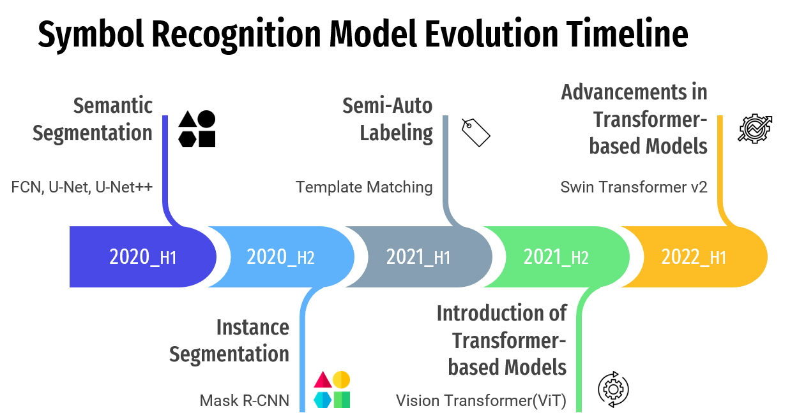
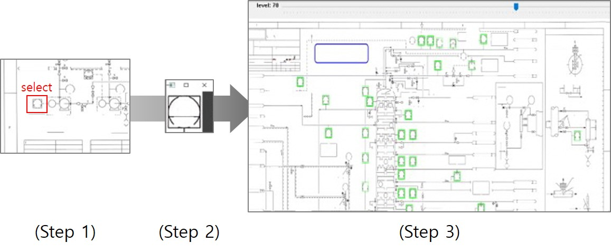

 이번 포스트에서는 설계도면(P&ID)에서 핵심적인 요소 중 하나인 **'심볼'**에 주목하여 그 인식과 관련된 기술과 개발 과정을 소개 하겠습니다.   
 설계 도면에서의 심볼은 밸브, 계장 기기, 펌프 등을 도식화한 도형으로, 프로세스 설계와 운영에 있어서 매우 중요한 역할을 합니다. 따라서, 이를 정확하게 인식하고 해석하는 기술은 프로젝트의 핵심 요소 중 하나입니다.   
 이번 포스트에서는 인식 대상인 '심볼'에 대한 이해를 높이고, 이를 정확하게 인식하는 기술과 개발 과정 및 한계점을 탐구하겠습니다.
   

[ (좌)실제 게이트 밸브, (우)게이트 밸브를 도식화한 P&ID 심볼 ]
   

## 📋 Table of Contents

1. [심볼 정의 및 종류](#1-심볼-정의-및-종류)
2. [기반 기술](#2-기반-기술)
3. [심볼 인식을 위한 딥러닝 모델 타임라인](#3-심볼-인식을-위한-딥러닝-모델-타임라인)
4. [심볼 인식 모델 구축 과정](#4-심볼-인식-모델-구축-과정)
5. [한계점](#5-한계점)

## 1. 심볼 정의 및 종류
### 심볼 정의
P&ID에서 심볼은 특정한 기기, 장치, 또는 프로세스를 나타내는 기호 또는 도형으로 정의됩니다. 각 심볼은 그림과 함께 설명서 또는 레전드에 포함되어 해당 기기 또는 장치에 대한 상세 정보를 담고 있습니다.

### 심볼 종류
 일반적으로 사용되는 심볼에는 밸브, 펌프, 계측 제어 기기 등 15개 이상의 카테고리가 있으며, 600여 개 이상의 하위 클래스로 분류됩니다. 
    아래는 밸브류 카테고리들의 심볼 예시입니다.

/valve_legend.png)

[ 밸브류 심볼 레전드 도면 ]

*출처: [블로그 링크](https://blog.naver.com/jhmillennium/223110345122){:target="_blank"}*

## 2. 기반 기술

객체를 인식하는 기반 기술은 크게 이미지 세그멘테이션(Image Segmentation)과 객체 탐지(Object Detection) 기술을 중심으로 합니다. 이 두가지 기술은 다음과 같은 개념 및 차이점을 가지고 있습니다.

### 이미지 세그멘테이션 (Image Segmentation)
 - 이미지 세그멘테이션은 이미지를 픽셀 수준에서 세분화하는 작업을 의미합니다. 즉, 이미지를 작은 부분으로 나누어 각 부분이 어떤 객체인지 또는 배경인지 판별합니다.
 - 주요 목표는 이미지 내의 각 픽셀을 하나의 클래스 또는 세그먼트에 할당하는 것입니다. 이것은 객체의 경계를 감지하지 않고 객체의 내부를 분할하는 작업을 포함합니다.
 - 시맨틱 세그멘테이션(Semantic Segmentation)과 인스턴스 세그멘테이션(Instance Segmentation)으로 구분됩니다.
 - 인스턴스 세그멘테이션의 대표적인 모델로는 Mask R-CNN이 있으며, RoI header와 Classification Header로 구성된 2-Stage Detector 모델이다.
 - RoI header는 객체의 위치를 정확하게 예측하는 역할을 하며, Classification Header는 객체의 클래스를 분류합니다.

### 객체 탐지 (Object Detection)
 - 객체 탐지는 이미지 상에서 객체의 존재와 그 위치를 탐지하는 작업을 의미합니다.
 - 객체 탐지는 이미지 내에서 객체의 바운딩 박스 (경계 상자)로 탐지하며, 각 객체의 클래스를 식별하는 것을 목표로 합니다.
 - 객체 탐지 모델로는 일반적으로 YOLO (You Only Look Once) 계열의 모델을 많이 활용합니다.
 - YOLO 모델은 1-Stage Detector 로서 격자 형식으로 이미지를 나누고, 격자 셀마다 객체 탐지 박스와 해당 객체의 클래스 확률을 동시에 예측합니다.

    (a)image classification, (b)object detection, (c)semantic segmentation, and (d)instance segmentation. 

*출처: [Computer vision algorithms and hardware implementations](https://www.researchgate.net/publication/335007177_Computer_vision_algorithms_and_hardware_implementations_A_survey){:target="_blank"}*

### Vision Transformer (ViT)

- Vision Transformer, 줄여서 ViT는 이미지 처리를 위한 딥러닝 모델 중 하나입니다. 이 모델은 기존의 CNN(Convolutional Neural Network) 아키텍처와는 다른 방식으로 이미지의 정보를 추출합니다.
- 주요 특징으로 어텐션 메커니즘을 활용하고, 패치(patch) 기반 처리, 스케일러블한 구조를 가지고 있습니다.
- P&ID 내 심볼을 인식하기 위해서 ViT 모델에서 발전한 Swin Transformer 모델을 활용하였고, CNN 계열의 모델에 비해 더 정확한 성능을 보였습니다.

## 3. 심볼 인식을 위한 딥러닝 모델 타임라인

[ 심볼 인식 모델 타임라인 ]

### 2020년 상반기
본 프로젝에서 심볼 인식을 수행하기 위해 선행 연구 조사를 시작했습니다. 선행 연구 중에서 *[Rahul et al.(2019)](https://arxiv.org/abs/1901.11383){:target="_blank"}*의 논문을 key paper로 선정했습니다. Rahul et al.(2019)의 연구는 설계 도면 내 객체를 인식하기 위해 세그멘테이션 기반 Fully Convolutional Network(FCN) 모델을 활용하였습니다.. 
프로젝트 초기 단계에서, 이러한 key paper를 벤치마킹하여 *[FCN](https://arxiv.org/abs/1605.06211v1){:target="_blank"}*, *[U-Net](https://arxiv.org/abs/1505.04597v1){:target="_blank"}* 등과 같은 **시맨틱 세그멘테이션** 기반 딥러닝 모델을 활용했습니다. 
But, 설계 도면의 물량을 정확하게 계산하는 것이 이 프로젝트의 핵심 목표 중 하나였고, 시맨틱 세그멘테이션은 객체를 클래스별로 인식하는 데는 우수한 성과를 보였지만, 동일 클래스 내의 객체를 구분하여 물량을 파악하기에는 어려운 한계가 있었죠. 

  
  

[ Semantic Segmentation 기반 (좌)시스템 아키텍처와 (우)인식 결과 ]

*출처: [A Study of Symbol Detection on P&ID Based on Semantic Segmentation](https://www.dbpia.co.kr/journal/articleDetail?nodeId=NODE10512414){:target="_blank"}*

### 2020년 하반기
시맨틱 세그멘테이션의 한계점을 해결하기 위해 동일 클래스 내에서 객체를 구분할 수 있는 **인스턴스 세그멘테이션** 기반 *[Mask R-CNN](https://arxiv.org/pdf/1703.06870v3.pdf){:target="_blank"}* 모델을 도입했습니다. 설계 도면의 특성 때문에 YOLO 와 같은 객체 탐지 모델을 활용하지 않았습니다. 설계 도면은 일반적으로 높은 밀집도를 가지며, 객체를 바운딩 박스 형태로 탐지하면 주변 밀접한 객체와 겹치게 됩니다. 이는 추후 과정에서 프로세스 흐름을 파악할 때 오류를 발생시킬 수 있는 원인이 됩니다. 인스턴스 세그멘테이션은 픽셀 단위로 객체를 탐지하므로 YOLO와 같은 문제점을 해결할 수 있습니다.  
학습 데이터셋 확보를 위해 rotation, scaling, elastic deformation 등 다양한 데이터 증강(data augmentation)과 합성 데이터(Synthetic Data)인 Fake Drawing을 생성하여 학습을 수행했습니다.

  
  

[ Instance Segmentation 기반 (좌)시스템 아키텍처와 (우)인식 결과 ]

*출처: [A Study of Symbol Detection on P&ID Based on Instance Segmentation](http://cde.or.kr/data/conf/2020_c/%EC%A0%9C26%ED%9A%8C%EB%8F%99%EA%B3%84%ED%94%84%EB%A1%9C%EC%8B%9C%EB%94%A9_%EB%AA%A9%EC%B0%A8%20%EB%B0%9C%EC%B7%8C.pdf){:target="_blank"}*

### 2021년 상반기
인공지능 분야에서의 석유와 같이 중요한 자원은 역시 **데이터**입니다. 하지만 석유도 우리 생활에 활용하려면 다양한 공정을 거쳐야 합니다. 마찬가지로, 데이터도 딥러닝 모델에 학습하기 위해서는 정확한 정답을 태깅하는 레이블링 작업을 거쳐야 합니다.  
본 프로젝트를 수행할 때 회사에서 보유하고 있는 도면 데이터는 풍부했지만, 레이블링된 학습 데이터셋이 부족했었습니다. ~~(프로젝트 초창기에는 충분한 예산 확보가 되지 않아 레이블링 외주를 맡기기 어려운 상태였습니다😥.)~~ 따라서 레이블링 작업을 직접 수행하게 되었고, 이는 다시 하고 싶지 않은 경험이었습니다.~~(덕분에 비문증이 생겼..)~~ 그래도 레이블링 데이터가 쌓일수록 심볼 인식 모델의 성능은 지속적으로 향상되었습니다. 특히 단순히 양이 많은 것보다 다양한 케이스의 데이터가 많을수록 모델 성능 향상의 폭이 컸습니다. (단순한 다다익선보다는 다양한 케이스의 다다익선이 더 옳은 표현인 것 같습니다.) 하지만 모델의 성능이 향상될수록 눈과 손목은 나빠졌죠☠️.  
레이블링 수작업 문제를 해결하기 위해, 앞서 설명드린 것과 같이 다양한 데이터 증강 기법과 합성 데이터인 Fake Drawing을 생성했습니다. 하지만, 모델 성능에는 인공 데이터보다는 real 데이터가 더 효과적이었습니다.  따라서, real 데이터에 레이블링을 손쉽게 하기 위해 Template Matching을 활용한 **Semi-Auto Labeling** 도구를 자체적으로 개발하였습니다. Template Matching은 탐지하려는 객체 하나를 기준으로 정하고, 이와 유사한 형태의 심볼들을 탐지하는 computer vision 기술입니다. 이 방법은 유사도에 따라 탐지하는 객체의 수와 탐지 정밀도가 반비례합니다. 유사도가 높으면 탐지하는 객체의 수가 줄지만 굉장히 높은 정밀도를 보이며, 반대로 유사도를 낮추면 탐지 정밀도는 떨어지지만 최대한 많은 유사 객체를 찾습니다. 
Semi-Auto Labeling은 레이블링 작업자가 유사도를 직접 조정하여 레이블링하므로 완전 자동은 아니지만 반자동 형태로 레이블링 작업량을 절감할 수 있었습니다.

  

    (Step 1) 레이블링 대상 객체를 선택, (step 2) 기준 객체 영역 추출, (step3) 임계치에 따라 유사한 객체 레이블링.

### 2021년 하반기 ~ 2022년 상반기
2021년 하반기, ICLR 2021에서 computer vision 분야에서도 Transformer를 활용한 *[Vision Transformer](https://arxiv.org/abs/2010.11929){:target="_blank"}(ViT)* 논문이 드디어 발표되었습니다. 이전에 구축했던 심볼 인식 모델은 CNN 계열의 모델인 ResNet을 백본 모델로 활용했었습니다. Vision AI 분야에 Transformer가 SOTA를 갱신하여 백본 모델을 ViT로 교체하고 인식 성능을 향상시켰습니다. 
2022년 상반기, ViT의 등장으로 인해 transformer 기반의 vision 모델들이 다수 발표되었습니다. 심볼 인식 모델 또한 ViT에서 더 발전된 *[Swin Transformer ](https://arxiv.org/abs/2103.14030v2){:target="_blank"}*의 모델로 백본을 교체하여 성능 향상을 이루어냈습니다. 
아래 그림과 같이 동일한 이미지에 대해 백본 모델만 ResNet에서 Swint Transformer로 변경하여 심볼 인식을 수행해보았습니다. 빨간 박스 영역처럼 노이즈가 심한 경우에서 Transformer 기반 백본 모델의 recall 성능이 더 높았고, 전반적인 심볼 인식 IoU 값도 더 향상됨을 확인할 수 있었습니다.

  
  

[ Mask R-CNN의 백본별 (좌)CNN 계열 ResNet 모델, (우)Transformer 계열 Swin-T 모델 인식 결과 ]
 
이와 같이 심볼 인식 모델을 개발하기 위해서 2020년 시맨틱 세그멘테이션 기반 모델에서 시작하여 2022년 상반기 Swin Transformer 모델 도입까지 3년 동안 심볼 인식 모델을 지속적으로 발전시켰습니다.

## 4. 심볼 인식 모델 구축 과정
### 데이터 수집및 준비
제가 재직 중인 현대엔지니어링은 오랫 동안 국내외 수많은 대규모 건설 사업을 수행해왔기 때문에 설계 도면 데이터가 많았었기 때문에 

### 데이터 전처리
### 모델 학습
### 모델 테스트 및 성능 평가
### 실험 결과

## 5. 한계점

본 실험의 한계점과 향후 방향 설명

> **"심볼 인식 2편"**에서는 현재의 한계점을 해결하기 위한 준지도학습 방식 심볼 인식 내용을 소개합니다.