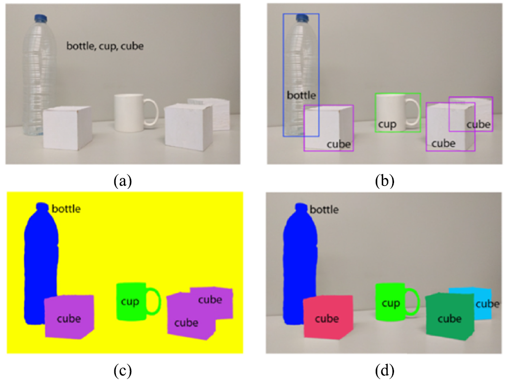
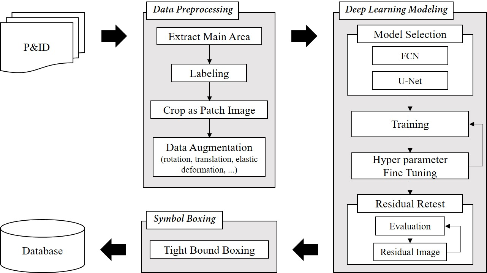
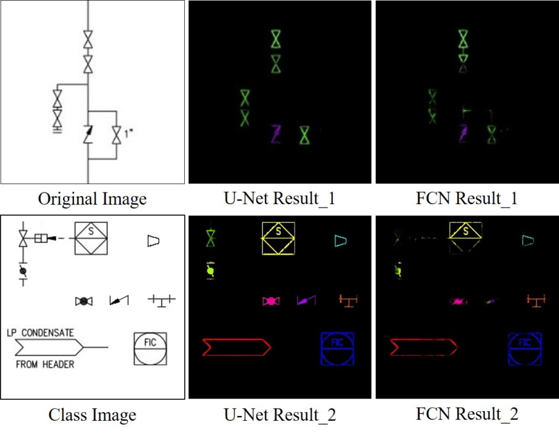
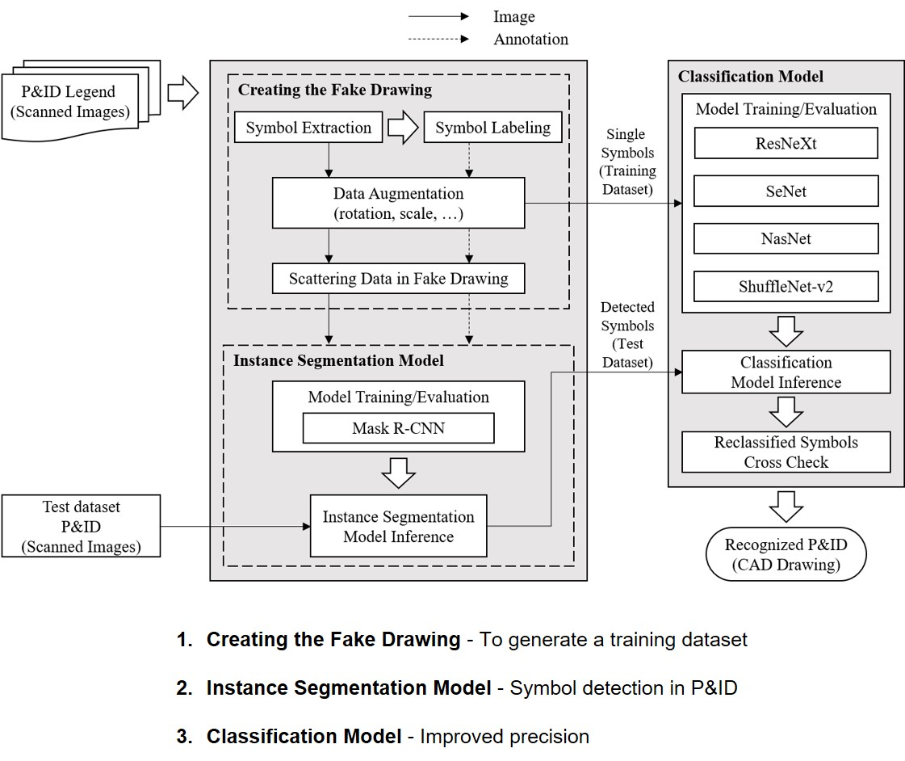
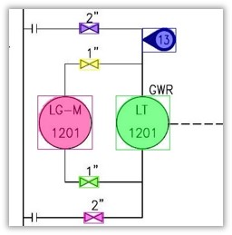
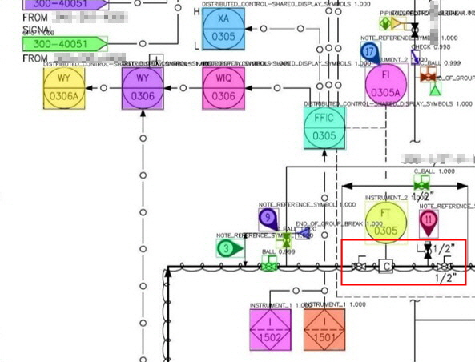
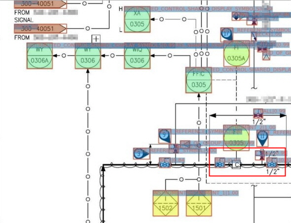
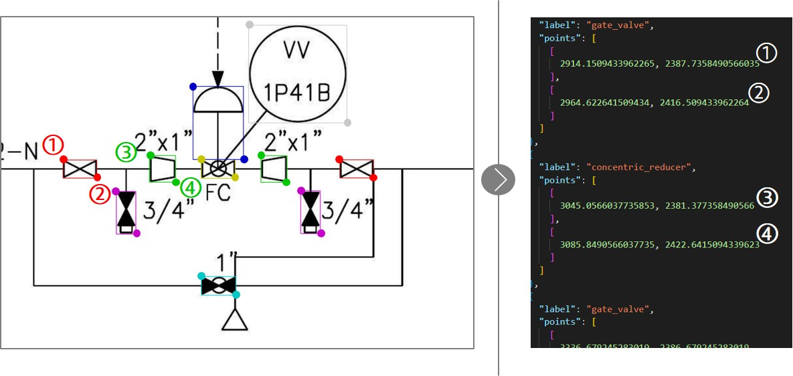

 이번 포스트에서는 설계도면(P&ID)에서 핵심적인 요소 중 하나인 **'심볼'**에 주목하여 그 인식과 관련된 기술과 개발 과정을 소개 하겠습니다. <br><br>
 설계 도면에서의 심볼은 밸브, 계장 기기, 펌프 등을 도식화한 도형으로, 프로세스 설계와 운영에 있어서 매우 중요한 역할을 합니다. 따라서, 이를 정확하게 인식하고 해석하는 기술은 프로젝트의 핵심 요소 중 하나입니다. <br><br>
 이번 포스트에서는 인식 대상인 '심볼'에 대한 이해를 높이고, 이를 정확하게 인식하는 기술과 개발 과정 및 한계점을 탐구하겠습니다.
 <br><br>

<div align="center">

</div>
<center>[ (좌)실제 게이트 밸브, (우)게이트 밸브를 도식화한 P&ID 심볼 ]</center>  <br>

## 📋 Table of Contents

1. [심볼 정의 및 종류](#1-심볼-정의-및-종류)
2. [기반 기술](#2-기반-기술)
3. [심볼 인식을 위한 딥러닝 모델 타임라인](#3-심볼-인식을-위한-딥러닝-모델-타임라인)
4. [심볼 인식 모델 구축 과정](#4-심볼-인식-모델-구축-과정)
5. [한계점](#5-한계점)

## 1. 심볼 정의 및 종류
### 심볼 정의
P&ID에서 심볼은 특정한 기기, 장치, 또는 프로세스를 나타내는 기호 또는 도형으로 정의됩니다. 각 심볼은 그림과 함께 설명서 또는 레전드에 포함되어 해당 기기 또는 장치에 대한 상세 정보를 담고 있습니다.

### 심볼 종류
 일반적으로 사용되는 심볼에는 밸브, 펌프, 계측 제어 기기 등 15개 이상의 카테고리가 있으며, 600여 개 이상의 하위 클래스로 분류됩니다. 
 <br><br> 아래는 밸브류 카테고리들의 심볼 예시입니다.

/valve_legend.png)
<center>[ 밸브류 심볼 레전드 도면 ]</center>
*출처: [블로그 링크](https://blog.naver.com/jhmillennium/223110345122){:target="_blank"}*

## 2. 기반 기술

객체를 인식하는 기반 기술은 크게 이미지 세그멘테이션(Image Segmentation)과 객체 탐지(Object Detection) 기술을 중심으로 합니다. 이 두가지 기술은 다음과 같은 개념 및 차이점을 가지고 있습니다.

### 이미지 세그멘테이션 (Image Segmentation)
 - 이미지 세그멘테이션은 이미지를 픽셀 수준에서 세분화하는 작업을 의미합니다. 즉, 이미지를 작은 부분으로 나누어 각 부분이 어떤 객체인지 또는 배경인지 판별합니다.
 - 주요 목표는 이미지 내의 각 픽셀을 하나의 클래스 또는 세그먼트에 할당하는 것입니다. 이것은 객체의 경계를 감지하지 않고 객체의 내부를 분할하는 작업을 포함합니다.
 - 시맨틱 세그멘테이션(Semantic Segmentation)과 인스턴스 세그멘테이션(Instance Segmentation)으로 구분됩니다.
 - 인스턴스 세그멘테이션의 대표적인 모델로는 Mask R-CNN이 있으며, RoI header와 Classification Header로 구성된 2-Stage Detector 모델이다.
 - RoI header는 객체의 위치를 정확하게 예측하는 역할을 하며, Classification Header는 객체의 클래스를 분류합니다.

### 객체 탐지 (Object Detection)
 - 객체 탐지는 이미지 상에서 객체의 존재와 그 위치를 탐지하는 작업을 의미합니다.
 - 객체 탐지는 이미지 내에서 객체의 바운딩 박스 (경계 상자)로 탐지하며, 각 객체의 클래스를 식별하는 것을 목표로 합니다.
 - 객체 탐지 모델로는 일반적으로 YOLO (You Only Look Once) 계열의 모델을 많이 활용합니다.
 - YOLO 모델은 1-Stage Detector 로서 격자 형식으로 이미지를 나누고, 격자 셀마다 객체 탐지 박스와 해당 객체의 클래스 확률을 동시에 예측합니다.

<div align="center">

</div>
    (a)image classification, (b)object detection, (c)semantic segmentation, and (d)instance segmentation. 

*출처: [Computer vision algorithms and hardware implementations](https://www.researchgate.net/publication/335007177_Computer_vision_algorithms_and_hardware_implementations_A_survey){:target="_blank"}*

### Vision Transformer (ViT)

- Vision Transformer, 줄여서 ViT는 이미지 처리를 위한 딥러닝 모델 중 하나입니다. 이 모델은 기존의 CNN(Convolutional Neural Network) 아키텍처와는 다른 방식으로 이미지의 정보를 추출합니다.
- 주요 특징으로 어텐션 메커니즘을 활용하고, 패치(patch) 기반 처리, 스케일러블한 구조를 가지고 있습니다.
- P&ID 내 심볼을 인식하기 위해서 ViT 모델에서 발전한 Swin Transformer 모델을 활용하였고, CNN 계열의 모델에 비해 더 정확한 성능을 보였습니다.

## 3. 심볼 인식을 위한 딥러닝 모델 타임라인
<div align="center">

</div>
<center>[ 심볼 인식 모델 타임라인(2020 H1 ~ 2022 H1) ]</center>
### 2020년 상반기
본 프로젝에서 심볼 인식을 수행하기 위해 선행 연구 조사를 시작했습니다. 선행 연구 중에서 *[Rahul et al.(2019)](https://arxiv.org/abs/1901.11383){:target="_blank"}*의 논문을 key paper로 선정했습니다. Rahul et al.(2019)의 연구는 설계 도면 내 객체를 인식하기 위해 세그멘테이션 기반 Fully Convolutional Network(FCN) 모델을 활용하였습니다..<br>
프로젝트 초기 단계에서, 이러한 key paper를 벤치마킹하여 *[FCN](https://arxiv.org/abs/1605.06211v1){:target="_blank"}*, *[U-Net](https://arxiv.org/abs/1505.04597v1){:target="_blank"}* 등과 같은 **시맨틱 세그멘테이션** 기반 딥러닝 모델을 활용했습니다.<br>
But, 설계 도면의 물량을 정확하게 계산하는 것이 이 프로젝트의 핵심 목표 중 하나였고, 시맨틱 세그멘테이션은 객체를 클래스별로 인식하는 데는 우수한 성과를 보였지만, 동일 클래스 내의 객체를 구분하여 물량을 파악하기에는 어려운 한계가 있었죠.<br>

<div align="center">
  
  
</div>
<center>[ Semantic Segmentation 기반 (좌)시스템 아키텍처와 (우)인식 결과 ]</center>
*출처: [A Study of Symbol Detection on P&ID Based on Semantic Segmentation](https://www.dbpia.co.kr/journal/articleDetail?nodeId=NODE10512414){:target="_blank"}*

### 2020년 하반기
시맨틱 세그멘테이션의 한계점을 해결하기 위해 동일 클래스 내에서 객체를 구분할 수 있는 **인스턴스 세그멘테이션** 기반 *[Mask R-CNN](https://arxiv.org/pdf/1703.06870v3.pdf){:target="_blank"}* 모델을 도입했습니다. 설계 도면의 특성 때문에 YOLO 와 같은 객체 탐지 모델을 활용하지 않았습니다. 설계 도면은 일반적으로 높은 밀집도를 가지며, 객체를 바운딩 박스 형태로 탐지하면 주변 밀접한 객체와 겹치게 됩니다. 이는 추후 과정에서 프로세스 흐름을 파악할 때 오류를 발생시킬 수 있는 원인이 됩니다. 인스턴스 세그멘테이션은 픽셀 단위로 객체를 탐지하므로 YOLO와 같은 문제점을 해결할 수 있습니다.<br><br>
학습 데이터셋 확보를 위해 rotation, scaling, elastic deformation 등 다양한 데이터 증강(data augmentation)과 합성 데이터(Synthetic Data)인 Fake Drawing을 생성하여 학습을 수행했습니다.

<div align="center">
  
  
</div>
<center>[ Instance Segmentation 기반 (좌)시스템 아키텍처와 (우)인식 결과 ]</center>
*출처: [A Study of Symbol Detection on P&ID Based on Instance Segmentation](http://cde.or.kr/data/conf/2020_c/%EC%A0%9C26%ED%9A%8C%EB%8F%99%EA%B3%84%ED%94%84%EB%A1%9C%EC%8B%9C%EB%94%A9_%EB%AA%A9%EC%B0%A8%20%EB%B0%9C%EC%B7%8C.pdf){:target="_blank"}*

### 2021년 상반기
인공지능 분야에서의 석유와 같이 중요한 자원은 역시 **데이터**입니다. 하지만 석유도 우리 생활에 활용하려면 다양한 공정을 거쳐야 합니다. 마찬가지로, 데이터도 딥러닝 모델에 학습하기 위해서는 정확한 정답을 태깅하는 레이블링 작업을 거쳐야 합니다.<br><br>
본 프로젝트를 수행할 때 회사에서 보유하고 있는 도면 데이터는 풍부했지만, 레이블링된 학습 데이터셋이 부족했었습니다. ~~(프로젝트 초창기에는 충분한 예산 확보가 되지 않아 레이블링 외주를 맡기기 어려운 상태였습니다😥.)~~ 따라서 레이블링 작업을 직접 수행하게 되었고, 이는 다시 하고 싶지 않은 경험이었습니다.~~(덕분에 비문증이 생겼..)~~ 그래도 레이블링 데이터가 쌓일수록 심볼 인식 모델의 성능은 지속적으로 향상되었습니다. 특히 단순히 양이 많은 것보다 다양한 케이스의 데이터가 많을수록 모델 성능 향상의 폭이 컸습니다. (단순한 다다익선보다는 다양한 케이스의 다다익선이 더 옳은 표현인 것 같습니다.) 하지만 모델의 성능이 향상될수록 눈과 손목은 나빠졌죠☠️.<br><br>
레이블링 수작업 문제를 해결하기 위해, 앞서 설명드린 것과 같이 다양한 데이터 증강 기법과 합성 데이터인 Fake Drawing을 생성했습니다. 하지만, 모델 성능에는 인공 데이터보다는 real 데이터가 더 효과적이었습니다.<br> 따라서, real 데이터에 레이블링을 손쉽게 하기 위해 Template Matching을 활용한 **Semi-Auto Labeling** 도구를 자체적으로 개발하였습니다. Template Matching은 탐지하려는 객체 하나를 기준으로 정하고, 이와 유사한 형태의 심볼들을 탐지하는 computer vision 기술입니다. 이 방법은 유사도에 따라 탐지하는 객체의 수와 탐지 정밀도가 반비례합니다. 유사도가 높으면 탐지하는 객체의 수가 줄지만 굉장히 높은 정밀도를 보이며, 반대로 유사도를 낮추면 탐지 정밀도는 떨어지지만 최대한 많은 유사 객체를 찾습니다.<br>
Semi-Auto Labeling은 레이블링 작업자가 유사도를 직접 조정하여 레이블링하므로 완전 자동은 아니지만 반자동 형태로 레이블링 작업량을 절감할 수 있었습니다.

<div align="center">
  
</div>
    (Step 1) 레이블링 대상 객체를 선택, (step 2) 기준 객체 영역 추출, (step3) 임계치에 따라 유사한 객체 레이블링.

### 2021년 하반기 ~ 2022년 상반기
2021년 하반기, ICLR 2021에서 computer vision 분야에서도 Transformer를 활용한 *[Vision Transformer](https://arxiv.org/abs/2010.11929){:target="_blank"}(ViT)* 논문이 드디어 발표되었습니다. 이전에 구축했던 심볼 인식 모델은 CNN 계열의 모델인 ResNet을 백본 모델로 활용했었습니다. Vision AI 분야에 Transformer가 SOTA를 갱신하여 백본 모델을 ViT로 교체하고 인식 성능을 향상시켰습니다.<br>
2022년 상반기, ViT의 등장으로 인해 transformer 기반의 vision 모델들이 다수 발표되었습니다. 심볼 인식 모델 또한 ViT에서 더 발전된 *[Swin Transformer ](https://arxiv.org/abs/2103.14030v2){:target="_blank"}*의 모델로 백본을 교체하여 성능 향상을 이루어냈습니다.<br>
아래 그림과 같이 동일한 이미지에 대해 백본 모델만 ResNet에서 Swint Transformer로 변경하여 심볼 인식을 수행해보았습니다. 빨간 박스 영역처럼 노이즈가 심한 경우에서 Transformer 기반 백본 모델의 recall 성능이 더 높았고, 전반적인 심볼 인식 IoU 값도 더 향상됨을 확인할 수 있었습니다.

<div align="center">
  
  
</div>
<center>[ Mask R-CNN의 백본별 (좌)CNN 계열 ResNet 모델, (우)Transformer 계열 Swin-T 모델 인식 결과 ]</center><br>
이와 같이 심볼 인식 모델을 개발하기 위해서 2020년 시맨틱 세그멘테이션 기반 모델에서 시작하여 2022년 상반기 Swin Transformer 모델 도입까지 3년 동안 심볼 인식 모델을 지속적으로 발전시켰습니다.

## 4. 심볼 인식 모델 구축 과정
### 데이터 수집 및 준비
딥러닝 모델을 학습시키기 위해 실제 건설 프로젝트의 설계 도면을 수집하고 준비하는 과정을 거쳤습니다. 이 과정에서 수집된 설계 도면의 양은 건설 사업의 규모에 따라 다양했습니다. 대체로 200장에서 600장 사이의 양을 다루었으며, 본 연구를 위해 특정 건설 사업을 선정하여 약 600장의 설계 도면을 사용했습니다.<br><br>
수집한 설계 도면은 주로 스캔된 PDF 형식으로 저장되었으며, 딥러닝 모델 학습을 위해 이미지 파일 형태로 변환되어야 했습니다. 먼저, 도면 데이터의 해상도를 500dpi(Dots per inch)로 변환하고 이미지 크기를 4678px * 3307px으로 리사이징하였습니다. Dpi는 해상도를 나타내는데, 적절한 dpi 설정은 도면 이미지를 식별하기 위한 중요한 요소였습니다. 낮은 dpi 설정은 이미지 내 객체를 인식하기 어렵게 만들었고, 반대로 너무 높은 dpi 설정은 이미지의 사이즈를 너무 커지게 만들었습니다. 따라서 적절한 dpi 설정을 통해 이미지의 해상도와 크기를 최적화하였습니다.<br><br>
이어서, 딥러닝 모델을 학습시키기 위해서는 인식하려는 심볼의 위치 정보와 해당 심볼의 클래스명이 레이블링된 데이터가 필요합니다. 이를 위해 우리는 Semi-Auto Labeling 도구를 사용하여 레이블링 작업을 수행하였습니다. 레이블링 작업은 데이터셋의 품질을 향상시키는 데 핵심적인 역할을 하기 때문에 여러 차례 크로스체크를 거쳐 작업을 완료하였으며, 총 30장의 도면에 대한 레이블링 작업을 마무리했습니다.
<div align="center">

</div>
<center>[ 심볼 레이블링 ]</center>

### 데이터 전처리
레이블링된 데이터를 딥러닝 모델에 학습시키기 위해 몇 가지 추가 작업이 필요합니다. 첫째로, 학습에 사용할 데이터셋의 양이 부족하고, 다양한 케이스를 포함해야 했습니다. 둘째로, 모델의 입력 레이어로 사용하기 위해 이미지를 조정해야 했습니다.

  1. ***데이터 양 부족 문제 해결을 위한 Data Augmentation***<br> 초기 데이터셋의 양이 한정적이었기 때문에 Data Augmentation을 수행하였습니다. 도면 데이터를 아래의 코드와 같이 회전(90도, 180도, 270도) 및 뒤집기(상하, 좌우) 등을 적용하여 데이터를 증강하였습니다.

      <details>
      <summary>코드 접기/펼치기</summary>
      <div markdown="1">

      ```python
      class ImageAugmentation:
          def __init__(self, settings):
              self.settings = settings
              self.input_folderpath = self.settings['inputs']['input_folderpath']
              self.output_folderpath = self.settings['inputs']['output_folderpath']
      # ```(생략)```
          # 데이터 형식 변경 메서드
          def dataformation(self, aug_img, aug_path, data, shape_type, new_coordinates, deformation_type):
      # ```(생략)```
              # JSON 내의 모양 좌표 업데이트
              for i in range(len(new_coordinates)):
                  data["shapes"][i]["shape_type"] = shape_type[i]
                  data["shapes"][i]["points"] = new_coordinates[i]

              # JSON 내의 이미지 경로, 높이 및 너비 업데이트
              data["imagePath"] = new_path
              data["imageHeight"] = aug_img.shape[0]
              data["imageWidth"] = aug_img.shape[1]

              # 업데이트된 JSON을 출력 파일에 작성
              with open(json_path, 'w') as outfile:
                  json.dump(data, outfile, indent=2)
      # ```(생략)```
          # 전체 파이프라인 메서드
          def pipeline(self):
      # ```(생략)```
              ts = self.settings['transforms']

              # 회전 각도 확인
              if ts['rotation']['rotation_state'] == True:
                  rotangle = ts['rotation']['rotangle']
                  if rotangle >= 360:
                      rotangle = 359
              else:
                  rotangle = 0

              # 주석이 달린 이미지 반복
              for img in inp_imgs:
      # ```(생략)```
                  # transforms 적용
                  new_aug_cor = list()
                  for i in tqdm(range(length)):
                      # Rotate
                      aug_coordinates = coordinates[i]
                      if ts['rotation']['rotation_state'] == True:
                          if rotangle != 0:
                              aug_coordinates = transforms().rotation(anno_img, aug_coordinates, rotangle)

                          deformation_type = 'rot' + str(rotangle)

                      # Flip
                      if ts['flipping']['flipping_state'] == True:
                          if ts['flipping']['vertical_flip'] == True:
                              aug_coordinates = transforms().flipvertical(anno_img, aug_coordinates)
                              deformation_type = 'vflip'
                          if ts['flipping']['horizontal_flip'] == True:
                              aug_coordinates = transforms().fliphorizontal(anno_img, aug_coordinates)
                              deformation_type = 'hflip'

                      if len(aug_coordinates) == 0:
                          continue

                      if ts['flipping']['flipping_state'] and ts['rotation']['rotation_state']:
                          deformation_type = 'rot' + str(rotangle) + '+' + deformation_type

                      new_aug_cor.append(aug_coordinates)

                  # 이미지에 회전 및 뒤집기 변환 적용
                  if rotangle != 0:
                      aug_img = ndimage.rotate(anno_img, rotangle, reshape=True)
                  else:
                      aug_img = anno_img
                  if ts['flipping']['vertical_flip'] == True:
                      aug_img = anno_img[::, ::-1]
                  if ts['flipping']['horizontal_flip'] == True:
                      aug_img = anno_img[::-1, ::]

                  # 새로운 주석 데이터 생성 및 저장
                  obj.dataformation(aug_img, aug_path, data, shape_type, new_aug_cor, deformation_type)

      if __name__ == '__main__':
      # ```(생략)```
          # 적용할 augmentation 방법 설정
          settings = {
      # ```(생략)```
              'transforms': {
                  'rotation': {
                      'rotation_state': True,
                      'rotangle': 0
                  },
                  'flipping': {
                      'flipping_state': False,
                      'horizontal_flip': False,
                      'vertical_flip': False
                  }
              }
          }
          # 회전 augmentation 방법 적용
          for rotangle in [0, 90, 180, 270]:
              print('[+] rotangle : ', rotangle)
              settings['transforms']['rotation']['rotangle'] = rotangle
              obj = ImageAugmentation(settings)
              obj.pipeline()
          # 좌우 반전 augmentation 방법 적용
          settings['transforms']['rotation']['rotation_state'] = False
          settings['transforms']['flipping']['flipping_state'] = True
          settings['transforms']['flipping']['horizontal_flip'] = True
          print('[+] flip : ', 'horizontal_flip')
          obj = ImageAugmentation(settings)
          obj.pipeline()

          # 상하 반전 augmentation 방법 적용
          settings['transforms']['flipping']['horizontal_flip'] = False
          settings['transforms']['flipping']['vertical_flip'] = True
          print('[+] flip : ', 'vertical_flip')
          obj = ImageAugmentation(settings)
          obj.pipeline()
      # ```(생략)```
      ```
      </div>
      </details><br>

  2. ***이미지 조정을 위한 이미지 패치 생성***<br>
  모델의 입력 이미지로 사용하기 위해 원본 도면 이미지를 패치 단위로 잘라내었습니다. 원본 도면 이미지의 크기는 4678px * 3307px 이었는데, 모델에 입력될 때 이미지 크기가 축소되면서 심볼이 너무 작아져 인식이 어려워지는 문제가 있었습니다. 이를 해결하기 위해 Mask R-CNN 논문에서 권장하는 1024px * 1024px 크기의 패치 이미지로 자르기로 결정했습니다. <br>
  이미지 패치를 생성할 때, 단순히 격자로 이미지를 잘라내면 이미지의 일부가 잘리는 문제가 발생할 수 있으므로, 겹치는 부분(overlap)을 70%로 설정하여 sliding window 방식을 사용하여 도면 한 장당 약 116장의 패치 이미지를 추출했습니다.

  3. ***레이블 데이터 포맷 변환과 데이터셋 분할***<br>
  마지막으로, 레이블 데이터의 형식을 coco 데이터셋 레이블 포맷으로 변환하고, 학습용과 검증용 데이터셋을 8:2의 비율로 구분하였습니다.

이와 같은 데이터 전처리 과정을 통해 모델이 효과적으로 학습될 수 있도록 데이터셋을 준비하였습니다.

### 모델 준비
모델 학습을 위해서 준비한 데이터에 맞게 몇몇 **하이퍼파라미터**를 조정해야합니다.
1. *Swin_Transformer_Object_Detection/configs/swin/cascade_mask_rcnn_swin_base_patch4_window7_mstrain_480-800_giou_4conv1f_adamw_3x_pid.py*
  - _base_: 참조하는 파일명으로 변경
  - num_classes: 클래스 개수 변경 (int)
  - max_epochs: 에폭 수 변경 (int)
    <details>
    <summary>코드 접기/펼치기</summary>
    <div markdown="1">
    ```python
    _base_ = [
        '../_base_/models/cascade_mask_rcnn_swin_fpn.py',
        '../_base_/datasets/pid_instance.py',
        '../_base_/schedules/schedule_1x.py', '../_base_/default_runtime.py'
    ]
    # ```(생략)```
    roi_head=dict(
      bbox_head=[
        dict(
          type='ConvFCBBoxHead',
          num_classes=119,
        )
    # ```(생략)```
        dict(
          type='ConvFCBBoxHead',
          num_classes=119,
        )
    # ```(생략)```
        dict(
          type='ConvFCBBoxHead',
          num_classes=119,
        )
      ]
    )
    # ```(생략)```
    runner = dict(type='EpochBasedRunnerAmp', max_epochs=20)
    ```
    </div>
    </details>
    <br>
2. *Swin_Transformer_Object_Detection/configs/base/models/cascade_mask_rcnn_swin_fpn.py*
  - num_classes: 클래스 개수 변경 (int)
<br><br>

3. *Swin_Transformer_Object_Detection/configs/base/datasets/pid_instance.py*
  - dataset_type 변경: 'PIDDataset'
  - dataset_root 변경: '~/data/train_dataset/training/pid_dataset/'
  - 데이터셋 경로 변경
    <details>
    <summary>코드 접기/펼치기</summary>
    <div markdown="1">
    ```python
    dataset_type = 'PIDDataset'
    data_root = '~/data/train_dataset/training/pid_dataset/'
    # ```(생략)```
    data = dict(
    samples_per_gpu=1,
    workers_per_gpu=2,
    train=dict(
      type=dataset_type,
      ann_file=data_root + 'train.json',
      img_prefix=data_root + 'train_images/',
      pipeline=train_pipeline),
    val=dict(
      type=dataset_type,
      ann_file=data_root + 'val.json',
      img_prefix=data_root + 'val_images/',
      pipeline=test_pipeline),
    test=dict(
      type=dataset_type,
      ann_file=data_root + 'test.json',
      img_prefix=data_root + 'test_images/',
      pipeline=test_pipeline))
    # ```(생략)```
    ```
    </div>
    </details>
    <br>
4. *Swin_Transformer_Object_Detection/configs/base/default_runtime.py*
  - checkpoint_config: 저장할 epoch의 interval 설정(int)
<br><br>

5. *Swin_Transformer_Object_Detection/mmdet/datasets/pid.py*
  - class명: PIDDataset으로 변경 
  - CLASSES: 클래스명 변경 (str)
    <details>
    <summary>코드 접기/펼치기</summary>
    <div markdown="1">
    ```python
    @DATASETS.register_module()
    class PIDDataset으로(CustomDataset):
      CLASSES = ('1101', '137', '142', '103', '104', '107', '102', '136', '158', '105', '108', '1102', '131', '145', '110', '161', '122', '155', '133', '159', '162', '160', '1103', '1104', '1105', '204', '209', '206', '208', '207', '313', '349', '163', '113', '106', '305', '1106', '308', '307', '316', '309', '344', '314', '310', '326', '329', '343', '311', '301', '302', '325', '317', '319', '126', '303', '318', '707', '1601', '304', '901', '703', '704', '1107', '709', '710', '1702', '1701', '1501', '508', '523', '614', '507', '509', '519', '516', '617', '1617', '1618', '1619', '1620', '1502', '521', '528', '504', '1401', '520', '525', '527', '518', '1503', '1402', '1403', '426', '506', '405', '424', '425', '515', '1405', '413', '511', '510', '1603', '1602', '1604', '1605', '1607', '1609', '1608', '1606', '1613', '1611', '1612', '1614', '1610', '1615', '1616', '619', '407')
    # ```(생략)```
    ```
    </div>
    </details>
    <br>
6. *Swin_Transformer_Object_Detection/mmdet/datasets/__init__.py*
  - from .pid import PIDDataset 추가
  - PIDDataset 추가
    <details>
    <summary>코드 접기/펼치기</summary>
    <div markdown="1">
    ```python
    from .pid import PIDDataset
    # ```(생략)```
    __all__ = [
      'PIDDataset',  
    # ```(생략)```
    ]
    ```
    </div>
    </details>
    
### 모델 학습
모델 학습 하이퍼파라미터 수정이 완료되면 아래와 같이 모델을 학습합니다.
학습은 DGX-Station V100 2장을 활용하여 20 에폭 동안 진행되었으며, 이 과정은 약 15시간이 소요되었습니다.
```bash
python train.py --config [CONFIG_PTH] --work-dir [CHECKPOINTS_PTH]

python Swin_Transformer_Object_Detection/train.py --config Swin_Transformer_Object_Detection/configs/swin/cascade_mask_rcnn_swin_base_patch4_window7_mstrain_480-800_giou_4conv1f_adamw_3x_pid.py --work-dir ~/model/symbol_model
```
> * 매개변수
    - CONFIG_PTH: configuration 파일
    - CHECKPOINTS_PTH: 학습된 모델이 저장될 경로

### 모델 추론
평가를 위해 도면 이미지를 sliding window로 패치 단위로 추론합니다. 이로 인해 패치 단위로 인식된 이미지를 하나의 이미지로 다시 통합해야 합니다. 그러나 이 과정에서 겹치는 부분이 있어 중복된 탐지 결과가 발생할 수 있습니다. 중복으로 인식된 바운딩 박스를 처리하기 위해 NMS(Non-Maximum Suppression) 기법을 활용합니다.<br>
이와 같은 과정을 위해 모델을 추론합니다. 모델 추론 코드는 아래와 같고, 주요 코드만 일부 갖고 왔습니다.
<details>
<summary>코드 접기/펼치기</summary>
<div markdown="1">
```python
# ```(생략)```
import numpy as np
import slidingwindow as sw
import torch
import torchvision
from mmdet.apis import inference_detector, init_detector 
# ```(생략)```    
def sliding_window_detect(files, IMAGE_DIR, class_names, output_path):
    '''
    이미지 파일 리스트(files), 이미지 디렉토리 경로(IMAGE_DIR), 클래스 이름(class_names), 결과 저장 경로(output_path)를 입력으로 받는 함수 정의
    window_list: 윈도우 이미지를 저장할 리스트
    coordinates: 윈도우 좌표를 저장할 리스트
    window_size: 윈도우 사이즈
    overlap: 오버랩 크기
    '''
    # 도면 이미지 파일 리스트를 루프돌며 처리
    for cnt, file_name in enumerate(files) :
        name = file_name.split('.')[0]
        # ```(생략)```
        window_list = list()
        coordinates = list()
        window_size, overlap = 1024, 0.3

        # 이미지를 슬라이딩 윈도우로 나눠서 처리
        windows = sw.generate(image, sw.DimOrder.HeightWidthChannel, window_size, overlap)
        for idx, win in enumerate(windows):            
            min_x, min_y, _, _ = str(win)[1:-1].split(',')  # 윈도우 좌표 추출
            x, y = int(min_x), int(min_y)
            coordinates.append([x,y])
            window = image[win.indices()] # 크롭된 윈도우 이미지
            window_list.append(window)
        
        ## # 윈도우 이미지들에 대한 객체 인식 수행
        results = inference_detector(model, window_list)
        
        # 모든 패치의 결과를 한 장씩 처리
        rois = list()
        scores =list()
        classes=list()
        for idx in range(len(results)) :
            x,y = coordinates[idx]  # 해당 윈도우의 좌표
            for i,result in enumerate(results[idx][0]) :
                for r in result :
                    r=list(map(float,r))
                    if len(r) != 0 and r[4]>0.3 :
                        rois_array = np.array(r[:4]) + [x,y,x,y]  # 상대 좌표를 절대 좌표로 변환
                        rois.append(rois_array.tolist())  # 검출된 객체의 좌표 저장
                        scores.append(r[4]) # 객체의 점수 저장
                        classes.append(class_names[i]) # 객체 클래스 저장

        # 클래스별로 ROIs를 저장하기 위한 딕셔너리 생성
        rois_dict = dict()
        for key, value in zip(classes, rois):
            if key not in rois_dict:
                rois_dict[key] = [value]
            else :
                rois_dict[key].append(value)

        # 클래스별로 점수(scores)를 저장하기 위한 딕셔너리 생성
        scores_dict = dict()
        for key, value in zip(classes, scores) :
            if key not in scores_dict:
                scores_dict[key] = [value]
            else :
                scores_dict[key].append(value)
        
        # IOU (Intersection over Union) 임계값 설정
        iou_threshold = 0.05

        # 클래스별로 NMS (Non-Maximum Suppression) 수행
        for cls in rois_dict.keys() :
            rois_array = np.array(rois_dict[cls])
            rois_tensor = torch.tensor(rois_array, dtype=torch.float)
            scores_array = np.array(scores_dict[cls])
            scores_tensor = torch.tensor(scores_array, dtype=torch.float)
            
            # NMS 수행하여 겹치는 바운딩박스를 제거하고 최종 바운딩박스 선택
            keep_indices = torchvision.ops.nms(rois_tensor, scores_tensor, iou_threshold)
            rois_nms_tensor = rois_tensor[keep_indices]
            scores_nms_tensor = scores_tensor[keep_indices]

            # NMS를 통해 선정된 객체의 좌표와 점수를 추출
            for idx in range(len(rois_nms_tensor)):
                rois_nms = rois_nms_tensor[idx].tolist()
                scores_nms = scores_nms_tensor[idx].tolist()
            # ```(생략)```

if __name__ == '__main__' :
    # ```(생략)```
    # 객체 검출 모델 초기화
    model = init_detector(config, checkpoint)

    # ```(생략)```

    # sliding_window_detect 함수 호출
    sliding_window_detect(files, IMAGE_DIR, class_names, dst_path)
    # ```(생략)```
```
</div>
</details>
<br>

위 코드를 추론하기 위해 커맨드 라인 명령어 실행합니다.
```bash
python Swin_Transformer_Object_Detection/symbol_detector.py --prj [PROJECT_NAME]

python Swin_Transformer_Object_Detection/symbol_detector.py --prj project
```
> * 매개변수
    - PROJECT_NAME: 건설 프로젝트 이름

### 실험 결과
모델의 성능을 평가하기 위해서 사용한 측정 지표로는 mAP, mAR, 그리고 F1-score를 활용하였습니다.<br>

여기서 APm과 ARm은 탐지된 심볼의 IoU(Intersection over Union) 신뢰도가 m% 이상일 때의 평균 정밀도와 평균 재현율을 나타냅니다.<br>
P&ID(Piping and Instrumentation Diagram)의 특성상, 인식해야 하는 요소들이 밀집하게 포함되어 있으므로 탐지 영역이 다른 요소에 영향을 미치 않게 mAP(mean Average Precision)의 IoU 임계치를 0.9로 설정하여 모델의 성능을 평가하였습니다.

F1-score는 mAP과 mAR의 조화 평균 값으로, 다음 수식을 통해 계산됩니다: <br>
<center>$2 \cdot \frac{mAP \cdot mAR}{mAP + mAR}$</center> <br>

아래 표는 Swin Transformer v2와 CNN 계열의 5가지 모델을 비교한 결과입니다. 대체로 95% 이상의 높은 성능을 보이며, 특히 Transformer 기반의 Swin Transformer v2 모델이 98.03%의 최고 성능을 기록하여 가장 우수한 결과를 얻었습니다.

| <center>Model</center> | <center>mAP (m=0.9)</center> |
|------------|-------------|
| ResNet | 95.91 % |
| ResNeXt | 96.06 % |
| HRNet | 96.79 % |
| ResNeSt | 95.19 % |
| ConvNeXt | 97.24 % |
| **Swin Transformer v2** | **98.03 %** |

## 5. 한계점
본 프로젝트는 객체 탐지를 위한 2-Stage Detector인 Cascade Mask R-CNN과 Transformer 기반 Swin Transformer v2 모델을 활용하여 심볼 인식을 성공적으로 수행하였으며, 높은 성능인 98.03%를 달성했습니다.<br><br>
이 결과는 특정 건설 프로젝트를 대상으로 학습하여 해당 건설 프로젝트 도면을 인식하는데 유용했습니다. 하지만 실제 산업 현장에서는 건설 프로젝트마다 사용되는 심볼의 이름과 형상이 달라지므로, 새로운 건설 프로젝트에 대해서는 새로운 딥러닝 모델을 구축해야 합니다.<br><br>
새로운 딥러닝 모델을 구축하는 경우 데이터 레이블링부터 모델 학습까지 모든 작업을 처음부터 다시 수행해야 합니다. 이는 많은 시간과 공수를 필요로 하며, 입찰 단계에서 물량을 신속하게 산출해야 하는 상황에서 어려움을 겪을 수 있습니다.<br><br>
따라서 이러한 한계를 극복하기 위해 레이블링 작업에 필요한 공수를 최소화하면서도 모델 성능을 유지할 수 있는 방법이 필요합니다.<br><br>
"[**심볼 인식 2편**](/projects/pnid/03)"에서는 현재의 한계를 해결하기 위한 준지도학습 방식의 심볼 인식 내용을 소개합니다.