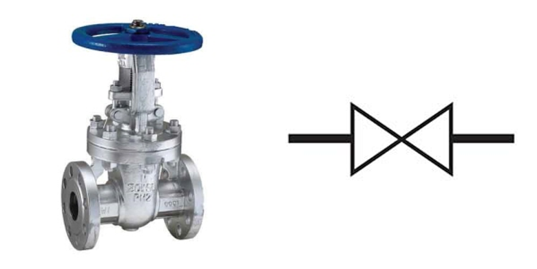

 이번 포스트에서는 설계도면(P&ID)에서 핵심적인 요소 중 하나인 **'심볼'**에 주목하여 그 인식과 관련된 기술과 개발 과정을 소개 하겠습니다.   
 설계 도면에서의 심볼은 밸브, 계장 기기, 펌프 등을 도식화한 도형으로, 프로세스 설계와 운영에 있어서 매우 중요한 역할을 합니다. 따라서, 이를 정확하게 인식하고 해석하는 기술은 프로젝트의 핵심 요소 중 하나입니다.   
 이번 포스트에서는 인식 대상인 '심볼'에 대한 이해를 높이고, 이를 정확하게 인식하는 기술과 개발 과정 및 한계점을 탐구하겠습니다.
   

[(좌)실제 게이트 밸브, (우)게이트 밸브를 도식화한 P&ID 심볼]
   

## Table of Contents

1. [심볼 정의 및 종류](#1-심볼-정의-및-종류)
2. [기반 기술](#2-기반-기술)
3. [심볼 인식 모델 개발](#3-심볼-인식-모델-개발)
4. [모델 실험 및 평가](#4-모델-실험-및-평가)
5. [한계점](#5-한계점)

## 1. 심볼 정의 및 종류
### 1.1 심볼 정의
P&ID에서 심볼은 특정한 기기, 장치, 또는 프로세스를 나타내는 기호 또는 도형으로 정의됩니다. 각 심볼은 그림과 함께 설명서 또는 레전드에 포함되어 해당 기기 또는 장치에 대한 상세 정보를 담고 있습니다.

### 1.2 심볼 종류
 일반적으로 사용되는 심볼에는 밸브, 펌프, 계측 제어 기기 등 15개 이상의 카테고리가 있으며, 600여 개 이상의 하위 클래스로 분류됩니다. 
    아래는 밸브류 카테고리들의 심볼 예시입니다.

/valve_legend.png)

[밸브류 심볼 레전드 도면]

*출처: [블로그 링크](https://blog.naver.com/jhmillennium/223110345122)*

## 2. 기반 기술

객체를 인식하는 기반 기술은 크게 이미지 세그멘테이션(Image Segmentation)과 객체 탐지(Object Detection) 기술을 중심으로 합니다. 이 두가지 기술은 다음과 같은 개념 및 차이점을 가지고 있습니다.

### 2.1 이미지 세그멘테이션 (Image Segmentation)
 - 이미지 세그멘테이션은 이미지를 픽셀 수준에서 세분화하는 작업을 의미합니다. 즉, 이미지를 작은 부분으로 나누어 각 부분이 어떤 객체인지 또는 배경인지 판별합니다.
 - 주요 목표는 이미지 내의 각 픽셀을 하나의 클래스 또는 세그먼트에 할당하는 것입니다. 이것은 객체의 경계를 감지하지 않고 객체의 내부를 분할하는 작업을 포함합니다.
 - 시맨틱 세그멘테이션(Semantic Segmentation)과 인스턴스 세그멘테이션(Instance Segmentation)으로 구분됩니다.
 - 인스턴스 세그멘테이션의 대표적인 모델로는 Mask R-CNN이 있으며, RoI header와 Classification Header로 구성된 2-Stage Detector 모델이다.
 - RoI header는 객체의 위치를 정확하게 예측하는 역할을 하며, Classification Header는 객체의 클래스를 분류합니다.

### 2.2 객체 탐지 (Object Detection)
 - 객체 탐지는 이미지 상에서 객체의 존재와 그 위치를 탐지하는 작업을 의미합니다.
 - 객체 탐지는 이미지 내에서 객체의 바운딩 박스 (경계 상자)로 탐지하며, 각 객체의 클래스를 식별하는 것을 목표로 합니다.
 - 객체 탐지 모델로는 일반적으로 YOLO (You Only Look Once) 계열의 모델을 많이 활용합니다.
 - YOLO 모델은 1-Stage Detector 로서 격자 형식으로 이미지를 나누고, 격자 셀마다 객체 탐지 박스와 해당 객체의 클래스 확률을 동시에 예측합니다.

    (a)image classification, (b)object detection, (c)semantic segmentation, and (d)instance segmentation. 

[출처: Computer vision algorithms and hardware implementations]

### 2.3 Vision Transformer (ViT)

- Vision Transformer, 줄여서 ViT는 이미지 처리를 위한 딥러닝 모델 중 하나입니다. 이 모델은 기존의 CNN(Convolutional Neural Network) 아키텍처와는 다른 방식으로 이미지의 정보를 추출합니다.
- 주요 특징으로 어텐션 메커니즘을 활용하고, 패치(patch) 기반 처리, 스케일러블한 구조를 가지고 있습니다.
- P&ID 내 심볼을 인식하기 위해서 ViT 모델에서 발전한 Swin Transformer 모델을 활용하였고, CNN 계열의 모델에 비해 더 정확한 성능을 보였습니다.

## 3. 심볼 인식 모델 개발

심볼 인식 모델을 개발하기 위해서 Semantic Segmentation 모델부터 Swin Transformer 모델까지 4년간 발전해왔습니다.

## 4. 모델 실험 및 평가

모델 평가 산식 및 실험 결과 그리고 디스커션

## 5. 한계점

본 실험의 한계점과 향후 방향 설명

> **"심볼 인식 2편"**에서는 현재의 한계점을 해결하기 위한 준지도학습 방식 심볼 인식 내용을 소개합니다.