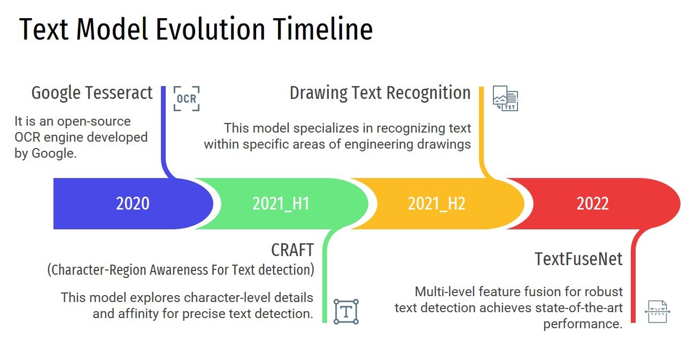
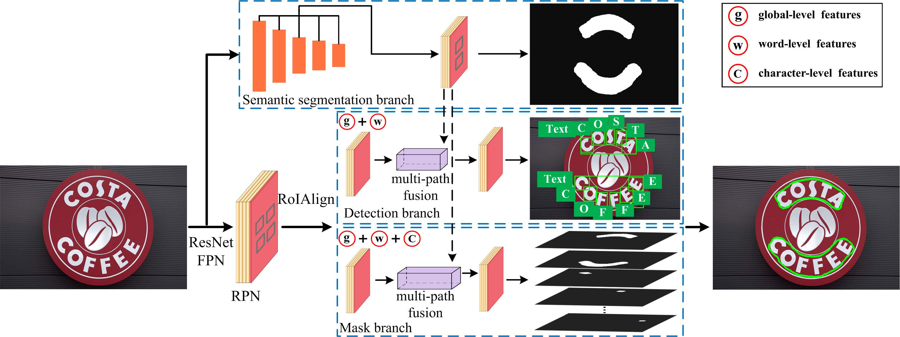
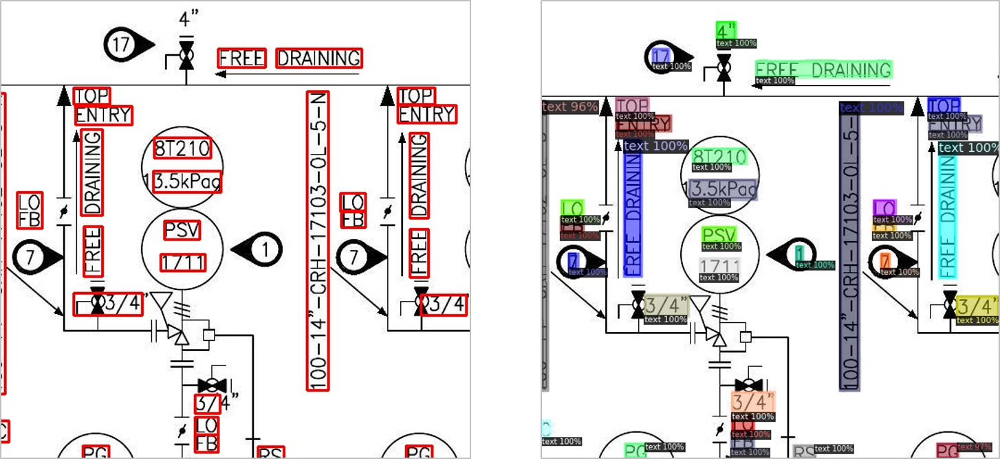

설계도면(P&ID)에서 핵심적인 요소 중 하나인 **'텍스트'**에 주목하여 영역 탐지와 인식에 대해 두 편으로 나누어 기술 소개와 개발 과정을 소개합니다.<br>이번 포스트에서는 텍스트가 설계도면 어느 영역에 위치해 있는지를 찾는 텍스트 탐지 기술에 대해 설명합니다.

## 📋 Table of Contents

1. [텍스트 탐지·인식 타임라인](#1-텍스트-탐지인식-타임라인)
2. [텍스트 탐지 배경](#2-텍스트-탐지-배경)
3. [기반 기술](#3-기반-기술)
4. [텍스트 탐지 모델 구축 과정](#4-텍스트-탐지-모델-구축-과정)
5. [결론](#5-결론)

## 1. 텍스트 탐지·인식 타임라인
<div align="center">

</div>
<center>[ 텍스트 탐지·인식 모델 타임라인(2020~2022) ]</center>

설계 도면 내 텍스트를 탐지하고 인식하기 위한 기술은 시간에 따라 다양한 모델과 방법론을 적용하며 발전시켰습니다.

### 2020년
초기 연구에는 오픈 OCR 엔진인 Google Tesseract를 활용하여 텍스트 탐지부터 인식까지 시도하였습니다. Tesseract는 설치 및 사용이 매우 간단하며 영어 외에도 다양한 언어를 지원하는 장점이 있었지만, 품질이 낮거나 스캔된 설계 도면과 같은 비정형 데이터에 대한 처리에 한계가 있었습니다. 특히 설계 도면은 텍스트와 심볼이 함께 혼합되어 있어 Tesseract는 이를 구분하지 못하는 문제가 두드러졌습니다. 따라서 텍스트 탐지와 인식 모델을 구분하여 적합한 모델을 연구하게 되었습니다.

### 2021년 상반기
설계 도면과 같은 특수한 환경에서는 텍스트의 다양한 형태와 배치가 존재합니다. 이런 형태들은 일반 문서에서 찾아보기 어렵죠. 따라서 Google Tesseract보다 뛰어난 텍스트 영역을 탐지하는 모델이 필요하게 되었습니다. 따라서 텍스트 영역을 정확하게 탐지하는 모델을 개발하고, 이를 통해 탐지된 영역에 대해 Tesseract를 이용하여 인식하자 라는 전략을 세웠습니다. 이로써 텍스트 탐지 모델 연구가 먼저 시작하게 되었습니다.<br>
텍스트 탐지 모델은 네이버 클로바에서 CVPR 2019에 발표한 CRAFT(Character-Region Awareness For Text detection)를 선택하였습니다. 이 모델은 Google Tesseract보다 훨씬 우수한 탐지 성능을 보였습니다. 하지만 여전히 일부 결과는 심볼과 텍스트를 구분하지 못하거나, 한 글자 텍스트를 미탐지하는 등의 아쉬운 점이 있었습니다.

### 2021년 하반기
CRAFT 모델을 활용하여 텍스트 영역을 탐지하고, Google Tesseract를 활용하여 인식을 시도하였으나, 이 역시 스캔된 설계 도면과 같은 특수한 환경에서는 만족스러운 결과를 내놓지 못했습니다. 이에 따라 설계 도면에 특화된 텍스트 인식 모델의 프레임워크를 직접 재구성하여 Drawing Text Recognition 모델을 개발했습니다. 텍스트 인식 모델에 대한 설명은 다음 포스트에서 보다 상세하게 소개드리겠습니다.

### 2022년
텍스트 인식의 성능이 훌륭하더라도 텍스트 탐지 모델이 텍스트 영역을 정밀하게 탐지하지 못한다면 최종 결과물의 품질이 저하됩니다. 또한, 텍스트 탐지 결과의 편집은 다른 객체 편집보다 사용자에게 더 까다로운 작업입니다. 따라서 탐지 모델의 정밀도 향상이 필수적으로 고려되어야 했습니다. 2022년에는 CRAFT 모델 대신 벤치마킹 성능이 더 뛰어났던 TextFuseNet 모델을 테스트하였고, 비교 실험을 통해 최종적으로 정밀도가 더 높고 SOTA(State-of-the-Art)였던 TextFuseNet 모델을 도입했습니다.

## 2. 텍스트 탐지 배경
텍스트 탐지는 이미지나 도면과 같은 비정형 데이터에서 텍스트 영역을 자동으로 인식하고 분리하는 과정을 말합니다. 이는 정보 추출, 자동화, 문서 분류 등 다양한 응용 분야에서 핵심 역할을 합니다. 설계 도면에 텍스트 탐지 기술을 적용하기 위해서는 설계 도면의 특수한 특징을 고려해야 합니다. 설계 도면은 일반 문서와는 다르게 텍스트와 심볼이 혼재되어 있으며, 텍스트의 형태 역시 길거나 짧거나 회전된 형태 등 다양합니다. 아래의 설계 도면 예시를 통해 특수한 경우를 확인해보겠습니다.<br><br>
좌측 그림을 살펴보면 초록 박스 영역 내에는 긴 텍스트("25-FG-41008-11430X")와 같이 특수 기호(대쉬)로 구분된 텍스트가 있으며, 빨간색 박스 영역에는 반시계 방향으로 90도 회전된 텍스트("50-0C-60176-11430Y")가 존재합니다.<br>
우측 그림에서는 초록 박스 영역처럼 짧은 텍스트("50")도 있으며, 빨간 박스 영역과 같이 텍스트가 심볼 내부에 배치된 경우도 있습니다.

<div align="center">
  
  
</div>
<center>[ 설계 도면 내 텍스트 형태 및 배치 ]</center>
*출처: [이미지 출처](https://arvengtraining.com/en/differences-between-pfds-and-pids/){:target="_blank"}*

## 3. 기반 기술
### TextFuseNet
Jian et al.은 실제 환경에서의 텍스트 탐지를 위해 문자(character), 단어(word), 전역(global) 레벨의 다양한 특징 표현을 사용하는 텍스트 탐지 프레임워크를 제안하였습니다. 이 논문은 현재(2023.09.26 기준) Scene Text Detection on ICDAR 2013, 2015에서 F-Measure 1위에 랭크되어 있습니다.<br>
이 논문의 Methodology에서 설명하는 주요 특징은 Multi-level Feature Representation, Multi-path Fusion Architecture, Weakly Supervised Learning이 있습니다.
<div align="center">
  
</div>
<center>[ TextFuseNet 아키텍처 ]</center>
*출처: [이미지 출처](https://www.ijcai.org/Proceedings/2020/72){:target="_blank"}*

  *1. Multi-level Feature Representation*<br>
  문자와 단어 레벨의 특징은 detection 및 mask branches를 통해 얻어 내고, RoIAlign 기술을 활용하여 서로 다른 특징을 추출합니다. 전역의 특징을 얻기 위해서는 semantic segmentation branch를 추가로 도입하였습니다. 다양한 레벨의 특징을 통합하기 위해 Multi-path Fusion Acrhitecture를 활용합니다.
  - 문자 수준의 특징 (Character-level Features): 이 특징은 텍스트 detection branch에서 추출되며, 텍스트 영역 내에서 개별 문자를 탐지합니다. 이러한 문자 수준의 특징은 문자의 위치, 크기 및 다른 문자와의 관계와 같은 정보를 포함합니다.<br>
  - 단어 수준의 특징 (Word-level Features): 단어 수준의 특징은 텍스트 제안 영역에서 추출됩니다. 이 영역은 RPN (Region Proposal Network)을 사용하여 생성되며 텍스트 detection branch에서 텍스트 제안(Text proposal)을 얻습니다. RoIAlign을 사용하여 각 텍스트 제안 크기를 7X7로 조정하고, FPN (Feature Pyramid Network)에서 나온 특징 맵 (Feature Maps)에서 해당 영역에 해당하는 특징을 정확하게 추출합니다. 이러한 특징은 단어의 위치와 경계 상자와 같은 정보를 포함합니다.<br>
  - 전역 수준의 특징 (Global-level Features): 전역 수준의 특징은 텍스트 영역 주변의 이미지 정보를 포함합니다. 이러한 특징은 텍스트 detection branch에서 바운딩 박스 주변의 이미지 영역에서 추출됩니다.<br>


  *2. Multi-path Fusion Acrhitecture*<br>
  TextFuseNet의 핵심 구성 요소 중 하나로, 텍스트 감지 및 인스턴스 분할에 사용되는 다양한 수준의 특징을 결합하는 방법입니다.<br>
  세가지 레벨 특징은 Multi-path Fusion Architecture에서 결합됩니다. 문자 수준의 특징은 문자를 인식하기 전에 추출되기 때문에 문자 수준에서의 퓨전은 수행되지 않습니다. 대신, 텍스트 제안 영역에서 추출한 특징과 전역 수준의 특징이 퓨전되며, 이러한 퓨전된 특징은 텍스트 감지 작업을 위해 사용됩니다. 이로써 텍스트가 있는지 여부를 판단하고, 텍스트가 있다면 텍스트의 유형을 분류하고 해당 텍스트의 경계 상자를 정확히 예측하는 데 도움이 됩니다.<br><br>
  또한, Mask branch에서는 각각의 단어 수준 인스턴스에 대해 문자, 단어 및 전역 수준의 특징을 다중 경로 퓨전 아키텍처 내에서 퓨즈할 수 있습니다.
  마지막으로, TextFuseNet의 손실 함수는 아래 수식과 같이 text proposal을 생성하는 RPN 손실 함수, 텍스트 영역을 세그멘트화하는 시맨틱 세그멘테이션 손실 함수, 텍스트 바운딩 박스를 예측하는 탐지 손실 함수, 그리고 텍스트 영역의 픽셀을 세그먼트화하는 마스크 손실 함수를 모두 합한 것입니다. 이 손실 함수를 최소화함으로써 모델은 텍스트 탐지를 효과적으로 수행하게 됩니다.<br>
  <center>$L = L_{rpn} + L_{seg} + L_{det} + L_{mask}$</center><br>

  *3. Weakly Supervised Learning*<br>
  TextFuseNet은 단어와 문자를 모두 탐지해야 하므로 문자 수준의 레이블링 작업이 필요합니다. 그러나 문자 수준의 레이블링 작업은 시간과 비용이 많이 드는 작업입니다. 따라서 이 논문에서는 약한 지도 학습(weakly supervised learning) 기반 방법을 제안합니다.<br>
  약한 지도 학습 방식은 사전 학습된 모델을 사용하여 약한 지도 데이터로부터 문자 수준의 학습 예제를 찾습니다. 이 사전 학습된 모델은 제안된 프레임워크를 기반으로 완전히 레이블링된 데이터셋에서 학습되며, 이 데이터셋은 문자 및 단어 수준의 레이블을 제공합니다. 그런 다음 문자 및 단어 수준의 레이블링 정보가 없는 데이터셋에 대해 사전 학습된 모델을 이용하여 문자 학습 예제를 찾습니다.

결론적으로 TextFuseNet은 임의 형태의 텍스트를 탐지하는데 새로운 프레임워크로, 다양한 레벨 특징과 퓨즈합니다.

## 4. 텍스트 탐지 모델 구축 과정
### 데이터 수집 및 전처리
설계 도면에 포함된 텍스트의 폰트와 스타일은 건설 프로젝트나 설계 벤더마다 다양합니다. 따라서 최대한 다양한 설계 도면을 수집해야 했으므로 총 10여 개의 건설 프로젝트를 대상으로 각 프로젝트당 약 200 장의 도면을 확보하여 총 2000 여 장의 설계 도면을 수집하게 되었습니다. 하지만, 모든 설계 도면을 대상으로 레이블링 작업하는 것이 역부족이였기 때문에 약 40 장을 어노테이션했습니다.

학습하기 위한 50장의 데이터셋은 특성에 따라 약간의 사이즈 차이가 있었기 때문에 4678px * 3307px으로 사이즈를 스케일링하였습니다. 심볼 인식 작업과 동일하게 설계 도면의 이미지가 컸기 때문에 sliding window 방식으로 512px * 512px 사이즈로 크롭하였습니다. 최대한 많은 학습 데이터셋 확보와 정보 유실을 방지하기 위해 overlap을 70% 설정하였습니다.<br>
크롭된 512px * 512px 패치 이미지에 대해서 설계 도면의 특성을 고려하여 회전 및 노이즈 등의 data augmentation을 수행했습니다. 최종적으로 10,000 장의 데이터셋은 아래와 같이 ICDAR 포맷으로 변경하였습니다.
> x1, y1, x2, y2, x3, y3, x4, y4, 텍스트 정보<br>
182,393,309,393,309,414,182,414,RFCC FEED<br>
219,429,254,429,254,450,219,450,116<br>
182,465,362,465,362,486,182,486,FROM E-0XX-01A<br>
336,429,479,429,479,451,336,451,M6-0XX-00001<br>

준비된 데이터셋은 8:2 비율로 training dataset과 validation dataset을 나누어 준비를 완료했습니다.

### 모델 학습
yaml 파일에서 모델의 하이퍼파라미터를 수정하고, 아래와 같은 명령어로 학습을 수행합니다.<br>
학습은 DGX-Station V100 2장을 활용하여 200,000 iteration 만큼 학습하였습니다.
```bash
python TextFuseNet/tools/train_net.py --config-file ~/configs/ocr/drawingtext_101_FPN.yaml
```

### 모델 추론
아래 명령어와 같이 학습된 모델을 활용하여 설계 도면의 텍스트를 탐지합니다.
```bash
python TextFuseNet/text_detector.py
```
설계 도면은 sliding window를 활용하여 512px * 512px 사이즈 패치 단위로 추론하고, NMS를 통해 원본 사이즈 탐지 결과로 산출합니다.
<div align="center">
  
</div>
<center>[ 설계 도면 텍스트 탐지 결과 (좌)CRAFT결과 (우)TextFuseNet결과 ]</center>

## 5. 결론
본 편에서는 설계 도면(P&ID) 내 핵심 요소 중 하나인 텍스트를 탐지하기 위한 기술과 개발 과정을 소개했습니다. 텍스트 탐지와 인식은 건설 및 설계 분야에서 매우 중요한 작업으로, 이를 자동화하고 개선하는 데 기여하는 과정을 다뤘습니다.

특히, 핵심 기반 기술인 TextFuseNet은 다양한 특징 표현을 활용하는 텍스트 탐지 프레임워크로, 다양한 레벨의 특징과 퓨전 아키텍처를 사용하여 텍스트를 정확하게 탐지합니다. 또한, 약한 지도 학습을 통해 데이터 수집과 레이블링의 어려움을 극복하는 방법을 소개하였습니다.

텍스트 탐지 작업은 커스터마이징 데이터셋을 잘 구성한다면 SOTA 모델을 활용하여 충분히 높은 탐지 성능을 얻을 수 있었으므로 큰 튜닝 없이 진행할 수 있었습니다. 앞으로의 연구와 개발을 통해 더욱 효과적인 텍스트 탐지 모델들이 개발되기를 기대합니다.

다음 포스트 "[**텍스트 탐지 & 인식 2편**](/projects/pnid/05)"에서는 설계 도면의 특성을 고려하여 자체적으로 개발한 프레임워크를 사용하여 탐지된 텍스트 영역을 인식하는 내용을 소개합니다.