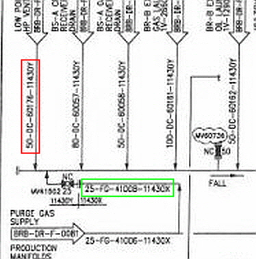
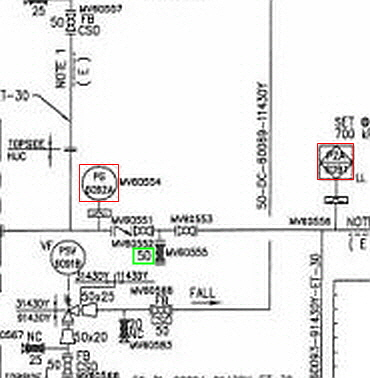

이번 포스트에서는 설계도면(P&ID)에서 핵심적인 요소 중 하나인 **'텍스트'**에 주목하여 영역 탐지와 인식에 대해 2편으로 나누어 기술 소개와 개발 과정을 소개드립니다.

## 📋 Table of Contents

1. [텍스트 탐지·인식 타임라인](#1-텍스트-탐지인식-타임라인)
2. [텍스트 탐지 배경](#2-텍스트-탐지-배경)
3. [기반 기술](#3-기반-기술)
4. [텍스트 탐지 모델 구축 과정](#4-텍스트-탐지-모델-구축-과정)
5. [결론](#5-결론)

## 1. 텍스트 탐지·인식 타임라인

[ 텍스트 탐지·인식 모델 타임라인(2020~2022) ]

설계 도면 내 텍스트를 탐지하고 인식하기 위한 기술은 시간에 따라 다양한 모델과 방법론을 적용하며 발전시켰습니다.

### 2020년
초기 연구에는 오픈 OCR 엔진인 Google Tesseract를 활용하여 텍스트 탐지부터 인식까지 시도하였습니다. Tesseract는 설치 및 사용이 매우 간단하며 영어 외에도 다양한 언어를 지원하는 장점이 있었지만, 품질이 낮거나 스캔된 설계 도면과 같은 비정형 데이터에 대한 처리에 한계가 있었습니다. 특히 설계 도면은 텍스트와 심볼이 함께 혼합되어 있어 Tesseract는 이를 구분하지 못하는 문제가 두드러졌습니다. 따라서 텍스트 탐지와 인식 모델을 구분하여 적합한 모델을 연구하게 되었습니다.

### 2021년 상반기
설계 도면과 같은 특수한 환경에서는 텍스트의 다양한 형태와 배치가 존재합니다. 이런 형태들은 일반 문서에서 찾아보기 어렵죠. 따라서 Google Tesseract보다 뛰어난 텍스트 영역을 탐지하는 모델이 필요하게 되었습니다. 따라서 텍스트 영역을 정확하게 탐지하는 모델을 개발하고, 이를 통해 탐지된 영역에 대해 Tesseract를 이용하여 인식하자 라는 전략을 세웠습니다. 이로써 텍스트 탐지 모델 연구가 먼저 시작하게 되었습니다. 
텍스트 탐지 모델은 네이버 클로바에서 CVPR 2019에 발표한 CRAFT(Character-Region Awareness For Text detection)를 선택하였습니다. 이 모델은 Google Tesseract보다 훨씬 우수한 탐지 성능을 보였습니다. 하지만 여전히 일부 결과는 심볼과 텍스트를 구분하지 못하거나, 한 글자 텍스트를 미탐지하는 등의 아쉬운 점이 있었습니다.

### 2021년 하반기
CRAFT 모델을 활용하여 텍스트 영역을 탐지하고, Google Tesseract를 활용하여 인식을 시도하였으나, 이 역시 스캔된 설계 도면과 같은 특수한 환경에서는 만족스러운 결과를 내놓지 못했습니다. 이에 따라 설계 도면에 특화된 텍스트 인식 모델의 프레임워크를 직접 재구성하여 Drawing Text Recognition 모델을 개발했습니다. 텍스트 인식 모델에 대한 설명은 다음 포스트에서 보다 상세하게 소개드리겠습니다.

### 2022년
텍스트 인식의 성능이 훌륭하더라도 텍스트 탐지 모델이 텍스트 영역을 정밀하게 탐지하지 못한다면 최종 결과물의 품질이 저하됩니다. 또한, 텍스트 탐지 결과의 편집은 다른 객체 편집보다 사용자에게 더 까다로운 작업입니다. 따라서 탐지 모델의 정밀도 향상이 필수적으로 고려되어야 했습니다. 2022년에는 CRAFT 모델 대신 벤치마킹 성능이 더 뛰어났던 TextFuseNet 모델을 테스트하였고, 비교 실험을 통해 최종적으로 정밀도가 더 높고 SOTA(State-of-the-Art)였던 TextFuseNet 모델을 도입했습니다.

## 2. 텍스트 탐지 배경
텍스트 탐지는 이미지나 도면과 같은 비정형 데이터에서 텍스트 영역을 자동으로 인식하고 분리하는 과정을 말합니다. 이는 정보 추출, 자동화, 문서 분류 등 다양한 응용 분야에서 핵심 역할을 합니다. 설계 도면에 텍스트 탐지 기술을 적용하기 위해서는 설계 도면의 특수한 특성을 고려해야 합니다. 설계 도면은 일반 문서와는 다르게 텍스트와 심볼이 혼재되어 있으며, 텍스트의 형태 역시 길거나 짧거나 회전된 형태 등 다양합니다. 아래의 설계 도면 예시를 통해 특수한 경우를 확인해보겠습니다.  
좌측 그림을 살펴보면 초록 박스 영역 내에는 긴 텍스트("25-FG-41008-11430X")와 같이 특수 기호(대쉬)로 구분된 텍스트가 있으며, 빨간색 박스 영역에는 반시계 방향으로 90도 회전된 텍스트("50-0C-60176-11430Y")가 존재합니다. 
우측 그림에서는 초록 박스 영역처럼 짧은 텍스트("50")도 있으며, 빨간 박스 영역과 같이 텍스트가 심볼 내부에 배치된 경우도 있습니다.

  
  

[ 설계 도면 내 텍스트 형태 및 배치 ]

*출처: [이미지 출처](https://arvengtraining.com/en/differences-between-pfds-and-pids/){:target="_blank"}*

## 3. 기반 기술

## 4. 텍스트 탐지 모델 구축 과정

## 5. 결론