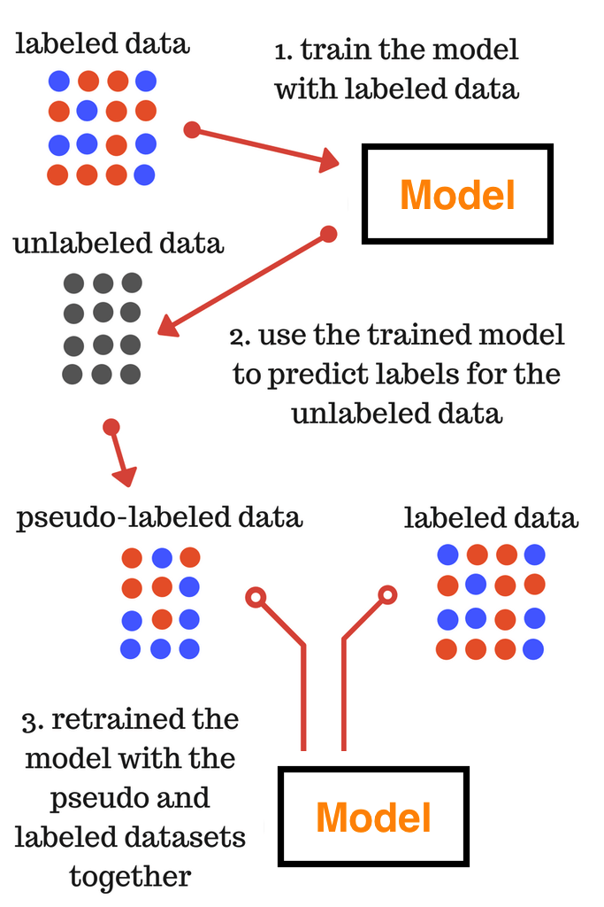
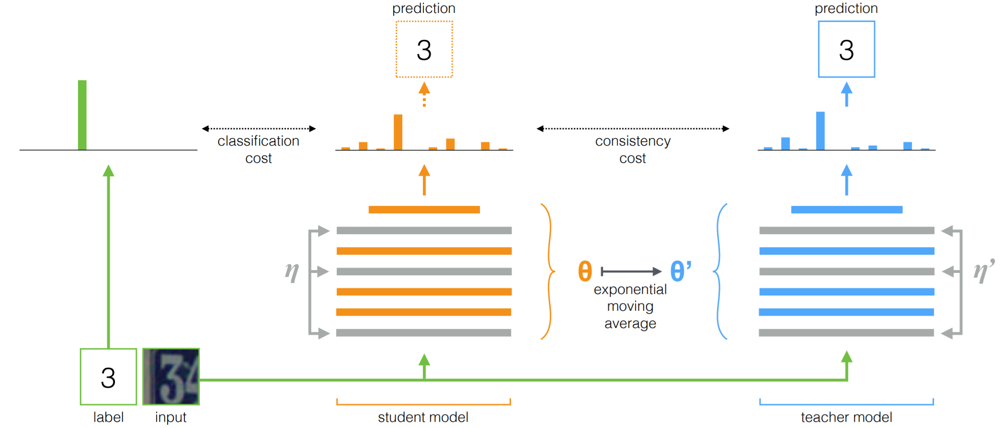
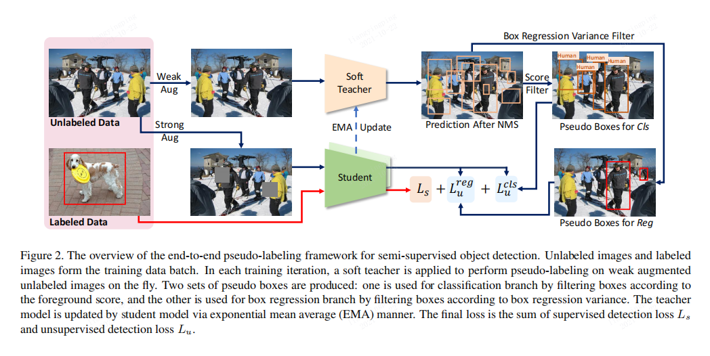
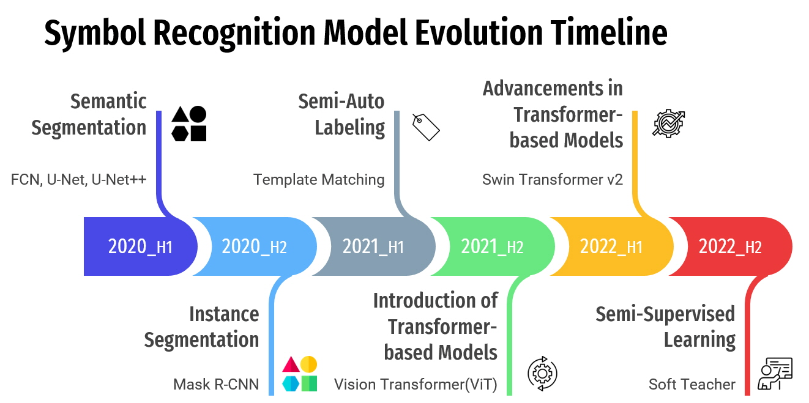
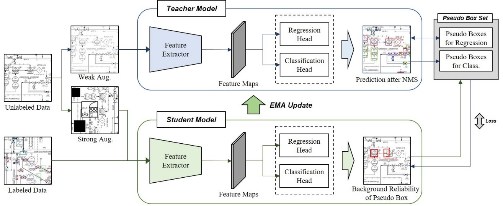
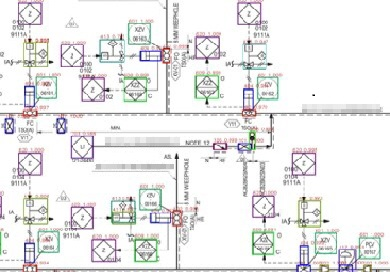

코카콜라를 떠올려보면 머릿 속에 떠오르는 로고 디자인이 있을 것입니다. 하지만 최근에는 제로 슈가, 레몬맛, 우주맛 등 다양한 맛을 표현하는 디자인이 출시되었고, 걸그룹 뉴진스와도 콜라보를 하며 새로운 디자인이 계속해서 쏟아져 나오고 있죠.
<br><br>
사람들은 새로운 디자인이 나오더라도 엄청 독특하지만 않는다면 "코카콜라에서 새로운 맛이 나왔나보네?" 라고 생각할 것입니다.
하지만, 인공지능은 어떨까요? 학습 데이터셋에 없는 디자인을 인식하는 것은 아무리 오랜 학습을 수행해도 정확한 결과를 내놓지 못할 겁니다.
<br><br>
앞서 다루었던 심볼 인식의 경우도 건설 프로젝트가 변경되면 심볼의 형상과 이름이 바뀌게 되는데요. 이것은 코카콜라의 디자인과 비슷한 상황입니다.
<br><br>
이번 포스트에서는 "[**심볼 인식 1편**](/projects/pnid/02)"과 같은 한계를 해결하기 위한 ***준지도학습 방식***을 활용한 심볼 인식에 대해 소개합니다.

<div align="center">
  
  
</div>
<center>[ 코카콜라의 다양한 디자인 ]</center>
*출처: [이미지 출처](https://www.coca-cola.co.kr/creations/masism-unexpected-coke){:target="_blank"}*

## 📋 Table of Contents

1. [배경](#1-배경)
2. [기반 기술](#2-기반-기술)
3. [준지도학습 기반 심볼 인식 모델 구축 과정](#3-준지도학습-기반-심볼-인식-모델-구축-과정)
4. [결론](#4-결론)

## 1. 배경
소프트웨어 취약점 테스트 중에 *퍼징(Fuzzing)*이란 기법이 있습니다. 이 기법은 다양한 입력값을 무작위로 주입하여 소프트웨어의 취약점과 에러를 검출하는 방식인데요. 이러한 소프트웨어적 측면에서 이상 탐지를 하는 것도 중요한만큼 프로젝트 관리 측면에서도 도메인 배경 지식을 익히고 실제 산업 환경을 고려하여 발생 가능한 이슈를 사전에 체크해보는 것이 중요한 것 같습니다.<br><br>
이전 포스트에서는 특정 건설 사업을 선정하여 심볼 인식을 수행하여 성공적인 결과를 얻었는데요. 그러나 이러한 접근 방식은 다른 건설 사업에서는 심볼의 형상이나 이름이 변경되기 때문에 적용이 어렵다는 한계가 있습니다.<br><br>
예를 들어, 아래 그림과 같이 A 프로젝트에서 "GLOBE VALVE"라는 심볼을 B 프로젝트에서는 BALL VALVE라고 정의될 수 있고, 프로젝트가 변경되면 심볼의 형상이 완전히 달라지는 경우가 있습니다. 즉, 이것은 국제적인 표준이 부재하고 있다는 문제를 보여줍니다.<br><br>
따라서 이러한 다양한 변수를 고려하여 심볼 인식 모델을 구축해야 합니다. 지속적인 새로운 데이터셋 레이블링 작업와 모델 업데이트를 통해 최신 상태로 유지해야 하므로 준지도 학습(Semi-Supervised Learning) 방식을 적용했습니다!!

<div align="center">
  
</div>
<center>[ 프로젝트별 심볼 차이 ]</center>
*출처: [이미지 출처](https://sadboxabc.blogspot.com/2019/06/34-symbol-legend.html){:target="_blank"}*

## 2. 기반 기술
### 준지도 학습(Semi-Supervised Learning) 방식
준지도 학습은 지도 학습과 비지도 학습의 중간 방식으로, 소량의 레이블링된 데이터와 레이블링되지 않은 데이터를 함께 사용합니다. 대부분의 현실 세계 데이터에서 레이블이 존재하는 데이터는 전체 데이터의 1%에서 10% 정도를 차지하므로, 준지도 학습은 이러한 레이블이 없는 데이터를 효과적으로 활용하여 모델을 학습시키는 방법 중 하나입니다.<br><br>
준지도 학습은 다양한 가정에 기반하여 다양한 방식으로 구현됩니다. 그 중에서도 셀프 트레이닝(Self-Training)과 일관성 정규화(Consistency Regularization) 방법이 널리 사용됩니다.

### 셀프 트레이닝(Self-Training)
셀프 트레이닝은 모델 스스로 수도 레이블(pseudo label)을 생성하여 사용하는 방법론입니다. 기존의 레이블링된 데이터를 사용하여 분류 모델을 학습한 후, 레이블이 없는 데이터에 대한 모델의 결과를 가장 높은 신뢰도로 예측된 값을 새로운 정답 레이블로 정의합니다. 이후 이 정의된 레이블을 수도 레이블이라 하며, 이를 사용하여 모델을 재학습합니다. 이러한 과정을 반복하며 모델의 성능을 향상시킵니다. 하지만 모델의 예측이 잘못된 경우 수도 레이블링도 잘못되고, 이는 모델 성능에 큰 영향을 미칠 수 있습니다. 이를 해결하기 위해 일정한 임계치(threshold)를 설정하여 신뢰도가 높은 예측만을 수도 레이블로 사용하는 방법도 있습니다.

<div align="center">
  
</div>
<center>[ Pseudo Labeling ]</center>
*출처: [관련 논문](https://www.researchgate.net/publication/280581078_Pseudo-Label_The_Simple_and_Efficient_Semi-Supervised_Learning_Method_for_Deep_Neural_Networks){:target="_blank"}*

### 일관성 정규화(Consistency Regularization)
일관성 정규화는 다른 방식으로, 레이블이 없는 데이터에 섭동(perturbation)을 포함하여 데이터를 증강시킨 후, 해당 데이터를 입력값으로 사용하여 모델을 학습합니다. 이를 통해 모델의 결과에 일관성을 부여하고, 레이블이 없는 데이터를 활용하여 모델의 성능을 향상시킵니다. 이 방법론을 사용한 모델에는 여러 가지 종류가 있으며, 그 중에서도 Mean Teacher 모델은 널리 사용되는 대표적인 모델 중 하나입니다. Mean Teacher 모델은 학생(student) 모델과 교사(teacher) 모델로 구성되며, 두 모델의 파라미터를 공유하면서 학습합니다.

<div align="center">
  
</div>
<center>[ Mean Teacher ]</center>
*출처: [관련 논문](https://arxiv.org/abs/1703.01780){:target="_blank"}*

### Soft Teacher
[Xu et al.](https://arxiv.org/abs/2106.09018){:target="_blank"}가 제안한 Soft Teacher 모델은 준지도 학습 기반 객체 인식 분야에서 높은 성능을 달성한 모델 중 하나입니다. 이 모델은 학습 과정에서 세 가지 주요 특징을 제시하여 효과적인 객체 인식을 가능하게 합니다.

  1. ***End-to-End Framework***<br>
  Soft Teacher 모델은 기존의 준지도 학습 모델과 다른 새로운 접근 방식을 채택했습니다. 이 모델은 end-to-end 프레임워크로 구성되어 있어서 멀티 스테이지 프레임워크를 사용하는 모델과는 구조적으로 다릅니다. 일반적으로 수도 레이블링 방법 기반의 모델은 멀티 스테이지 프레임워크를 채택하여 수도 레이블링된 데이터를 활용합니다. 그러나 이러한 접근 방식은 전체 학습 속도를 저해하고 초기에 부정확한 수도 레이블링으로 인해 성능이 제한될 수 있습니다. Soft Teacher는 이러한 문제를 극복하기 위해 학생-교사 모델 구성을 채택합니다. 교사 모델은 레이블링 되지 않은 데이터에 수도 레이블을 생성하고, 학생 모델은 레이블링 된 데이터와 수도 레이블이 있는 레이블링되지 않은 데이터로 학습합니다. 학습 중에 교사 모델은 학생 모델에 의해 지수 이동 평균(EMA) 전략을 통해 지속적으로 업데이트되어 서로의 학습 파라미터를 공유합니다.

  2. ***"Soft" Teacher***<br>
  "Soft" Teacher는 학생 모델의 탐지 성능을 향상시키기 위한 새로운 교사 모델입니다. 일반적으로 모델은 바운딩 박스 후보들의 신뢰도를 계산하고, 신뢰도 임계치에 따라 foreground 박스 또는 background 박스로 판단하여 이를 제거 또는 선택합니다. 그러나 이러한 방식은 임계치가 높게 설정되면 실제 foreground 박스가 background 박스로 잘못 판단되어 제거될 수 있습니다. "Soft" Teacher 기법은 이러한 문제를 해결하기 위해 사용됩니다. 이 기법에서는 학생 모델이 생성한 바운딩 박스 후보들의 신뢰도를 각각의 박스 후보들의 손실에 가중치를 주고, 교사 모델은 신뢰도 값을 foreground 판별 지표로 사용하여 학생 모델이 생성한 바운딩 박스 후보들을 탐지합니다. 이로써 보다 정확한 객체 탐지가 가능하게 됩니다.

  3. ***Box Jittering***<br>
  Box Jittering은 학생 모델의 박스 영역 식별(localization) 성능을 향상시키기 위한 기법 중 하나입니다. 교사 모델이 생성한 후보 바운딩 박스 중 foreground로 지정된 박스들을 해당 바운딩 박스 후보 주위에 랜덤하게 흩트러트려 교사 모델에 의해 정제된 바운딩 박스를 얻어내는 방법입니다. 이를 통해 학생 모델은 보다 정확한 박스 위치를 식별하고 객체의 정확한 경계를 파악할 수 있게 됩니다.

<div align="center">
  
</div>
<center>[ Soft Teacher ]</center>
*출처: [관련 논문](https://arxiv.org/abs/2106.09018){:target="_blank"}*

## 3. 준지도학습 기반 심볼 인식 모델 구축 과정
이전 포스트에서는 2020년 상반기부터 2022년 상반기까지의 심볼 인식 딥러닝 모델의 개발 타임라인을 살펴봤습니다. 이번 포스트에서는 아래 그림과 같이 2022년 하반기까지 완료된 타임라인과 해당 기간 동안 수행한 준지도 학습 기반 심볼 인식 모델의 구축 과정에 대해 소개하겠습니다.
<div align="center">

</div>
<center>[ 심볼 인식 모델 타임라인(2020 H1 ~ 2022 H2) ]</center>
<br>
2022년 하반기에는 설계 도면에 특화된 준지도 학습 기반 심볼 인식 모델 아키텍처를 구현했습니다. 아래 그림은 해당 아키테거츨 나타냅니다.
<div align="center">

</div>
<center>[ 설계 도면 특화 준지도 학습 모델 아키텍처 ]</center>
<br>
*출처: [준지도 학습 기반 P&ID 심볼 인식에 대한 연구](https://www.kci.go.kr/kciportal/ci/sereArticleSearch/ciSereArtiView.kci?sereArticleSearchBean.artiId=ART002872612){:target="_blank"}*
준지도 학습 기반 심볼 인식 모델 구축 과정은 [데이터 수집 및 전처리 -> 모델 준비 -> 모델 학습 -> 모델 추론 -> 실험 결과] 순으로 진행 되었습니다.

### 데이터 수집 및 전처리
이번 실험에서는 200장의 도면 이미지 데이터셋을 보유한 건설 프로젝트를 선정하여 심볼 인식을 수행했습니다. 이 프로젝트에서 인식하고자 하는 심볼 클래스의 개수는 총 93개입니다. 지도학습 모델과의 비교를 위해 백본 모델과 탐지 모델, 그리고 레이블링 데이터셋 동일하게 설정했습니다. 다만, 준지도학습의 핵심은 레이블링이 되지 않은 unlabeld dataset을 학습에 추가하는 것이므로, 이를 위해 unlabeled dataset을 위한 추가 데이터 전처리 작업을 수행했습니다.<br>
데이터 레이블링 작업은 전체 200장의 데이터 중 5장(2.5%)과 10장(5%)만을 Partially Labeled Dataset으로 선택하여 진행했습니다.<br><br>
전처리 작업의 주요 단계는 다음과 같습니다.
  1. ***Resize dataset***<br>
  먼저, 도면 사이즈를 일관성 있게 조절하기 위해 모든 도면 이미지를 4678px * 3307px 사이즈로 조정했습니다. 이뿐만 아니라, labeled dataset의 경우는 이미지 크기 변경에 따라 annotation 좌표 값도 함께 수정했습니다.

  2. ***Data Augmentation***<br>
  데이터의 다양성 확보를 위해 데이터 증강 기법을 적용했습니다. 특히 준지도 학습 방식은 unlabeled dataset의 경우 약한 증강(weak augmentation)과 강한 증강(strong augmentation)으로 구분합니다. 약한 증강에 활용한 증강 기법은 RandResize, RandFlip, RandBrightness, RandSharpness 등을 적용하였고, 강한 증강 기법은 RandTranslate, RandRotate, RandShear, RandErase 등의 기법을 추가 적용하여 다양한 케이스의 학습 데이터셋을 확보했습니다.


  3. ***Sliding Window 방식 활용***<br>
  이미지의 크기가 큰 경우, 전체 이미지를 한 번에 처리하는 것은 계산상의 어려움이 있습니다. 이를 위해 Sliding Window 방식을 활용하여 도면 이미지를 1024px * 1024px 사이즈의 패치로 분할하였습니다

  4. ***Annotation 형식 표준화***<br>
  Labeled dataset의 경우, annotation 정보를 일관된 형식으로 관리하기 위해 coco 데이터셋 레이블 포맷으로 변경했습니다. 

  5. ***Unlabeled Dataset 처리***<br>
  레이블이 없는 unlabeled datset의 경우, labeled dataset과 다르게 info annotation과 unlabeled.json을 생성합니다. 이를 통해 준지도 학습 모델은 unlabeled datset도 학습에 활용이 가능합니다.

### 모델 준비
모델 학습을 위해서 준비한 데이터에 맞게 몇몇 **하이퍼파라미터**를 조정해야합니다.

  1. *configs/soft_teacher/soft_teacher_cascade_mask_rcnn_r50_ssl_pid_full_1440k.py*<br>
  학습에 활용될 gpu의 개수와 데이터셋의 경로를 설정합니다.

  2. *configs/soft_teacher/base_ssl.py*<br>
  모델의 configuration을 재설정하고, Dataset의 클래스명을 변경합니다.

  3. *thirdparty/mmdetection/configs/base/models/cascade_mask_rcnn_r50_fpn.py*<br>
  인식 대상 클래스 개수를 수정합니다.

  4. *thirdparty/mmdetection/configs/base/datasets/pid_detection.py*<br>
  Image dataset과 annotation의 경로를 수정합니다.

  5. *thirdparty/mmdetection/mmdet/datasets/pid_detection.py*<br>
  CLASSES를 수정합니다.(클래스의 순서 중요.)

  6. *thirdparty/mmdetection/mmdet/datsets/__init__.py*<br>
  from .pid_ssl import PIDDataset 을 축하고 __all__ 변수에 PIDDataset 인자를 추가합니다.

### 모델 학습
필요한 하이퍼파라미터를 수정한 후, 다음과 같은 명령어로 모델을 학습합니다.<br>
이 과정은 DGX-Station V100 2장을 활용하여 약 7시간 동안 60,000 iteration만큼 진행되었습니다.
```bash
python -m torch.distributed.launch --nproc_per_node=4 --master_port=29700 soft_techer_model/train.py soft_techer_model/configs/soft_teacher/soft_teacher_cascade_mask_rcnn_r50_ssl_pid_full_1440k.py --work-dir ~/model/symbol_model/project --launcher pytorch
```

### 모델 추론
모델 추론은 지도학습 방식과 크게 다르지 않습니다. 준지도 학습 모델 역시 도면 이미지를 sliding window을 활용하여 패치 단위로 분할하고, 추론 작업을 수행합니다. 이때 추론된 패치 단위 결과들은 NMS(Non-Maximum Suppression) 기법을 활용하여 중복된 바운딩 박스를 처리하고, 하나의 도면 이미지로 통합합니다.<br>
아래는 모델 추론을 위한 커맨드 라인 명령어입니다.
```bash
python soft_techer_model/general_symbol_detector.py
```
<div align="center">

</div>
<center>[ 준지도 학습 모델 추론 결과 ]</center>

### 실험 결과
본 실험에서는 mAP의 IoU 임계치를 0.9로 설정하여 모델의 성능을 평가하였습니다.

실험은 레이블링된 데이터의 비율을 1%와 2.5% 두 가지 경우에 대해 준지도 학습과 지도 학습 모델의 성능을 비교하였습니다. 이 중에서 레이블링 데이터 비율이 2.5%인 경우, 준지도 학습 모델이 98.24%라는 매우 높은 성능을 보였습니다.

다음은 실험 결과를 요약한 표입니다.

|         <center>Method</center>         | <center>Partially Labeled Data</center> | <center>mAP (m=0.9)</center> |
|-----------------------------------------|-----------------------------------------|------------------------------|
|          Supervised Learning            |           <center>1%</center>           |            92.08 %           |
|   Semi-Supervised Learning<br>(our)     |           <center>1%</center>           |            97.37 %           |
|          Supervised Learning            |          <center>2.5%</center>          |            94.19 %           |
| ***Semi-Supervised Learning<br>(our)*** |          <center>2.5%</center>          |         ***98.24 %***        |

위 결과를 통해 레이블링 데이터가 제한적인 상황에서도 준지도 학습을 활용하면 모델의 성능을 향상시킬 수 있음을 확인할 수 있었습니다. 특히 레이블링 데이터의 양이 약간 증가함에 따라 준지도 학습 모델의 성능 향상이 두드러졌습니다.

## 4. 결론
이번 포스트에서는 준지도 학습을 활용한 심볼 인식에 대해 다뤘습니다. 심볼 인식은 건설 프로젝트 및 다른 도메인에서 중요한 작업 중 하나이며, 특히 딥러닝 모델을 활용한 자동화된 심볼 인식은 생산성과 정확성을 높일 수 있는 핵심 기술 중 하나입니다.

준지도 학습을 통해 레이블링된 데이터의 양을 획기적으로 줄이고, 레이블이 없는 데이터를 효과적으로 활용하여 모델의 성능을 높일 수 있는 접근 방법을 소개하였습니다. 실험 결과를 통해, 레이블링 데이터가 제한적인 상황에서도 준지도 학습을 활용하면 모델의 성능을 향상시킬 수 있음을 확인하였습니다. 특히, 레이블링 데이터의 양이 조금만 증가해도 준지도 학습 모델의 성능 향상이 두드러지며, 이는 현업에서 매우 유용한 결과입니다.

이를 바탕으로 준지도 학습 모델과 지도 학습 모델을 앙상블하여 두 모델의 한계점을 극복하는 방향으로 구축할 것이며, 앙상블 모델을 통해 실제 산업 환경에서 더 나은 자동화 및 정확성을 제공할 수 있을 것으로 기대합니다.

<!-- 다음 포스트는 "[**텍스트 탐지 & 인식 1편**](/projects/pnid/04)"이며, 설계 도면 내 텍스트의 영역을 탐지하는 내용을 소개합니다. -->