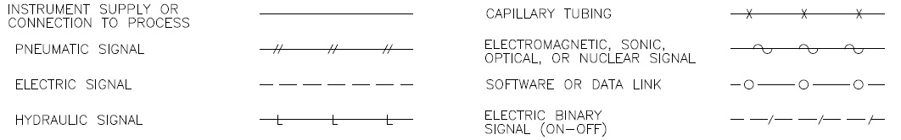
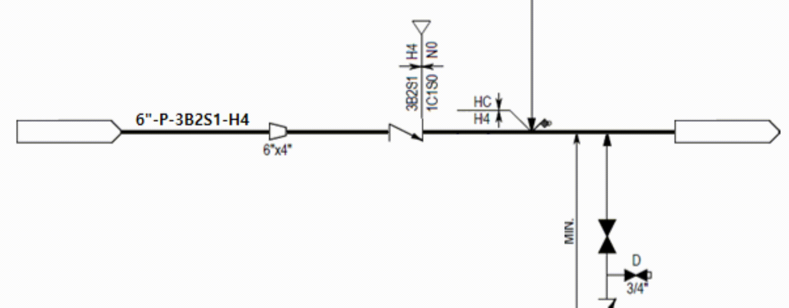

이번 포스트에서는 **도면 내 라인 인식**에 대해 소개드립니다.

## 📋 Table of Contents

1. [라인 인식 배경](#1-라인-인식-배경)
2. [라인 인식 시스템 흐름](#2-라인-인식-시스템-흐름)
3. [라인 인식 모델 구축 과정](#3-라인-인식-모델-구축-과정)
4. [결론](#4-결론)

## 1. 라인 인식 배경
설계 도면에서 라인은 형태와 의미 종류가 다양합니다. 형태로는 실선(Unbroken Line), 점선(Dotted Line), 이점 쇄선(Dash-double Line), 파선(Dashed Line) 등이 있으며, 의미 종류는 배관 또는 공정 라인(Pipe Line or Process Line), 전기 신호 라인(Signal Line), 통신 라인(Communication Line), 보온을 위한 열선(Heat Tracing Line) 등이 존재합니다.

[ 라인 종류 ]

 

설계 도면의 라인 인식은 어느 위치에 라인이 존재하는지만 탐지하는 것이 아니고 라인 위에 어떠한 객체들이 존재하고, 라인의 스펙은 무엇이며, 어느 부분에서 스펙이 변경되는지까지 인식하여 정보체계를 구성해야합니다. 

라인의 스펙 정보를 담고 있는 것을 라인 넘버라고 부르는데요. 이 라인 넘버는 표준화되어 있지 않고 건설 프로젝트별로 규약을 정하여 사용합니다. 예를 들어 아래 그림에서 빨간색 라인 구간의 라인 넘버는 6"-P-3B2S1-H4 이고 6", P, 3B2S1, H4 모두 고유의 스펙 정보를 가지고 있는 코드입니다. 이러한 스펙들은 특정 객체를 만나면 스펙 정보가 변경하게 됩니다. 그 예시를 아래의 그림으로 간단하게 설명드리겠습니다.

[ 파이프라인 스펙 구성 ]

 

총 구간은 빨간색, 파란색, 초록색 구간으로 나뉘어지며, 유체가 좌측에서 우측으로 흘러갑니다. 우선 빨간색 구간에서 라인 넘버는 6"-P-3B2S1-H4 입니다. 빨간 구간의 우측 끝 사다리꼴 객체를 만나면 파란색 구간의 스펙 정보가 6" 정보가 4"로 변경되면서 4"-P-3B2S1-H4가 됩니다. 마지막으로 파란색 구간과 초록색 구간 사이에 있는 객체를 만나면 여러 스펙 정보가 변경되게 되는데요. 3B2S1은 1C1S0으로, H4는 N0으로 변경되면서 최종적으로 초록색 구간의 라인 넘버는 6"-P-1C1S0-N0이 됩니다.

라인 인식은 라인의 위치 정보 외에도 스펙 정보를 알 수 있는 라인 넘버와 라인 내 위치하는 구성 요소들 모두 파악해야하는 테스크입니다.

## 2. 라인 인식 시스템 흐름
