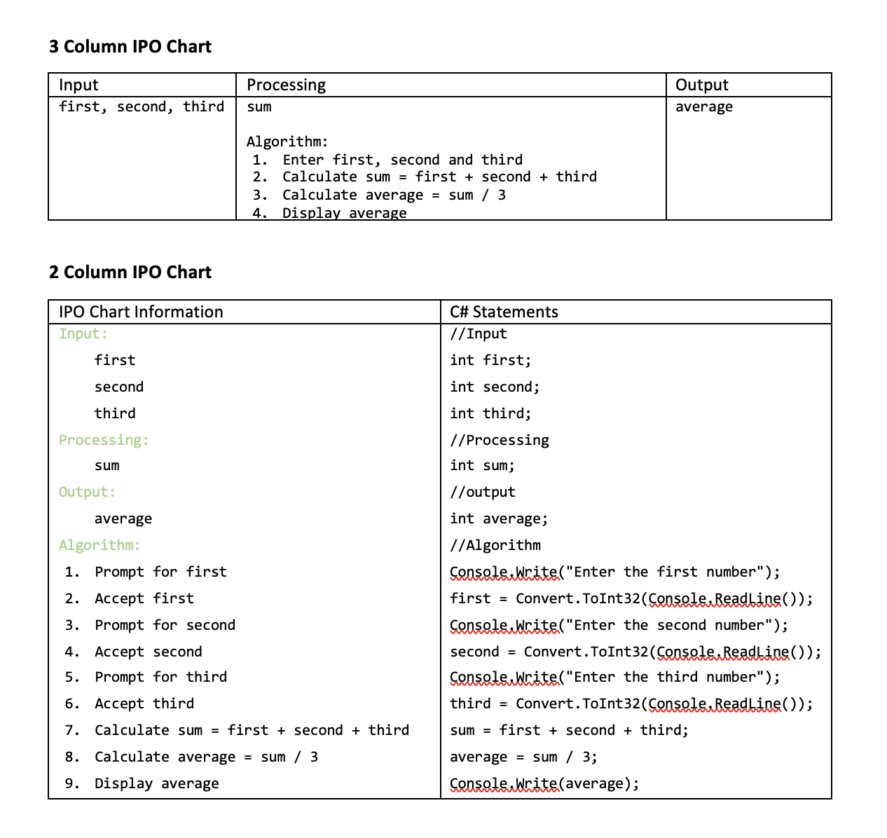

<!-- 

📋 This is the tech-news archives to help me keep track of what I am interested in!

- Reference tech news link: <https://thenextweb.com/news/blockchain-development-tech-career>
  

<div class="notice--danger">{{ notice-2 | markdownify }}</div> -->

📋 This is my note-taking from what I learned in the class "Programming 1 - COMP 100-002"
{: .notice--danger}

> ## Objectives
>
> 1. Learn about programming
> 2. Learn about algorithms
> 3. Identify the output, input, and processing items from a problem specification
> 4. Explore programming concepts

<br>

## Definition of Computer Programming

### What is Computer Programming?

Computer programming is not only about **language syntax or using an IDE**, it is more about **solving problems**.

### Problem Solving Process

**Step 1. Analyze the problem**

- Problem
  > Justin Trudeau has been working with Quality Cleaners for six years. Last year, he received a promotion with an increase of 3.5%, which brought his current weekly pay to $300. Justin is scheduled to receive another increase of 3% next week. He wants you to write a program that will display the amount of his new weekly pay.

1. Start to analyze by using IPO(Input Processing Output) Chart
   - Input: What is given
   - Processing: Stores intermediate values
   - Output: What is required
2. IPO Chart of the problem above

   |       Input        |    Processing     |     Output     |
   | :----------------: | :---------------: | :------------: |
   | Current weekly pay | Processing items: | New weekly pay |
   |     Raise rate     |    Algorithm:     |                |

- Ignore the information that is not important in this problem

  > ~~Justin Trudeau has been working with Quality Cleaners for six years. Last year, he received a promotion with an increase of 3.5%, which brought~~ his current weekly pay to $300. Justin is scheduled to receive another increase of 3% next week. He wants you to write a program that will display the amount of his new weekly pay.

- Another examples of problem

  > **Example 1 of Problem**
  >
  > Doug Ford also works at Quality Cleaners, he earns $14 per hour. Last week, Doug worked 35 hours. He wants you to write a program that will display the amount of his net weekly pay.
  > <br> &rarr; This problem specification does not contain enough information to be solved

  > **Example 2 of Problem**
  >
  > Andrea Horwath, who works at Quality Cleaners, needs a program that will display the cost of painting a room.
  > <br> &rarr; The input in this problem specification is not explicitly stated

<br>

**Step 2. Planning the Algorithm**

- The definition of Algorithm: A finite series of steps to complete a task that may be specified by means of:
  - English instructions
  - Pseudocode
  - Flowchart
- Steps of algorithm must be precise and short &rarr; ex) Food recipe
- How we can expand on the previous IPO Chart of the problem above

  |      Input       | Processing                                                                   |    Output    |
  | :--------------: | :--------------------------------------------------------------------------- | :----------: |
  | currentWeeklyPay | Processing Items: payIncrease                                                | newWeeklyPay |
  |   rateIncrease   | Algorithm:                                                                   |              |
  |                  | 1. Prompt for currentWeeklyPay                                               |              |
  |                  | 2. Accept currentlWeeklyPay                                                  |              |
  |                  | 3. Prompt for rateIncrease                                                   |              |
  |                  | 4. Accept rateIncrease                                                       |              |
  |                  | 5. Calculate the payIncrease by multiplying currentWeeklyPay by rateIncrease |              |
  |                  | 6. Calculate the newWeeklyPay by adding payIncrease and currentWeeklyPay     |              |
  |                  | 7. Display newWeeklyPay                                                      |              |

  <br>

**Step 3. Desk-checking the Algorithm**

- To check if our algorithm is working properly, Use a **desk-check table**
  <br> **Desk-checking table**

  | Weekly pay (Input) | Raise rate (Input) | Pay increase (Processing) | New weekly pay (processing) |
  | :----------------: | :----------------: | :-----------------------: | :-------------------------: |
  |      $300.00       |        0.03        |           $9.00           |           $309.00           |

  <br>

**Step 4. Code the Algorithm in a Program**

- Transform the IPO chart information into a computer program

Algorithm conversion (Here, our algorithm into c# statements)

- Input:
  - currentWeeklyPay
  - rateIncrease
  ```
  double currentWeeklyPay;
  double rateIncrease;
  ```
- Output:
  - newWeeklyPay
  ```
  double newWeeklyPay;
  ```
- Processing:
  - payIncrease
  ```
  double payIncrease;
  ```
- Algorithm
  1. Enter the current weekly pay
  2. Accept the current weekly pay
  3. Enter the rate increase
  4. Accept the rate increase
  ```
  Console.WriteLine("Enter the current pay: ");
  currentlWeeklyPay = Convert.ToDouble(Console.ReadLine());
  Console.WriteLine("Enter the rate increase ");
  rateIncrease = Convert.ToDouble(Console.ReadLine());
  ```
  5. Calculate the payIncrease by multiplying currentWeeklyPay by rateIncrease
  ```
  payIncrease = currentWeeklyPay * rateIncrease;
  ```
  6. Calculate the newWeeklyPay by adding payIncrease and currentWeeklyPay
  ```
  newWeeklyPay = payIncrease + currentWeeklyPay;
  ```
  7. Display newWeeklyPay
  ```
  Console.WriteLine("New pay: $" + newWeeklyPay);
  ```
  <br>

**Step 5. Desk-checking Program**

- To check if our program is working properly, Use a **desk-check table**
  <br> **Desk-checking table**

  | Weekly pay (Input) | Raise rate (Input) | New weekly pay (Output) |
  | :----------------: | :----------------: | :---------------------: |
  |      $300.00       |        0.03        |         $309.00         |

  <br>

**Step 6. Evaluate and Modify**
<br> Evaluation and Modification might need for the following situations:

- Enhancements request from users
- The problem specifications might change because of the following:
  - Company policies
  - Government laws

## 3 Column IPO Chart & 2 Column IPO Chart



<br>

## Guidelines for getting the C# statements

1. Comments have three formats:

   - Single line: //
   - Multiple line: /\*\*/
   - Documentation: ///

2. Declaration statement must start with a data type followed by the variable and terminated with a semi colon

3. Screen output is done via:

   - Console.Write and Console.WriteLine

4. Keyboard input is done via:

   - Console.ReadLine

5. To obtain other type, use the Convert class

   - Convert.ToInt32, Convert.ToDouble, Convert.ToChar, Convert.ToBoolean

6. All statements must be terminated by a semi colon

<br>

## Additional Information

C# Data Types - int OR double?

- [C# Data Types](https://www.w3schools.com/cs/cs_data_types.php)
- [Should I Use "int" or "double"?](https://library.fiveable.me/ap-comp-sci-a/faqs/int-double/blog/FwRLXmbZ43bAjpQf2qAt)
- [C# Decimal vs Double and Other Tips About Number Types](https://exceptionnotfound.net/decimal-vs-double-and-other-tips-about-number-types-in-net/)
- [Statements (C# Programming Guide)](https://learn.microsoft.com/en-us/dotnet/csharp/programming-guide/statements-expressions-operators/statements)
- [C# - Data Types](https://www.tutorialsteacher.com/csharp/csharp-data-types)

<br>

---

<br>

    🖋️ This is my self-taught blog! Feel free to let me know
    if there are some errors or wrong parts 😆

[Back to Top](#){: .btn .btn--primary }{: .align-right}
