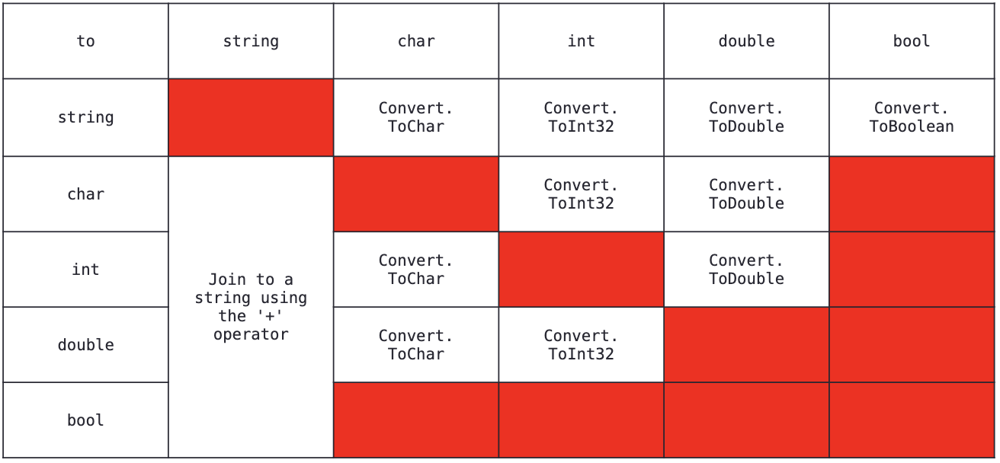



📋 This is my note-taking from what I learned in the c# tutorials!

- Reference tutorials link: <https://www.w3schools.com/cs/index.php>
  

<div class="notice--danger">{{ notice-2 | markdownify }}</div>

<!-- 📋 This is my note-taking from what I learned in the class "Programming 1 - COMP 100-002"
{: .notice--danger} -->

<br>

## C#

- C# (C-Sharp) is a programming language developed by Microsoft that runs on the .NET Framework.
- C# is used to develop web apps, desktop apps, mobile apps, games and much more.

### <u>What is C#?</u>

- An object-oriented programming language created by Microsoft that runs on the .NET Framework.
- C# has roots from the C family, and the language is close to other popular languages like C++ and Java.
- The first version was released in year 2002. The latest version, C# 11, was released in November 2022.

### <u>Why use C#?</u>

- It is one of the most popular programming language in the world.
- It is easy to learn and simple to use.
- It has a huge community support.
- C# is an object oriented language which gives a clear structure to programs and allows code to be reused, lowering development costs.
- As C# is close to C, C++ and Java, it makes it easy for programmers to switch to C# or vice versa

### <u>C# IDE</u>

- The easiest way to get started with C#, is to use an IDE.
- An IDE (Integrated Development Environment) is used to edit and compile code. &rarr; Visual Studio
- Applications written in C# use the .NET Framework, so it makes sense to use Visual Studio, as the program, the framework, and the language, are all created by Microsoft.

<br>

## C# Syntax

Example

```
using System;

namespace HelloWorld
{
  class Program
  {
    static void Main(string[] args)
    {
      Console.WriteLine("Hello World!");
    }
  }
}
```

Explanation of Example

- Line 1: "using System" means that we can use classes from the "System" namespace.
- Line 2: A blank line. C# ignores white space. However, multiple lines makes the code more readable.
- Line 3: "namespace" is used to organize your code, and it is a container for classes and other namespaces.
- Line 4: The curly braces "{}" marks the beginning and the end of a block of code.
- Line 5: "class" is a container for data and methods, which brings functionality to your program. Every line of code that runs in C# must be inside a class. In our example, we named the class "Program."
- Line 7: Another thing that always appear in a C# program, is the "Main" method. Any code inside its curly brackets "{}" will be executed. You don't have to understand the keywords before and after Main. You will get to know them bit by bit while reading this tutorial.
- Line 9: "Console" is a class of the "System" namespace, which has a "WriteLine()" method that is used to output/print text. In our example it will output "Hello World!".

> - If you omit the "using System" line, you would have to write "System.Console.WriteLine()" to print/output text.
> - Every C# statement ends with a semicolon ;.
> - C# is case-sensitive: "MyClass" and "myclass" has different meaning.
> - Unlike Java, the name of the C# file does not have to match the class name, but they often do (for better organization). When saving the file, save it using a proper name and add ".cs" to the end of the filename.

<br>

## C# Output

To output values or print text in C#, Use the "WriteLine()" method.

```
Console.WriteLine("Hello World!");
```

```
Console.WriteLine("Hello World!");
Console.WriteLine("I am Learning C#");
Console.WriteLine("It is awesome!");
```

```
Console.WriteLine(3 + 3);
```

### <u>The Write Method</u>

- Similar to "WriteLine()" method.
- The only difference is that it does not insert a new line at the end of the output.

> <u>Ex of WriteLine Method</u>
>
> ```
> Console.WriteLine("Hello World! ");
> Console.WriteLine("I am Learning C# ");
> Console.WriteLine("It is awesome!");
> ```
>
> <u>Output</u>
>
> Hello World!
> <br> I am Learning C#
> <br> It is awesome!

> <u>Ex of Write Method</u>
>
> ```
> Console.Write("Hello World! ");
> Console.Write("I am Learning C# ");
> Console.Write("It is awesome!");
> ```
>
> <u>Output</u>
>
> Hello World! I am Learning C# It is awesome!

<br>

## C# Comments

Comments can be used to explain C# code, and to make it more readable. It can also be used to prevent execution when testing alternative code.

### <u>Single-line Comments</u>

For short comments

```
// This is a comment
Console.WriteLine("Hello World!");
```

```
Console.WriteLine("Hello World!");  // This is a comment
```

### <u>Multi-line Comments</u>

For longer comments

```
/* The code below will print the words Hello World
to the screen, and it is amazing */
Console.WriteLine("Hello World!");
```

<br>

## C# Variables

Variables are containers for storing data values.

In C#, there are different types of variables (defined with different keywords), for example:

- int: stores integers (whole numbers), without decimals, such as 123 or -123
- double: stores floating point numbers, with decimals, such as 19.99 or -19.99
- char: stores single characters, such as 'a' or 'B'. Char values are surrounded by single quotes
- string: stores text, such as "Hello World". String values are surrounded by double quotes
- bool: stores values with two states &rarr; true or false

### <u>Declaring (Creating) Variables</u>

> Syntax
>
> ```
> type variableName = value;
> ```
>
> Where type is a C# type (such as int or string), and variableName is the name of the variable (such as x or name). The equal sign is used to assign values to the variable.

```
string name = "John";
Console.WriteLine(name);
```

```
int myNum = 15;
Console.WriteLine(myNum);
```

```
// You can declare a variable without assigning the value, and assign the value later
int myNum;
myNum = 15;
Console.WriteLine(myNum);
```

```
// If you assign a new value to an existing variable, it will overwrite the previous value
int myNum = 15;
myNum = 20; // myNum is now 20
Console.WriteLine(myNum);
```

> <u>Other Types</u>
>
> ```
> int myNum = 5;
> double myDoubleNum = 5.99D;
> char myLetter = 'D';
> bool myBool = true;
> string myText = "Hello";
> ```

### <u>C# Constants</u>

If you don't want others (or yourself) to overwrite existing values, you can add the const keyword in front of the variable type. &rarr; This will declare the variable as "constant", which means unchangeable and read-only

```
const int myNum = 15;
myNum = 20; // Will occur error
```

> The const keyword is useful when you want a variable to always store the same value, so that others (or yourself) won't mess up your code. An example that is often referred to as a constant, is PI (3.14159...).
>
> Note: You cannot declare a constant variable without assigning the value. If you do, an error will occur: A const field requires a value to be provided.

### <u>C# Display Variables</u>

The "WriteLine()" method is often used to display variable values to the console window.

```
// To combine both text and a variable, use the "+" character
string name = "John";
Console.WriteLine("Hello " + name);
```

```
// You can also use the "+" character to add a variable to another variable
string firstName = "John ";
string lastName = "Doe";
string fullName = firstName + lastName;
Console.WriteLine(fullName);
```

```
// For numeric values, the "+" character works as a mathematical operator (notice that we use "int" (integer) variables here)
int x = 5;
int y = 6;
Console.WriteLine(x + y); // Print the value of x + y, that is "11"
```

### <u>C# Multiple Variables</u>

```
// To declare more than one variable of the same type, use a comma-separated list
int x = 5, y = 6, z = 50;
Console.WriteLine(x + y + z);
```

```
// You can also assign the same value to multiple variables in one line
int x, y, z;
x = y = z = 50;
Console.WriteLine(x + y + z);
```

### <u>C# Identifiers</u>

- All C# variables must be identified with unique names.
- These unique names are called identifiers.
- Identifiers can be short names (like x and y) or more descriptive names (age, sum, totalVolume).
- It is recommended to use descriptive names in order to create understandable and maintainable code

```
// Good
int minutesPerHour = 60;

// OK, but not so easy to understand what m actually is
int m = 60;
```

> The general rules for naming variables are:
>
> - Names can contain letters, digits and the underscore character (\_)
> - Names must begin with a letter
> - Names should start with a lowercase letter and it cannot contain whitespace
> - Names are case sensitive ("myVar" and "myvar" are different variables)
> - Reserved words (like C# keywords, such as int or double) cannot be used as names

<br>

## C# Data Types

A variable in C# must be a specified data type

```
int myNum = 5;               // Integer (whole number)
double myDoubleNum = 5.99D;  // Floating point number
char myLetter = 'D';         // Character
bool myBool = true;          // Boolean
string myText = "Hello";     // String
```

- A data type specifies the size and type of variable values.
- It is important to use the correct data type for the corresponding variable; to avoid errors, to save time and memory, but it will also make your code more maintainable and readable.
- We use binary computer &rarr; All information is stored as 1's and 0's
- E.g. Consider the bit sequence "0100 0001." What does it represent?
  - The number 65
  - The char A
  - The bool true
  - Double ?
  - String ?

### <u>Native OR Built-in Types</u>

- Simple type
  - int, char, double, and bool
- Native type
  - Simple types and Strings
- Custom type or user-defined types
- Conversion

### <u>The Most Common Data Types</u>

| Data   | Type Size             | Description                                                                       |
| :----- | :-------------------- | :-------------------------------------------------------------------------------- |
| int    | 4 bytes               | Stores whole numbers from -2,147,483,648 to 2,147,483,647                         |
| long   | 8 bytes               | Stores whole numbers from -9,223,372,036,854,775,808 to 9,223,372,036,854,775,807 |
| float  | 4 bytes               | Stores fractional numbers. Sufficient for storing 6 to 7 decimal digits           |
| double | 8 bytes               | Stores fractional numbers. Sufficient for storing 15 decimal digits               |
| bool   | 1 bit                 | Stores true or false values                                                       |
| char   | 2 bytes               | Stores a single character/letter, surrounded by single quotes                     |
| string | 2 bytes per character | Stores a sequence of characters, surrounded by double quotes                      |

### <u>Numbers</u>

Number types are divided into two groups:

<u>Integer Types</u>

- stores whole numbers, positive or negative (such as 123 or -456), without decimals.
- Valid types are int and long.
- Which type you should use, depends on the numeric value.

> Int
>
> - This is a whole number and signed 32-bit integer.
> - The int data type can store whole numbers from -2,147,483,648 to 2,147,483,647 (
>   $$-2^{31}$$
>   to
>   $$2^{31}$$ > \- 1)
> - In general, and in our tutorial, the int data type is the preferred data type when we create variables with a numeric value.
> - Used to store numbers that you may perform the usual arithmetic operations.
>
> ```
> int myNum = 100000;
> Console.WriteLine(myNum);
> ```
>
> ```
> int age = Convert.ToInt32(Console.ReadLine());
> int a = 4;         //decimal literal
> int b = 0x12;      //hexadecimal literal
> int c = 0b1010;    //binary literal
> int d = 'A';       //char literal
>
> int b = 6;
> Console.WriteLine(a + b);
> ```

> Int to Other Types Conversions
>
> - To string (by concatenation with a string)
>
> ```
> 123 + "123";   //123123
> "" + 123;      // 123
> "nkp-" + 123;  //nkp-123
> ```
>
> - To double
>
> ```
> Convert.ToDouble(321);
> (double) 321; //this is call casting
> ```
>
> - To char
>
> ```
> Convert.ToChar(65);
> (char)65; //this is call casting
> ```
>
> - To bool
>   No conversion exist

> Long
>
> - The long data type can store whole numbers from -9223372036854775808 to 9223372036854775807.
> - This is used when int is not large enough to store the value.
> - Note that you should end the value with an "L"
>
> ```
> long myNum = 15000000000L;
> Console.WriteLine(myNum);
> ```

<u>Floating Point Types</u>

- represents numbers with a fractional part, containing one or more decimals.
- Valid types are float and double.
- You should use a floating point type whenever you need a number with a decimal, such as 9.99 or 3.14515.

> Float
>
> - Can store fractional numbers.
> - Note that you should end the value with an "F" for floats.
>
> ```
> // Float Example
> float myNum = 5.75F;
> Console.WriteLine(myNum);
> ```

> Double
>
> - Can store fractional numbers.
> - Note that you should end the value with an "D" for doubles.
> - A 64-bit floating point value.
> - Positive and negative zero.
> - Positive and negative infinity.
> - Not-a-Number value (NaN).
> - The finite set of nonzero values.
> - Used to store numbers that you may perform the usual arithmetic.
> - $$-{1.79*10}^{308}$$
>   to
>   $${+1.7*10}^{308}$$
>
> ```
> // Double Example
> double myNum = 19.99D;
> Console.WriteLine(myNum);
> ```
>
> ```
> double weight = Convert.ToDouble(Console.ReadLine());
> double a = 3.14;
> double b = 3;      //integer literal
> double b = 'A';    //char literal
> double c = 5d;
> double c = 5.8E-6; //5.8 x 10<sup>-6<sup>
>
> Console.WriteLine(a + b);
> ```

> Double to Other Types Conversions
>
> - To string (by concatenation with a string)
>
> ```
> 1.23 + "13";     //1.2313
> "" + 12.3;       // 12.3
> "nkp-" + 1.3E5;  //nkp-1.3 * $${10}^{5}$$
> ```
>
> - To int
>
> ```
> Convert.ToInt32(3.21);
> (int)3.21; //this is call casting
> ```
>
> - To char
>
> ```
> Convert.ToChar(65.4);
> (char)65.4; //this is call casting
> ```
>
> - To bool
>   No conversion exist

> The precision of a floating point value indicates how many digits the value can have after the decimal point. The precision of float is only six or seven decimal digits, while double variables have a precision of about 15 digits. Therefore it is safer to use double for most calculations.

> Decimal
>
> - A fixed precision number.
> - Uses 128 bit for storage.
> - $${-7.9*10}^{28}$$
>   to
>   $${+7.9*10}^{28}$$
>
> ```
> decimal a = 3.4m;   //hexadecimal literal
> decimal b = 3;      //integer literal
> decimal b = 3;      //even a char literal works
> decimal c = 3.14;   //double literal does not work
> ```
>
> - An int is accurate to 7 or 8 digits
> - A double is accurate to 15 digits
> - A decimal is accurate to 28 digits

> Scientific Numbers
>
> - A floating point number can also be a scientific number with an "e" to indicate the power of 10
>
> ```
> float f1 = 35e3F;
> double d1 = 12E4D;
> Console.WriteLine(f1); //Output: 35000
> Console.WriteLine(d1); //Output: 120000
> ```

### <u>Booleans</u>

- A boolean data type is declared with the bool keyword and can only take the values true or false.
- Boolean values are mostly used for conditional testing.
- Used to be comparisons.

```
bool isCSharpFun = true;
bool isFishTasty = false;
Console.WriteLine(isCSharpFun);   // Outputs True
Console.WriteLine(isFishTasty);   // Outputs False
```

```
bool isMarried = Convert.ToBoolean(Console.ReadLine());
bool a = true;
bool b = false;

Console.WriteLine(a + b); //ERROR
```

> Boolean to Other Types Conversions
>
> - To string (by concatenation with a string)
>
> ```
> true + "13";
> "" + false;
> ```
>
> - NO OTHER CONVERSION EXIST

### <u>Characters</u>

- This is actually a 16-bit numeric value.
- The char data type is used to store a single character.
- The character must be surrounded by single quotes, like 'A' or 'c' (A char literal is delimited by a pair of single quotes).
- Constants of the char type can be written as character literals, hexadecimal escape sequence, or Unicode representation.

```
char myGrade = 'B';
Console.WriteLine(myGrade);
```

```
char input = Convert.ToChar(Console.ReadLine());
char a = 'X';
char b = '\x0058’; //hexadecimal literal
char c = '\u0058’; //unicode

Console.WriteLine(a + b); //error
```

> Char to Other Types Conversions
>
> - To string (by concatenation with a string)
>
> ```
> 'A' + "123"; //A123
> "" + 'b';    // b
> ```
>
> - To double
>
> ```
> Convert.ToDouble('X');
> (double)'X'; //this is call casting
> ```
>
> - To int
>
> ```
> Convert.ToInt32('a');
> (int)'a'; //this is call casting
> ```
>
> - To bool
>   No conversion exist

### <u>Strings</u>

- This is a sequence of zero or more [unicode characters](https://en.wikipedia.org/wiki/List_of_Unicode_characters)
- The string data type is used to store a sequence of characters (text).
- String values must be surrounded by double quotes, like "Hello" (Delimited by a pair of double quotes).
- Used to store text, part#, tel, ...
- Size is only limited by the amount of available system memory.

```
string greeting = "Hello World";
Console.WriteLine(greeting);
```

```
string name = Console.ReadLine();
string a = "h";
string b = "ello";
Console.WriteLine(a + b);

string c = @"\\icet1vm\1vm\npershad"; //Verbatim string useful for urls etc

string a = "\n";
```

- [Verbatim text - @ in variables, attributes, and string literals](https://learn.microsoft.com/en-us/dotnet/csharp/language-reference/tokens/verbatim)

> String to Other Types Conversions
>
> - To int
>
> ```
> Convert.ToInt32("123");
> ```
>
> - To double
>
> ```
> Convert.ToDouble("3.14");
> ```
>
> - To char
>
> ```
> Convert.ToChar("X");
> Convert.ToChar("1");
> Convert.ToChar("0");
> ```
>
> - To bool
>
> ```
> Convert.ToBoolean("true");
> ```

### <u>Other Numeric Types</u>

- bytes, sbyte (8 bits)
- short, ushort (16 bits)
- uint (32 bits)
- long, ulong (64 bits)
- float (32 bits)
  <br> &rarr; "s-": Signed, "u-": Unsigned

<br> &rarr; The only difference between these and the ones that you will be using is the size and precision.
<br> &rarr; They following the same rules for mathematical operations.
<br> &rarr; Sometimes there might be over or under flows.

### <u>Formatting Numeric Values</u>


<br>

## Need to Remember

- Understanding data-type is crucial in mastering the semantics of a language.
- String is the most flexible data types.
- Bool is the least flexible data types.
- Although some conversions are automatic (implicit), in this course you MUST do an explicit cast.
- Casting a double to an int does not do any rounding &rarr; it simply discards the fractional part of the number.

<br>

## C# Type Casting

Type casting is when you assign a value of one data type to another type.

In C#, there are two types of casting

- Implicit Casting (automatically): converting a smaller type to a larger type size
  char &rarr; int &rarr; long &rarr; float &rarr; double
- Explicit Casting (manually): converting a larger type to a smaller size type
  double &rarr; float &rarr; long &rarr; int &rarr; char

### <u>Implicit Casting</u>

Implicit casting is done automatically when passing a smaller size type to a larger size type.

```
int myInt = 9;
double myDouble = myInt;       // Automatic casting: int to double

Console.WriteLine(myInt);      // Outputs 9
Console.WriteLine(myDouble);   // Outputs 9
```

### <u>Explicit Casting</u>

Explicit casting must be done manually by placing the type in parentheses in front of the value.

```
double myDouble = 9.78;
int myInt = (int) myDouble;    // Manual casting: double to int

Console.WriteLine(myDouble);   // Outputs 9.78
Console.WriteLine(myInt);      // Outputs 9
```

### <u>Type Conversion Methods</u>



It is also possible to convert data types explicitly by using built-in methods, such as

- Convert.ToBoolean
- Convert.ToDouble
- Convert.ToString
- Convert.ToInt32 (int)
- Convert.ToInt64 (long)

```
int myInt = 10;
double myDouble = 5.25;
bool myBool = true;

Console.WriteLine(Convert.ToString(myInt));    // convert int to string
Console.WriteLine(Convert.ToDouble(myInt));    // convert int to double
Console.WriteLine(Convert.ToInt32(myDouble));  // convert double to int
Console.WriteLine(Convert.ToString(myBool));   // convert bool to string
```

> Why Conversion?
>
> Many times, there's no need for type conversion. But sometimes you have to. Take a look at the next chapter, when working with user input, to see an example of this.

<br>

## C# User Input

### <u>Get User Input</u>

- The user can input his or hers username, which is stored in the variable userName.
- Then we print the value of userName:

```
// Type your username and press enter
Console.WriteLine("Enter username:");

// Create a string variable and get user input from the keyboard and store it in the variable
string userName = Console.ReadLine();

// Print the value of the variable (userName), which will display the input value
Console.WriteLine("Username is: " + userName);
```

### <u>User Input and Numbers</u>

- The "Console.ReadLine()" method returns a "string".
- Therefore, you cannot get information from another data type, such as int.

The following program will cause an error:

```
Console.WriteLine("Enter your age:");
int age = Console.ReadLine();
Console.WriteLine("Your age is: " + age);
//errors: Cannot implicitly convert type 'string' to 'int'
```

You can convert any type explicitly, by using one of the Convert.To methods:

```
Console.WriteLine("Enter your age:");
int age = Convert.ToInt32(Console.ReadLine());
Console.WriteLine("Your age is: " + age);
```

<br>

## C# Operators

### <u>Operators</u>

Operators are used to perform operations on variables and values.

In the example below, we use the "+" operator to add together two values:

```
int x = 100 + 50;
```

```
int sum1 = 100 + 50;        // 150 (100 + 50)
int sum2 = sum1 + 250;      // 400 (150 + 250)
int sum3 = sum2 + sum2;     // 800 (400 + 400)
```

### <u>Arithmetic Operators</u>

Arithmetic operators are used to perform common mathematical operations:

| Operator | Name           | Description                            | Example |
| :------- | :------------- | :------------------------------------- | :------ |
| +        | Addition       | Adds together two values               | x + y   |
| -        | Subtraction    | Subtracts one value from another       | x - y   |
| \*       | Multiplication | Multiplies two values                  | x \* y  |
| /        | Division       | Divides one value by another           | x / y   |
| %        | Modulus        | Returns the division remainder         | x % y   |
| ++       | Increment      | Increases the value of a variable by 1 | x++     |
| --       | Decrement      | Decreases the value of a variable by 1 | x--     |

### <u>Assignment Operators</u>

Assignment operators are used to assign values to variables.

In the example below, we use the "assignment" operator (=) to assign the value "10" to a variable called "x":

```
int x = 10;
```

The addition assignment operator (+=) adds a value to a variable:

```
int x = 10;
x += 5;
Console.WriteLine(x); //Output: 15
```

A list of all assignment operators:

| Operator | Example | Same As    |
| :------- | :------ | :--------- |
| =        | x = 5   | x = 5      |
| +=       | x += 3  | x = x + 3  |
| -=       | x -= 3  | x = x - 3  |
| \*=      | x \*= 3 | x = x \* 3 |
| /=       | x /= 3  | x = x / 3  |
| %=       | x %= 3  | x = x % 3  |
| &=       | x &= 3  | x = x & 3  |
| \|=      | x \|= 3 | x = x \| 3 |
| ^=       | x ^= 3  | x = x ^ 3  |
| >>=      | x >>= 3 | x = x >> 3 |
| <<=      | x <<= 3 | x = x << 3 |

### <u>Comparison Operators</u>

Comparison operators are used to compare two values (or variables). This is important in programming, because it helps us to find answers and make decisions.

The return value of a comparison is either True or False. These values are known as Boolean values, and you will learn more about them in the Booleans and If..Else chapter.

In the following example, we use the greater than operator (>) to find out if 5 is greater than 3:

```
int x = 5;
int y = 3;
Console.WriteLine(x > y); // returns True because 5 is greater than 3
```

A list of all comparison operators:

| Operator | Name                     | Example |
| :------- | :----------------------- | :------ |
| ==       | Equal to                 | x == y  |
| !=       | Not equal                | x != y  |
| >        | Greater than             | x > y   |
| <        | Less than                | x < y   |
| >=       | Greater than or equal to | x >= y  |
| <=       | Less than or equal to    | x <= y  |

### <u>Logical Operators</u>

As with comparison operators, you can also test for True or False values with logical operators.

Logical operators are used to determine the logic between variables or values:

| Operator | Name        | Description                                             | Example            |
| :------- | :---------- | :------------------------------------------------------ | :----------------- |
| &&       | Logical and | Returns True if both statements are true                | x < 5 && x < 10    |
| \|\|     | Logical or  | Returns True if one of the statements is true           | x < 5 \|\| x < 4   |
| !        | Logical not | Reverse the result, returns False if the result is true | !(x < 5 && x < 10) |

```
int x = 5;
Console.WriteLine(x > 3 && x < 10);
// returns True because 5 is greater than 3 AND 5 is less than 10
```

```
int x = 5;
Console.WriteLine(x > 3 || x < 4);
// returns True because one of the conditions are True (5 is greater than 3, but 5 is not less than 4)
```

```
int x = 5;
Console.WriteLine(!(x > 3 && x < 10));
// returns False because ! (not) is used to reverse the result
```

<br>

## C# Math

The C# Math class has many methods that allows you to perform mathematical tasks on numbers.

### <u>Math.Max(x,y)</u>

The "Math.Max(x,y)" method can be used to find the highest value of x and y:

```
Console.WriteLine(Math.Max(5, 10));  // Output 10
```

### <u>Math.Min(x,y)</u>

The "Math.Min(x,y)" method can be used to find the lowest value of of x and y:

```
Console.WriteLine(Math.Min(5, 10));  // Output: 5
```

### <u>Math.Sqrt(x)</u>

The "Math.Sqrt(x)" method returns the square root of x:

```
Console.WriteLine(Math.Sqrt(64));  // Output: 8
```

### <u>Math.Abs(x)</u>

The "Math.Abs(x)" method returns the absolute (positive) value of x:

```
Console.WriteLine(Math.Abs(-4.7)); // Output: 4.7
```

### <u>Math.Round()</u>

The "Math.Round()" rounds a number to the nearest whole number:

```
Console.WriteLine(Math.Round(9.99)); // Output: 10
```

<br>

## C# Strings

Strings are used for storing text.

A "string" variable contains a collection of characters surrounded by double quotes:

```
string greeting = "Hello";
Console.WriteLine(greeting); // Output: Hello
```

```
string greeting = "Hello.";
string greeting2 = "Nice to meet you!";
Console.WriteLine(greeting);
Console.WriteLine(greeting2);
// Output:
// Hello.
// Nice to meet you!
```

### <u>String Length</u>

A string in C# is actually an object, which contain properties and methods that can perform certain operations on strings.

For example, the length of a string can be found with the Length property:

```
string txt = "ABCDEFGHIJKLMNOPQRSTUVWXYZ";
Console.WriteLine("The length of the txt string is: " + txt.Length);
//Output: The length of the txt string is: 26
```

### <u>Other Methods</u>

There are many string methods available.

For example ToUpper() and ToLower(), which returns a copy of the string converted to uppercase or lowercase:

```
string txt = "Hello World";
Console.WriteLine(txt.ToUpper());   // Output: "HELLO WORLD"
Console.WriteLine(txt.ToLower());   // Output: "hello world"
```

<br>

## C# String Concatenation

The "+" operator can be used between strings to combine them. This is called concatenation:

```
string firstName = "John "; // Note that we have added a space after "John" to create a space between firstName and lastName on print.
string lastName = "Doe";
string name = firstName + lastName;
Console.WriteLine(name); // Output: John Doe
```

You can also use the "string.Concat()" method to concatenate two strings:

```
string firstName = "John ";
string lastName = "Doe";
string name = string.Concat(firstName, lastName);
Console.WriteLine(name); // Output: John Doe
```

### <u>Adding Numbers and Strings</u>

C# uses the "+" operator for both "addition" and "concatenation". &rarr; Remember: Numbers are added. Strings are concatenated.
{: .notice--info}

If you add two numbers, the result will be a number:

```
int x = 10;
int y = 20;
int z = x + y;
Console.WriteLine(z);
// Output: 30
// z will be 30 (an integer/number)
```

If you add two strings, the result will be a string concatenation:

```
string x = "10";
string y = "20";
string z = x + y;
Console.WriteLine(z);
// Output: 1020
// z will be 1020 (a string)
```

### <u>String Interpolation</u>

Another option of "string concatenation", is "string interpolation", which substitutes values of variables into placeholders in a string.

Note that you do not have to worry about spaces, like with concatenation:

Note that you have to use the dollar sign ($) when using the string interpolation method.
{: .notice--info}

```
string firstName = "John";
string lastName = "Doe";
string name = $"My full name is: {firstName} {lastName}";
Console.WriteLine(name); // Output: My full name is: John Doe
```

<br>

## C# Access Strings

You can access the characters in a string by referring to its index number inside square brackets "[]".

Note: String indexes start with 0: [0] is the first character. [1] is the second character, etc.
{: .notice--info}

### <u>myString[0]</u>

This example prints the "first character" in "myString":

```
string myString = "Hello";
Console.WriteLine(myString[0]); // Output: H
```

This example prints the "second character (1)" in "myString":

```
string myString = "Hello";
Console.WriteLine(myString[1]); // Output: e
```

### <u>myString.IndexOf("e")</u>

You can also find the index position of a specific character in a string, by using the "IndexOf()" method:

```
string myString = "Hello";
Console.WriteLine(myString.IndexOf("e")); // Output: 1
```

### <u>Substring()</u>

Another useful method is "Substring()", which extracts the characters from a string, starting from the specified character position/index, and returns a new string.

This method is often used together with "IndexOf()" to get the specific character position:

```
// Full name
string name = "John Doe";

// Location of the letter D
int charPos = name.IndexOf("D");

// Get last name
string lastName = name.Substring(charPos);

// Print the result
Console.WriteLine(lastName); // Output: Doe
```

<br>

## C# Strings - Special Characters

Because strings must be written within quotes, C# will misunderstand this string, and generate an error:

```
string txt = "We are the so-called "Vikings" from the north."; // errors!
```

The solution to avoid this problem, is to use the "backslash escape character".

The backslash "(\\)" escape character turns special characters into string characters:

| Escape character | Result | Description  |
| :--------------- | :----- | :----------- |
| \\'              | '      | Single quote |
| \\"              | "      | Double quote |
| \\\              | \      | Backslash    |

The sequence \\" inserts a double quote in a string:

```
string txt = "We are the so-called \"Vikings\" from the north.";
Console.WriteLine(txt);
// Output: We are the so-called "Vikings" from the north.
```

The sequence \\' inserts a single quote in a string:

```
string txt = "It\'s alright.";
Console.WriteLine(txt); // Output: It's alright.
```

The sequence \\\ inserts a single backslash in a string:

```
string txt = "The character \\ is called backslash.";
Console.WriteLine(txt); // Output: The character \ is called backslash.
```

Other useful escape characters in C# are:

| Code | Result    |
| :--- | :-------- |
| \n   | New Line  |
| \t   | Tab       |
| \b   | Backspace |

```
string txt = "Hello\nWorld!";
Console.WriteLine(txt);
// Output:
// Hello
// World!
```

```
string txt = "Hello\tWorld!";
Console.WriteLine(txt);
// Output: Hello   World!
```

```
string txt = "Hel\blo World!";
Console.WriteLine(txt);
// Output: Helo World!
```

<br>

## C# Booleans

Very often, in programming, you will need a data type that can only have one of two values, like:

- YES / NO
- ON / OFF
- TRUE / FALSE

For this, C# has a "bool" data type, which can take the values "true" or "false".

### <u>Boolean Values</u>

A boolean type is declared with the "bool" keyword and can only take the values "true" or "false":

```
bool isCSharpFun = true;
bool isFishTasty = false;
Console.WriteLine(isCSharpFun);   // Output: True
Console.WriteLine(isFishTasty);   // Output: False
```

### <u>Boolean Expression</u>

A Boolean expression returns a boolean value: "True or False", by comparing values/variables.

This is useful to build logic, and find answers.

For example, you can use a "comparison operator", such as the "greater than (>) operator" to find out if an expression (or a variable) is true:

```
int x = 10;
int y = 9;
Console.WriteLine(x > y); // returns True, because 10 is higher than 9
```

```
Console.WriteLine(10 > 9); // returns True, because 10 is higher than 9
```

In the examples below, we use the "equal to (==)" operator to evaluate an expression:

```
int x = 10;
Console.WriteLine(x == 10); // returns True, because the value of x is equal to 10
```

```
Console.WriteLine(10 == 15); // returns False, because 10 is not equal to 15
```

### <u>Real Life Example</u>

Let's think of a "real life example" where we need to "find out if a person is old enough to vote."

In the example below, we use the ">= comparison operator" to find out if the age "(25)" is "greater than" OR "equal to" the voting age limit, which is set to "18":

```
int myAge = 25;
int votingAge = 18;
Console.WriteLine(myAge >= votingAge);  // returns True, meaning 25 year olds are allowed to vote!
```

Output "Old enough to vote!" if myAge is greater than or equal to 18. Otherwise output "Not old enough to vote.":

```
int myAge = 25;
int votingAge = 18;

if (myAge >= votingAge)
{
  Console.WriteLine("Old enough to vote!");
}
else
{
  Console.WriteLine("Not old enough to vote.");
}
// Output: Old enough to vote!
```

<br>

---

<br>

    🖋️ This is my self-taught blog! Feel free to let me know
    if there are some errors or wrong parts 😆

[Back to Top](#){: .btn .btn--primary }{: .align-right}

```

```
