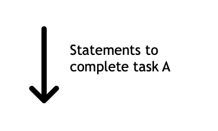
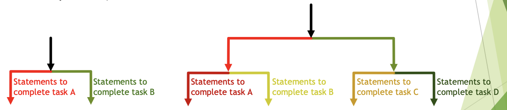
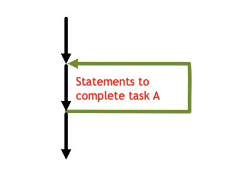
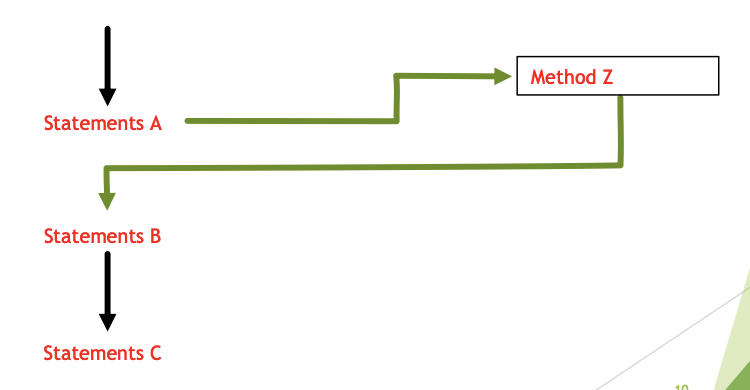

<!-- 

📋 This is my note-taking from what I learned in the c# tutorials!

- Reference tutorials link: <https://www.w3schools.com/cs/index.php>
  

{{ notice-2 | markdownify }}
 -->

📋 This is my note-taking from what I learned in the class "Programming 1 - COMP 100-002"
{: .notice--danger}

 

## What is a Program?

A program will be the statements that you write in Visual Studio.

These statement might include the following:

Comments:

- Notes that the developer would make for anyone reading the code.
- Should have your name and the date and purpose of your code.
- Must include the problem specification as well.

Statements:

- Using statement.
- Declaration statement.
- Expression statements.
- Other kinds of statements e.g. if, switch do-while, ...

 

## How are statements processed?

1. For most modern languages, executions (processing) starts in a special spot often referred to as the entry point. <u>In C#, code execution starts in the main method.</u>

2. The first statement in the main method is processed, and then the next, and then the next until the last one and then the program ends.

3. This order of processing is natural and logical.

4. It is natural because this is how everything in the world works.

5. Logical because all the statement are guaranteed to be processed.
   - You are able to predict the output of a block of code.
   - This allows you to read code.

 

## How can we change the order of processing?

1. If the order of processing is the same everything the code in executed, then the program will only be capable of doing a single task.

   - If it is calculating volume, it will process only calculation volume even if you execute one million time.

2. If we require a program to be able to do more than one task, then the order of processing MUST be different &rarr; i.e. there should be skips, jumps and repeats.

3. To formalize this non-sequential processing the concept of Control Structure was introduced by language designers.

 

## Control Structures

1. Determines which line of code will be processed.

2. <u>There are four control structures</u> in C# as it is with most modern languages.

   - Sequence
   - Conditional / Selection / Branching
   - Looping / Repeat / Iteration
   - Methods

### <u>1. Control Structures &rarr; Sequence</u>

This is the normal order of thing.

- Statements are processed sequentially from top to bottom.
- No skips, jumps or repeats.
- Program are monolithic, it will do the same thing all the time regardless of input.

### <u>2. Control Structures &rarr; Conditional/Selection/Branching</u>

- This facilitates skipping blocks of code based on a condition.
- Also called branching or selection because control is divided.
- This allow you to write any program that can be programmed (i.e. computable).

### <u>3. Control Structures &rarr; Repetition/Looping/Iteration</u>

- This control structure facilitate processing a block of statement zero or more times.
- This allows us to write less code.

### <u>4. Control Structures &rarr; Method</u>

- This allows you to attach a name to a block of code. So you are able to access the logic any time it is required.
- The developer is more productive because he came reuse logic that is already written.

Each of these control structure brings some advantage to the developer!!!
{: .notice--info}

 

---

 

    🖋️ This is my self-taught blog! Feel free to let me know
    if there are some errors or wrong parts 😆

[Back to Top](#){: .btn .btn--primary }{: .align-right}
