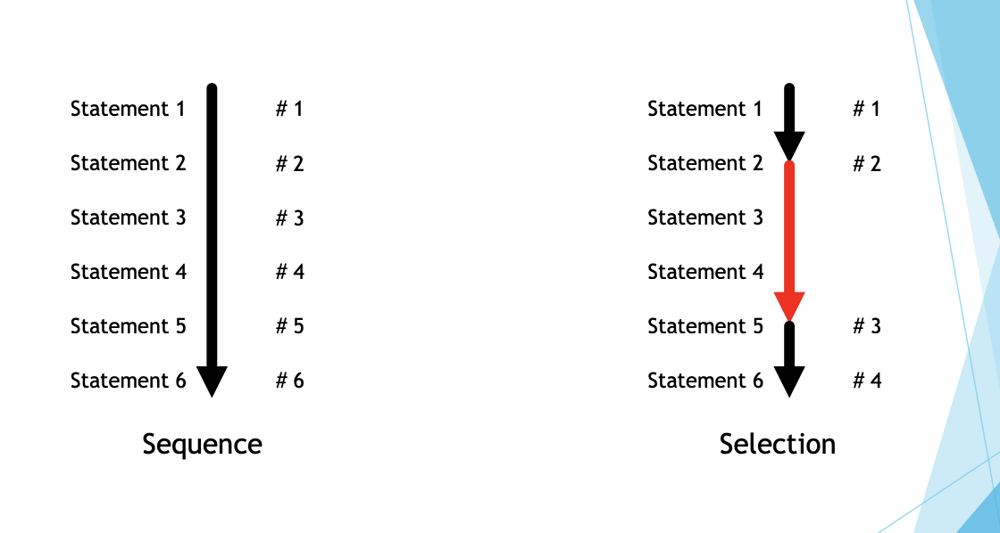
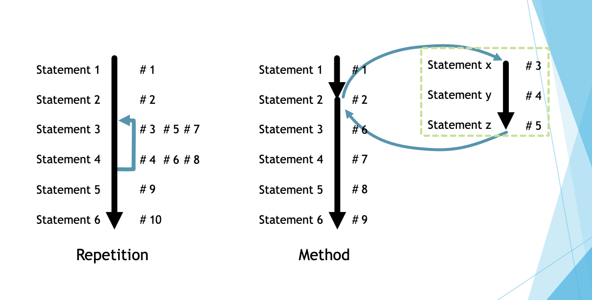
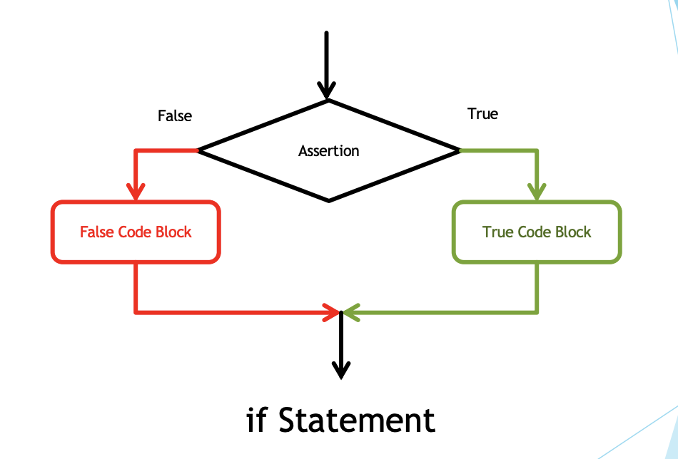

<!-- 

📋 This is my note-taking from what I learned in the c# tutorials!

- Reference tutorials link: <https://www.w3schools.com/cs/index.php>
  

<div class="notice--danger">{{ notice-2 | markdownify }}</div> -->

📋 This is my note-taking from what I learned in the class "Programming 1 - COMP 100-002"
{: .notice--danger}

<br>

## The Control Structures




<br>

## Control Structures: Conditional/Selection/Branching

- This structure facilitate selective execution of code.
- In some situation, the code block can be ignored or can be processed.
- In C#, this is done with the "if" and the "switch" statements.
- The latter is easier to understand but limited to test equality for ints, chars, and strings.
- This allow you to write any program that is can be programmed (i.e. computable)
- Also called branching or selection because control is divided.

### <u>if Statement</u>



1. Uses assertions and code blocks.

2. Assertion is a Boolean expression.

   - You may use the relational operators (==, !=, <, <=, >, >=) to build a Boolean expression.

3. A code block can be a single statement OR a set of statements enclosed within a pair of curly braces.
   - In an if-statement, there are normally 2 blocks - true and
     false block.

> Syntax
>
> ```
> if (<<bool expression>>)
> {
>   <<true block>>
> }
> else
> {
>   <<false block>>
> }
> ```

```
if (weight > 100)
{
  Console.WriteLine("Heavy");
}
else
{
  Console.WriteLine("Not heavy");
}
```

```
using System;
public class Program
{
  public static void Main()
  {
    Console.Write("Enter your age: ");
    int age = Convert.ToInt32(Console.ReadLine());

    if (age < 0)
    {
      Console.WriteLine("Age cannot be negative");
    }
  }
}
```

```
Console.Write("Enter an integer: ");
int number = Convert.ToInt32(Console.ReadLine());

if (number % 2 == 0)
{
  Console.WriteLine($"{number} is even");
}
else //you don’t need to check for odd. Why?
{
  Console.WriteLine($"{number} is odd");
}
```

```
Console.Write("Are you married (True/False)?: ");
bool isMarried = Convert.ToBoolean(Console.ReadLine());

if (isMarried) //the value in the assertion is already bool
{
  Console.WriteLine("Sorry this is a singles only club.");
}
else
{
  Console.WriteLine("Welcome.");
}
```

<br>

## Tips

1. Always use a pair of braces to enclosed your true code block or your false code block.

2. Use positive logic.

   - if(a == b) // positive logic
   - if(!a == b) // negative logic

3. The selection statement is best described using a Flowchart.



Note this!

- The Selection Control Structures adds immense power to the language.
- Selection statements can be nested to do almost everything.
- Another selection statement is the switch-statement.
  

<div class="notice--info">{{ notice-2 | markdownify }}</div>

<br>

---

<br>

    🖋️ This is my self-taught blog! Feel free to let me know
    if there are some errors or wrong parts 😆

[Back to Top](#){: .btn .btn--primary }{: .align-right}
