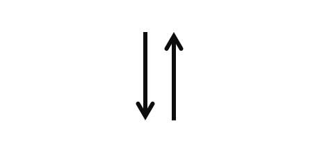
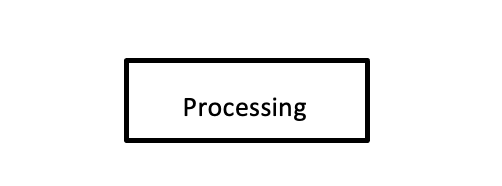
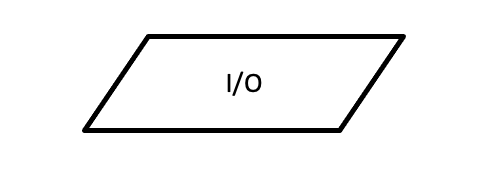
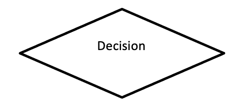
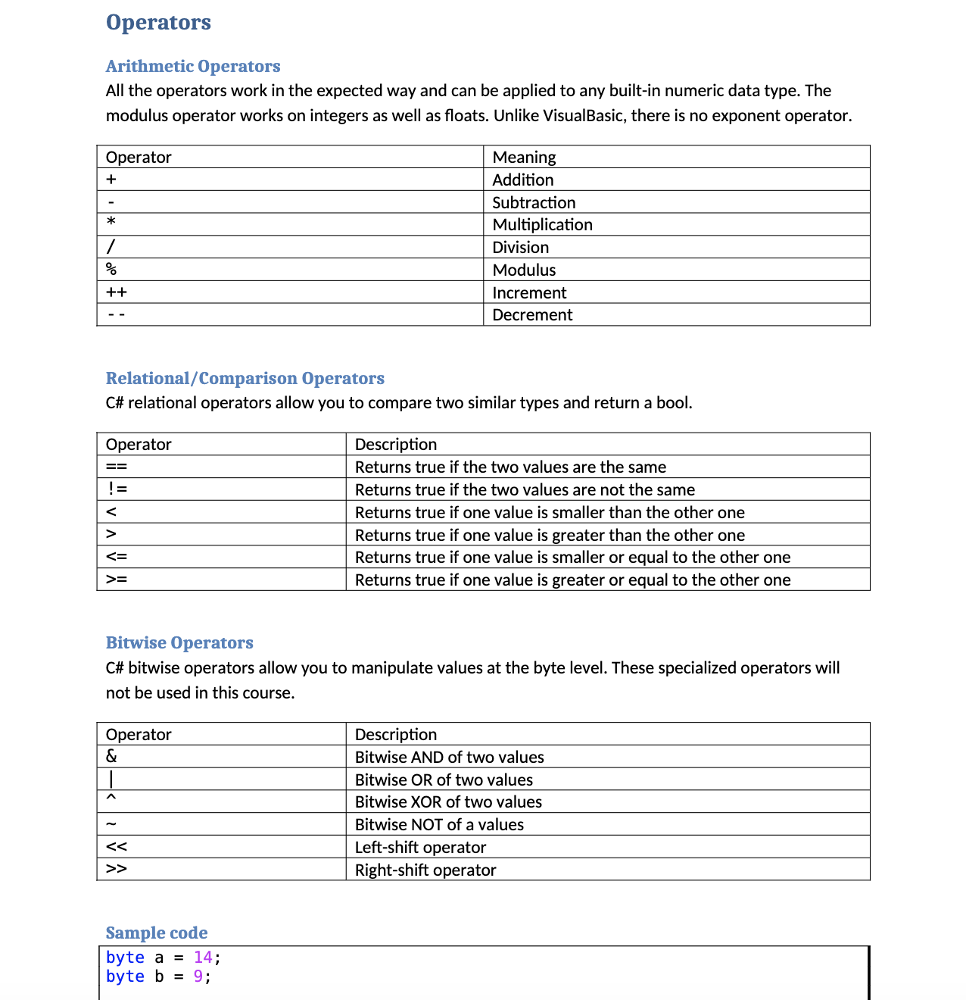
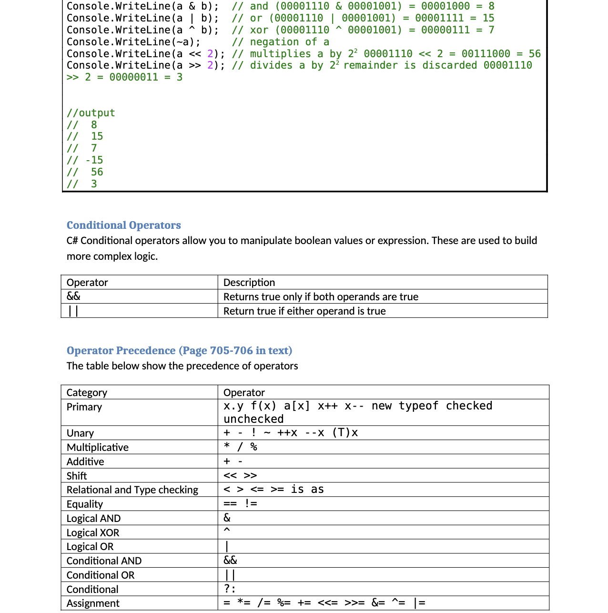



📋 This is my note-taking from what I learned in the c# tutorials!

- Reference link: Taken from “Introducing Visual Studio 2010” pg. 61
  

{{ notice-2 | markdownify }}

<!-- 📋 This is my note-taking from what I learned in the class "Programming 1 - COMP 100-002"
{: .notice--danger} -->

 

## C# Keywords

| Category / Section           | Keywords                                                                                                                                                             |
| :--------------------------- | :------------------------------------------------------------------------------------------------------------------------------------------------------------------- |
| Type Keywords                | bool, byte, sbyte, char, class, decimal, double, float, delegate, dynamic, enum, interface, object, string, struct, short, ushort, int, uint, long, ulong, void, var |
| Modifiers                    | public, protected, private, internal, abstract, const, event, in, out, override, readonly, sealed, static, virtual                                                   |
| Selection Keywords           | if, else, switch, case, default                                                                                                                                      |
| Iterator Keywords            | for, foreach, do, while                                                                                                                                              |
| Jump Keywords                | break, continue, goto, return                                                                                                                                        |
| Exception Handling Keywords  | try, catch, finally                                                                                                                                                  |
| Arithmetic Overflow Keywords | checked, unchecked                                                                                                                                                   |
| Synchronization Keywords     | Lock                                                                                                                                                                 |
| Parameter Keywords           | params, ref, out, in                                                                                                                                                 |
| Namespace Keywords           | namespace, using                                                                                                                                                     |
| Literal Keywords             | null, true, false, default                                                                                                                                           |
| Object Keywords              | is, as, new, typeof                                                                                                                                                  |
| LINQ Keywords                | from, where, select, group, into, orderby, join, let, ascending, descending, on, equals, by, in                                                                      |
| Other Keywords               | base, get, set, value, global, implicit, explicit, operator, partial, this, yield                                                                                    |

 

## C# Flowchart Elements

### <u>Flowlines</u>

Flowlines are indicated by straight lines with optional arrows to show the direction of data flows. The arrowhead is necessary with the flow direction might be in doubt. Flowlines are used to connect blocks by exiting from one and entering another.

### <u>Flatten ellipses</u>

Flatten ellipses indicate the start and the end of a module. An ellipse uses the name of the module at the start. The end is indicated by the word end or stop for the top Control and the word exit for all other modules.

### <u>Rectangle</u>

The rectangle indicates a processing block, for such things as calculations, opening and closing files, and so forth. A processing block has one entrance and one exit.

### <u>Parallelogram</u>

The parallelogram indicates input to and output from the computer memory. An IO block has one entrance and one exit.

### <u>Diamond</u>

The diamond indicates a decision. It has one entrance and two and only two exits from the block. One exit is the action when the resultant is TRUE and the other exit when the resultant is FALSE.

### <u>Rectangles with lines</u>

Rectangles with lines down each side indicate the process of modules. The have one entrance and only one exit.

### <u>Flowchart sections</u>

Flowchart sections can be connected with two different symbols. The circle connects sections on the same page, and the home base plate connects flowchart from page to page. Inside these two symbols the programmer writes letters or numbers inside the circle to indicate where the adjoining connector is located. On- and off-page connectors will have either an entrance of an exit.

 

## C# Operators

 

---

 

    🖋️ This is my self-taught blog! Feel free to let me know
    if there are some errors or wrong parts 😆

[Back to Top](#){: .btn .btn--primary }{: .align-right}
