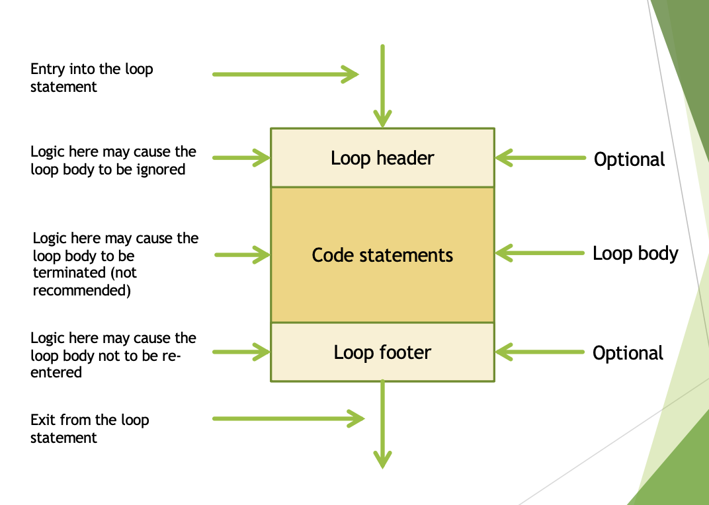
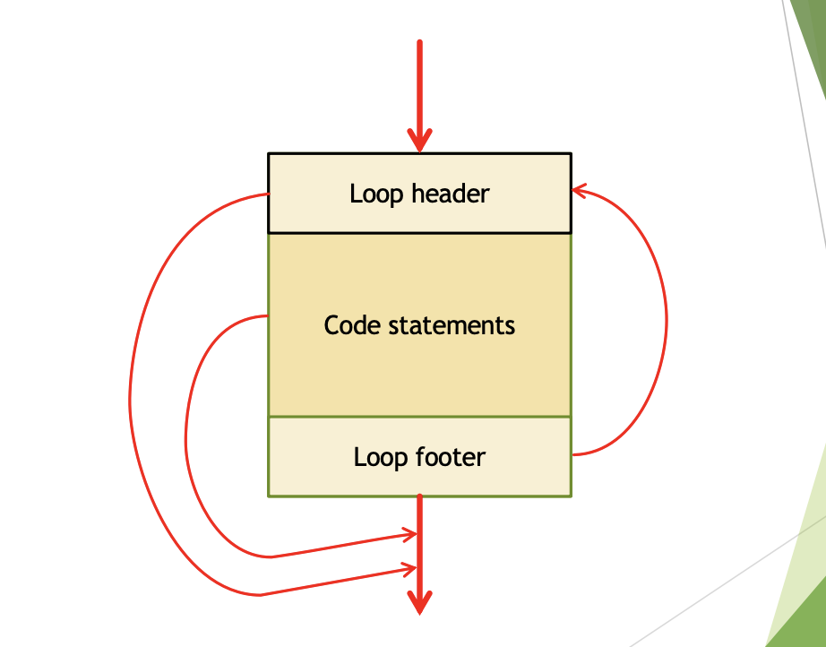
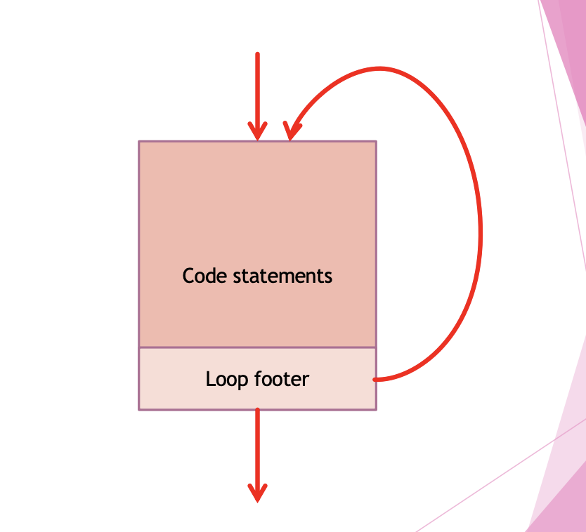
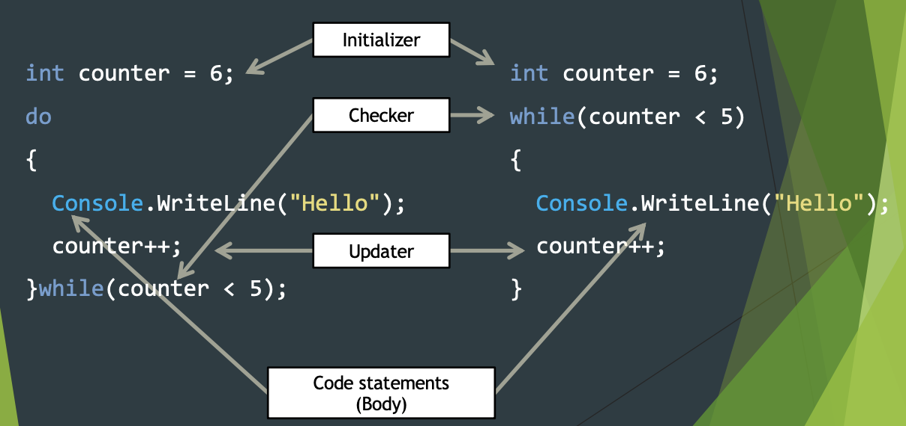

<!-- 

📋 This is my note-taking from what I learned in the c# tutorials!

- Reference link: Taken from “Introducing Visual Studio 2010” pg. 61
  

<div class="notice--danger">{{ notice-2 | markdownify }}</div> -->

📋 This is my note-taking from what I learned in the class "Programming 1 - COMP 100-002"
{: .notice--danger}

<br>

## Control Structures

- Sequence &rarr; Prev
- Conditional &rarr; Prev
- Looping &rarr; Current
- Method

<br>

## What is a Loop?

Looping / Iteration / Repetition

Provides the structure to process a statement of a block of statements zero or more times.

- Loops can execute a block of code as long as a specified condition is reached.
- Loops are handy because they save time, reduce errors, and they make code more readable.
- Avoid re-writing the same code/logic.
- Enable the construction of some programs that would otherwise be logistically improbable.
  : Example: Summing the number less than one million

### <u>Three parts in a Loop</u>

- Initializer
  : Setup the counter, the incrementor, or accumulator
- Updater
  : Very important
- Checker
  : This is the only way to terminate the loop

<br>

## Anatomy of an abstract loop



<br>

## Control flow in an abstract loop



<br>

## C# While Loop

The while loop loops through a block of code as long as a specified condition is True:

### <u>Syntax</u>

```
<<initializer>>;

while (<<checker>>)
{
  code statements
  code statements

  <<updater>>;
}
```

### <u>Example</u>

The code in the loop will run, over and over again, as long as a variable (i) is less than 5:

```
int counter = 0;

while (counter < 5)
{
  Console.WriteLine("Hello");

  counter++;
}
// Output:
Hello
Hello
Hello
Hello
Hello
```

Note: Do not forget to increase the variable used in the condition, otherwise the loop will never end!
{: .notice--info}

<br>

## C# Do/While Loop

The do/while loop is a variant of the while loop. This loop will execute the code block once, before checking if the condition is true, then it will repeat the loop as long as the condition is true.

- Provide the structure to process a statement of a block of statements multiple times.
- Avoid re-writing the same code /logic.
- Enable the construction of some programs that would otherwise be impossible to do.
  : Example: Adding the user input until the sum just exceeds 100

### <u>Control flow in a Do-while loop</u>



### <u>Syntax</u>

```
<<initializer>>; // -> code statements to prepare for the loop

do
{
  code statements
  code statements

  <<updater>>; // -> for value of the checker

} while(<<checker>>); // -> boolean expression
```

### <u>Example</u>

The loop will always be executed at least once, even if the condition is false, because the code block is executed before the condition is tested:

```
int counter = 0;

do
{
  Console.WriteLine("Hello");

  counter++;

} while (counter < 5);
// Output:
Hello
Hello
Hello
Hello
Hello
```

```
int counter = 0;

do
{
  Console.WriteLine("Hello");
  counter = counter + 1;

} while(counter < 5);
```

```
int counter = 1;

do
{
  Console.WriteLine($"{counter} {counter * 12}");
  counter = counter + 1;

} while(counter <= 10);
```

### <u>Example: Counting down</u>

```
int counter = 100;

do
{
  Console.WriteLine(counter);
  counter = counter - 1;

} while(counter > 0);
```

### <u>Example: Using a different increment</u>

```
int start = 50, stop = 80, increment = 10;

do
{
  Console.WriteLine(start);
  start += increment;

} while(start <= stop);
```

### <u>Example: Using an accumulator</u>

```
int start = 50, stop = 80, sum = 0;

do
{
  sum = sum + start;
  start = start + 1;

} while(start < stop);
```

### <u>Example: Using a filter</u>

```
int start = 50, stop = 20;

do
{
  if(start % 3 == 0)
  {
    Console.WriteLine(start);
    //start = start - 1; //what will this do?
  }

  start = start - 1;

} while(start > stop);
```

### <u>Example: Using a flag instead of a counter</u>

```
int sum = 0;
bool toContinue = true;

do
{
  Console.Write("Enter a positive number: ");
  int number = Convert.ToInt32(Console.ReadLine());

  if(number >= 0)
  {
    sum = sum + number;
  }
  else
  {
    toContinue = false;
  }

} while(toContinue);

Console.WriteLine("The sum of the numbers is {0}", sum);
```

<br>

## Why loops?

- Add readability to your code
  : The body is distinct from the rest of the code
- You write less code
  : So you are less likely to introduce errors in your code



📋 This is my note-taking from what I learned in the c# tutorials!

- Must have some way of terminating the loop:
  : - Counter
  : - Flag, Trigger, Sentinel
- "Continue and break statement" also affects control in a loop
  

<div class="notice--info">{{ notice-2 | markdownify }}</div>

<br>

## String Interpolation

- The $ character identifies a string literal as an interpolated string.
- An interpolated string is a literal that might contain interpolation expressions.
- This technique provides a more readable and convenient syntax to format strings.

> - In this course this is the only accepted way to output values.
> - Concatenation will be penalized e.g. Console.Write("Cost is " + cost);
> - Placeholders also will be penalized e.g. Console.Write("Cost is {0:C}", cost);

### <u>Goal of String Interpolation</u>

1. Aligning columns
   : - Left alignment
   : - Right alignment
2. Format specifiers
   : - Using D
   : - Using C
   : - Using F
   : - Using N
   : - Using E

<br>

## Structure of an interpolated string

```
{interpolationExpression[,<alignment>][:formatString]}
```

- InterpolatedExpression: The expression that produces a result to be formatted.
- Alignment: A value that defines the minimum number of characters in the string representation of the expression.
  : - A positive value the expression is right-aligned.
  : - A negative value the expression is left-aligned
- FormatString: A supported format string.

<br>

## Alignment

- Alignment is specified immediately after the interpolated expression using a comma.
- Negative values indicates left alignment.
- Positive values indicates right alignment.
- When working with columns, you must work from left to right.
  : i.e. align the left-most column, then move onto the 2nd left-most and then to the 3rd left most columns.
- If the alignment value is less that the number of character in the actual format expression, then the alignment value is ignored and this column as well as subsequent columns will be messed up.

### <u>Example: Alignment</u>

```
Console.WriteLine($"|{"Left(-15)",-15}|{"Right(15)",15}|{"Right(15)",15}|");
Console.WriteLine($"|{strA,-15}|{strB,15}|{strC,15}|");
Console.WriteLine($"|{strD,-15}|{strE,15}|{strF,15}|");

// Result
// |Left(-15)      |      Right(15)|      Right(15)|
// |1              |           -123|    123_456_789|
// |0.000_000_129_888_888|   12.988_888_8|     123.98E001|
```

```
Console.WriteLine($"|{"Right(15)",15}|{"Left(-15)",-15}|{"Right(15)",15}|");
Console.WriteLine($"|{strA,15}|{strB,-15}|{strC,15}|");
Console.WriteLine($"|{strD,15}|{strE,-15}|{strF,15}|");

// Result
// |      Right(15)|Left(-15)      |      Right(15)|
// |              1|-123           |    123_456_789|
// |0.000_000_129_888_888|12.988_888_8   |     123.98E001|
```

```
Console.WriteLine($"|{"Right(22)",15}|{"Left(-15)",-15}|{"Right(15)",15}|");
Console.WriteLine($"|{strA,22}|{strB,-15}|{strC,15}|");
Console.WriteLine($"|{strD,22}|{strE,-15}|{strF,15}|");

// Result
// |             Right(22)|Left(-15)      |      Right(15)|
// |                     1|-123           |    123_456_789|
// | 0.000_000_129_888_888|12.988_888_8   |     123.98E001|
```

<br>

## Format specifier

- C# offers multiple ways to format output.
- In this course, we will be using the single letter specifier.
- The specifier may be either an uppercase or a lowercase letter.
- For readability, the uppercase version is preferred!
- By default, most specifiers will display two decimal places.
- To specify other than two decimal places, use an integer modifier immediately after the.
- When removing digits from a number, rounding takes place.

### <u>The integer specifier – D</u>

- This specifier, works "only on integral values."
  : - Program will crash with floating point values.
- Must be used with an integral suffix.
- This suffix indicate the number of digits to be shown in the output.
- If the value has more digits than specified by the suffix, then the value is displayed as normal.
- If the value has less digits than specified by the suffix, then the zero is padded in front of the value.

```
{123_456:D} -> 123456
{123_456:D9} -> 000123456
```

### <u>The currency specifier – C</u>

- The specifier, works on any numeric value (both integer and floating point values).
- It uses the local machine currency settings, to display the value appropriately.
- For integral value, zeros are adding to the end of the displayed output.
- On some system, negative numbers will be displayed in parenthesis.

| Numeric Value         | Currency Specifier | Output          |
| :-------------------- | :----------------- | :-------------- |
| 1                     | with "C1"          | $1.0            |
| -123                  | with "C2"          | ($123.00)       |
| 123_456_789           | with "C0"          | $123,456,789    |
| 1                     | with "C3"          | $1.000          |
| -123                  | with "C4"          | ($123.0000)     |
| 123_456_789           | with "C"           | $123,456,789.00 |
| 0.000_000_129_888_888 | with "C1"          | $0.0            |
| 12.988_888_8          | with "C2"          | $12.99          |
| 123.98E001            | with "C0"          | $1,240          |
| 0.000_000_129_888_888 | with "C3"          | $0.000          |
| 12.988_888_8          | with "C4"          | $12.9889        |
| 123.98E001            | with "C"           | $1,239.80       |

### <u>The floating point specifier – F</u>

- This specifier, works on any numeric value (both integer and floating point values).
- Like the C formatter, it will pad zeros at the end of the output for integers and rounding up values.

| Numeric Value         | Floating Specifier | Output       |
| :-------------------- | :----------------- | :----------- |
| 1                     | with "F1"          | 1.0          |
| -123                  | with "F2"          | -123.00      |
| 123_456_789           | with "F0"          | 123456789    |
| 1                     | with "F3"          | 1.000        |
| -123                  | with "F4"          | -123.0000    |
| 123_456_789           | with "F"           | 123456789.00 |
| 0.000_000_129_888_888 | with "F1"          | 0.0          |
| 12.988_888_8          | with "F2"          | 12.99        |
| 123.98E001            | with "F0"          | 1240         |
| 0.000_000_129_888_888 | with "F3"          | 0.000        |
| 12.988_888_8          | with "F4"          | 12.9889      |
| 123.98E001            | with "F"           | 1239.80      |

### <u>The specifier – N</u>

- This specifier, works on any numeric value (both integer and floating point values).
- It works identical to the F. Except, it inserts comma separators for groups of three digits.

| Numeric Value         | N Specifier | Output         |
| :-------------------- | :---------- | :------------- |
| 1                     | with "N1"   | 1.0            |
| -123                  | with "N2"   | -123.00        |
| 123_456_789           | with "N0"   | 123,456,789    |
| 1                     | with "N3"   | 1.000          |
| -123                  | with "N4"   | -123.0000      |
| 123_456_789           | with "N"    | 123,456,789.00 |
| 0.000_000_129_888_888 | with "N1"   | 0.0            |
| 12.988_888_8          | with "N2"   | 12.99          |
| 123.98E001            | with "N0"   | 1,240          |
| 0.000_000_129_888_888 | with "N3"   | 0.000          |
| 12.988_888_8          | with "N4"   | 12.9889        |
| 123.98E001            | with "N"    | 1,239.80       |

### <u>The scientific notation – E</u>

- This specifier, works on any numeric value (both integer and floating point values).
- Uses exponents in the display.
- This is the only way very large numbers of value very close to zero can be displayed.

| Numeric Value         | Scientific Notation Specifier | Output        |
| :-------------------- | :---------------------------- | :------------ |
| 1                     | with "E1"                     | 1.0E+000      |
| -123                  | with "E2"                     | -1.23E+002    |
| 123_456_789           | with "E0"                     | 1E+008        |
| 1                     | with "E3"                     | 1.000E+000    |
| -123                  | with "E4"                     | -1.2300E+002  |
| 123_456_789           | with "E"                      | 1.234568E+008 |
| 0.000_000_129_888_888 | with "E1"                     | 1.3E-007      |
| 12.988_888_8          | with "E2"                     | 1.30E+001     |
| 123.98E001            | with "E0"                     | 1E+003        |
| 0.000_000_129_888_888 | with "E3"                     | 1.299E-007    |
| 12.988_888_8          | with "E4"                     | 1.2989E+001   |
| 123.98E001            | with "E"                      | 1.239800E+003 |

<br>

## Do-While and While statements

The output for the below loops are identical.
{: .notice--info}

```
int counter = 0;

while (counter < 5)
{
  Console.WriteLine("Hello");

  counter++;
}
// Output:
Hello
Hello
Hello
Hello
Hello
```

```
int counter = 0;

do
{
  Console.WriteLine("Hello");

  counter++;

} while (counter < 5);
// Output:
Hello
Hello
Hello
Hello
Hello
```

<br>

## Different kinds of Loops

- Do-while (post-test loop)
- While (pre-test loop)
- For (pre-test loop)
- Foreach (iterator for collections)

### <u>Post-test loops vs Pre-test loops</u>



- The output for the below loops is NOT identical.
- In the do-while loop, the body is processed before reaching the assertion.
- In the while loop, the assertion is checked before the body is processed.
  

<div class="notice--info">{{ notice-2 | markdownify }}</div>

```
[Do-While Loop]

int counter = 6;

do
{
  Console.WriteLine("Hello");
  counter++;

} while(counter < 5);
// Output:
Hello
```

```
[While Loop]

int counter = 6;

while(counter < 5)
{
  Console.WriteLine("Hello");
  counter++;
}
// Output:
No result
```

<br>

## Common semantics in all loops



<br>

## C# For Loop

When you know exactly how many times you want to loop through a block of code, use the "for loop" instead of a "while loop":

### <u>Syntax</u>

```
for (<<initializer>>; <<checker>>; <<updater>>)
{
  code statements
  code statements
}
```

- "initializer" is executed (one time) before the execution of the code block.
- "checker" defines the condition for executing the code block.
- "updater" is executed (every time) after the code block has been executed.

### <u>Example 1</u>

The loop variable is local to the loop and is not accessible outside of the curly braces.

```
for(int counter = 0; counter < 5; counter++)
{
  Console.WriteLine("Hello");
}
```

### <u>Example 2</u>

The example below will print the numbers 0 to 4:

```
for (int i = 0; i < 5; i++)
{
  Console.WriteLine(i);
}
// Output:
0
1
2
3
4
```

- "initializer" sets a variable before the loop starts (int i = 0).
- "checker" defines the condition for the loop to run (i must be less than 5). If the condition is true, the loop will start over again, if it is false, the loop will end.
- "updater" increases a value (i++) each time the code block in the loop has been executed.

### <u>Example 3</u>

This example will only print even values between 0 and 10:

```
for (int i = 0; i <= 10; i = i + 2)
{
  Console.WriteLine(i);
}
// Output:
0
2
4
6
8
10
```

### <u>All three part of the header are optional</u>

```
int counter = 0; //initializer

for(; ;)
{
  Console.WriteLine("Hello");

  counter++; //updater

  if(counter > 5) //checker
  {
    break;
  }
}
```

### <u>A little bit about scoping</u>

```
for(int counter = 0, sum = 0; counter < 5; counter++)
{
  Console.WriteLine("Hello");
  sum += counter;
  Console.WriteLine($"{sum}");
}
// Output:
Hello
0
Hello
1
Hello
3
Hello
6
Hello
10
```

&rarr; What happens if we move "sum" outside of the loop? How to fix? See the below code for solution.
{: .notice--info}

```
int sum = 0;

for(int counter = 0; counter < 5; counter++)
{
  Console.WriteLine("Hello");
  sum += counter;
}

Console.WriteLine($"{sum}");
// Output:
Hello
Hello
Hello
Hello
Hello
10
```

&rarr; Sum is now available inside as well as outside of loop.
{: .notice--info}

<br>

## Nested Loops

It is also possible to place a loop inside another loop. This is called a nested loop.

The "inner loop" will be executed one time for each iteration of the "outer loop":

```
// Outer loop
for (int i = 1; i <= 2; ++i)
{
  Console.WriteLine("Outer: " + i);  // Executes 2 times

  // Inner loop
  for (int j = 1; j <= 3; j++)
  {
    Console.WriteLine(" Inner: " + j); // Executes 6 times (2 * 3)
  }
}
// Output:
Outer: 1
 Inner: 1
 Inner: 2
 Inner: 3
Outer: 2
 Inner: 1
 Inner: 2
 Inner: 3
```

<br>

## C# Foreach Loop

There is also a "foreach loop", which is used exclusively to loop through elements in an array:

### <u>Syntax</u>

```
foreach (type variableName in arrayName)
{
  // code block to be executed
}
```

### <u>Example</u>

The following example outputs all elements in the cars array, using a foreach loop:

```
string[] cars = {"Volvo", "BMW", "Ford", "Mazda"};
foreach (string i in cars)
{
  Console.WriteLine(i);
}
// Output:
Volvo
BMW
Ford
Mazda
```

<br>

## Which is the best loop?



- All the loops are inter-changeable
- Sometimes it is more convenient to use one form over the other
  : - do-while loop always process the body once
  : - for loop is very compact form
  : - while loop good when working with indeterminate loops
- The best loop is the one that you are most comfortable with!!
  

<div class="notice--info">{{ notice-2 | markdownify }}</div>

<br>

---

<br>

    🖋️ This is my self-taught blog! Feel free to let me know
    if there are some errors or wrong parts 😆

[Back to Top](#){: .btn .btn--primary }{: .align-right}
