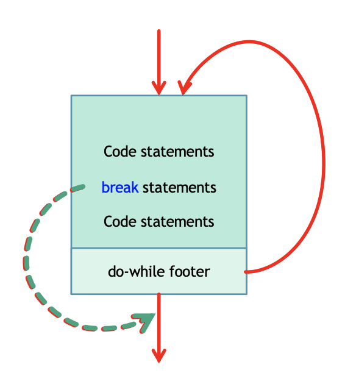
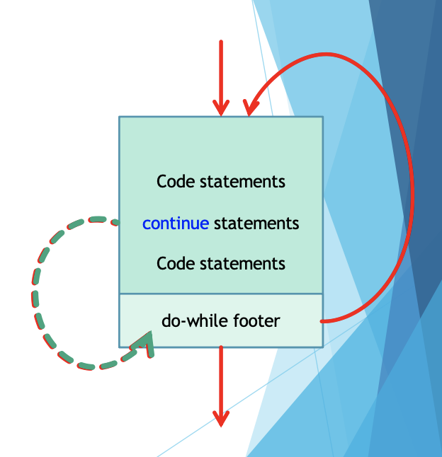

<!-- 

📋 This is my note-taking from what I learned in the c# tutorials!

- Reference link: Taken from “Introducing Visual Studio 2010” pg. 61
  

<div class="notice--danger">{{ notice-2 | markdownify }}</div> -->

📋 This is my note-taking from what I learned in the class "Programming 1 - COMP 100-002"
{: .notice--danger}

<br>

## Controlling the normal flow of execution of a loop

- Break
- Continue
- Return
- Goto &rarr; Later
- Throw &rarr; Later

<br>

## Loops

All loops have three semantic parts: initializer, checker and the updater.

- When the checker fails, the loop is terminated and control goes out from the loop to the statement immediately below the loop body.
- In addition to the checks that control flow, you may affect flow yourself.

<br>

## C# Break: Modifying control flow in loops



You have already seen the "break" statement used in an earlier chapter of this tutorial. It was used to "jump out" of a "switch" statement.

The break statement can also be used to jump out of a loop.

- Whenever the break statement is encountered in a loop body, it immediately terminate further processing and exits the body of the loop.
- Useful when you want to terminate an indefinite loop
- If the break statement is encountered in a nested loop, then that particular loop is terminate and the outer loop remains operational.

### <u>Example 1</u>

This example jumps out of the loop when i is equal to 4:

```
for (int i = 0; i < 10; i++)
{
  if (i == 4)
  {
    break;
  }
  Console.WriteLine(i);
}
// Output:
0
1
2
3
```

### <u>Example 2: Break with Do-While Loop</u>

```
int sum = 0, counter = 0, stop = 25, mark;

do
{
  Console.Write($"Enter marks #{counter + 1}: ");
  mark = Convert.ToInt32(Console.ReadLine());

  if(mark < 0)
  {
    break;
  }

  sum += mark;
  counter++;

} while(counter < stop);

Console.WriteLine($"Total of {counter} marks is {sum}");

// Output:
Enter marks #1: 3
Enter marks #2: 5
Enter marks #3: 20
Enter marks #4: 19
Enter marks #5: -2 // break point!
Total of 4 marks is 47
```

### <u>Example 3: Break with While Loop</u>

```
int sum = 0, counter = 0, mark;

while(true)
{
  Console.Write($"Enter marks #{counter + 1}: ");
  mark = Convert.ToInt32(Console.ReadLine());

  if(mark < 0)
  {
    break;
  }

  sum += mark;
  counter++;
}

Console.WriteLine($"Total of {counter} marks is {sum}");

// Output:
Enter marks #1: 20
Enter marks #2: 30
Enter marks #3: 50
Enter marks #4: -23
Total of 3 marks is 100
```

```
int i = 0;

while (i < 10)
{
  Console.WriteLine(i);
  i++;

  if (i == 4)
  {
    break;
  }
}
// Output:
0
1
2
3
```

<br>

## C# Continue: Modifying control flow in loops



The "continue" statement breaks one iteration (in the loop), if a specified condition occurs, and continues with the next iteration in the loop.

- Whenever the continue statement is encountered, it skips the rest of the body, and continues to the next check.
  : - In a do-while loop, it is at the end.
  : - In a while or for loop, it is at the beginning.
- If your loop updater is after the continue statement as could be the case in a Do-While or While loop … there might be problems.

### <u>Example 1</u>

This example skips the value of 4:

```
for (int i = 0; i < 10; i++)
{
  if (i == 4)
  {
    continue;
  }
  Console.WriteLine(i);
}
// Output:
0
1
2
3
5
6
7
8
9
```

### <u>Example 2: Continue with While Loop</u>

```
int i = 0;

while (i < 10)
{
  if (i == 4)
  {
    i++;
    continue;
  }

  Console.WriteLine(i);
  i++;
}
// Output:
0
1
2
3
5
6
7
8
9
```

### <u>Example 3: Continue with For Loop</u>

```
int sum = 0, stop = 100;

for(int i = 0; i < stop; i++)
{
  if(i % 7 == 0)
  {
    continue; //updating the sum is skipped
  }
  sum += i;
}

Console.WriteLine($"The sum is {sum}");

// Output:
The sum is 4215
```

### <u>Example 4: Continue with Do-While Loop</u>

```
int sum = 0, stop = 100;
int i = 0;

do
{
  i++; //better place to put the updater

  if(i % 7 == 0)
  {
    continue;
  }
  //Console.WriteLine($"{i}"); //show all the numbers used for sum
  sum += i;
  //i++; //bad place to put the updater

} while (i < stop);

Console.WriteLine($"The sum is {sum}");

// Output:
The sum is 4315
```

<br>

## C# Return

- The return statement is more drastic than the break and the continue statements.
- It terminates the loop, in fact all the loops are terminated and it even terminate the current method.

<br>

## Summary



In addition to the checker expression that is a part of every loop statement, you can also affect control flow by the following statements:

- Continue
  : When this statement is encountered, the rest of the loop body is skipped and processing resumes at the start of the loop
- Break
  : When this statement is encountered, the loop body is terminated
- Return
  : When this statement is encountered, the method is terminated (more on this in the third part of this course)
  

<div class="notice--info">{{ notice-2 | markdownify }}</div>

<br>

---

<br>

    🖋️ This is my self-taught blog! Feel free to let me know
    if there are some errors or wrong parts 😆

[Back to Top](#){: .btn .btn--primary }{: .align-right}
