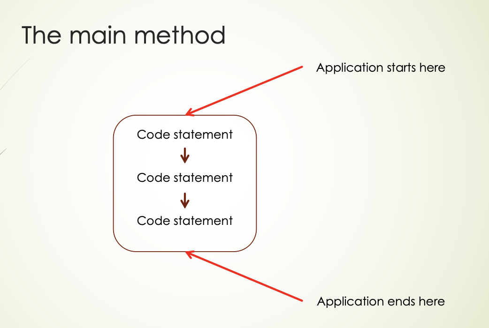
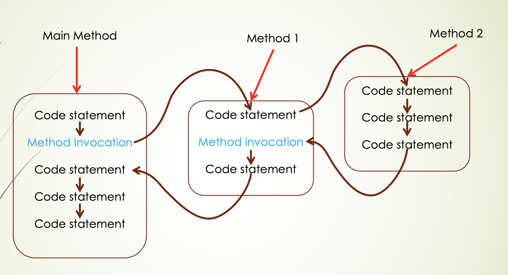

<!-- 

📋 This is my note-taking from what I learned in the c# tutorials!

- Reference tutorials link: <https://www.w3schools.com/cs/index.php>
  

<div class="notice--danger">{{ notice-2 | markdownify }}</div> -->

📋 This is my note-taking from what I learned in the class "Programming 1 - COMP 100-002"
{: .notice--danger}

<br>

## Control Structures

- Sequence &rarr; Prev
- Conditional &rarr; Prev
- Looping &rarr; Prev
- Method v

<br>

# C# Methods

A method is a block of code which only runs when it is called. You can pass data, known as parameters, into a method. Methods are used to perform certain actions, and they are also known as functions. Why use methods? To reuse code: define the code once, and use it many times.

<u>Method/Functions/Procedures/Subs</u>

- Provides the structure to packet a statement or a block of statements as a single unit.
- This unit can then be invoked anywhere that logic is needed .
- Avoids re-writing the same code /logic.
- Enables the re-use of code.
- Vendors can package code into libraries and sell the resulting libraries.

<u>Methods</u>

- Methods are like mini programs.
- Can require inputs ( parameters).
- Can give only a single output (return a single value).
  : - This is a setback that we will overcome later.
- Can declare internal variables (local variables).
- Can use external variables (global variables).
  : - Global variables are easier to work with but it is consider a bad practice.

## Method Diagrams





<br>

## Control Flow

- Control follows normally as per sequence or conditional or looping.
- When a statement invocation is encountered, control is transferred to that method.
- When the last statement of the method is processed, control returns to the statement just below (that called it) to resume processing.
- If a method calls a method, which in turns calls another method, the same techniques is used.
- The previous slide illustrate this transfer of control.

<br>

## Built-in Methods

<u>These are methods that are available as part of the .NET framework</u>

- Console &rarr; Write, WriteLine, ReadLine
- Convert &rarr; ToInt32, ToDouble,
- Math &rarr; Sqrt, Sin, Cos, Tan, Log, Pow

<u>It is advantageous to use built-in methods</u>

- You don’t need to write any code. It is free.
- It is thoroughly tested by 100, 000’s of users. It bug free.

<br>

## Why Methods?

- Complex tasks can be broken down into simpler sub-tasks.
- Sub-tasks can be solved and tested individually.
  : - You have more confidence that the solution is more complete.
- The resulting sub-systems can be combined to build a larger application.
- Add readability to your code.
  : - You only need to understand a short block of code rather than upwards of 50 lines of code.
- Coding tasks can be farmed out to multiple coders
- Add modularity to your system.

<br>

## Anatomy

<u>Head</u>

- This is the first line of the method.
- It indicates how to use the method.
- All headers are unique (called signature) in a program.

<u>Body</u>

- Enclosed within a pair of curly braces.
- The statements to realized the action of the method.

<br>

## The Method Header

```
public static int ToInt32(string s)
```

1. public - optional, has to do with accessibility. Other possibilities are private and protected.
   : - We can safely ignore this token in this course.
2. static - optional, indicates if this is a class method or instance method.
   : - In this course it is mandatory and will always be static.
3. int - mandatory, the type of the return value. This can be any native type or even a user-defines type. If the method does not return a value, this will be void.
4. ToInt32 – mandatory, this is the name of the method. Same rules as normal identifier.
   :- As with all identifiers, try to choose a descriptive name.
   :- Because a method is supposed to do something, you should use a verb phrase &rarr; ex) CalculateTax, GenerateId, CombineNames
5. string s – The is the argument to the method. "s" represents the value that is passed to the method, and string is the type of the value that is passed to the method.
   : - If there are multiple parameters, then each must be preceded by it type. &rarr; ex) (int age, string name, double weight, bool isMarried)
   : - You get to choose the parameter name (make is meaningful).

### <u>Example: Method Header</u>

```
static void DisplayPersonalInformation()
static void DisplayAreaOfCircle(double radius)
static double CalculateTax(double price)
static void PrintNumbers(int row, int col)
static void PrintBlock(int row, int col)
static void PrintLine(int col)
static double CalculateVolumeOfCube(double length, double width, double height)
static double GetVolumeOfCube()
```

### <u>Example: A method that does not require any argument</u>

```
//method definition
//Unlike all the previous control structures, you may not nest method definition
//In C# you can declare a method either before or after the main
//In this course we will declare it after the main

public static void DisplayInstructorInformation()
{
  Console.WriteLine("Seyeon Jo");
  Console.WriteLine("Student");
}

//method invocation in main method
//parenthesis is necessary after the name

DisplayPersonalInformation();
```

### <u>Example: Single argument method</u>

```
public static void DisplayAreaOfCircle(double radius)
{
  double area = Math.PI * radius * radius;
  Console.WriteLine($"A circle with radius {radius:f2} will have an area {area:f2}");
}

//argument (input for the method) is supplied
//you don’t need to specify the data type of the argument when invoking the method

DisplayAreaOfCircle(1.0);
```

```
public static double CalculateTax(double price)
{
  double tax = price * 0.13;
  return tax;
}

double price = 10.00;
double tax = CalculateTax(price);
double cost = price + tax;

Console.WriteLine($"Total cost: {cost:c}");
Console.WriteLine($"Total cost: {price + CalculateTax(price):c}");
Console.WriteLine($"Total cost: {1.56 + CalculateTax(1.56):c}");
```

### <u>Example: Multiple argument method</u>

```
public static double CalculateVolumeOfCube(double length, double width, double height)
{
  return length * width * height;
}

public static double GetVolumeOfCube()
{
  Console.WriteLine("Enter length of cube: ");
  double length = Convert.ToDouble(Console.ReadLine());

  Console.WriteLine("Enter width of cube: ");
  double width = Convert.ToDouble(Console.ReadLine());

  Console.WriteLine("Enter height of cube: ");
  double height = Convert.ToDouble(Console.ReadLine());

  return length * width * height;
}

Console.WriteLine($"Volume of cube: {CalculateVolumeOfCube(5.0, 3.0, 2)}");
Console.WriteLine($"Volume of cube: {GetVolumeOfCube()}");
```

```
public static void PrintNumbers(int row, int col)
{
  for(int j = 0; j < row; j++)
  {
    for(int i = 0;i < col;i++)
    {
      Console.Write("+");
    }
  Console.WriteLine("");
  }
}

int r = 10, c = 5;

PrintNumbers(r, c); //if the user inadvertently exchange rows and cols when calling the method the complier will not be able to catch this.

PrintNumbers(c, r);
```

```
public static void PrintBlock(int row, int col)
{
  for(int j = 0; j < row; j++)
  {
    PrintLine(col);
    Console.WriteLine();
  }
}

public static void PrintLine(int col)
{
  for(int i = 0; i < col; i++)
  {
    Console.Write("+");
  }
}

PrintBlock(10, 5);
```

<br>

## Create a Method

A method is defined with the name of the method, followed by "parentheses ()". C# provides some pre-defined methods, which you already are familiar with, such as "Main()", but you can also create your own methods to perform certain actions:

Create a method inside the Program class:

```
class Program
{
  static void MyMethod()
  {
    // code to be executed
  }
}
```

> Example Explained
>
> - "MyMethod()" is the name of the method
> - "static" means that the method belongs to the Program class and not an object of the Program class. You will learn more about objects and how to access methods through objects later in this tutorial.
> - "void" means that this method does not have a return value. You will learn more about return values later in this chapter

In C#, it is good practice to start with an uppercase letter when naming methods, as it makes the code easier to read.
{: .notice--danger}

<br>

## Call a Method

To call (execute) a method, write the method's name followed by two parentheses () and a semicolon;

In the following example, "MyMethod()" is used to print a text (the action), when it is called:

1. Inside Main(), call the myMethod() method:

   ```
   static void MyMethod()
   {
     Console.WriteLine("I just got executed!");
   }

   static void Main(string[] args)
   {
     MyMethod();
   }

   // Output: "I just got executed!"
   ```

2. A method can be called multiple times:

   ```
   static void MyMethod()
   {
     Console.WriteLine("I just got executed!");
   }

   static void Main(string[] args)
   {
     MyMethod();
     MyMethod();
     MyMethod();
   }

   // I just got executed!
   // I just got executed!
   // I just got executed!
   ```

<br>



- Methods are supposed to solve simple tasks.
- Should be self-contained.
  : - Can have its own variables.
  : - May require (input) arguments.
  : - May return values.
- Can be invoked by its name followed by a pair of parenthesis enclosing any required inputs.
  

<div class="notice--info">{{ notice-2 | markdownify }}</div>

<br>

---

<br>

    🖋️ This is my self-taught blog! Feel free to let me know
    if there are some errors or wrong parts 😆

[Back to Top](#){: .btn .btn--primary }{: .align-right}
