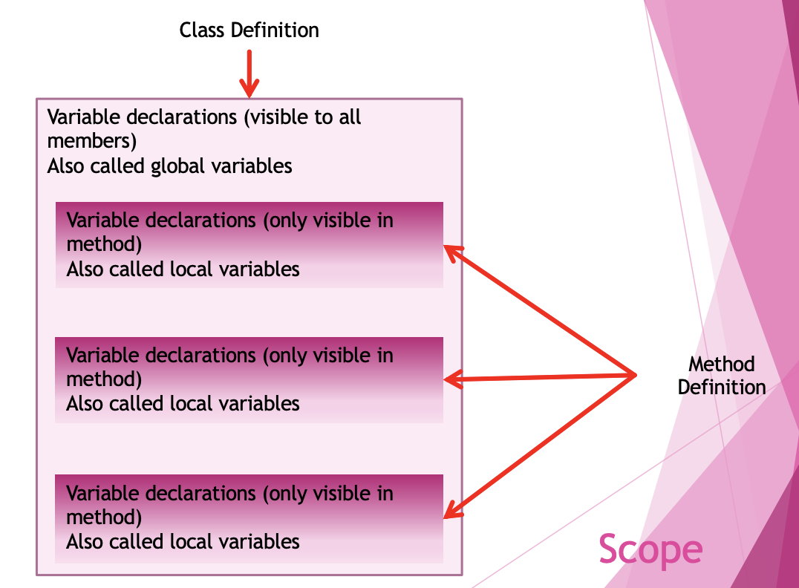

<!-- 

📋 This is my note-taking from what I learned in the c# tutorials!

- Reference tutorials link: <https://www.w3schools.com/cs/index.php>
  

<div class="notice--danger">{{ notice-2 | markdownify }}</div> -->

📋 This is my note-taking from what I learned in the class "Programming 1 - COMP 100-002"
{: .notice--danger}

<br>

## Control Structures

- Sequence &rarr; Prev
- Conditional &rarr; Prev
- Looping &rarr; Prev
- Method v

<br>

# C# Method Parameters

## Parameters & Arguments

Information can be passed to methods as parameter. Parameters act as variables inside the method.

They are specified after the method name, inside the parentheses. You can add as many parameters as you want, just separate them with a comma.

The following example has a method that takes a "string" called "fname" as parameter. When the method is called, we pass along a first name, which is used inside the method to print the full name:

```
static void MyMethod(string fname)
{
  Console.WriteLine(fname + " Refsnes");
}

static void Main(string[] args)
{
  MyMethod("Liam");
  MyMethod("Jenny");
  MyMethod("Anja");
}
// Output:
// Liam Refsnes
// Jenny Refsnes
// Anja Refsnes
```

- When a method is called … the thing that is passed to the method is called an argument or arguments.
  : - When you are calling methods, you talk about argument.
- In the method the thing is received is called a parameter(s).
  : - When you are writing methods, you talk about parameters.

When a parameter is passed to the method, it is called an argument. So, from the example above: fname is a parameter, while Liam, Jenny and Anja are arguments.
{: .notice--info}

## Multiple Parameters

You can have as many parameters as you like, just separate them with commas:

```
static void MyMethod(string fname, int age)
{
  Console.WriteLine(fname + " is " + age);
}

static void Main(string[] args)
{
  MyMethod("Liam", 5);
  MyMethod("Jenny", 8);
  MyMethod("Anja", 31);
}
// Output:
// Liam is 5
// Jenny is 8
// Anja is 31
```

Note that when you are working with multiple parameters, the method call must have the same number of arguments as there are parameters, and the arguments must be passed in the same order.
{: .notice--info}

<br>

# C# Default Parameters

## Default Parameter Value

You can also use a default parameter value, by using the equals sign (=).

If we call the method without an argument, it uses the default value ("Norway"):

```
static void MyMethod(string country = "Norway")
{
  Console.WriteLine(country);
}

static void Main(string[] args)
{
  MyMethod("Sweden");
  MyMethod("India");
  MyMethod();
  MyMethod("USA");
}
// Output:
// Sweden
// India
// Norway
// USA
```

A parameter with a default value, is often known as an "optional parameter". From the example above, country is an optional parameter and "Norway" is the default value.
{: .notice--info}

This makes it easier to use method especially if the methods required multiple arguments and most of the time only a few of them you work with directly.

So you may optionally omit an argument with a default argument. &rarr; To lessen confusion, the optional argument are always to the end of the argument list.

```
static double CalculateFees(int numberOfCourses, double cost = 549.99)
{
  return numberOfCourses * cost;
}

double fees = CalculateFees(5, 549.99);
fees = CalculateFees(6);
fees = CalculateFees(6, 659.99);
```



Param keyword

- This allows you to pass a variable number of arguments to the method.
- You may use this modifier with only one parameter and it must be the last one.
  

<div class="notice--info">{{ notice-2 | markdownify }}</div>

<br>

# C# Return Values

## Return Values

In the previous page, we used the "void" keyword in all examples, which indicates that the method should not return a value.

If you want the method to return a value, you can use a primitive data type (such as "int" or "double") instead of "void", and use the "return" keyword inside the method:

```
static int MyMethod(int x)
{
  return 5 + x;
}

static void Main(string[] args)
{
  Console.WriteLine(MyMethod(3));
}

// Output: 8
```

This example returns the sum of a method's two parameters:

```
static int MyMethod(int x, int y)
{
  return x + y;
}

static void Main(string[] args)
{
  Console.WriteLine(MyMethod(5, 3));
}

// Output: 8
```

You can also store the result in a variable (recommended, as it is easier to read and maintain):

```
static int MyMethod(int x, int y)
{
  return x + y;
}

static void Main(string[] args)
{
  int z = MyMethod(5, 3);
  Console.WriteLine(z);
}

// Output: 8
```

<br>

# C# Named Arguments

## Named Arguments

It is also possible to send arguments with the "key: value" syntax.

That way, the order of the arguments does not matter:

```
static void MyMethod(string child1, string child2, string child3)
{
  Console.WriteLine("The youngest child is: " + child3);
}

static void Main(string[] args)
{
  MyMethod(child3: "John", child1: "Liam", child2: "Liam");
}

// Output: The youngest child is: John
```

- This feature makes it easier for the user to work with a method.
- If you are lots of arguments, using the names of the argument make it easier for code readability.
- You don’t need to remember the order of the parameter.

```
static double CalculateFees(int numberOfCourses, double cost)
{
  return numberOfCourses * cost;
}

double fees = CalculateFees(5, 549.99);
fees = CalculateFees(numberOfCourses: 5, cost: 549.99);
fees = CalculateFees(cost: 549.99, numberOfCourses: 5);
```

<br>

# C# Method Overloading

## Method Overloading

With method overloading, multiple methods can have the same name with different parameters:

```
int MyMethod(int x)
float MyMethod(float x)
double MyMethod(double x, double y)
```

Consider the following example, which have two methods that add numbers of different type:

```
static int PlusMethodInt(int x, int y)
{
  return x + y;
}

static double PlusMethodDouble(double x, double y)
{
  return x + y;
}

static void Main(string[] args)
{
  int myNum1 = PlusMethodInt(8, 5);
  double myNum2 = PlusMethodDouble(4.3, 6.26);
  Console.WriteLine("Int: " + myNum1);
  Console.WriteLine("Double: " + myNum2);
}
```

Instead of defining two methods that should do the same thing, it is better to overload one.

In the example below, we overload the "PlusMethod" method to work for both "int" and "double":

```
static int PlusMethod(int x, int y)
{
  return x + y;
}

static double PlusMethod(double x, double y)
{
  return x + y;
}

static void Main(string[] args)
{
  int myNum1 = PlusMethod(8, 5);
  double myNum2 = PlusMethod(4.3, 6.26);
  Console.WriteLine("Int: " + myNum1);
  Console.WriteLine("Double: " + myNum2);
}
```

Note: Multiple methods can have the same name as long as the number and/or type of parameters are different.
{: .notice--info}

<br>

# C# Scope

## Scope

- This deals with visibility or access of variables.
- A method is like a mini-program.
- You may declare variable inside of them.



```
public class Program {
  static int var_a; //class scope: global variable

  public static void Method_B() {
    int var_b; //method scope: local variable
  }

  public static void Method_C() {
    int var_c; //method scope: local variable

    for(; ;) {
      int var_d; //block scope
      {
        int var_e; //block scope
      }
  }
  }
}
```

```
public class Program {
  static int var_a;

  public static void Method_B() {
    int var_b; //var_a and var_b accessible
  }

  public static void Method_C() {
    int var_c; //var_a and var_c accessible

    for() {
      int var_d; //var_a, var_c and var_d accessible

      {
        int var_e; //var_a, var_c , var_d and var_e accessible
      }
    }
  }
}
```

## Scoping

- What happens when multiple variables with the same name occurs in the same scope?
- The one within the closest scope prevails.
- It is good practice to avoid name clashes when declaring local variables.
  : - The compiler enforces unique name declaration.
- It is impossible to access a variable that is declare in another scope such as another method.



- Argument is the thing that you send to a method.
- Parameter is the thing that the method gets.
- Variable may be declared in either of three scopes: global, local or block.
- You should declare variables in the smallest block allowable.
- Avoid global scope.
  : - Although it is less complicated to use.
  : - Any code with access can mutate the variable.
  

<div class="notice--info">{{ notice-2 | markdownify }}</div>

<br>

# C# ref and out

## The "ref" and "out" keyword

- These two modifiers are used to decorate the parameters in the method definition.
- It tells the method to expect the real variables instead of copies of the variables.
- When the method is called the modifier must also be used to decorate the arguments, so that the actual variables are sent.

<u>Using the ref keyword</u>

```
public static void Main()
{
  int var_a = 5; //ref parameters must be initialize
  Console.WriteLine($"Before method call {var_a}");
  Twice(ref var_a); //note the ref keyword
  Console.WriteLine($"After method call {var_a}");
}

public static void Twice(ref int a) //note the ref keyword
{
  a *= 2;
  Console.WriteLine($"In method call {a}");
}
```

<u>Using the out keyword</u>

```
public static void Main(){
  double radius = 1, area, volume;
  CalAreaVol(radius, out area, out volume); //out modifier specified
  Console.WriteLine("Radius: {radius:f2}, area: {area:f2}, volume: {volume:f2}");
}

static void CalAreaVol(double r, out double a, out double v) //out modifier
{
  a = 4 * Math.Pi * r * r; //out parameter must be initialized
  v = 4 * Math.Pi * r * r * r / 3; //out parameter must be initialized
}
```



- Allow the callee to mutate the ref or out parameter.
- When ref is used the variable must be initialized before the method is called.
- When out is used the method must initialized the variable before the callee returns.
- Method assumes an out parameter DOES not have a value, so you must assign a value before the method ends.
  

<div class="notice--info">{{ notice-2 | markdownify }}</div>

<br>

## Some special methods

- Main
  : - This identifies the starting point of your program
  : - There is only one Main method
- Constructor
  : - A method that has the same name as the class
  : - Maybe overloaded
  : - Called with a class is instantiated
- ToString
  : - A method that is called when you try to print an object of the class



Why Methods?

- It is difficult to imagine a program without more than one method.
- It gives you confidence that your application has minimum errors, so your code would not break easily.
- It is an integral component of the OOP paradigm.
  

<div class="notice--info">{{ notice-2 | markdownify }}</div>

<br>

---

<br>

    🖋️ This is my self-taught blog! Feel free to let me know
    if there are some errors or wrong parts 😆

[Back to Top](#){: .btn .btn--primary }{: .align-right}
