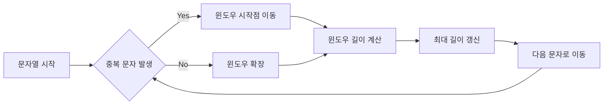

## LeetCode 3rd: Longest Substring Without Repeating Characters

이 글에서는 LeetCode의 대표적인 문제 중 하나인 **“3. Longest Substring Without Repeating Characters”** 를 다룹니다.

이 문제는 면접에서 빈번히 등장하며, 문자열 처리 및 슬라이딩 윈도우(Sliding window) 기법을 활용하는 좋은 예제라고 생각합니다.

#### 문제 이해하기

주어진 문자열에서 **중복 문자가 없는** 가장 긴 부분(substring)의 길이를 찾는 문제 입니다.

**부분 문자열(substring)**이란, 문자열에서 연속된 문자로 이루어진 일부분을 의미합니다.

**_예시_**

-   입력: `"abcabcbb"` → 출력: `3` (`"abc"`)
-   입력: `"bbbbb"` → 출력: `1` (`"b"`)
-   입력: `"pwwkew"` → 출력: `3` (`"wke"`)
여기서 주의할 점은 "pwke"는 순서가 유지되지 않으므로 **부분 문자열(substring)** 이 아니라 **부분 수열(subsequence)** 에 해당 됩니다.

#### 문제 해결 및 전략
이 문제를 효과적으로 해결하는 가장 직관적인 방법은 **슬라이딩 윈도우(Sliding window)** 기법을 사용하는 것입니다.
슬라이딩 윈도우는 중복되지 않는 문자의 범위를 효율적으로 관리할 수 있습니다.
특히, 해시맵(딕셔너리)을 사용하여 각 문자의 가장 최근 위치를 기억하면 더욱 빠르게 처리할 수 있습니다.

#### 알고리즘 설계
1. 두 개의 포인터(`start`, `end`)로 윈도우의 범위를 정의 합니다.
2. 문자와 해당 문자의 마지막 등장 위치를 저장할 딕셔너리를 생성합니다.
3. 문자열을 순회하여 다음을 수행합니다:
- 문자가 이미 딕셔너리에 있고, 윈도우 범위 내에 있다면, 윈도우 시작점을 해당 문자의 바로 다음 위치로 이동합니다.
- 윈도우의 길이를 계산하여 최대 길이를 갱신합니다.
- 문자의 위치를 딕셔너리에 갱신합니다.

#### 알고리즘 다이어그램

#### Python3 Code
```python
#python3
#3rd Longest Substring Without Repeating Characters

class Solution:
    def lengthOfLongestSubstring(self, s: str) -> int:
        # 각 문자의 가장 최근 등장 인덱스를 저장할 딕셔너리
        char_dict = {}
        
        # 지금까지 발견한 중복 없는 가장 긴 부분 문자열의 길이
        max_length = 0
        
        # 현재 검사 중인 윈도우(중복 없는 부분 문자열)의 시작 인덱스
        start = 0

        # 문자열을 순회하면서 각 문자와 그 인덱스를 처리
        for end, char in enumerate(s):
            # 현재 문자가 이미 딕셔너리에 있고, 현재 윈도우 내에 있는 경우 (중복 문자 발견)
            if char in char_dict and start <= char_dict[char]:
                # 윈도우의 시작점을 중복된 문자 다음 위치로 이동시켜 중복을 제거
                start = char_dict[char] + 1
            
            # 현재 윈도우의 길이(end-start+1)와 지금까지의 최대 길이를 비교하여 갱신
            # else 조건이 없어도 되는 이유: 중복이 있든 없든 매번 최대 길이를 확인해야 함
            max_length = max(max_length, end - start + 1)
            
            # 현재 문자의 인덱스를 딕셔너리에 저장/갱신
            # 이후 같은 문자가 나타났을 때 중복 여부를 확인하는 데 사용
            char_dict[char] = end

        # 찾은 가장 긴 부분 문자열의 길이 반환
        return max_length
        
```
#### 코드 상세 설명
- `char_dict`: 각 문자가 마지막으로 나타난 위치를 저장하는 딕셔너리입니다.
- `start`와 `end`: **슬라이딩 윈도우(Sliding window)** 의 시작과 끝을 나타내는 포인터입니다.
- 슬라이딩 윈도우 이동:
		-	만약 현재 문자가 윈도우 내에 있다면, 중복을 피하기 위해 윈도우 시작을 한 칸 앞으로 이동시킵니다.
		-	최대 길이를 항상 갱신하여 유지합니다.
예를 들어, 문자열 `\"abcbd"\`를 처리하면 다음과 같은 과정으로 진행을 합니다.

| 문자 | 상태                                  | 윈도우 길이 | 최대 길이 |
|------|---------------------------------------|-------------|-----------|
| a    | {a:0}, start=0                        | 1           | 1         |
| b    | {a:0, b:1}, start=0                   | 2           | 2         |
| c    | {a:0, b:1, c:2}, start=0              | 3           | 3         |
| b    | {a:0, b:3, c:2}, start=2 (b중복 처리) | 2           | 3         |
| d    | {a:0, b:3, c:2, d:4}, start=2         | 3           | 3         |
최종 결과는 **`3`** 입니다.

#### 시간 및 공간 복잡도
- 시간 복잡도: `0(n)` - 문자열을 한 번만 순회 합니다.
- 공간 복잡도: `0(min(m,n))`-`m`은 문자 집합의 크기이며, 일반적으로 **문자 종류가 많이 않을 때** 효율적입니다.

#### LeetCode 성능

이 알고리즘은 LeetCode에서 다음과 같은 성능을 보입니다.

-   런타임 성능: **13 ms** (상위 **87.14%**)
    
-   메모리 효율성: **18.04 MB** (상위 **12.54%**)


#### 결론
**"Longest Substring Without Repeating Characters"** 문제는 슬라이딩 윈도우와 해시맵을 활용하여 효율적으로 해결할 수 있는 문제입니다. 이 문제를 통해 문자열 처리 알고리즘에 대한 깊은 이해와 최적화 전략을 학습할 수 있습니다. 슬라이딩 윈도우 기법은 유사한 다른 문제들에도 광범위하게 적용할 수 있는 유용한 알고리즘입니다.