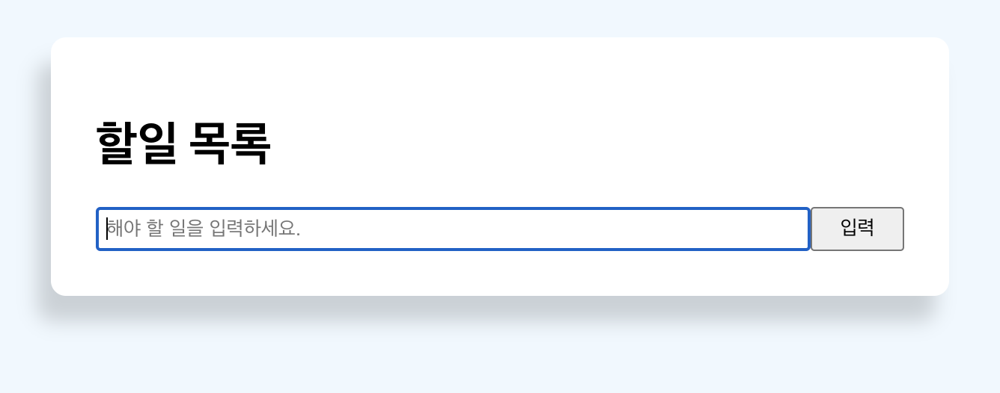

## ToDo로 알아보는 Class문법

react class는 자바스크립트 class와 유사하다. 즉, 자바스크립트 class형을 이해하고있으면 어려울게 없다.

먼저 간단하게, 흔한 투두리스크로 연습을 해보자.

#### UI




```js
// App.js

import React, {Component} from 'react';


export default class App expends Component {
  
  btnStyle = {
    color: "#fff",
    border: "none",
    padding: "5px 9px",
    borderRadius: "50%",
    cursor: "pointer",
    float: "right",
  };
  
   getStyle = () => {
    return {
      padding: "10px",
      borderBottom: "1px #ccc dotted",
      textDecoration "none",
    };
  };

render() {
    return (
    	 <div className="container">
        <div className="todoBlock">
          <div className="title">
            <h1>할일 목록</h1>
          </div>
            return (
              <div style={this.getStyle(item.completed)} key={item.id}>
                <input
                  type="checkbox"
                  defaultChecked={false}
                />
                {item.content}
                <button
                  style={this.btnStyle}
                >
                  x
                </button>
              </div>
   <form style={{ display: "flex" }}>
            <input
              type="text"
              name="value"
              style={{ flex: "10", padding: "5px" }}
              placeholder="해야 할 일을 입력하세요."
              value={this.state.value}
            />
            <input
              type="submit"
              style={{ flex: "1" }}
              className="btn"
              value="입력"
            />
          </form>

        </div>
      </div>
    )
  }
}
```

- 리액트의 컴포넌트를 사용하여 App컴포넌트를 확장시켜준다.

- Class에서는 render함수를 호출해야 랜더링됩니다.

- 랜더링 해줄 리턴값을 리턴문안에 작성합니다. 즉 jsx문법을 포함한 뼈대를 그린다.


위와같이 할일목록을 지정하는 title box와 할일목록을 입력하는 인풋박스가 생성됩니다.

여기서 getStyle과 btnStyle을 return문안에 this로 연결해주고 있습니다. (this 자세히알아보기)


### **Map** 메소드를 사용한 할 일 목록 나열

```js
export default class App expends Component {
  
 // ...생략
 todoLists = [{
   id : 1,
   todo : "공부하기"
 }, {
   id : 2,
   todo : "서핑하기"
 }]

render() {
  return {
    // ..생략
       </div>

          {this.todoLists.map((item) => {
            return (
              <div style={this.getStyle()} key={item.id}>
                <input
                  type="checkbox"
                  defaultChecked={false}
                />
                {item.content}
                <button
                  style={this.btnStyle}                
                >
                  x
                </button>
              </div>
            );
          })}         
   // ..생략    
    
  }
}
```

- 이렇게 todoLists를 맵 메소드를 사용해서 데이터를 나열할수 있습니다.

- 배열의 수가 2개이므로 2번 맵핑이 돌면서 각각 리스트들이 생성됩니다.

- 맵을 사용하면 key값을 제공해야합니다. 

  <details> <summary>key 값을 넣지않는다면?</summary> <div markdown="1">  Warning: Each child in an array or iterator should have a unique "key" prop ...같은 오류가 생깁니다.  </div> </details>


### JSX Key 속성은 무엇인가?

리액트에서 요소의 리스트를 나열할 때는 Key를 넣어줘야합니다.

키는 React가 변경, 추가 또는 제거된 항목을 식별하는 데 도움이 됩니다. 요소에 안 정적인 ID를 부여하려면 배열 내부의 요소에 키를 제공해야 합니다.


### 리액트는 가상 돔을 이용해서 바뀐 부분만 실제 돔에 적용

이는 리액트가 가상돔을 사용할때 중요한 부분입니다. 

가상 돔을 이용해서 바뀐 부분만 실제 돔에 적용해준다고 했습니다.

리액트에서는 리스트를 나열할 때 바뀐 부분만 찾을 때 어떻게 할까요?

**key**를 이용해서 어떠한 부분이 바뀌었는지 인식할 수 있습니다


```js
{/* before */}
<ul>
  <li>1 </li>
	<li>2 </li>
</ul>

{/* after */}
<ul>
  <li>1</li>
	<li>2</li>
	<li>3</li>
</ul>
```

3번을 1,2번 뒤에추가할때는 React에서 3번만 추가하면 된다고 인식합니다.

위와같은 경우는 문제가 없이 동작합니다.


```js
{/* before */}
<ul>
  <li>1 </li>
	<li>2 </li>
</ul>

{/* after */}
<ul>
  <li>3</li>
	<li>1</li>
	<li>2</li>
</ul>
```

3번을 1,2번 앞에 추가할 때는 React의 모든요소가 새롭게 변경된거라 인식하고

모든 자식 엘리먼트를 새롭게 그려버립니다.

이경우, key를 추가해서 1,2번을 새롭게 그리는 것이 아닌 3번을 추가 후

1,2번은 자리만 이동해줍니다.


#### **key**에는 유니크한 값을 넣어줍니다**.(index**는 비추천**!)**

index도 0부터 시작해서 유니크한 값을 가지지만 만약 리스트가 추가되거나 제거되면 해당 리스트들의 key값도 바뀌게 됩니다


```js
{/* before */}
<ul>
  <li key={0}>1 </li>
	<li key={1}>2 </li>
</ul>

{/* after */}
<ul>
  <li key={0}>3</li>
	<li key={1}>1</li>
	<li key={2}>2</li>
</ul>
```

새로 맨앞에 들어온 리스트가 그 전에 있던 index를 key값으로 가져서 이러한 현상이 일어납니다.


### **Filter** 메소드를 사용해서 할 일 목록 지우기

할일 목록 삭제버튼을 클릭해서 목록을 삭제해보자.


```js
// 생략

 handleClick = (id) => {
    const deleteTodoList = this.todoLists.filter(
      (item) => item.id !== id
    );
  };
		  render() {
			return (

        {this.state.todoLists.map((item) => {
            return (
              <div style={this.getStyle()} key={item.id}>
                <input
                  type="checkbox"
                  defaultChecked={false}                 
                />
                {item.content}
                <button
                  style={this.btnStyle}
                  onClick={() => this.handleClick(item.id)}
                >
                  x
                </button>
              </div>
            );
          })}
          // ...생략
  )
}
```


- button을 클릭할때 해당하는 리스트의 ID를 파라미러터로 넘겨서 원본의 todoLists와 비교하여 아이디가 같지않는것만 필터해주면 같은것은 걸러지게 됩니다.
- 하지만 실제 화면에서는 아무런 변화가 일어나지않습니다.


### **React State** 란?

리액트에서 데이터가 변할 때 화면을 다시 렌더링 해주기 위해서는 **React State**를 사용해야 합니다.


**React State**란 무엇인가요**?**

컴포넌트의 렌더링 결과물에 영향을 주는 데이터를 갖고 있는 객체입니다. (State가 변경되면 컴 포넌트는 리랜더링(Re-rendering)됩니다. 또한 State는 컴포넌트 안에서 관리됩니다.


#### 리액트 State 생성하기

``` js
export default class App expends Component {
  
 state = {
 todoLists = [{
   id : 1,
   todo : "공부하기"
 }, {
   id : 2,
   todo : "서핑하기"
 }],
   value : "",
}
```

- state안에 todoLists, value를 생성한다


#### State 적용해보자

```js
 handleClick = (id) => {
    const deleteTodoList = this.state.todoLists.filter(
      (item) => item.id !== id
    );
    this.setState({ todoLists: deleteTodoList });
  };


render() {
    return (
      <div className="container">
        <div className="todoBlock">
          <div className="title">
            <h1>할일 목록</h1>
          </div>

          {this.state.todoLists.map((item) => {
            return (
              <div style={this.getStyle()} key={item.id}>
                <input
                  type="checkbox"
                  defaultChecked={false}                  
                />
                {item.content}
                <button
                  style={this.btnStyle}
                  onClick={() => this.handleClick(item.id)}
                >
                  x
                </button>
              </div>
            );
          })}
	)
}
```

- 기존 this에 state만 붙여주면된다.
- state를 업데이트 해줄떄는 setState를 사용한다. 
- setState({ 업데이트할 key : value})


#### 입력부분 만들기

```js
 onChangeHandler = (e) => {
    this.setState({ value: e.target.value });
  };
  handleSubmit = (e) => {
    e.preventDefault();
    const newTodoList = {
      id: Date.now(),
      todo: this.state.value,      
    };
    this.setState({
      todoLists: [...this.state.todoLists, newTodoList],
      value: "",
    });
  };

render() {
    return (
       <form style={{ display: "flex" }} onSubmit={this.handleSubmit}>
            <input
              type="text"
              name="value"
              style={{ flex: "10", padding: "5px" }}
              placeholder="해야 할 일을 입력하세요."
              value={this.state.value}
              onChange={this.onChangeHandler}
            />
            <input
              type="submit"
              style={{ flex: "1" }}
              className="btn"
              value="입력"
            />
          </form>
	)
}      
```

- input에 입력할때마다 이벤트를 발생시켜주는 onChange에 onChangeHandler함수를 바인딩해준다.
- 그리고 value값을 setState를 통해 업데이트 시켜줍니다
- 입력을 누르면 onSubmit이벤트를 통해 새로운 투두리스트를 만들어줍니다.
- id는 고유값을 위해서 Date.now()를 사용했고, todo에 업데이트된 state.value를 넣어줍니다.

- 이렇게 새롭게 업데이트된 투두리스트를 setState를 통해 기존 todoLists를 업데이트 시켜줍니다.
- Spread Operator를 통해 기존 투두리스트에 새로운 투두리스트를 덮어 씌웁니다.
