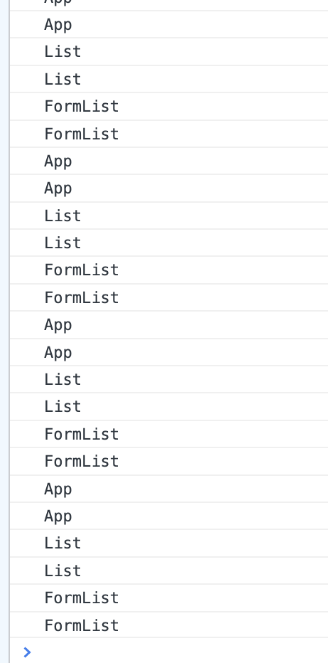
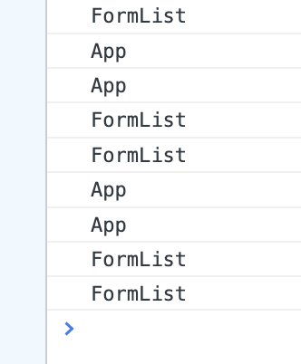

### **React.memo** 를 이용한 컴포넌트 렌더링 최적화


#### 현재 **Todo** 앱의 문제점**!**

현재 Todo 앱에서 App , Lists, List, Form 컴포넌트로 나눠져 있습니다.

이렇게 나눠준 이유는 재사용성을 위해서도 이지만 각 컴포넌트의 렌더링의 최적화를 위해서 이기도 합니다. 

예를 들 어서 Form에서 글을 타이핑을 할 때 원래는 Form 컴포넌트와 그 State 값을 가지고 있는 App 컴포넌트만 렌더링이 돼야 하는데 현재는 어떻게 되고 있는지 봐보겠습니다.


#### 모든 컴포넌트에 콘솔로그 찍고 Input에 입력하기




한 글자 입력 시마다 props가 바뀌지 않아서 렌더링 하지 않아도 되는 Lists 컴포넌트와 List 컴포넌트까지 다시 렌더링 되는 걸 볼 수가 있습니다


#### React.memo 적용으로 문제 해결


```js
const List = React.memo(({ todoLists, setTodo }) => {
  console.log("List");
  return (
    <div>
      {todoLists.map((item) => (
        <Lists item={item} todoLists={todoLists} setTodo={setTodo} />
      ))}
    </div>
  );
});

export default List;
```


적용하고싶은 컴포넌트에 React.memo를 사용합니다.



실제 랜더링이 필요하지않는 List는 재 랜더링되지않게됩니다.

