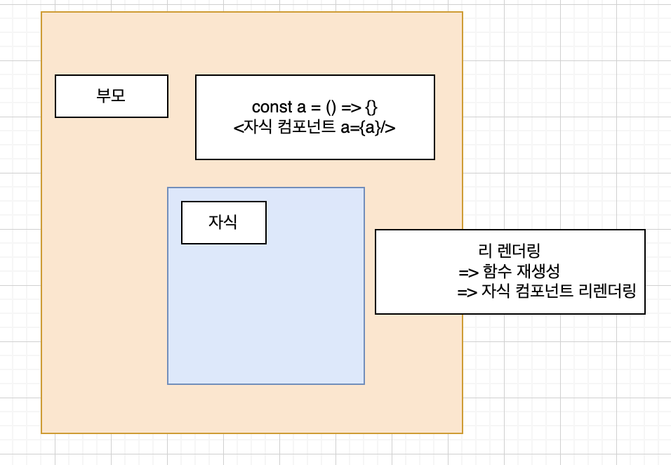

### **useCallback** 을 이용한 함수 최적화


원래 컴포넌트가 렌더링 될 때 그 안에 있는 함수도 다시 만들게 됩니다. 

하지만 똑같은 함수를 컴포넌트가 리 렌더링 된다고 해서 계속 다시 만드는 것은 좋은 현상은 아닙니다.

그리고 이렇 게컴포넌트가리렌더링될때마다함수를계속다시만든다고하면 

만약이함수가자식컴포 넌트에 props로 내려 준다면 함수를 포함하고 있는 컴포넌트가 리 렌더링 될 때마다 자식 컴포 넌트도 함수가 새롭게 만들어지니 계속 리 렌더링 하게 됩니다.





#### 삭제 버튼 함수 App 컴포넌트로 이동


```js
App.js
const App = () => {
  console.log("App");
const handleClick = (id) => {
    const deleteTodoList = todoLists.filter((item) => item.id !== id);
    setTodo(deleteTodoList);
  };
}
return (
	 <List
          handleClick={handleClick}
          todoLists={todoLists}
          setTodo={setTodo}
        />
	)
}
```

handleClick을 props로 넘겨준다. 그러자 이전에 설정한 React.memo로 감싸줘서 리렌더링 되지않던 컴 List컴포넌트들이 한글자 입력시마다 다시 리 렌더링이 되는걸 볼수있다.


#### React.useCallback 적용으로 문제 해결

useCallback 적용은 useCallback 안에 콜백함수와 의존성 배열을 순서대로 넣어주시면 된다.

```js
  const handleClick = useCallback(
    (id) => {
      const deleteTodoList = todoLists.filter((item) => item.id !== id);
      setTodo(deleteTodoList);
    },
    [todoLists]
  );

```

함수 내에서 참조하는 state, props가 있다면 의존성 배열에 추가해주시면 됩니다. 

useCallback으로 인해서 todoData가 변하지 않는 다면 함수는 새로 생성되지 않습니다. 새로 생성되지 않기에 메모리에 새로 할당되지 않고 동일 참조 값을 사용하게 됩니다.

의존성 배열에 아무것도 없다면 컴포넌트가 최초 렌더링 시에만 함수가 생성되며 그 이후 에는 동일한 참조 값을 사용하는 함수가 됩니다.


적용 후 다시 인풋에 입력하면 List는 콘솔에 찍히지않는걸 볼 수있습니다.

