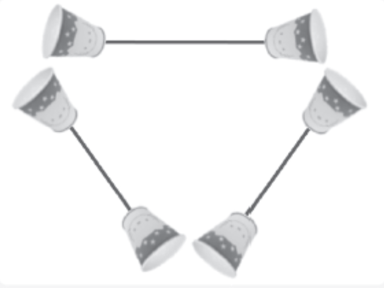
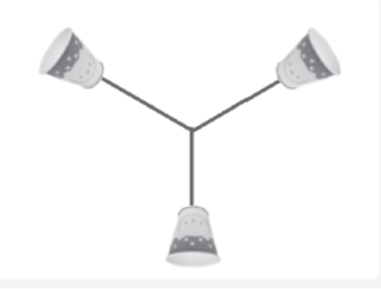

# 멀티플렉싱 기반의 서버
## 멀티 프로세스 서버의 단점
- 프로세스의 빈번한 생성 -> 성능 저하
- 멀티 프로세스의 흐름을 고려하여 구현해야하기에 **구현이 어려움**
- 프로세스간 통신이 필요한 상황에서는 서버의 구현이 더 복잡

## 멀티 프로세스 서버의 대안
하나의 프로세스에서 다수의 클라이언트에게 서비스할 수 있어야함 -> **IO 멀티플렉싱**

---
<br/>

<div style="display: flex; justify-content: center; gap: 20px;">
  <div style="text-align: center;">
    
    <p>멀티 프로세스</p>
  </div>
  <div style="text-align: center;">
    
    <p>IO 멀티플렉싱</p>
  </div>
</div>

---
<br/>

# select 함수의 이해와 서버 구현
## select 함수의 작동 흐름
1. fd_set 초기화 (관심 대상 목록 만들기), 관심 소켓 등록
    - 파일 디스크립터의 설정
    - 검사의 범위 설정
    - 타임 아웃의 설정
```
int select(
    int maxfd, fd_set *readset, fd_set *writeset, fd_set *exceptset, const struct timeval *timeout
)

// maxfd : 관찰 대상이 되는 디스크립터의 수
// timeout의 지정을 통해 무조건 반환이 되는 시간 결정 가능
```

2. select 함수의 호출
    - 변화가 발생한 소켓의 디스크립터 1 , 나머지는 0
3. 변화 발생한 소켓만 read, write

## 특징
1. 타임 아웃 설정 가능
2. 리스닝 소켓 또한 관찰의 대상 (연결 요청 또한 데이터의 수신으로 구분)
3. 타임아웃에 의한 반환이라면 다시 select() 호출 -> break문 실행
4. 이벤트 발생 시 이벤트를 찾기위해 반복문 구성 -> select의 단점