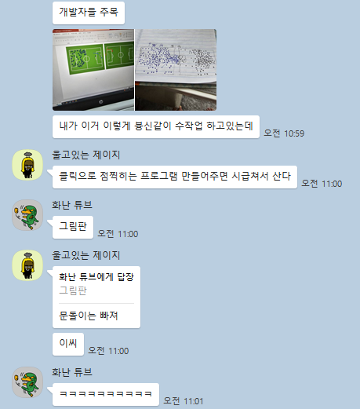
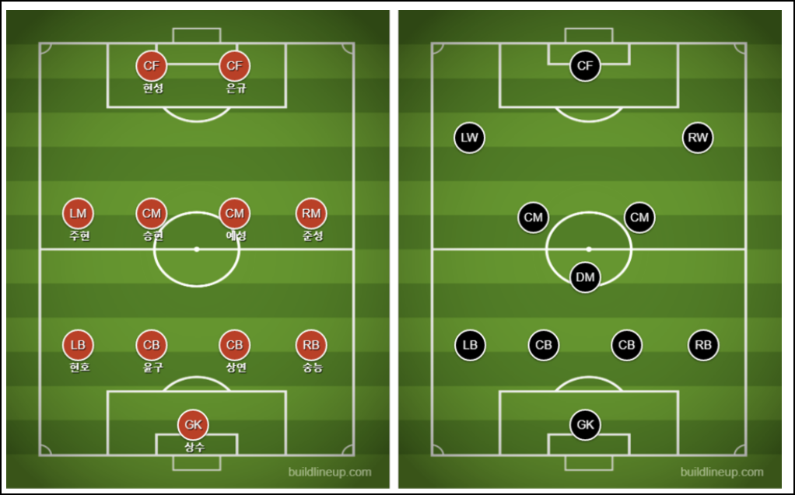
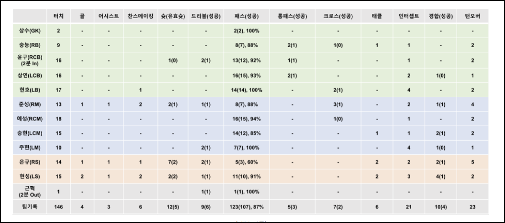
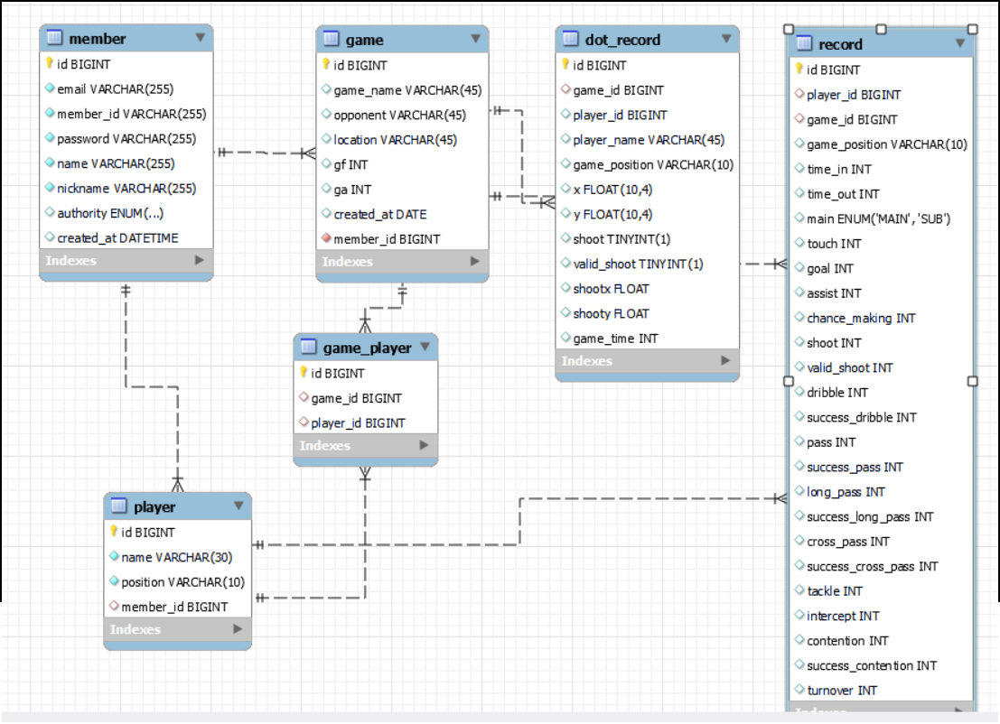
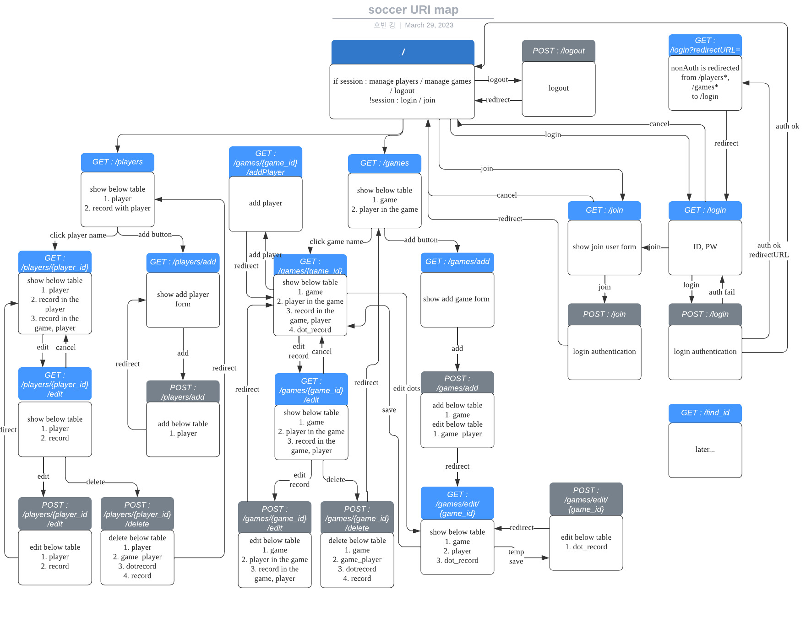
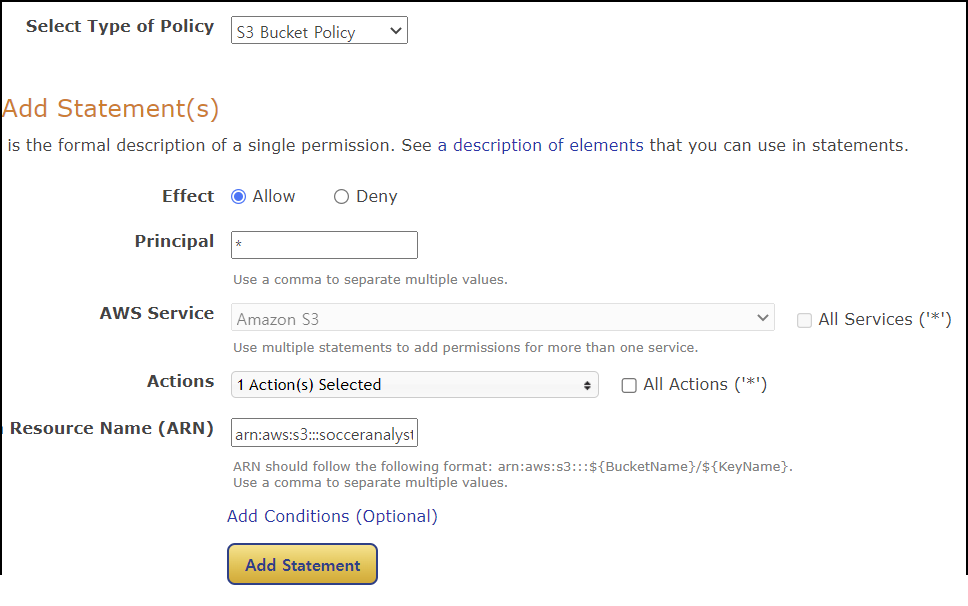
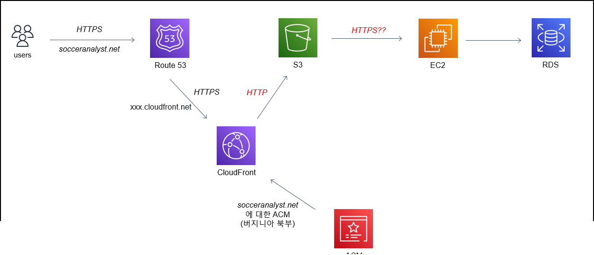
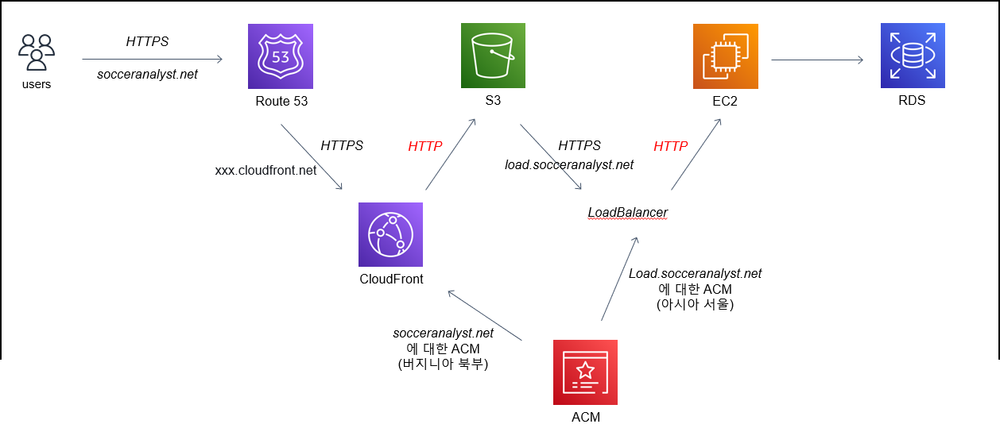

# soccerAnalyst 

[socceranalyst 링크입니다.](https://socceranalyst.net)

[git 코드보기](https://github.com/hobeen-kim/socceranalyst.git)

저는 축구를 보는 것도 좋아하지 않고 하는 건 완전 싫어하지만 우연찮게도 첫 배포까지 완료한 프로젝트는 축구 관련이었습니다.

첫 프로젝트의 3주 동안의 여정은 다음과 같이 시작되는데...

제 동기가 전역 후 K7 리그에서 일하고 있는데요. 히트맵을 그리기 위해서 간단한 프로그램이 필요한 상태였습니다. 마땅히 하고 싶은 아이디어가 없던 저에게 나름의 동기 부여도 되었습니다. (문돌이는 빠지라고 할 때 빠질 뻔했습니다.)

그래서 듣던 김영한님의 강의를 멈추고, codestate 시작 3주전에 프로젝트를 시작했습니다. (제한 시간 3주!)

# 요구사항 분석

소프트웨어 강의는 들었지만 소프트웨어 개발 주기를 기억하고 있는 건 아니었습니다. 하지만 당연히 프로그램을 만들기 전에 동기가 어떤 기능을 원하고 있는지 확인해봐야겠죠. 일단 명시적인 요구사항은 하나였습니다.

**"클릭을 하면 파란색, 빨간색 점이 찍히는 프로그램을 만들어달라"**

이런 간단한 요구사항은 사실 html, css, js 만 사용한다면 하루만에 뚝딱 만들어낼 수 있겠지만... 어차피 제 토이프로젝트용으로 만드는 것이니 제가 알아서 요구사항을 도출해봤습니다. 

동기는 블로그에 K7 팀의 경기기록을 포스팅하기 위해 히트맵(패스를 받은 위치가 찍힌 필드)을 작성하고 있었는데요. 그래서 블로그로 들어가서 필요한 사항들을 찾아봤습니다.

*이런 라인업이나,* 

*이렇게 경기 기록도 따로 기록하고 있었습니다.*

## 넣을 기능들

블로그 내용 및 요구사항을 바탕으로 구현할 기능들을 정리해봤습니다.

- 선수 추가 (이름, 포지션)
- 경기 추가 (경기 내용, 경기에 참여한 선수, 경기 내 기록)
- 히트맵 추가 (각 점마다 x, y 값, 슛/유효슛 여부, 어떤 선수의 점인지 등)

사실 기능을 치밀하게 설계한 건 아니었구요. 작은 프로젝트이니 머리속에 넣고 떠오르는대로 하면 될 것같다는 생각이 들었습니다만... **그 생각은 기능을 추가할 때마다 DB 테이블을 수정해야 하는 대참사를 만들었습니다.. ㅜㅜ**

사실 이 포스팅을 작성하고 있는 시점에는 이미 다 만든 시점이라 기능들을 세부적으로 적진 않았습니다. 사실 이걸 보고 따라만드는 목적보단 제가 나중에 봤을 때 리마인드하는 목적으로 쓰고 있는거라서요 ... ㅎㅎ 기능이 궁금하시면 사이트에 들어가보시면 됩니다.

# 구현 기술

**Back**

- Java Spring Boot
  - Spring Data JPA
  - Spring Security (jwt 토큰 인증 포함)

**Front**

- React
  - react-router-dom
  - bootstrap

**DB**

- H2 (test 용)
- mysql (배포용) + workbench

**Tool**

- IDE: IntelliJ, VSCode
- Test : Postman, Junit
- chatGPT (두뇌 역할)

 **배포**

- aws : route 53, cloudFront, EC2(loadBalancer 포함), RDS, ACM
- 기타 : netlify (쓰다가 말았습니다.)

먼저 백엔드는 당연히 Springboot 이었습니다. 왜냐하면 저는 Spring 만 배웠으니까요.. ㅎㅎ 이제 장고랑 노드도 배우려고 합니다.

그리고 프론트는 thymeleaf 를 사용하려고 했는데요. 원하는 기능 구현도 어려워서(사실 몰라서) 결국 react 로 중간에 갈아탔습니다. react 를 잘 아는 건 아니지만 생활코딩 egoing 님의 양산형 제자로서 조금 배웠으니까요. 모르는건 찾아보면서 넣었습니다. 그래서 react 코드는 사실 리팩토링은 크게 안할거구요. css 만 바꿔주면서 디자인 변경만 하려고 합니다. 지금 디자인은 보노보노를 넣는게 더 나을 정도로 너무 구립니다.

DB 도 잘 아는 기술인 mysql 을 사용했는데요. 사실 workbench 를 사용하다보니 크게 DB 쪽은 만질 게 없었습니다. DB 구성도 간단하거든요.

배포는 뒤에 원래 예스닉(도메인구매), netlify(front), Ec2(back), RDS(DB) 를 사용하려고 했는데, SSL 문제로 aws 에서 제공해주는 ACM 을 사용하기 위해 모든 배포툴을 aws 로 통합했습니다. 어차피 무료이기도 하고, 일년 뒤에서 연 10만원 내외이면 그대로 쓰려고 합니다.

# DB 설계

처음에는 lucid 템플릿 무료평가버전으로 DB 설계와 API 설계까지 해놨습니다만 저장이 안되었는지 DB 설계는 날아가버렸습니다 ㅠㅠ. 그래서 workbench 에 있는 DB ERD 를 들고 왔습니다. 

현재 Amazon RDS 에 있는 DB 입니다. 한번에 눈에 들어오게 배치가 안되더군요. 각 테이블의 필드가 어떤 역할을 하는지 설명하는 건 어려울 것 같습니다 ㅎㅎ

1. member : 가입한 계정

   - member 는 player, game 과 일대다 관계를 가지고 있습니다.
   - 1개의 계정이 여러 player 와 game 을 생성가능한 건 당연하겠죠

2. player : 팀 내 보유한 선수 정보

   - player 는 record 와 일대다 관계를 가지고 있습니다.

   - 여기서 특이한 건 player 도 position 을 가지고 있고 record 에도 game_position 이 있습니다.

   - 왜냐하면 선수는 자신의 포지션이 아니라 다른 포지션으로도 뛸 수 있기 때문입니다. 이 부분은 축알못인 저는 모르고 있다가 동기에게 혹시나 해서 물어보고 중간에 추가한 필드입니다.

3. game : 팀이 치른 경기 정보

   - game 은 record, dot_record 와 일대다 관계를 가지고 있습니다.

4. game_player : player 와 game 의 다대다 관계 설정 테이블

   - game 은 경기 내 참여 선수를 가지고 있어야 하며, player 는 여러 경기에 참여할 수 있어야 합니다.
   - 그래서 관리하기 쉽게 game_player 테이블을 만들고 id 까지 부여했습니다.

5. dot_record : 히트맵에서의 점 (가장 중요한 요구사항을 위한 테이블)

   - 사실 이 테이블이 핵심이라고 볼 수 있습니다. 
   - 현재는 game 테이블과 다대일 관계이지만 처음 만들 때는 player 테이블과도 다대일 관계였습니다.
   - 하지만 player 를 설정하지 않은 dot_record 도 필요하다고 생각하게 되었고 여러가지 고민을 하게 되었습니다.
     - **왜냐하면 동기는 그냥 점만 찍으면 되는데 귀찮게 player 설정까지?? 라고 생각할 수 있기 때문입니다.**
     - 또한 빨간 색 점은 등록한 선수로 player 설정이 가능하지만 파란 색 점(상대팀) 은 애초에 등록한 적이 없기 때문에 별도로 blue_player 를 생성해줘야 했습니다. 해결 방안으로는 ...
       1. 최초 계정 생성 시 anonymous_player. blue_player 를 계정 당 1개씩 만들고 player 를 설정하지 않거나 파란색 점을 찍으면 해당 플레이어로 저장
       2. **player 와 dot_record 연관관계 끊기**
       3. 일대다 관계이지만 dot_record 의 player_id 가 null 이 가능하도록 하게 하기
     - 결국 선택한 방법은 2번이었습니다. 
       - 1번을 선택한다면 경기 생성 시마다 anonymous, blue_player 를 참여시키지만 선수 관리 페이지이나 경기 생성 페이지에서는 표시가 안되게 해야 한다는 점이 수정할 요소가 많다고 생각했고,
       - 3번은 ... 사실 안되는 줄 알았는데 다 만들고 나니 되는 걸 알았습니다. 저렇게 변경할지 그대로 둘지 생각해봐야겠습니다. 
       - 중요한 건 2번을 선택하면 문제점이 player 가 삭제될 때 dot_record 가 남아있다는 건데, 오히려 그게 낫다고 봅니다. 사실 선수가 수정되어도 히트맵 상 점은 남아있어야 한다고 생각하거든요.
         - **적으면서 생각난건데, 이렇게 되면 사실 player 가 삭제될 때 game 내 기록된 record 가 사라진다는 문제점이 있다는 걸 깨달았습니다. 이부분은 추후에 수정해야겠습니다. 당장 떠오르는 수정 방법은 player 테이블에 ''hide" 필드를 만들어서 완전 삭제가 아니라 선수 관리 페이지에 표시만 안되게 하는 방법이 있는데, 나중에 적용해봐야겠습니다.**

# REST API 

**다들 이거를 설계할 때 swagger 를 사용하시던데, 저는 그게 뭔지도 몰랐습니다.** 그래서 lucid 탬플릿으로 생각나는대로 만들었습니다. 일단 부끄럽지만 고민했던 흔적을 보겠습니다.

제가 이런 화살표로 된, 한눈에 들어오는 걸 좋아해서 이렇게 만들었습니다...만 다음부터는 swagger 문서를 사용해보겠습니다.

뭐, 틀리더라도 한번 시도해본게 낫지 않겠습니까

기본적으로 세션 여부에 따라 인증을 실시하고 /players, /games 에 접근 가능하도록 했습니다. 물론 현재 기준으로 절반이상 변경되었기 때문에 아무짝에도 쓸모없는 계획문서입니다. (인증자체도 token 으로 하는걸로 변경했습니다.)

# 구현(코드 없음)

코드를 일일히 나열하기에는 많고 추후에 리팩토링 하면서 리뷰정도는 할 수 있을 것 같습니다.

사실 주요 서비스에 대한 react 와 springboot 코드를 만드는 건 일주일 정도밖에 안걸렸습니다. 워낙 쉬운 crud 이기도 하고, 흔한 게시판 기능도 아직 구현하지 않았거든요. 일단 저에게는 시간이 3주밖에 없었습니다 ㅎㅎ

사실 시간이 오래 걸린 부분은 **typescript 배우다가 js 로 갈아타기**(몰라서 배우면서 함), **auth 토큰 인증**(5일?? security 는 제대로 배운 적없어서 급하게 강의보고 공부하며 코드 복붙함), **배포 및 https 기능**(4일 정도, 이유는 모르겠지만 잘 안됨)이었습니다.

백엔드 같은 경우도 깊게 생각하지 않고 해서 막상 배운거를 제대로 써먹지 못했습니다. 포인트컷을 적용한 예외처리, sql 로그를 보고 db 조회 최적화, 동시성 문제가 발생하는지(잘 모름) 등등... 

그래서 사실 앞으로 이 카테고리의 주요 내용은 스프링 기술을 이용한 리팩토링 + 추가 기능 구현이 될 것 같습니다.

# 배포

배포는 route 53, cloudFront, EC2(loadBalancer 포함), RDS, ACM 기술 등을 사용했고 제가 직면했던 이슈만 개략적으로 설명해보겠습니다.

## EC2, RDS 생성 및 연결

ec2 인스턴스 생성와 RDS (mysql) 생성하고 보안 그룹을 통해 연결해주었습니다. 

EC2 와 RDS 연결은 보안그룹을 설정해줘야 합니다...만 사실 그때는 배포가 처음이라 아무것도 모르고 asw 설명서 따라만 해서 지금 설명할 엄두가 안납니다. 나중에 공부를 더 하고 정리해봐야겠습니다. 지금 제 기준으로 중요한 건 이게 아니니까요

## **Netlify 사용**

처음에는 netlify 를 사용하려고 했으나, 생각하지 못한 이슈가 있었습니다. 그것은 바로 https 통신이었습니다.

Netlify 는 무조건 https 만 지원하기 때문에 백엔드에서 받는 EC2 에서 SSL 인증서가 있어야 했습니다. 하지만 SSL 인증서를 받기 위한 let's encypt 발급은 쌩초보인 저에게는 너무 힘들었고, 그냥 고민하지 말고 aws ACM 을 사용하자고 결론 내고 전부 aws 기술로 갈아탔습니다.

물론 netlify 를 사용하면서도 ACM 을 사용할 수 있지 않나 라는 생각을 지금 해보았습니다만, 당시에는 그 고민하고 연구할 시간에 빨리 배포하는 게 중요했습니다. (3주 timeLimit...)

##  route 53, cloudFront, S3 사용

먼저 인증서를 생성해야 하는데, 버지니아 북부로 들어가서 자신이 쓸 url(socceranalyst.net, www.socceranalyst.net) 으로 발급 받아야 합니다.

버지니아 북부로 하는 이유는 cloudFront 가 글로벌이라서 버지니아 북부 SSL 만 사용가능하기 때문입니다. 

1. S3 

   - 생성

     1. 버킷 이름 : 자신의 url (socceranalyst.net)

     2. 모든 퍼블릭 엑세스 차단 비활성

   - 버킷 정책 설정
     - 정책 생성기에서 policy(S3 Bucket Policy), effect(allow), principal(*), action()ARN(S3 arn 작성, arn:aws:s3:::socceranalyst.net)
     - 
     - generate Policy 에서 나오는 json 을 버킷 정책 편집기에 넣으면 됩니다.

2. CloudFront
   - 생성
     - 원본 도메인(S3 엔드포인트), 뷰어 프로토콜 정책(Redirect HTTP to HTTPS), 대체 도메인 이름(socceranalyst.net), 사용자 정의 SSL 인증서(아까 만든 인증서), 기본 루트 객체(index.html) 등을 입력하고 생성합니다.
3. route 53
   - A 유형으로 레코드 생성
     - A 유형으로 socceranalyst.net 이 cloudFront 주소인 xxx.cloudfront.net 을 가리키게 합니다.

## 다 연결된 것 같았지만...

route 53 까지 하니 이런 형태가 되었습니다.

하지만 여기서 문제는 **s3 에 있는 react 가 ec2 를 호출할 때 https 로 호출한다는 거였습니다. 아직 해결못한 문제입니다.**

- 즉. react 에서 axios 로 'http:/[ec2 ip주소]:80' 으로 호출하면 https 는 http 로 못보낸다는 에러
- axios 로 https://[ec2 ip주소]:443 으로 호출하면 ec2 에 SSL 이 없다는 에러

*제가 서칭한 바로는 cloudFront 에서 http 로 변환한 후 s3 로 보내면 s3 에서부터는 http 로 전부 호출되는 거라고 알고 있었는데 어떤 부분이 문제였는지 모르겠습니다. 여기서 하루 이상을 소비했습니다.*

## Load Balancer 사용

그래서 로드밸런서를 통해 다시 https 를 http 로 변환했습니다. 이게 맞는지 모르겠지만 나중에 연구해보고 다시 설계를 해야겠습니다. 이 시점에서 다른 고민을 수 없었던게 약속한 시간인 3주가 되기 하루전이었거든요. (배포 전 마지막 온몸비틀기였습니다.)

 

*매우 난잡한 구성이다*

제가 생각한 것은, 'S3 에서 react 가 https 를 보내야 한다면 다시 받아서 http 로 변경하자' 였습니다. 이건 좀 이상하지만... 나중에 고쳐보죠 뭐

1. 일단 ACM 인증서를 서울로 하고 load.socceranalyst.net 로 발급받았습니다. 
2. 그리고 로드밸런싱에서 대상그룹을 HTTP 80포트로 만들어줬구요.
3. 로드밸런서는 **Application Load Balancer**로 listener 를 http 와 https 둘 다 해주고 targetgroup 도 아까 만들었던 대상그룹으로 넣었습니다.
4. 마지막으로 route 53 에서 load.socceranalyst.net 을 추가해서 로드밸런서에 연결해주었습니다. 

이러면 뭔가 중복되는 거 같긴한데... 차차 해결합시다 ㅠㅠ

일단 route 53 과 S3 는 cloudFront 로 통신이 잘 되는데 왜 다시 https 로 변환되는가부터 생각해봐야겠습니다.

# 마치며

위 내용이 제가 3주동안 개발한 (첫!) 토이프로젝트 전부입니다.

이제는 다음 프로젝트를 시작하기 전에 한달 정도 기간을 잡고 미흡했던 부분을 보완하는 포스팅을 주로 하려고 합니다.

예를 들어,

**기능추가**

- 자유게시판 기능 (비인증자도 사용가능하도록 구현)
- goole, naver, kakao oauth2 구
- 라인업 만들기 기능 구현
- 경기 매칭 시스템 도입
- ID, PW 찾기 기능 구현(놀랍게도 아직 안했음!)
- Player 테이블에 hide 필드 추가(boolean) 및 선수 숨기기 기능 구현

**프론트**

- css 꾸미기, 모바일에서도 쉽게 볼 수 있게 크기 등 조정
- 첫 사용자 가이드 만들기
- 일단 예쁘게 만들어보기 (디자인 감각이 꽝이라서 잘 안될 거 같긴 합니다. 후순위)

**백엔드**

- 예외 처리 ->  포인트 컷 적용
- 서버측에서 validation 검증 처리(놀랍게도 아직 안했음)
- refreshToken 사용해서 로그인 연장(놀랍게도 아직 안했음, 현재는 AccessToken 으로만 시간을 18시간 정도 유효하게 줬습니다.)
- 조회, 수정 실행 시 sql 로그를 보고 DB 조회 최적화(실행할 때마다 너무 많이 조회되는 것 같음)
- 동시성 문제 확인 및 처리(개념조차 없음)
- 통신 데이터 정리(해당 호출에서 이 데이터를 보내는게 맞는가 등등... 정리가 안되어 있)

**배포**

- cloudFront 만으로 어떻게 https 처리가 가능한지 공부부터 한 뒤 적용
- 안되면 ec2 에 SSL 이라도 넣어보자

**기타**

- 광고 붙이기 (희망)
- 검색엔진에 등록하기 (google, naver)

등등이 있겠습니다... 하하..