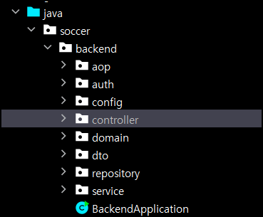
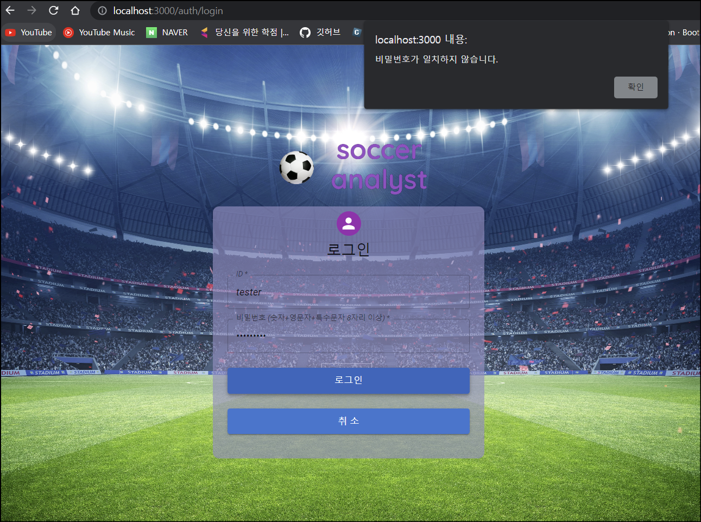

# 현재 상태

로그인 구현코드만 살펴봅시다. (다른 코드도 비슷한 상태니...)

## AuthController 에서 login 메서드

```java
 @PostMapping("/login")
    public ResponseEntity<?> login(@RequestBody MemberRequestDto requestDto) {
        try{
            TokenDto token = authService.login(requestDto);
            return ResponseEntity.ok(token);
        }catch(RuntimeException e){
            String errorMessage = e.getMessage();
            return ResponseEntity.badRequest().body(errorMessage);
        }
    }
```

- 서비스 계층으로 MemberRequestDto(String memberId, String password) 를 보내주고 있습니다.
- 서비스 계층에서 결과를 받을 때 RuntimeException 일 경우 errorMessage 를 받아서 프론트로 보내주고 있습니다.
- 이 때 ResponseEntity<T> 에서 T 가 Token 이 될 수도 있고 String 이 될 수도 있기 때문에 `?` 를 사용했습니다.

## AuthService 의 login 메서드

```java
public TokenDto login(MemberRequestDto requestDto) {
        UsernamePasswordAuthenticationToken authenticationToken = requestDto.toAuthentication();
        TokenDto tokenDto = null;

        try{
            Authentication authentication = managerBuilder.getObject().authenticate(authenticationToken);
            tokenDto = tokenProvider.generateTokenDto(authentication);
        } catch (Exception e) {
            throw new RuntimeException("아이디 또는 비밀번호가 일치하지 않습니다");
        }

        log.info("tokenDto: {}", tokenDto);

        return tokenDto;
    }
```

- 서비스 계층에서는 MemberRequestDto 인 MemberId, password 를 받아서 MemberRequestDto 의 메서드인 toAuthentication() 으로 UsernamePasswordAuthenticationToken 을 반환합니다.

  - toAuthentication() 메서드

  - ```java
    public UsernamePasswordAuthenticationToken toAuthentication() {
        return new UsernamePasswordAuthenticationToken(memberId, password);
    }
    ```

- 이제 검증을 시작하는데 여기서 아이디, 비밀번호가 맞지않으면  catch 로 가서 Exception 을 잡습니다. **만들 때는 급해서 catch 되는 Exception 을 그냥 Exception 으로 넣었는데 이러면 안됩니다. 아이디, 비밀번호가 틀렸을 때 잡는 exception 외에는 잡으면 안되기 때문입니다.** 

  - *예를 들어서 generateTokenDto 메서드에서 오류가 발생했는데 그걸 Exception 으로 잡아서 "아이디 또는 비밀번호가 일치하지 않습니다" 로 예외처리한다면??*

  - `log.info("Exception : {}", e.getClass());` 를 통해 찾은 Exception 의 클래스는 `org.springframework.security.authentication.BadCredentialsException` 였습니다. catch 문을 변경해줍니다. 

  - ```java
    ...
    //Exception -> BadCredentialsException 로 변경
    catch (BadCredentialsException e) {
        log.info("Exception : {}", e.getClass()); //이건 지워주도록 하자
        throw new BadCredentialsException("아이디 또는 비밀번호가 일치하지 않습니다");
    }
    ...
    ```

- 서비스 계층은 일단은 계속 try-catch 로 놔둘 생각입니다. 서버에서 에러에 맞는 에러메세지를 보내도록 구성하려고 하기 때문입니다.

- BadCredentialsException 은 RuntimeException 을 상속받는 클래스기 때문에 Controller 에는 RuntimeException 으로 일단 놔두겠습니다.

# @Aspect 를 사용한 예외 처리

마침 제가 김영한님께 배운 스프링 고급편에서 @Aspect 를 다룬 강의까지 봤기 때문에 쉽게 변경할 수 있었습니다. 근데 강의내용 정리한 거는 제가 작성했지만 도저히 이해가 안되더군요 ㅠ

 ## ExceptionAspect 클래스

```java
package soccer.backend.aop;

import lombok.extern.slf4j.Slf4j;
import org.aspectj.lang.ProceedingJoinPoint;
import org.aspectj.lang.annotation.Around;
import org.aspectj.lang.annotation.Aspect;
import org.springframework.http.ResponseEntity;
import org.springframework.stereotype.Component;

@Aspect
@Component
public class ExceptionAspect {

    @Around("execution(* soccer.backend.controller..*(..)) || execution(* soccer.backend.auth.controller..*(..))")
    public Object execute(ProceedingJoinPoint joinPoint) throws Throwable{

        try{
            Object result = joinPoint.proceed();
            return result;
        }catch (RuntimeException e) {

            String errorMessage = e.getMessage();
            return ResponseEntity.badRequest().body(errorMessage);
        }
    }

}
```

일단 파일 위치는 aop아래로 두었습니다.

어노테이션은 @Aspect 와 스프링 빈 등록을 위한 @Component 를 붙입니다.

하나하나 살펴보겠습니다.

**@Aspect** 

- 스프링 애플리케이션에 프록시를 적용하려면 포인트컷과 어드바이스로 구성되어 있는 어드바이저 ( Advisor )를 만들어서 스프링 빈으로 등록하면 됩니다. 그러면 자동 프록시 생성기가 모두 자동으로 처리해준다.
- 자동 프록시 생성기는 스프링 빈으로 등록된 어드바이저들을 찾고, 스프링 빈들에 자동으로 프록시를 적용해줍니다.
- **스프링은 @Aspect 애노테이션으로 매우 편리하게 포인트컷과 어드바이스로 구성되어 있는 어드바이저 생성 기능을 지원합니다**

 **@Around**

- 일단 컨트롤러 아래에 다 적용시킬건데, 컨트롤러가 Auth 폴더와 Controller 폴더로 나눠져있어서 `||` 기호로 두군데에 적용시킵니다.

- 이렇게 따로 나눈 특별한 이유가 없고, 제가 Auth 구현할 때 좀 힘들었어서 따로 관리하려고 Auth 폴더를 따로 만들어놨습니다.

  - 

  - 다음에 만들 때는 모든 Controller 를 하나의 디렉토리에 넣는게 좋겠습니다.

- `"execution(* soccer.backend.controller..*(..)) || execution(* soccer.backend.auth.controller..*(..))"` 의미는 soccer.backend.controller 디렉토리와 soccer.backend.auth.controller 디렉토리에 모두 @aspect 를 적용시킨다는 겁니다.

**try~catch**

- ```java
  try{
      Object result = joinPoint.proceed();
      return result;
  }catch (RuntimeException e) {
  
      String errorMessage = e.getMessage();
      return ResponseEntity.badRequest().body(errorMessage);
  }
  ```

  try 문 안에는 정상실행일 때입니다. 즉, "AuthController 의 login 을 실행하고 결과를 result 로 넣어라" 라고 생각하면 됩니다. 

  catch 문 안은 RuntimeException e 를 잡아서 errorMessage 를 받은 다음에 ResponseEntity.badRequest().body(errorMessage); 로 반환합니다. **즉, 처음에 AuthController 의 catch 문입니다.**

  일단 지금 처리할 예외는 전부 RuntimeException 입니다.

## AuthController > login 메서드 변경

오잉!? 메서드의 상태가...!

```java
//처음에 본 그 메서드입니다. 
@PostMapping("/login")
    public ResponseEntity<?> login(@RequestBody MemberRequestDto requestDto) {
        try{
            TokenDto token = authService.login(requestDto);
            return ResponseEntity.ok(token);
        }catch(RuntimeException e){
            String errorMessage = e.getMessage();
            return ResponseEntity.badRequest().body(errorMessage);
        }
    }
```

**네 이렇게 변했습니다.**

```java
@PostMapping("/login")
public ResponseEntity<TokenDto> login(@RequestBody MemberRequestDto requestDto) {
    TokenDto token = authService.login(requestDto);
    return ResponseEntity.ok(token);
}
```

- 반환 타입 변경 : ResponseEntity<?> -> ResponseEntity<TokenDto>
  - ResponseEntity<TokenDto> 으로 반환타입을 설정해도 @Aspect 의 String 타입 반환도 잘 되더군요. 반환 타입은 코드 작성 시점에 컴파일 에러만 없으면 되는 듯 합니다.
- try~catch 문 다 빼기

# @ControllerAdvice  를 사용한 예외 처리

우리의 영원한 친구 chatGPT 는 

> 예외 처리를 위한 별도의 로직이 필요한 경우, `@ControllerAdvice` 어노테이션을 사용하여 전역 예외 처리기를 구현하는 것이 더 효과적일 수 있습니다. 이 방법을 사용하면, 예외 처리 로직을 별도의 클래스로 분리하여 코드의 가독성과 유지 보수성을 높일 수 있습니다.

라고 저를 설득했기 때문에 해당 방법도 적용해보겠습니다.

## @ControllerAdvice  

`@ControllerAdvice` 어노테이션을 사용하여 작성된 전역 예외 처리기는 컨트롤러 레벨에서 발생한 예외를 처리합니다. 

```java
package soccer.backend.aop;

import org.springframework.http.ResponseEntity;
import org.springframework.web.bind.annotation.ControllerAdvice;
import org.springframework.web.bind.annotation.ExceptionHandler;

@ControllerAdvice
public class GlobalExceptionHandler {

    @ExceptionHandler(RuntimeException.class)
    public ResponseEntity<?> handleRuntimeException(RuntimeException e) {
        String errorMessage = e.getMessage();
        return ResponseEntity.badRequest().body(errorMessage);
    }
}

```

aop 폴더에 해당 클래스를 넣으면 끝입니다. @ControllerAdivce 에 @Component 도 포함되어 있습니다.

- RuntimeException 을 처리하는 handleRuntimeException 메서드를 구현했습니다. 
- 마찬가지로 error 에서 메세지를 받아서 프론트로 보냅니다.

*주의할 점 : @Aspect 와 같이 적용되고 있으니, ExceptionAspect 에서는 @Component 를 주석처리해줍시다.

## 전역처리하지 않고 특정 컨트롤러 메서드만 적용하려면?

예를 들어서 AuthController 에 login 메서드에만 예외처리 AOP 를 적용하고 싶으면?(signUp 에는 적용하기 싫다면!)

 -> `@ControllerAdvice`에 `annotations` 속성을 사용하여 해당 어노테이션을 지정할 수 있습니다.

1. 먼저 사용자지정 어노테이션을 하나 만들어줍니다.

**@CustomException**

```java
@Retention(RetentionPolicy.RUNTIME)
@Target(ElementType.METHOD)
public @interface CustomException {}
```

2. @ControllerAdvice 에서 annotations 속성을 지정해줍니다.

```java
@ControllerAdvice(annotations = CustomException.class)
public class CustomExceptionHandler {
    
    @ExceptionHandler(RuntimeException.class)
    public ResponseEntity<String> handleRuntimeException(RuntimeException e) {
        return ResponseEntity.status(HttpStatus.INTERNAL_SERVER_ERROR).body(e.getMessage());
    }
}
```

3. 특정 컨트롤러 메서드에 `@HandleException` 어노테이션을 추가합니다.

```java
@PostMapping("/login")
@CustomException
public ResponseEntity<TokenDto> login(@RequestBody MemberRequestDto requestDto) {
    TokenDto token = authService.login(requestDto);
    return ResponseEntity.ok(token);
}
```


## 추가 사항 : ID 오류 처리와 PW 오류 처리 구분

아무래도 ID 가 틀렸는지 PW 가 틀렸는지 알려줘야 ID 를 변경해보든 PW 를 찾아보든 하겠죠? 해당 메서드를 구현해보겠습니다.

Auth 를 구현할 때 어디에 쓰는지도 모르는 `CustomUserDetailsService` 를 구현해놨었습니다. 해당 클래스를 보겠습니다.

## CustomUserDetailsService

loadUserByUsername 만 보겠습니다.

```java
package soccer.backend.auth.service;

import lombok.RequiredArgsConstructor;
import org.springframework.security.core.GrantedAuthority;
import org.springframework.security.core.authority.SimpleGrantedAuthority;
import org.springframework.security.core.userdetails.User;
import org.springframework.security.core.userdetails.UserDetails;
import org.springframework.security.core.userdetails.UserDetailsService;
import org.springframework.security.core.userdetails.UsernameNotFoundException;
import org.springframework.stereotype.Service;
import soccer.backend.domain.member.Member;
import soccer.backend.repository.MemberRepository;

import java.util.Collections;

@Service
@RequiredArgsConstructor
public class CustomUserDetailsService implements UserDetailsService {
    private final MemberRepository memberRepository;

    @Override
    public UserDetails loadUserByUsername(String username) throws UsernameNotFoundException {
        return memberRepository.findByMemberId(username)
                .map(this::createUserDetails)
                .orElseThrow(() -> new UsernameNotFoundException("아이디가 존재하지 않습니다."));
    }

    private UserDetails createUserDetails(Member member) {
        GrantedAuthority grantedAuthority = new SimpleGrantedAuthority(member.getAuthority().toString());

        return new User(
                String.valueOf(member.getId()),
                member.getPassword(),
                Collections.singleton(grantedAuthority)
        );
    }
}
```

loadUserByUsername 메서드에서 username 를 매개변수로 넘기면, memberRepository 에서 username 으로 memberId 를 찾아서 createUserDetails 를 호출하고 UserDetails 를 반환합니다.

**그런데 username 을 찾지 못한다면 UsernameNotFoundException("아이디가 존재하지 않습니다.") 을 반환하게 됩니다.**

따라서 서비스 계층에서 이걸 받아서 그대로 컨트롤러에 error 메세지를 넘기면 됩니다.

## AuthService

```java
public TokenDto login(MemberRequestDto requestDto) {
            UsernamePasswordAuthenticationToken authenticationToken = requestDto.toAuthentication();
            TokenDto tokenDto = null;

            try{
                UserDetails userDetails = customUserDetailsService.loadUserByUsername(requestDto.getMemberId());
                // 비밀번호 일치 여부 확인
                if (!passwordEncoder.matches(requestDto.getPassword(), userDetails.getPassword())) {
                    throw new BadCredentialsException("비밀번호가 일치하지 않습니다.");
                }
                Authentication authentication = managerBuilder.getObject().authenticate(authenticationToken);
                tokenDto = tokenProvider.generateTokenDto(authentication);

            }catch (UsernameNotFoundException e) {
                throw new UsernameNotFoundException(e.getMessage());
            }

            log.info("tokenDto: {}", tokenDto);

            return tokenDto;
        }
```

AuthService 입니다. try 문 안에 다음 코드가 추가되었습니다.

```java
UserDetails userDetails = customUserDetailsService.loadUserByUsername(requestDto.getMemberId());
    // 비밀번호 일치 여부 확인
    if (!passwordEncoder.matches(requestDto.getPassword(), userDetails.getPassword())) {
        throw new BadCredentialsException("비밀번호가 일치하지 않습니다.");
    }
```

1. customUserDetailsService 의 loadUserByUsername 메서드를 호출합니다. 없으면 바로 catch(UsernameNotFoundException) 으로 넘어갑니다.
2. 아이디는 있는데 비밀번호가 다르다면? if 문 안으로 들어가서 BadCredentialsException 를 throw 합니다. 그러면 컨트롤러에서 `BadCredentialsException("비밀번호가 일치하지 않습니다.")` 로 받겠죠

**실행결과**




**정상 작동하는 것을 볼 수 있습니다!**

# 마치며

저는 일단 @ControllerAdvice  를 사용하기로 하고 @Aspect 는 다른 전역처리가 필요할 때 사용해보도록 하겠습니다.

서비스 계층에서 각각 예외에 대해 에러처리 메세지를 다 넣어줘야겠습니다.
