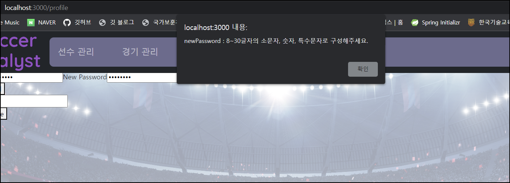

# Validation 설정 추가

validation 이란 간단히 말해서 사용자가 입력한 내용이 정확한지 검증하고 DB 에 반영하는 것입니다.

즉, 회원가입을 할 때 ID 를 "4자 이상 20자 이하, 영문소문자 필수, 숫자 선택" 과 같이 입력할 수 있는 값을 정하는 것입니다. 이 부분은 Spring Data JPA 를 사용한다면 어노테이션을 통해 간단하게 설정할 수 있지만, **놀랍게도 배포할 때까지 하지 않았습니다.(!)** 필수인데도 말입니다... 대신 프론트엔드에서는 정규식표현을 이용하여 validation 을 추가해놓았습니다.

**이런 validation 은 프론트엔드, 백엔드, DB 세군데에 반영하겠습니다.** 저는 프론트, 백엔드만 반영하면 되는줄 알았는데 찾아보니 DB 에도 반영되어야하더군요. 생각해보면 DB 무결성을 보장하기 위해 DB 에도 적용해야 하는데 제가 생각이 짧았던 것 같습니다. 

문제는 어떤 값을 null 을 허용할 것인지, 입력이 안되었을 때 default 값은 어떻게 할 것인지 등을 Auth 이외에는 구체적으로 고민하지 않았습니다.

그래서 일단 Validation 을 어떻게 할지부터 고민해보겠습니다.

# Validation 설정

일단 필드명, 타입, 제약사항(Constraints), 유효 범위로 구분하고 각각 설정해보겠습니다.

id 는 자동생성으로 입력불가능한 사항이니 생략하겠습니다.

제약사항은 WorkBench 기준입니다.

- **PK** : 기본키(Primary Key)입니다. NotNull + Unique 이며 테이블 당 1개만 설정할 수 있습니다. 여러열로 기본키를 구성하려면 복합키(composite key) 를 사용할 수 있습니다. 복합키는 두 개의 열이 합쳐서 하나의 복합열을 구성하는 것으로, 각각의 열은 Unique 가 아닐 수 있지만 복합열은 Unique 가 되어야 합니다.
- **NN** : not Null 입니다. Null 값을 허용하지 않습니다. 하지만 0(숫자 영) 이나 ""(공백) 은 허용하므로 추가적인 조치가 필요합니다.
- **UQ** : unique 입니다. 열의 모든 값이 고유해야 합니다.
- **CHECK** : 유효 범위에 쓸 CHECK 입니다. 제약사항과 따로 구분해놨습니다. 열 값이 특정 조건을 충족해야 함을 지정합니다. (1 < 값 <= 10 과 같이 사용합니다.)
- **DEFAULT** : 열에 기본값을 설정합니다. 
- **B** : Binary 입니다. 이 플래그는 열의 데이터 유형이 이진 데이터임을 나타냅니다. 이 경우, 해당 열은 이진 데이터를 저장하고 처리하는 데 사용됩니다. 
- **UN**: Unsigned  입니다. 이 제약사항은 열의 데이터 유형이 부호 없는 정수임을 나타냅니다. 부호 없는 정수는 음수 값을 허용하지 않으며, 0 및 양수 값만 저장할 수 있습니다. 이렇게 하면 해당 열의 저장 공간을 최적화할 수 있습니다.
- **ZF** : Zero Fill 입니다. 이 제약사항은 열 값이 저장될 때 남은 공간을 0으로 채워야 함을 나타냅니다. 이는 주로 고정 길이의 숫자 값을 저장하는 데 사용되며, 일관된 형식을 유지할 때 도움이 됩니다.
- **G** : Generated 입니다.  이 제약사항은 열 값이 사용자가 입력한 것이 아니라, 데이터베이스 시스템에 의해 자동으로 생성됨을 나타냅니다. 이는 주로 생성된 열(Generated Columns)이나 자동 증가 열(Auto-Increment Columns)에 사용됩니다.
- **AI** : Auto Increment 입니다. 데이터베이스 관리 시스템에서 자동으로 값을 증가시켜 고유한 값을 생성하는 기능입니다. 모든 테이블의 기본키를 id 로 하고 AI 를 적용했습니다.

### Member  validation

<table>
    <thead>
        <tr>
        	<th>필드명</</th>
            <th>타입</</th>
            <th>제약사항</</th>
            <th>유효 범위</</th>
        </tr>
    </thead>
    <tbody>
        <tr>
            <td>email</td>
            <td>String</td> 
            <td>NN</td> 
            <td>공백 미허용, 이메일 형식</td>             
        </tr>
        <tr>
            <td>memberId</td>
            <td>String</td> 
            <td>NN, UQ</td> 
            <td>글자수 4~20/소문자필수, 숫자선택</td>             
        </tr>
        <tr>
            <td>password</td>
            <td>String</td> 
            <td>NN</td> 
            <td>글자 수 8~30/숫자, 영문자, 특수문자 조합</td>             
        </tr>
        <tr>
            <td>name</td>
            <td>String</td> 
            <td>NN</td> 
            <td>글자수 1~100, 영문자 또는 한글</td>             
        </tr>
        <tr>
            <td>nickname</td>
            <td>String</td> 
            <td>NN</td> 
            <td>글자수 1~20, 영문자 또는 한글로 시작, 숫자선택</td>             
        </tr>
        <tr>
            <td>authority</td>
            <td>ENUM</td> 
            <td>NN</td> 
            <td>ENUM('ROLE_USER', 'ROLE_ADMIN')</td>             
        </tr>
    </tbody>
</table>

글자 수가 지정되어있으면 Not Null 이 적용된거지만 혹시 정규식표현이 변경될 수도 있으니 NotNull 도 함께 넣어주겠습니다.

만약에 NotNull 만 넣을거라면 백엔드서버에서는 JPA 를 사용하면서 @NotBlank 를 넣어줘야 합니다. 해당 문자열이 `""`(공백) 이라면 사실 의미가 없죠.

**참고로 spring data JPA 의 @NotNull vs @NotBlank vs @NotEmpty 입니다.** 

- @NotBlank : 문자열이 `null`이 아니고, 공백 문자를 제외한 길이가 1 이상인지 확인합니다. `""`(공백) 도 허용하지 않습니다.
- @NotNull : `null` 값만 허용하지 않습니다. `0`, `""` 은 가능합니다.
- @NotEmpty : 문자열, 컬렉션, 배열, 맵 등의 객체가 비어있지 않음을 확인합니다. 문자열의 경우  `null`이거나 길이가 0인지 확인합니다. 즉, `""`(공백) 은 통과할 수 있습니다.

### Player validation

<table>
    <thead>
        <tr>
        	<th>필드명</</th>
            <th>타입</</th>
            <th>제약사항</</th>
            <th>유효 범위</</th>
        </tr>
    </thead>
    <tbody>
        <tr>
            <td>name</td>
            <td>String</td> 
            <td>NN</td> 
            <td>글자수 1~100, 영문자 또는 한글</td>             
        </tr>
        <tr>
            <td>position</td>
            <td>ENUM</td> 
            <td>NN</td> 
            <td>ENUM([포지션 이름])</td>             
        </tr>
        <tr>
            <td>memberId</td>
            <td>Long</td> 
            <td>NN, UN, FK</td> 
            <td>-</td>             
        </tr>
    </tbody>
</table>

memberId 는 어차피 1부터 시작하니까 UN(unsigned) 를 붙여서 쥐톨이나마 데이터를 효율적으로 사용해봅시다.

### Game validation

<table>
    <thead>
        <tr>
        	<th>필드명</</th>
            <th>타입</</th>
            <th>제약사항</</th>
            <th>유효 범위</</th>
        </tr>
    </thead>
    <tbody>
        <tr>
            <td>memberId</td>
            <td>Long</td> 
            <td>NN, UN, FK</td> 
            <td>-</td>             
        </tr>
        <tr>
            <td>gameName</td>
            <td>String</td> 
            <td>NN</td> 
            <td>글자수 1~100</td>             
        </tr>
        <tr>
            <td>opponent</td>
            <td>String</td> 
            <td>-</td>
            <td>글자수 0~100</td>             
        </tr>
        <tr>
            <td>location</td>
            <td>String</td> 
            <td>-</td> 
            <td>글자수 0~100</td>             
        </tr>
         <tr>
            <td>GA, GF</td>
            <td>Int</td> 
            <td>-</td> 
            <td>0~999 숫자만 허용</td>             
        </tr>
         <tr>
            <td>createdAt</td>
            <td>Date</td> 
            <td>NN</td> 
            <td>Date 형식</td>             
        </tr>
    </tbody>
</table>


gameName, opponent, location, GA, GF 까지 넉넉하게 줬습니다.

**gameName 은 글자수 1개 이상으로 NN 을 부여하지만, 나머지는 공백이나 0 이 가능하도록 합니다.** 즉, game 을 생성할 때나 수정할 때 gameName 만 입력해도 되게 하는 겁니다. **왜냐하면 입력하기 귀찮을 수 있잖아요??**

현재 서버에서 GA, GF 가 Integer 형태이지만 null 값을 넣어주지 않기 위해 Int 로 변경해주겠습니다.

createdAt 은 지금 프론트에서는 `2023-04-06T04:12:27.000Z` 이런 LocalDateTime 형식으로 보내는데요. 백엔드에서 LocalDate 로 받아서 변환해서 잘보내줍니다.

지금 알았는데 한국시간으로 안가네요 ... ㅎㅎ 지금은 어차피 Date 만 필요하니 급할 건 없지만 locale 을 한국으로 해서 같이 수정해야겠습니다.

### Game_player validation

<table>
    <thead>
        <tr>
        	<th>필드명</</th>
            <th>타입</</th>
            <th>제약사항</</th>
            <th>유효 범위</</th>
        </tr>
    </thead>
    <tbody>
        <tr>
            <td>gameId</td>
            <td>Long</td> 
            <td>NN, UN, FK</td> 
            <td>-</td>             
        </tr>
        <tr>
            <td>playerId</td>
            <td>Long</td> 
            <td>NN, UN, FK</td> 
            <td>-</td>             
        </tr>
    </tbody>
</table>


game 과 player 테이블의 매핑(연결) 테이블입니다. 특별할 건 없습니다.

### Record validation

<table>
    <thead>
        <tr>
        	<th>필드명</</th>
            <th>타입</</th>
            <th>제약사항</</th>
            <th>유효 범위</</th>
        </tr>
    </thead>
    <tbody>
        <tr>
            <td>gameId</td>
            <td>Long</td> 
            <td>NN, UN, FK</td> 
            <td>-</td>             
        </tr>
        <tr>
            <td>playerId</td>
            <td>Long</td> 
            <td>NN, UN, FK</td> 
            <td>-</td>             
        </tr>
        <tr>
            <td>gamePosition</td>
            <td>ENUM</td> 
            <td>NN</td> 
            <td>ENUM([포지션 이름])</td>             
        </tr>
        <tr>
            <td>timeIn, timeOut</td>
            <td>Int</td> 
            <td>-</td> 
            <td>0~120</td>             
        </tr>
        <tr>
            <td>main</td>
            <td>ENUM</td> 
            <td>NN</td> 
            <td>ENUM[MAIN, SUB]</td>             
        </tr>
        <tr>
            <td>touch, goal, assist 등등 기록</td>
            <td>Int</td> 
            <td>-</td> 
            <td>0~999 숫자만 허용</td>             
        </tr>
    </tbody>
</table>

gameId 와 playerId 는 FK 입니다. 

gamePosition 과 main 은 각각의 ENUM 타입입니다.  NotNull 을 넣었는데요. 저번에 프론트에서 "경기생성 페이지" 에서 데이터를 넘길 때 실수가 있어서  main 값을 넘기지 못했었습니다. 그때 Null 값이 들어갔었습니다. ENUM 을 지정하더라도 Not Null 은  필수입니다.

timeIn, timeOut 은 값 범위를 120분 이상까지 할지 고민했는데, 맘편하게 120분까지만 했습니다. touch, goal, assist 등의 기록도 맘편하게 999까지 허용했습니다.

### DotRecord validation

<table>
    <thead>
        <tr>
        	<th>필드명</</th>
            <th>타입</</th>
            <th>제약사항</</th>
            <th>유효 범위</</th>
        </tr>
    </thead>
    <tbody>
        <tr>
            <td>gameId</td>
            <td>Long</td> 
            <td>NN, UN, FK</td> 
            <td>-</td>             
        </tr>
        <tr>
            <td>playerId</td>
            <td>Long</td> 
            <td>NN, UN</td> 
            <td>-</td>             
        </tr>
        <tr>
            <td>playerName</td>
            <td>String</td> 
            <td>NN</td> 
            <td>글자수 1~100, 영문자 또는 한글</td>             
        </tr>
        <tr>
            <td>gamePosition</td>
            <td>ENUM</td> 
            <td>NN</td> 
            <td>ENUM([포지션 이름])</td>             
        </tr>
        <tr>
            <td>x, y, shootX, shootY</td>
            <td>Float(10,4)</td> 
            <td>-</td> 
            <td>-</td>             
        </tr>
        <tr>
            <td>shoot, validShoot</td>
            <td>boolean</td> 
            <td>-</td> 
            <td>-</td>             
        </tr>
        <tr>
            <td>gameTime</td>
            <td>Int</td> 
            <td>-</td> 
            <td>0~120 숫자만 허용</td>             
        </tr>
    </tbody>
</table>

이 웹앱의 핵심 기능의 DB 입니다. 

먼저 game 과는 다대일 관계이지만 Player 와는 아닙니다. 원래는 Player 와도 다대일 관계였지만... 익명 및 상대편 DotRecord 구현이 힘들어서 Player 다대일 관계는 뺏습니다. 

그리고 백엔드에서 playerId 를 참조해서 해당 DotRecord 의 playerName 과 gamePosition 을 Join 하여 넘기는 것보다 DotRecord 에 필드를 포함시키는 게 코드짜기 편하겠다고 생각해서 playerName 과 gamePosition 을 테이블에 포함시켰습니다. 

x, y, shootX, shootY 는 점이 찍히는 위치, 슛이 끝나고 화살표가 그려지는 위치(shoot, validShoot 이 True 일 때) 입니다. **그런데 지금 프론트엔드 payLoad 확인해보니 x, y 좌표값이 전부 정수형태로 갑니다. 0.xxx 가 중요할 수도 있으니 한번 확인해봐야겠습니다.**

gameTime 은 어차피 최대 120분이니 복잡할 것 없이 Int 로 범위 설정했습니다.

# 백엔드 Validation 설정 바꾸기 


이제 백엔드 스프링 코드를 하나하나 보면서 변경해봅시다. 

**중요한 점은 Validation 을 직접 Entity 에 설정하지 않고 DTO (Data Transfer Object) 에 적용한다는 점입니다. 방금  검색하다가 깨달았습니다...**

~~깨닫고 나니 김영한님이 저에게 DTO 에 적용해야하지만 당시 코드가 간단해서 Entity 에 강의하신게 기억이 납니다. 복습의 중요성입니다. (물론 포스팅 내용에 적어놓지 않아서 복습해봤자 의미가 없었을겁니다.)~~

다시 보니 김영한님 강의에서도 Validation 을 DTO 에 적용해놨습니다. 버그 이슈의 대부분은 지능 이슈입니다!

복습합시다. [Bean Validation 다시 복습](https://hobeen-kim.github.io/learning/spring-MVC2-%EA%B2%80%EC%A6%9D2-Bean-Validation/) 


### 검증에 실패한다면 어떤 오류가?

spring validation 을 통해서 프론트에서 서버로 들어오는 RequestDto 를 검증하게 됩니다.

**이때 검증에 실패하면 컨트롤러 메서드는 실행하지 않고 Error 를 반환합니다.**

이때 에러는 MethodArgumentNotValidException, BindException 입니다.

- MethodArgumentNotValidException : BindException 을 상속받습니다.  @RequestBody 에서 Validation 오류 시 해당 오류를 반환합니다.
- BindException : Exception 을 상속받습니다. @ModelAttribute 에서 Validation 오류 시 해당 오류를 반환합니다.

[@validated, @valid 관련 참고 포스팅 링크입니다.](https://wildeveloperetrain.tistory.com/158)

결론적으로 MethodArgumentNotValidException 이 터졌고, 체크예외이기 때문에 RuntimeException 으로는 (당연히) 잡을 수 없어서 전역예외처리에 추가해야 했습니다.

**GlobalExceptionHandler 클래스**

```java
package soccer.backend.aop;

import ...;

@ControllerAdvice
@Slf4j
public class GlobalExceptionHandler {

    @ExceptionHandler(RuntimeException.class)
    public ResponseEntity<?> handleRuntimeException(RuntimeException e) {
       ...
    }

    @ExceptionHandler(MethodArgumentNotValidException.class)
    public ResponseEntity<?> handleMethodArgumentNotValidException(MethodArgumentNotValidException e) {
        //이걸로 어떤 핸들러가 실행되는지 확인해봤습니다. ㅎㅎ
        log.info("MethodArgumentNotValidException 실행");

        BindingResult bindingResult = e.getBindingResult();
        List<FieldError> errors = bindingResult.getFieldErrors();
        List<String> errorMessages = errors.stream()
                .map(error -> error.getField() + " : " + error.getDefaultMessage())
                .collect(Collectors.toList());
        String errorMessage = errorMessages.stream().collect(Collectors.joining(", "));

        return ResponseEntity.badRequest().body(errorMessage);
    }
}

```

- `@Valid` 어노테이션이 붙은 파라미터 객체는 스프링 MVC에서 요청 처리를 시작하기 전에 검증이 수행됩니다. 검증 실패 시, `BindingResult` 객체에 검증 결과가 담긴다고 생각하시면 됩니다. 그래서 bindingResult 에서 FieldError 를 뽑아내게 됩니다. 
- 에러는 여러 개일 수 있습니다. (ID 도 검증에 걸리고 Email 도 걸리고...) 따라서 에러를 String List 형태로 변환한 후 `String errorMessages`  로 받아서 한줄로 만들어주겠습니다. 
- 그리고 badRequest 와 함께 반환합니다. 그러면 front 에서 alert 창으로 errorMessage 를 띄웁니다.

## DTO 변경하기

이제 정말로 Dto 에 Validation 을 추가해보도록 하겠습니다. Request 를 받는 dto 는 총 9개입니다. (별거 없는 서비스에 참 많습니다.)

### MemberRequestDto

회원가입 시 사용하는 Dto 입니다. 필요한 코드만 들고 왔습니다. builder 생성자나 oneToMany 는 지금은 필요없습니다.

```java
@Getter
@AllArgsConstructor
@NoArgsConstructor
@Builder
public class MemberRequestDto {
    @NotBlank(message = "ID 를 입력해주세요.")
    @Pattern(regexp = "^[a-z]+\\d*$", message = "4~20글자의 소문자, 숫자로 구성해주세요.")
    @Size(min = 4, max = 20, message = "4~20글자의 소문자, 숫자로 구성해주세요.")
    private String memberId;
    @Email(message="이메일 형식을 확인해주세요.")
    private String email;
    @NotBlank(message = "PassWord 를 입력해주세요.")
    @Pattern(regexp = "^(?=.[0-9])(?=.[a-zA-Z])(?=.*[@#$%^&+=])(?=\S+$).{8,30}$", message = "8~30글자의 소문자, 숫자, 특수문자로 구성해주세요.")
    private String password;
    @Pattern(regexp = "^[a-zA-Z가-힣]{1,100}$")
    private String name;
    @Pattern(regexp = "^[a-zA-Z가-힣][a-zA-Z가-힣0-9]{1,20}$")
    private String nickname;
}
```

### ChangePasswordRequestDto

비밀번호 변경 시 사용하는 Dto 입니다. 위와 똑같이 해줍니다.

```java
package soccer.backend.auth.dto;

import lombok.AllArgsConstructor;
import lombok.Getter;
import lombok.NoArgsConstructor;

@Getter
@AllArgsConstructor
@NoArgsConstructor
public class ChangePasswordRequestDto {
    @NotBlank(message = "ID 를 입력해주세요.")
    @Pattern(regexp = "^[a-z]+\\d*$", message = "4~20글자의 소문자, 숫자로 구성해주세요.")
    @Size(min = 4, max = 20, message = "4~20글자의 소문자, 숫자로 구성해주세요.")
    private String memberId;
    @Pattern(regexp = "^(?=.*[0-9])(?=.*[a-zA-Z])(?=.*[@#$%^&+=])(?=\\S+$).{8,30}$", message = "8~30글자의 소문자, 숫자, 특수문자로 구성해주세요.")
    private String exPassword;
    @Pattern(regexp = "^(?=.*[0-9])(?=.*[a-zA-Z])(?=.*[@#$%^&+=])(?=\\S+$).{8,30}$", message = "8~30글자의 소문자, 숫자, 특수문자로 구성해주세요.")
    private String newPassword;
}
```

### PlayerRequestDto

Player 등록 시 사용하는 Dto 입니다. 간단하게 name, position 만 받습니다. 

Id 검증은 서비스에서 실시하니까 따로 Validation 으로 검증은 하지 않겠습니다. 나머지도 똑같습니다.

```java
public class PlayerRequestDto {

    private Long id;
    @Pattern(regexp = "^[a-zA-Z가-힣]{1,100}$", message="1~100글자의 영문자 또는 한글을 입력해주세요.")
    private String name;
    @NotNull(message="포지션을 확인해주세요.")
    //position 은 Enum 타입이므로 NotNull 만 넣어줍니다.
    private Position position;

    }
}
```

### GameCreateRequestDto

경기를 생성할 때 사용하는 Dto 입니다.

```java
public class GameCreateRequestDto {

    @NotBlank(message = "경기명을 입력해주세요.")
    @Size(min=1, max=100, message="경기명은 1~100 글자 사이로 작성해주세요.")
    private String gameName;
    @Size(max=100, message="상대팀은 100 글자 이하로 작성해주세요.")
    private String opponent;
    @Size(max=100, message="위치는 100 글자 이하로 작성해주세요.")
    private String location;
    @Min(0) @Max(999)
    private int gf;
    @Min(0) @Max(999)
    private int ga;
    @NotNull(message="날짜를 확인해주세요.")
    private LocalDate createdAt;
    //경기에 참가하는 선수의 정보를 gamePlayerAddRequestDto 로 리스트형태로 받습니다. 
    private List<GamePlayerAddRequestDto> gamePlayerAddRequestDto;
}
```

- LocalDate : 기본적으로 Spring Boot와 Jackson은 ISO-8601 형식의 날짜 문자열을 자동으로 Java의 LocalDate 및 LocalDateTime 객체로 변환할 수 있습니다. 이때, 문자열이 시간 정보를 포함하지 않으면 LocalDate로, 시간 정보를 포함하면 LocalDateTime으로 변환합니다.

### gamePlayerAddRequestDto

경기에 참가하는 선수 정보를 받는 Dto 입니다. 몇몇은 playerRequestDto 와 똑같습니다. 

```java
public class GamePlayerAddRequestDto {

    private Long playerId;
    @NotNull(message="포지션을 확인해주세요.")
    private Position gamePosition;
    @Min(0) @Max(120)
    private int timeIn;
    @Min(0) @Max(120)
    private int timeOut;
    @NotNull(message="선발/교체 여부를 확인해주세요.")
    private Main main;
}

```

gamePosition 을 가지고 있지 않은 ananymous, blue player 가 있지만, 해당 익명값은 Position Enum 에 NONE 을 넣어서 해결해줬습니다.

### GameUpdateRequestDto

경기 내용을 업데이트할 때 필요한 Dto 입니다. 경기 내용에서는 수정할 부분이 '경기 정보'와 '경기에 참여한 선수 기록'으로 구분되는데요. 따로 구분하는 게 불필요한 http 요청을 줄일 수 있을 것 같아서 나눠놨습니다.

```java
public class GameUpdateRequestDto {

    private Long id;
    @Size(min=1, max=100, message="경기명은 1~100 글자 사이로 작성해주세요.")
    private String gameName;
    @Size(max=100, message="상대팀은 100 글자 이하로 작성해주세요.")
    private String opponent;
    @Size(max=100, message="위치는 100 글자 이하로 작성해주세요.")
    private String location;
    @Min(0) @Max(999)
    private int gf;
    @Min(0) @Max(999)
    private int ga;
    @NotNull(message="날짜를 확인해주세요.")
    private LocalDate createdAt;

}
```

`GameCreateRequestDto` 와 비슷하지만 `List<gamePlayerAddRequestDto>` 가 없습니다. 경기에 참여한 선수에 대한 정보는 필요없기 때문입니다.

### RecordRequestDto

다음은 선수 및 경기 내 record 를 담당하는 RecordRequestDto 입니다. 게임 생성 시에는 모든 기록이 default 값 (주로 0) 이 들어가서 생성됩니다. 그리고 경기 세부내용 조회 페이지에서 선수들의 기록을 변경할 수 있습니다. 

```java
public class RecordRequestDto {

    private Long id;
    @NotNull(message="포지션을 확인해주세요.")
    private Position gamePosition;
    @Min(0) @Max(120)
    private int timeIn;
    @Min(0) @Max(120)
    private int timeOut;
    @NotNull(message="선발/교체 여부를 확인해주세요.")
    private Main main;
    @Min(0) @Max(999) //아래에 min, max 를 합치는 코드를 만들었습니다.
    private int touch;
    private int goal;
    private int assist;
    private int chanceMaking;
    private int shoot;
    private int validShoot;
    private int dribble;
    private int successDribble;
    private int pass;
    private int successPass;
    private int longPass;
    private int successLongPass;
    private int crossPass;
    private int successCrossPass;
    private int tackle;
    private int intercept;
    private int contention;
    private int successContention;
    private int turnover;
}

```

**반복되는 @Min, @Max 합치기** 

@Min(0) @Max(999) 가 반복되고, timeIn/timeOut/gameTime 등은 @Min(0) @Max(120) 이 반복되니 다음과 같이 custom validation annotation 을 만들어줍니다.

```java
package soccer.backend.annotation;

import jakarta.validation.constraints.Max;
import jakarta.validation.constraints.Min;

import java.lang.annotation.ElementType;
import java.lang.annotation.Retention;
import java.lang.annotation.RetentionPolicy;
import java.lang.annotation.Target;

@Min(0)
@Max(120)
@Target({ElementType.FIELD})
@Retention(RetentionPolicy.RUNTIME)
public @interface MinMax120 {
}

```

```java
@Min(0)
@Max(999)
@Target({ElementType.FIELD})
@Retention(RetentionPolicy.RUNTIME)
public @interface MinMax999 {
}
```

이제부터 @MinMax120, @MinMax999 를 적용하겠습니다. ***<u>사실 중복을 줄이려고 만든건데 큰 차이가 없습니다. 오히려 나중에 값을 바꿀 때 더 힘들어질 수도 있겠습니다... ㅎㅎ</u>***

### GameFieldRequestDto

다음은 핵심로직을 위한 Dto 입니다. 히트맵에서 작성된 정보를 받습니다.

```java
public class GameFieldRequestDto {

    private Long id;
    private DotRecordRequestDto[] dotRecordRequestDto;

}
```

여기서는 경기의 id 와 각 DotRecord 의 기록을 받습니다. Validation 처리할 건 없습니다.

### DotRecordRequestDto

히트맵 상 점에 대한 기록을 받습니다. 

```java
public class DotRecordRequestDto {

    private Long playerId;
    @Pattern(regexp = "^[a-zA-Z가-힣]{1,100}$", message="1~100글자의 영문자 또는 한글을 입력해주세요.")
    private String playerName;
    //spring 에서는 float(10,4) 와 같이 지정할 수 없습니다.
    //대신 스프링에서 데이터베이스와 상호 작용할 때, 이와 같은 제약 조건을 다음과 같이 데이터베이스 스키마에 적용할 수 있습니다.
    //@Column(name = "x", columnDefinition = "float(10,4)") <- 하지만 원하는 건 아니니 사용하지 맙시다.
    private Float x;
    private Float y;
    @NotNull
    private Position gamePosition;
    private boolean shoot;
    private boolean validShoot;
    private Float shootX;
    private Float shootY;
	@MinMax120
    private Integer gameTime;
}
```

적다보니 서비스 로직에서 DotRecordRequestDto 를 dotRecord 로 받을 때 player 검증이 없었습니다... ㅎㅎ 다음과 같이 추가해줬습니다. 다음 로직은 dotRecordRequestDto 를 받아서 dotRecord 에 저장하고, List<DotRecord> 를 반환합니다.

```java
public List<DotRecord> toDotRecordList(Game game, DotRecordRequestDto[] dotRecordRequestDto) {
	//반환할 dotREcords 의 목록입니다.
    List<DotRecord> dotRecords = new ArrayList<>();
    
    //DotRecordRequestDto 반복문을 돌립니다.
    for (DotRecordRequestDto request : dotRecordRequestDto) {
        //DotRecord 를 새로 만들고 Request 에서 값을 받아서 넣습니다.
        DotRecord dotRecord = new DotRecord();
        ...

        //playerId 가 0 이 아니고, -1 이 아닌 player 가 repository 에 있는지 찾습니다.
        //0은 ananymous, -1 은 blue player 입니다. 검증할 필요없이 dotRecord 를 만들면 됩니다.
        if(request.getPlayerId() != 0 && request.getPlayerId() != -1){
            Player player = playerRepository.findById(request.getPlayerId()).orElseThrow(
                    () -> new IllegalArgumentException("해당 선수가 존재하지 않습니다.")
            );
            //playerRepository 에는 있지만 해당 member 의 player 가 아닐 수도 있으니 검증해봅니다.
            //isPlayer(player) 는 해당 member 의 player 가 맞는지 boolean 으로 반환하는 클래스입니다.
            if (!isPlayer(player)) {
                throw new IllegalArgumentException("해당 선수가 존재하지 않습니다.");
            }
        }
        dotRecord.setPlayerId(request.getPlayerId());
        ...

        dotRecords.add(dotRecord);
        dotRecordRepository.save(dotRecord);
        }
    return dotRecords;
}
```

만들면서 생각났는데, RequestDto 에는 playerName, gamePosition 을 빼고 playerId 만 받아서 `toDotRecordList` 에서 넣어주면 될 것 같습니다. 그리고 reponseDto 에서는 playerName, gamePosition 넣어주는거죠.

**근데 다시 생각나는건, 만약 player 가 삭제되면? 서비스에서는  player 가 사라져도 해당 id 를 가진 dotRecord 는 남기고 싶은데요. 해당 dotRecord 에 player 정보를 기록해두지 않으면 안됩니다. 이 부분은 다음에 player hide 옵션을 만든 후에 손보도록 합시다.**

결론적으로 toDotRecordList 에서 PlayerId 검증은 빼겠습니다. 나중에 생각합시다. 위에 toDotRecordList 는 무시해주도록 합시다.

Dto 가 잘되는지 통합테스트로 검증해봤습니다. (비밀번호 변경 하나만 해봤습니다 ㅎ)



프론트에는 아직 검증로직이 없어서 백엔드에서 오류를 받아옵니다. (경고창도 좀 예쁜걸로 바꿔야겠어요.)

다음 포스팅은 DB, 프론트엔드에 검증로직을 추가해보겠습니다.

# 추가 이슈

<u>*+추가 : @NotBlank or @NotNull 과 @Size 가 중복되면 그냥 빼주도록 하겠습니다. 에러 검증도 두번이나 되고 중복인데 굳이 넣을 필요 없네요.*</u>  

<u>*+추가 : 로그인 기능에서는 validation 을 빼겠습니다. 애초에 Id, pw 검증을 하니까요. 게다가 중간에 로그인 검증 hint 가 변경되면 기존 pw 로 로그인이 안되는 문제가 있습니다.*</u>

- 예를 들어 비밀번호를 1234 로 설정했는데, 개발자가 중간에 비밀번호 Validation 을 8자리 이상으로 변경한다면? 그런데 로그인에 validation 이 걸려있으면? 비밀번호는 맞는데 로그인이 안되는 문제가 발생...
- 같은 이유로 비밀번호를 변경하는 로직(ChangePasswordRequestDto) 에서 memberId 와 exPassword 는 검증하지 않도록 합시다.
