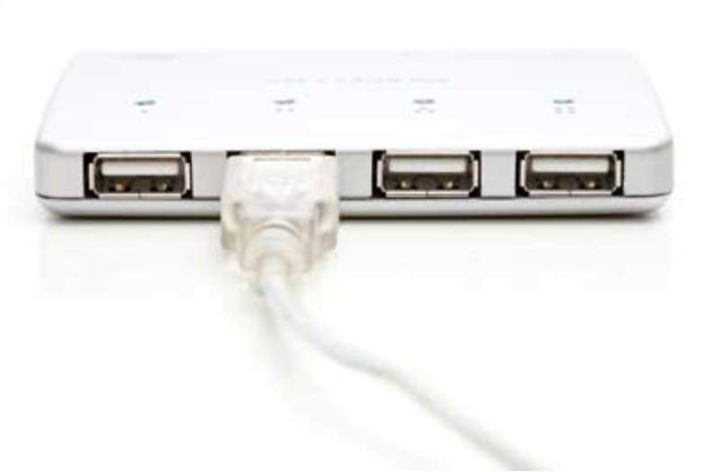
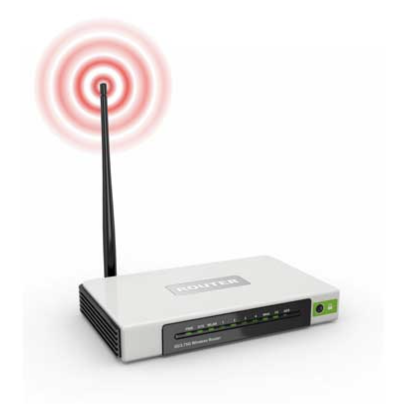
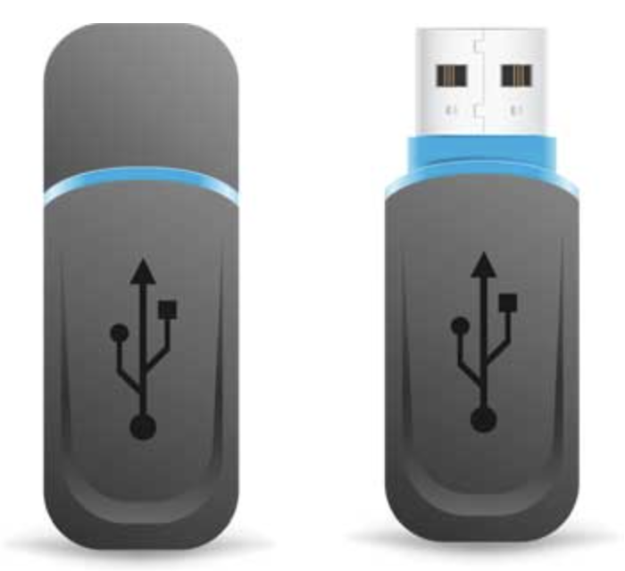
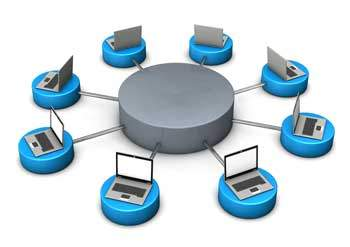

<!-- 

📋 This is the tech-news archives to help me keep track of what I am interested in!

- Reference tech news link: <https://thenextweb.com/news/blockchain-development-tech-career>
  

{{ notice-2 | markdownify }}
 -->

📋 This is my note-taking from what I learned in the class "Software Engineering Fundamentals - COMP 120-002"
{: .notice--danger}

## Operating System

&rarr; [What is an operating system?](https://www.techtarget.com/whatis/definition/operating-system-OS)

- A program that acts as an interface between the software and the computer hardware
- An integrated set of specialized programs used to manage overall resources and operations of the computer
- A specialized software that controls and monitors the execution of all other programs that reside in the computer, including application programs and other system software

### <u>Operating System Data Exchange</u>

### <u>Objectives of the Operating System</u>

- To make the computer system convenient to use in an efficient manner
- To hide the details of the hardware resources from the users
- To provide users a convenient interface to use the computer system
- To act as an intermediary between the hardware and its users, making it easier for the users to access and use other resources
- To manage the resources of a computer system
- To keep track of who is using which resource, granting resource requests, and mediating conflicting requests from different programs and users
- To provide efficient and fair sharing of resources among users and programs

### <u>Characteristics of the Operating System</u>

- Memory management:
  - Keep track of the primary memory, i.e. what part of it is in use by whom, what part is not in use, etc
  - Allocate the memory when a process or program requests it
- Processor management
  - Allocate the processor(CPU) to a process and De-allocate the processor when it is no longer required
- Device management
  - Keep track of all the devices
  - This is also called I/O controller that decides which process gets the device, when, and for how much time
- File management
  - Allocate and De-allocate the resources and decide who gets the resources
- Security
  - Prevent unauthorized access to programs and data by means of passwords and other similar techniques
- Job accounting
  - Keep track of time and resources used by various jobs and/or users
- Control over system performance
  - Record delays between the request for a service and from the system
- Interaction with the operators
  - Interaction may take place via the console of the computer in the form of instructions
  - The Operating System acknowledges the same, does the corresponding action, and informs the operator by a display screen
- Error detection aids
  - Production of dumps, traces, error messages, and other debugging and error-detecting methods
- Coordination between other software and users
  - Coordination and assignment of compilers, interpreters, assemblers, and other software to the various users of the computer systems

 

## Networking

- A Computer Networking is a system in which multiple computers are connected to each other to share information and resources

### <u>Characteristics of a Computer Network</u>

- Share resources from one computer to another
- Create files and store them in one computer, and Access those files from the other computers connected over the network
- Connect a printer, scanner, or a fax machine to one computer within the network and Let other computers of the network use the machines available over the network

### <u>The list of hardware required to set up a computer network</u>

- Network Cables

  - Network cables are used to connect computers
  - The most commonly used cable is Category 5 cable RJ-45
    

- Distributors

  - A computer can be connected to another one via a [serial port](https://static.javatpoint.com/computer/images/what-is-a-serial-port1.jpg) but if we need to connect many computers to produce a network, this serial connection will not work
  - The solution is to use a central body that can connect other computers, printers, and scanners
  - This central body then manages or distributes network traffic
    

- Routers

  - A router is a type of device which acts as the central point among computers and other devices that are a part of the network
  - It is equipped with holes called ports
  - Computers and other devices are connected to a router using network cables
  - Nowadays router comes in wireless modes using which computers can be connected without any physical cable
    

- Network Card

  - Network card is a necessary component of a computer without which a computer cannot be connected over a network
  - It is also known as the network adapter or Network Interface Card (NIC)
  - Most branded computers have network card pre-installed
  - Network cards are of two types: Internal and External Network Cards

  > Internal Network Cards
  >
  > - Motherboard has a slot for internal network card where it is to be inserted
  > - Two type of Internal network cards: 1st type using Peripheral Component Interconnect (PCI) connection and 2nd type using Industry Standard Architecture (ISA)
  > - Network cables are required to provide network access
  >   
  >
  > External Network Cards
  >
  > - External network cards are of two types: Wireless and USB based
  > - Wireless network card needs to be inserted into the motherboard, however no network cable is required to connect to the network.
  >   

- Universal Serial Bus (USB)
  - USB card is easy to use and connects via USB port
  - Computers automatically detect USB card and can install the drivers required to support the USB network card automatically
    

 

## Internet

(Background vector created by kjpargeter - www.freepik.com)

- A worldwide/global system of interconnected computer networks
- Use the standard Internet Protocol (TCP/IP)
- Every computer connected to the Internet is identified by a unique IP address
- The IP Address is a unique set of numbers (such as 110.22.33.114) which identifies a computer’s location
- A special computer DNS (Domain Name Server) is used to provide a name to the IP Address so that the user can locate a computer by a name
  - E.g. a DNS server will resolve a name https://www.centennialcollege.ca/ to a particular IP address to uniquely identify the computer on which this website is hosted
- The Internet is accessible to users all over the world who have access to a computer and a connection

 

## Intranet

- Intranet is the system in which multiple PCs are connected to each other
- PCs in intranet are not available to the world outside the intranet
- Usually each organization has its own Intranet network and members/employees of that organization can access the computers in their intranet
- Each computer in Intranet is also identified by an IP Address which is unique among the computers in that Intranet

 

## Similarities and Differences between **Internet** and **Intranet**

### <u>Similarities</u>

- Intranet uses the internet protocols such as TCP/IP and FTP
- Intranet sites are accessible via the web browser in a similar way as websites in the internet &rarr; However, only members of Intranet network can access intranet hosted sites
- In Intranet, their own instant messenger system can be used as similar to yahoo messenger/gtalk over the internet

### <u>Differences</u>

- Internet is general to PCs all over the world whereas Intranet is specific to a select number of PCs
- Internet provides a wider and better access to websites to a large population, whereas Intranet is restricted
- Internet is not as safe as Intranet, but Intranet can be safely privatized as per the need

 

---

 

    🖋️ This is my self-taught blog! Feel free to let me know
    if there are some errors or wrong parts 😆

[Back to Top](#){: .btn .btn--primary }{: .align-right}
