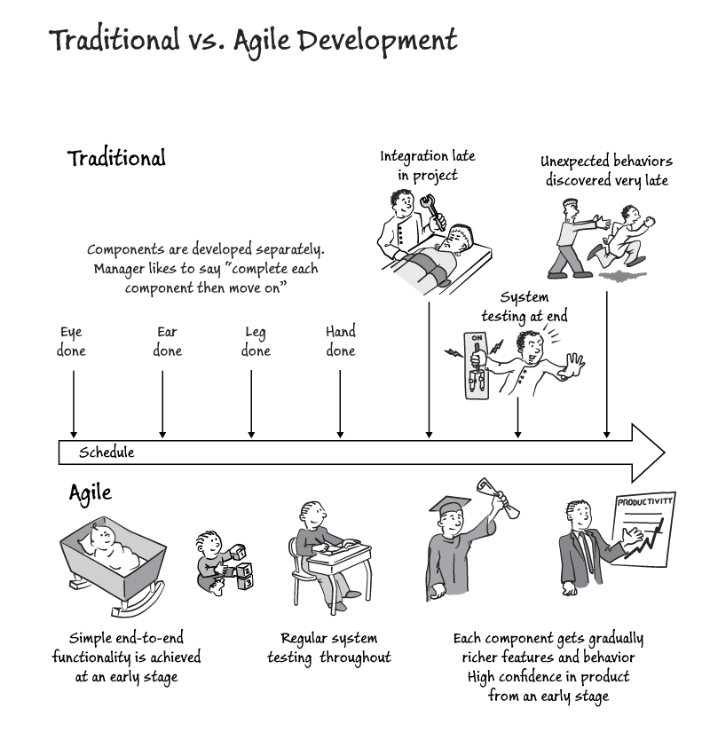
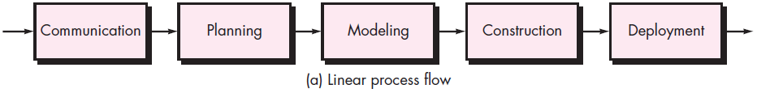
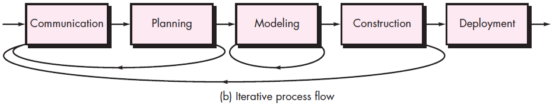
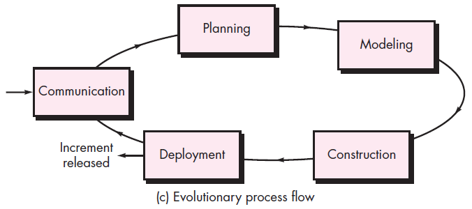
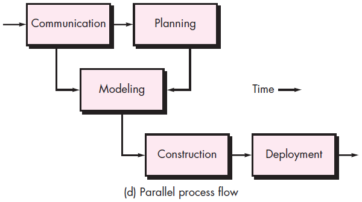
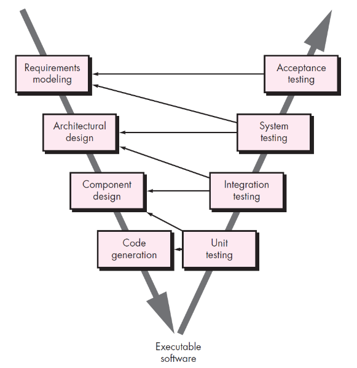

<!-- 

📋 This is the tech-news archives to help me keep track of what I am interested in!

- Reference tech news link: <https://thenextweb.com/news/blockchain-development-tech-career>
  

{{ notice-2 | markdownify }}
 -->

📋 This is my note-taking from what I learned in the class "Software Engineering Fundamentals - COMP 120-002"
{: .notice--danger}

## Software Process Models

 

## A Generic Process Model

A process is defined as a collection of work activities, actions, and tasks that are performed when some work product is to be created. Each of these activities, actions, and tasks reside within a framework or model that defines their relationship with the process and with one another.

Each framework activity is populated by a set of software engineering actions. Each software engineering action is defined by a task set that identifies the work tasks that are to be completed, the work products that will be produced, the quality assurance points that will be required, and the milestones that will be used to indicate progress.

A generic process framework for software engineering defines five framework activities:

1. Communication
2. Planning
3. Modeling
4. Construction
5. Deployment

In addition, a set of umbrella activities — project tracking and control, risk management, quality assurance, configuration management, technical reviews, and others — are applied throughout the process.

You should note that one important aspect of the software process has not yet been discussed. This aspect — called process flow — describes how the framework activities and the actions and tasks that occur within each framework activity are organized with respect to sequence and time.

 

## Process Flows

### <u>Linear Process Flow</u>

A linear process flow executes each of the five framework activities in sequence, beginning with communication and culminating with deployment.

### <u>Iterative Process Flow</u>

An iterative process flow repeats one or more of the activities before proceeding to the next.

### <u>Evolutionary Process Flow</u>

An evolutionary process flow executes the activities in a “circular” manner.

Each circuit through the five activities leads to a more complete version of the software.

### <u>Parallel Process Flow</u>

A parallel process flow executes one or more activities in parallel with other activities (e.g., modeling for one aspect of the software might be executed in parallel with construction of another aspect of the software).

 

## Identifying a Task Set

A task set defines the actual work to be done to accomplish the objectives of a software engineering action.

A task set is defined by creating several lists:

- A list of the tasks to be accomplished.
- A list of the work products to be produced.
- A list of the quality assurance filters to be applied.

### <u>List of Tasks - After SCRUM meeting</u>

[SCRUM meeting](https://www.productplan.com/glossary/scrum-meeting/)

Discussions with:

- Domain Expert
- Other developers in the team
- Business Analyst
- Professional Services
- Customer Services
- Clients
- Other stakeholders

Write a Requirement Analysis Document

 

## 5 Questions Designers Should Ask

1. Is the product satisfactory, or does it require redesign or rework?
2. Was user input solicited, to avoid the product being unsatisfactory and requiring rework?
3. Is there a need for new requirements?
4. Is the product larger than estimated?
5. Did the modules require more testing, design and implementation work to correct than expected?

 

## Process Patterns

Every software team encounters problems as it moves through the software process. It would be useful if proven solutions to these problems were readily available to the team so that the problems could be addressed and resolved quickly.

A process pattern:

1. Describes a process-related problem that is encountered during software engineering work.
2. Identifies the environment in which the problem has been encountered.
3. Suggests one or more proven solutions to the problem.

Stated in more general terms, a process pattern provides you with a template [Amb98] — a consistent method for describing problem solutions within the context of the software process.

### <u>Process Pattern Types</u>

- Stage patterns: Defines a problem associated with a framework activity for the process.
- Task patterns: Defines a problem associated with a software engineering action or work task and relevant to successful software engineering practice.
- Phase patterns: Define the sequence of framework activities that occur with the process, even when the overall flow of activities is iterative in nature.

 

## Process Assessment and Improvement

- The existence of a software process is no guarantee that software will be delivered on time, or meet the customer’s needs, or that it will exhibit long-term quality characteristics.
- Any software process can be assessed to ensure that it meets a set of basic process criteria that have been shown to be essential for successful software engineering.
- Software processes and activities should be assessed using numeric measures or software analytics (metrics).

### <u>Lists of Process Assessment and Improvement Standards</u>

- Standard CMMI Assessment Method for Process Improvement (SCAMPI)

  : Provides a five step process assessment model that incorporates five phases: initiating, diagnosing, establishing, acting and learning.

- CMM-Based Appraisal for Internal Process Improvement (CBA IPI)

  : Provides a diagnostic technique for assessing the relative maturity of a software organization; uses the SEI CMM as the basis for the assessment [Dun01]

- The SPICE (ISO/IEC15504) standard

  : The SPICE (ISO/IEC15504) standard defines a set of requirements for software process assessment. The intent of the standard is to assist organizations in developing an objective evaluation of the efficacy of any defined software process. [ISO08]

- ISO 9001:2000 for Software

  : A generic standard that applies to any organization that wants to improve the overall quality of the products, systems, or services that it provides. Therefore, the standard is directly applicable to software organizations and companies. [Ant06]

 

## Prescriptive Process Models

Prescriptive process models advocate an orderly approach to
software engineering.

That leads to a two questions:

- If prescriptive process models strive for structure and order, are they inappropriate for a software world that thrives on change?
- Yet, if we reject traditional process models (and the order they imply) and replace them with something less structured, do we make it impossible to achieve coordination and coherence in software work?

### <u>Waterfall Process Model</u>

[Another img for waterfall process model](https://e.centennialcollege.ca/content/enforced/894717-COMP120002_2023W/PastedImage_1dsgn33bn6055oeanwvwwfdy7caiu11f001101610056.png?_&d2lSessionVal=2plfkbcx6XLh1vrbneRuxm3sj&ou=894717)

The waterfall model, sometimes called the linear sequential model, suggests a systematic, sequential approach to software development that begins with customer specification of requirements and progresses through planning, modeling, construction, and deployment, culminating in ongoing support of the completed software.

Pros

- It is easy to understand and plan.
- It works for well-understood small projects.
- Analysis and testing are straightforward.

Cons

- It does not accommodate change well.
- Testing occurs late in the process.
- Customer approval is at the end.

<u>V-model</u>

A variation in the representation of the waterfall model is called the V-model.

This model depicts the relationship of quality assurance actions to the actions associated with communication, modeling, and early construction activities. As a software team moves down the left side of the V, basic problem requirements are refined into progressively more detailed and technical representations of the problem and its solution. Once code has been generated, the team moves up the right side of the V, essentially performing a series of tests (quality assurance actions) that validate each of the models created as the team moved down the left side. In reality, there is no fundamental difference between the linear sequential model and the V-model. The V-model provides a way of visualizing how verification and validation actions are applied to earlier engineering work.

The waterfall model is the oldest example of software engineering. However, over the past three decades, criticism of this process model has caused even ardent supporters to question its efficacy. Among the problems that are sometimes encountered when the waterfall model is applied are:

1.  Real projects rarely follow the sequential flow that the model proposes.
2.  It is often difficult for the customer to state all requirements explicitly at the beginning of most projects.
3.  The customer must have patience because a working version of the program(s) will not be available until late in the project time span.
4.  Major errors may not be detected until the working program is reviewed.

Today, software work is fast-paced and subject to a never-ending stream of changes (to features, functions, and information content). The waterfall model is often inappropriate for such work.

### <u>Prototyping Process Model</u>

[Another img for prototyping process model](https://us-west-1.cdn.h5p.com/orgs/1290873738221756388/organization/content/1291090865996661988/images/file-5f3a1878069db.png)

Often, a customer defines a set of general objectives for software, but does not identify detailed requirements for functions and features. In other cases, the developer may be unsure of other variables in the program. In these, and many other situations, a prototyping paradigm may offer the best approach.

Although prototyping can be used as a stand-alone process model, it is more commonly used as a technique that can be implemented within the context of any one of the process models noted in this chapter. This model helps you and other stakeholders to better understand what is to be built when requirements are fuzzy.

1. The prototyping paradigm begins with communication. You meet with other stakeholders to define the overall objectives for the software, identify whatever requirements are known, and outline areas where further definition is mandatory.
2. A prototyping iteration is planned quickly, and modeling (in the form of a “quick design”) occurs.
3. A quick design focuses on a representation of those aspects of the software that will be visible to end users (e.g., human interface layout or output display formats).
4. The quick design leads to the construction of a prototype.
5. The prototype is deployed and evaluated by stakeholders, who provide feedback that is used to further refine requirements. &rarr; Iteration occurs as the prototype is tuned to satisfy the needs of various stakeholders, while at the same time enabling you to better understand what needs to be done.

Pros

- Reduced impact of requirement changes.
- Customer is involved early and often.
- Works well for small projects.
- Reduced likelihood of product rejection.

Cons

- Customer involvement may cause delays.
- Temptation to “ship” a prototype.
- Work lost in a throwaway prototype.
- Hard to plan and manage.

Ideally, the prototype serves as a mechanism for identifying software requirements. If a working prototype is to be built, you can make use of existing program fragments or apply tools. It's benefits are in that users can get a feel for the actual system, and developers get to build something immdiately.

However, prototyping has a couple of drawbacks:

1. Stakeholders see what appear to be a working version of the software, and not understand that the architecture is still evolving, and was not created with overall quality or long-term mantainability in mind.
2. As a software engineer, implementation compromises may have been made to get a prototype working quickly. If you aren't careful, these less-than-deal choices will become an integral part of the evolving system.

The key to mitigating these problems is to be clear about the purposes of the prototype at the beginning with all stakeholders; that they agree the prototype was created partly to be a mechanism for defining requirements. It is tempting to design a prototype that can be evolved into the final product, but the reality is that developers may have to discard all or parts of a prototype to better meet the customer's evolving needs.

### <u>Evolutionary(Spiral) Process Model</u>

[Another img for evolutionary process model](https://e.centennialcollege.ca/content/enforced/894717-COMP120002_2023W/PastedImage_7o40wurb0i24hd6hjfevyfm9n66fb7rk001101772035.png?_&d2lSessionVal=2plfkbcx6XLh1vrbneRuxm3sj&ou=894717)

Software, like all complex systems, evolves over a period of time. Business and product requirements often change as development proceeds, making a straight line path to an end product unrealistic. It might be possible to create a limited version of a product to meet competitive or business pressure and release a refined version once all system features are better understood. In a situation like this you need a process model that has been explicitly designed to accommodate a product that evolves over time.

Originally proposed by Barry Boehm, the spiral model is an evolutionary software process model that couples the iterative nature of prototyping with the controlled and systematic aspects of the waterfall model. It provides the potential for rapid development of increasingly more complete versions of the software.

Using the spiral model, software is developed in a series of evolutionary releases. During early iterations, the release might be a model or prototype. During later iterations, increasingly more complete versions of the engineered system are produced.

Pros

- Continuous customer involvement.
- Development risks are managed.
- Suitable for large, complex projects.
- It works well for extensible products.

Cons

- Risk analysis failures can doom the project.
- Project may be hard to manage.
- Requires an expert development team.

A spiral model is divided into a set of framework activities defined by the software engineering team.

Each of the framework activities represent one segment of the spiral path. As this evolutionary process begins, the software team performs activities that are implied by a circuit around the spiral in a clockwise direction, beginning at the center. Risk is considered as each revolution is made.

Anchor point milestones — a combination of work products and conditions that are attained along the path of the spiral — are noted for each evolutionary pass.

The first circuit around the spiral (beginning at the inside streamline nearest the center,) might result in the development of a product specification; subsequent passes around the spiral might be used to develop a prototype and then progressively more sophisticated versions of the software. Each pass through the planning region results in adjustments to the project plan. Cost and schedule are adjusted based on feedback derived from the customer after delivery. In addition, the project manager adjusts the planned number of iterations required to complete the software.

Unlike other process models that end when software is delivered, the spiral model can be adapted to apply throughout the life of the computer software. The spiral model is a realistic approach to the development of large-scale systems and software. It uses prototyping as a risk reduction mechanism.

But like other models, the spiral model is not perfect. It may be difficult to convince customers that the evolutionary approach is controllable. It demands considerable risk assessment expertise for success. If a major risk is not found and managed, problems will occur.

The intent of evolutionary models is to develop high-quality software in an iterative or incremental manner. However, it is possible to use an evolutionary process to emphasize flexibility, extensibility, and speed of development. The challenge for software teams and managers is to establish a proper balance between these critical project and product parameters and customer satisfaction.

### <u>Unified Process Model (UP)</u>

[Another img for unified process model](https://us-west-1.cdn.h5p.com/orgs/1290873738221756388/organization/content/1291091363983616458/images/file-5f3c7984812b0.png)

In some ways the Unified Process is an attempt to draw on the best features and characteristics of traditional software process models, but characterize them in a way that implements many of the best principles of agile software development. It is a a “use-case driven, architecture-centric, iterative and incremental” software process closely aligned with the Unified Modeling Language (UML)

The Unified Modeling Language contains notation for the modeling and development of object-oriented systems and has become the industry standard for modeling software of all types.

<u>UP Phases</u>

It is likely that at the same time the construction, transition, and production phases are being conducted, work may have already begun on the next software increment. This means that the five UP phases do not occur in a sequence, but rather with staggered concurrency.

1. The inception phase
   : - The inception phase of UP is where the customer communication and planning takes place.
   : - Fundamental business requirements are described through a set of preliminary use cases that describe which features and functions of each major class of users desires that will become realized in the software architecture.
   : - Planning identifies resources, assesses major risks, and defines a preliminary schedule for the software increments.

2. The elaboration phase
   : - The elaboration phase encompasses the communication and modeling activities of the generic process model.
   : - Elaboration refines and expands the prelimi-nary use cases that were developed as part of the inception phase and expands the architectural representation to include five different views of the software — the use case model, the analysis model, the design model, the implementation model, and the deployment model.
   : - Modifications to the plan are often made at this time.

3. The construction phase
   : - The construction phase of the UP is identical to the construction activity defined for the generic software process.
   : - All necessary and required features and functions for the software increment (i.e., the release) are then implemented in source code. As components are being implemented, unit tests21 are designed and executed for each.
   : - In addition, integration activities (component assembly and integration testing) are conducted. Use cases are used to derive a suite of acceptance tests that are executed prior to the initiation of the next UP phase.

4. The transition phase
   : - The transition phase of the UP encompasses the latter stages of the generic con-struction activity and the first part of the generic deployment (delivery and feedback) activity.
   : - Software and supporting documentation is given to end users for beta testing, and user feedback reports both defects and necessary changes.
   : - At the conclusion of the transition phase, the software increment becomes a useable software release.

5. The production phase
   : - The production phase of the UP coincides with the deployment activity of the generic process.
   : - During this phase, the ongoing use of the software is monitored, support for the operating environment (infrastructure) is provided, and defect reports and requests for changes are submitted and evaluated.

Pros

- Quality documentation emphasized.
- Continuous customer involvement.
- Accommodates requirements changes.
- Works well for maintenance projects.

Cons

- Use cases are not always precise.
- Tricky software increment integration.
- Overlapping phases can cause problems.
- Requires expert development team.

<u>UP Work Products</u>

1. Inception Phase

   - Vision document
   - Initial use-case model
   - Initial project glossary
   - Initial business case
   - Initial risk assessment
   - Project plan, phases and iterations
   - Business model, if necessary
   - One or more prototypes

2. Elaboration Phase

   - Use-case model
   - Supplementary requirements including non-functional
   - Analysis model
   - Software architecture description
   - Executable architectural prototype
   - Preliminary design model
   - Revised risk list
   - Project plan including:
     : - iteration plan
     : - adapted workflows
     : - milestones
     : - technical work products
   - Preliminary user manual

3. Construction Phase

   - Design model
   - Software components
   - Integrated software increment
   - Test plan and procedure
   - Test cases
   - Support documentation:
     : - user manuals
     : - installation manuals
     : - description of current increment

4. Transition Phase

   - Delivered software increment
   - Beta test reports
   - General user feedback

### <u>Incremental Process Model</u>

The incremental model combines elements of linear and parallel process flows. The incremental model applies linear sequences in a staggered fashion as calendar time progresses. Each linear sequence produces deliverable “increments” of the software in a manner that is similar to the increments produced by an evolutionary process flow.

When an incremental model is used, the first increment is often a core product. That is, basic requirements are addressed but many supplementary features (some known, others unknown) remain undelivered. The core product is used by the customer (or undergoes detailed evaluation). As a result of use and/or evaluation, a plan is developed for the next increment. The plan addresses the modification of the core product to better meet the needs of the customer and the delivery of additional features and functionality. This process is repeated following the delivery of each increment, until the complete product is produced.

The incremental process model focuses on the delivery of an operational product with each increment. Early increments are stripped-down versions of the final product, but they do provide capability that serves the user and also provide a platform for evaluation by the user.

<u>Iterative and Incremental Delivery</u>

Iterative

- Develop through repeated cycles
- Start simple, expecting to change
- Used to find the right solution (fail early)
- Used to improve the candidate solution

Incremental

- Develop smaller portions at a time
- Gradually build up functionality
- Allows value to be delivered early

### <u>Concurrent Process Model</u>

The concurrent development model, sometimes called concurrent engineering, allows a software team to represent iterative and concurrent elements of any of the process models described in this chapter. For example, the modeling activity defined for the spiral model is accomplished by invoking one or more of the following software engineering actions: prototyping, analysis, and design.

The above graphic provides a schematic representation of one software engineering activity within the modeling activity using a concurrent modeling approach. The activity — modeling — may be in any one of the states noted at any given time. Similarly, other activities, actions, or tasks (e.g., communication or construction) can be represented in an analogous manner. All software engineering activities exist concurrently but reside in different states.

Concurrent modeling defines a series of events that will trigger transitions from state to state for each of the software engineering activities, actions, or tasks. For example, during early stages of design (a major software engineering action that occurs during the modeling activity), an inconsistency in the requirements model is uncovered. This generates the event analysis model correction, which will trigger the requirements analysis action from the done state into the awaiting changes state.

Concurrent modeling is applicable to all types of software development and provides an accurate picture of the current state of a project. Rather than confining software engineering activities, actions, and tasks to a sequence of events, it defines a process network. Each activity, action, or task on the network exists simultaneously with other activities, actions, or tasks. Events generated at one point in the process network trigger transitions among the states.

### <u>Other Process Models</u>

1. Component based development: the process to apply when reuse is a development objective

2. Formal methods: emphasizes the mathematical specification of requirements

3. AOSD: provides a process and methodological approach for defining, specifying, designing, and constructing aspects

 



## Questions!!

1. Which model gets approval from the customer at the end?
   : - Waterfall model &rarr; The customer gives approval at the end of the waterfall model, which is a disadvantage.
2. What actions are appropriate for a framework activity, given the nature of the problem to be solved, the characteristics of the people doing the work, and the stakeholders who are sponsoring the project?
   : - Connecting consistently with the stakeholders through phone and email. &rarr; Connecting consistently with the stakeholders through phone and email is the appropriate action.
3. UML stands for?
   : - Unified Modeling Language &rarr; UML stands for Unified Modeling Language



{{ notice-2 | markdownify }}

 

## Networking and its types (LAN, WAN, WLAN, MAN, SAN, PAN, EPN & VPN)

### <u>Networking</u>

: A Computer Networking is a system in which multiple computers are connected to each other to share information and resources. A computer network is a collection of interconnected computers that share information. The term "network" can refer to either computer physical connections or conceptual interconnections between system components.

### <u>Types of Networking</u>

1. [LAN](https://www.heavy.ai/technical-glossary/local-area-network)
   : A LAN is a computer network consisting of switches that allow access points, cables, routers, and devices to connect to web servers and internal servers within a single building, campus, or home network. Devices on a LAN (typically personal computers and workstations) can share and access files with each other over a single Internet connection.
   

2. [WAN](https://www.edrawsoft.com/wan-diagrams.html)
   : Wide-area networks (also known as WANs) are large computer networks that are not connected in one place. WAN providers allow WANs to communicate, share information, and more among devices worldwide. Because the Internet is the world's largest WAN, it is critical for multinational corporations and necessary for everyday use.
   

3. [WLAN](https://www.conceptdraw.com/examples/wireless-wlan)
   : Wireless Local Area Network (WLAN) is a wireless deployment method for two or more devices. WLANs use high-frequency radio waves and often include access points to the Internet. WLANs allow users to move through coverage areas (typically homes or small offices) while maintaining network connectivity.
   

4. [MAN](https://www.techtarget.com/searchnetworking/definition/metropolitan-area-network-MAN)
   : A metropolitan area network traditionally refers to a network of personal data used by a single organization of several buildings or by multiple interconnected organizations in the same geographical neighborhood. It is larger than a single building's LAN, but not large enough to be considered a WAN. The size is usually between 5 and 50 kilometers. If all buildings are in a single adjacent building, they can also be considered campus networks.
   

5. [SAN](https://www.techtarget.com/searchstorage/definition/storage-area-network-SAN)
   : A storage area network (SAN) is a dedicated high-speed network or subnetwork that interconnects and provides shared pools of storage devices to multiple servers. SAN technology addresses advanced enterprise storage needs by providing a separate, highly scalable, dedicated, high-performance network designed to interconnect multiple servers to a variety of storage devices.
   

6. [PAN](https://www.cloudflare.com/learning/network-layer/what-is-a-personal-area-network/)
   : A private area network (PAN) connects electronic devices in the area directly next to the user. PANs vary in size from a few centimeters to a few meters. One of the most common real-world examples of PAN is the connection between Bluetooth earphones and smartphones. PAN can also connect laptops, tablets, printers, keyboards, and other computerized devices.
   

7. [EPN](https://www.investopedia.com/terms/e/epn.asp)
   : An enterprise private network is a computer network that enables companies with many different offices to securely connect these offices to each office over the network. Enterprise-only networks are primarily set up to share computer resources.
   

8. [VPN](https://www.kaspersky.com/resource-center/definitions/what-is-a-vpn)
   : VPN stands for "Virtual Private Network," which describes the opportunity to establish a protected network connection when using a public network. VPNs encrypt Internet traffic and disguise online IDs. This makes it more difficult for third parties to track your activities online and steal your data. Encryption occurs in real time.
   

 

---

 

    🖋️ This is my self-taught blog! Feel free to let me know
    if there are some errors or wrong parts 😆

[Back to Top](#){: .btn .btn--primary }{: .align-right}
