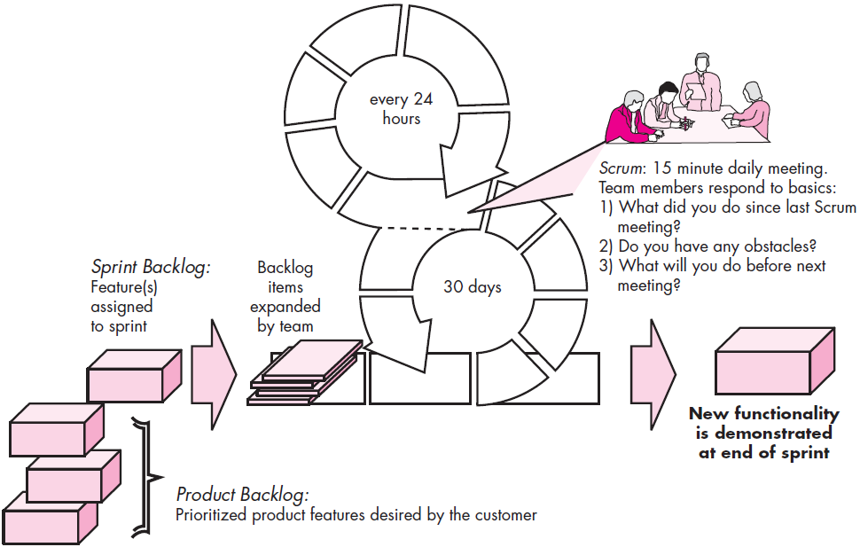
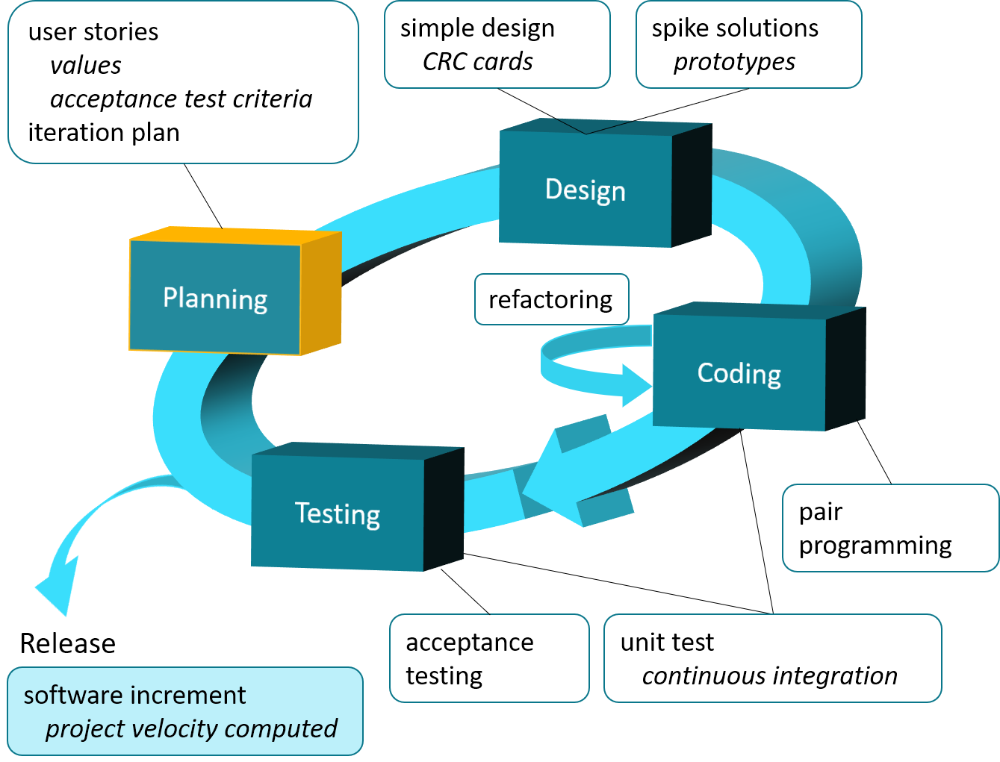
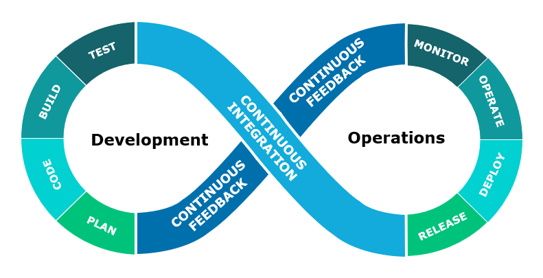
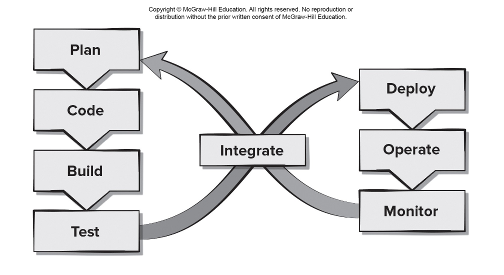

<!-- 

📋 This is the tech-news archives to help me keep track of what I am interested in!

- Reference tech news link: <https://thenextweb.com/news/blockchain-development-tech-career>
  

{{ notice-2 | markdownify }}
 -->

📋 This is my note-taking from what I learned in the class "Software Engineering Fundamentals - COMP 120-002"
{: .notice--danger}

## The Manifesto for Agile Software Development

"We are uncovering better ways of developing software by doing it and helping others do it.

Through this work we have come to value:

- <u>Individuals and interactions</u> over processes and tools
- <u>Working software</u> over comprehensive documentation
- <u>Customer collaboration</u> over contract negotiation
- <u>Responding to change</u> over following a plan

That is, while there is value in the items on the right, we value the items on the left more."

\- Kent Beck et al

 

## What is "Agility"?

According to Ivar Jacobson, the prevalence of change is the primary driver for agility. But agility is not just effective (rapid and adaptive) response to change.

It also encompasses the philosophy stated above which includes:

- Effective (rapid and adaptive) response to change.
- Effective communication among all stakeholders.
- Includes the customer as part of the development team.
- Drawing the customer onto the team.
- Organizing a team so that it is in control of the work performed.

This yields:

- Rapid, incremental delivery of software.

 

## Agility and Cost of Change

It is generally known and proven in software development that the cost of change increases nonlinearly as a project progresses, as shown with the solid black line in the graph. Accommodating change is easier in the early stages of a project, when the time and work required to implement the change is minimal and will not impact the outcome of the project. But implementing a change in the middle or later in a project may require major changes to the core design of the software, constructing new components and/or modifying existing components, new tests need to be created, and so on. Costs escalate quickly, and the time and effort required to ensure the change is made without unintended side effects are nontrivial.

Supporters of agility argue that a well-designed agile process flattens the cost of change curve, as indicated by the solid pink line. Agility allows a software team to accommodate changes later in the project without dramatic cost and time impact.

 

## What is an Agile Process?

Any agile software process is characterized in a manner that addresses a number of key assumptions about the majority of software projects:

1. It is difficult to predict in advance which software requirements will persist and which will change. It is equally difficult to predict how customer priorities will change as the project proceeds.
2. For many types of software, design and construction are interwoven. That is, both activities should be performed in tandem so that design models are proven as they are created. It is difficult to predict how much design is necessary before construction is used to prove the design.
3. Analysis, design, construction, and testing are not as predictable (from a planning point of view) as we might like.

Given these three assumptions, an important question arises: How do we create a process that can manage unpredictability?

The answer lies in process adaptability (to rapidly changing project and technical conditions). An agile process, therefore, must be adaptable.

### <u>An Agile Process</u>

- Is driven by customer descriptions of what is required (scenarios).
- Customer feedback is frequent and acted on.
- Recognizes that plans are short-lived.
- Develops software iteratively with a heavy emphasis on construction activities.
- Delivers multiple ‘software increments’ as executable prototypes.
- Adapts as project or technical changes occur.

 

## 12 Agility Principles

1. Our highest priority is to satisfy the customer through early and continuous delivery of valuable software.
2. Welcome changing requirements, even late in development. Agile processes harness change for the customer's competitive advantage.
3. Deliver working software frequently, from a couple of weeks to a couple of months, with a preference to the shorter timescale.
4. Business people and developers must work together daily throughout the project.
5. Build projects around motivated individuals. Give them the environment and support they need, and trust them to get the job done.
6. The most efficient and effective method of conveying information to and within a development team is face–to–face conversation.
7. Working software is the primary measure of progress.
8. Agile processes promote sustainable development. The sponsors, developers, and users should be able to maintain a constant pace indefinitely.
9. Continuous attention to technical excellence and good design enhances agility.
10. Simplicity – the art of maximizing the amount of work not done – is essential.
11. The best architectures, requirements, and designs emerge from self–organizing teams.
12. At regular intervals, the team reflects on how to become more effective, then tunes and adjusts its behavior accordingly.

> - Customer satisfaction is achieved by providing value through software that is delivered to the customer as rapidly as possible.
> - Develop recognize that requirements will change and welcome changes.
> - Deliver software increments frequently (weeks not months) to stakeholders to ensure feedback on their deliveries is meaningful.
> - Agile team populated by motivated individuals using face-to- face communication to convey information.
> - Team process encourages technical excellence, good design, simplicity, and avoids unnecessary work.
> - Working software that meets customer needs is the primary goal.
> - Pace and direction of the team’s work must be “sustainable,” enabling them to work effectively for long periods of time.
> - An agile team is a “self-organizing team”—one that can be trusted develop well-structured architectures that lead to solid designs and customer satisfaction.
> - Part of the team culture is to consider its work introspectively with the intent of improving how to become more effective its primary goal (customer satisfaction).

 

## Human Factors

Agile development focuses on the talents and skills of individuals. The process molds to the needs of the people and team, not the other way around.

Key traits must exist among the people on an agile team and the team itself:

### 1. Competence

This encompasses innate talent, specific software-related skills, and overall knowledge of the process that the team has chosen to apply. Skill and knowledge of process can and should be taught to all people who serve as agile team members.

### 2. Common focus

All should be focused on one goal — to deliver a working software increment to the customer within the time promised. To achieve this goal, the team will also focus on continual adaptations (small and large) that will make the process fit the needs of the team.

### 3. Collaboration

Software engineering is about assessing, analyzing, and using information that is communicated to the software team; creating information that will help all stakeholders understand the work of the team; and building information that provides business value for the customer. To accomplish these tasks, team members must collaborate — with one another and all other stakeholders.

### 4. Decision-making ability

A good team must be allowed the freedom to control its own destiny. This means that the team should be given autonomy — decision-making authority for both technical and project issues.

### 5. Fuzzy problem-solving ability

Part of being in an agile team is recognizing that that the problem they are solving today may not be the problem that needs to be solved tomorrow, and to continually have to deal with ambiguity and changes.

### 6. Mutual trust and respect

A properly formed team exhibits the trust and respect that are necessary to make them so strongly knit that the whole is greater than the sum of the parts.

### 7. Self-organization

Self-organization implies three things:

1. The agile team organizes itself for the work to be done.
2. The team organizes the process to best accommodate its local environment.
3. The team organizes the work schedule to best achieve delivery of the software increment.

Self-organization serves to improve collaboration and boost team morale. In essence, the team serves as its own management.

 

## Scrum

A very popular agile software development method, originally proposed by Sutherland, and further developed by Schwaber and Beedle.

Scrum incorporates the following framework activities: "requirements", "analysis", "design", "evolution", and "delivery".

The scrum process involves:

- Sprint Planning Meetings
- Daily Scrum Meetings
- Sprint Review Meetings
- Sprint Retrospective

Some of the distinguishing features if the Scrum process includes:

- Development work is partitioned into "packets".
- "Testing and documentation are on-going" as the product is constructed.
- Work occurs in "sprints" and is derived from a "backlog" of existing requirements.
- "Meetings are very short" and sometimes conducted without chairs.
- "Demos" are delivered to the customer with the time-box allocated.

[What is Scrum?](https://youtu.be/TRcReyRYIMg)

### <u>Scrum Details</u>

- Backlog Refinement Meeting Developers work with stakeholders to create product backlog.
- Sprint Planning Meeting Backlog partitioned into “sprints” derived from backlog and next sprint defined.
- Daily Scrum Meeting Team members synchronize their activities and plan work day (15 minutes max).
- Sprint Review Prototype “demos” are delivered to the stakeholders for approval or rejection.
- Sprint Retrospective After sprint is complete, team considers what went well and what needs improvement.

<u>Pros</u>

- Product owner sets priorities.
- Team owns decision making.
- Documentation is lightweight.
- Supports frequent updating.

<u>Cons</u>

- Difficult to control the cost of changes.
- May not be suitable for large teams.
- Requires expert team members.

 

## Extreme Programming (XP)

The one of the most widely used agile approaches to agile software development, originally proposed by Kent Beck.

Extreme Programming encompasses a set of rules and practices that occur within the context of four framework activities: planning, design, coding, and testing.

%20Framework.png>)

1. Planning
   : - Begins with the creation of <u>“user stories”</u>
   : - Agile team assesses each story and assigns a <u>cost</u>
   : - Stories are grouped to for a <u>deliverable increment</u>
   : - A <u>commitment</u> is made on delivery date
   : - After the first increment <u>“project velocity”</u> is used to help define subsequent delivery dates for other increments
2. Design
   : - Follows the <u>KISS principle</u>
   : - Encourage the use of <u>CRC cards</u> (see Chapter 8)
   : - For difficult design problems, suggests the creation of <u>“spike solutions”</u> — a design prototype
   : - Encourages <u>“refactoring”</u> — an iterative refinement of the internal program design
3. Coding
   : - Recommends the <u>construction of a unit test</u> for a store before coding commences
   : - Encourages <u>“pair programming”</u>
4. Testing
   : - All <u>unit tests are executed daily</u>
   : - <u>“Acceptance tests”</u> are defined by the customer and excuted to assess customer visible functionality

### <u>XP Details</u>

- XP Planning – Begins with user stories, team estimates cost, stories grouped into increments, commitment made on delivery date, computer project velocity.
- XP Design – Follows KIS principle, encourages use of CRC cards, design prototypes, and refactoring.
- XP Coding – construct unit tests before coding, uses pair.
- XP Testing – unit tests executed daily, acceptance tests define by customer.

<u>Pros</u>

- Emphasizes customer involvement.
- Establishes rational plans and schedules.
- High developer commitment to the project.
- Reduced likelihood of product rejection.

<u>Cons</u>

- Temptation to “ship” a prototype.
- Requires frequent meetings about increasing costs.
- Allows for excessive changes.
- Depends on highly skilled team members.

 

## Industrial XP (IXP)

An organic evolution of XP, but IXP has greater inclusion of management, expanded customer roles, and upgraded technical practices.

IXP incorporates six new practices:

### 1. Readiness assessment

The assessment ascertains whether

1. An appropriate development environment exists to support IXP.
2. The team will be populated by the proper set of stakeholders.
3. The organization has a distinct quality program and supports continuous improvement.
4. The organizational culture will support the new values of an agile team.
5. The broader project community will be populated appropriately.

### 2. Project community

When XP is to upscaled for a large organization, the concept of the “team” should become more of a community.

A community may have a technologist and customers who are central to the success of a project as well as many other stakeholders (e.g., legal staff, quality auditors, manufacturing or sales types) who “are often at the periphery of an IXP project yet they may play important roles on the project” [Ker05].

### 3. Project chartering

The IXP team assesses the project itself to determine whether an appropriate business justification for the project exists and whether the project will further the overall goals and objectives of the organization.

Chartering also examines the context of the project to determine how it complements, extends, or replaces existing systems or processes.

### 4. Test-driven management

An IXP project requires measurable criteria for assessing the state of the project and the progress that has been made to date.

Test-driven management establishes a series of measurable “destinations” [Ker05] and then defines mechanisms for determining whether or not these destinations have been reached.

### 5. Retrospectives

An IXP team conducts a specialized technical review after a software increment is delivered. Called a retrospective, the review examines “issues, events, and lessons-learned” [Ker05] across a software increment and/or the entire software release. The intent is to improve the IXP process.

### 6. Continuous learning

Because learning is a vital part of continuous process improvement, members of the XP team are encouraged to learn new methods and techniques that can lead to a higher quality product.

 

## Agile Modeling

Originally proposed by Scott Ambler, he describes agile modeling in the following way:

> "Agile Modeling (AM) is a practice-based methodology for effective modeling and documentation of software-based systems. Simply put, Agile Modeling (AM) is a collection of values, principles, and practices for modeling software that can be applied on a software development project in an effective and light-weight manner. Agile models are more effective than traditional models because they are just barely good, they don’t have to be perfect."
>
> \- Scott Ambler

Although AM suggests a wide array of “core” and “supplementary” modeling principles, those that make AM unique are:

### 1. Model with a purpose

A developer who uses AM should have a specific goal (e.g., to communicate information to the customer or to help better understand some aspect of the software) in mind before creating the model.

### 2. Use multiple models

There are many different models and notations that can be used to describe software. Only a small subset is essential for most projects. AM suggests that to provide needed insight, each model should present a different aspect of the system and only those models that provide value to their intended audience should be used.

### 3. Travel light

Every work product that is kept must be maintained as changes occur. This represents work that slows the team down. As software engineering work proceeds, keep only those models that will provide long-term value and jettison the rest.

### 4. Content is more important than representation

Modeling should impart information to its intended audience. A syntactically perfect model that imparts little useful content is not as valuable as a model with flawed notation that nevertheless provides valuable content for its audience.

### 5. Know the models and the tools you use to create them

Understand the strengths and weaknesses of each model and the tools that are used to create it.

### 6. Adapt locally

The modeling approach should be adapted to the needs of the agile team.

 

## Agile Unified Process

By adopting the classic UP phased activities — <u>inception, elaboration, construction, and transition</u> — AUP provides a serial overlay (i.e., a linear sequence of software engineering activities) that enables a team to visualize the overall process flow for a software project. However, within each of the activities, the team iterates to achieve agility and to deliver meaningful software increments to end users as rapidly as possible.

Each AUP iteration addresses these activities:

- <u>Modeling.</u> UML representations of the business and problem domains are created. However, to stay agile, these models should be “just barely good enough” [Amb06] to allow the team to proceed.
- <u>Implementation.</u> Models are translated into source code.
- <u>Testing.</u> Like XP, the team designs and executes a series of tests to uncover errors and ensure that the source code meets its requirements.
- <u>Deployment.</u> Like the generic process activity discussed in Week 5, deployment in this context focuses on the delivery of a software increment and the acquisition of feedback from end users.
- <u>Configuration and project management.</u> In the context of AUP, configuration management addresses change management, risk management, and the control of any persistent work products that are produced by the team. Project management tracks and controls the progress of the team and coordinates team activities.
- <u>Environment management.</u> Environment management coordinates a process infrastructure that includes standards, tools, and other support technology available to the team.

 

## Kanban

Kanban describes methods for improving any process or workflow. Kanban is focused on change management and service delivery. It originated at Toyota and is comprised of six core practices:

1. Visualizing with a Kanban board
   : - The Kanban board is organized into columns representing the development stage for each element of software functionality. The cards on the board might contain single user stories or recently discovered defects, and the team would advance them from "To do, "Doing", and "Done" as the project progresses.
   : - Examples of software that supports kanban development projects include GitHub, Jira, and Trello.
2. Limiting WIP
   : - Developers are encouraged to complete their current task before starting another, to limit the amount of work in progress (WIP) at any given time.
   : - This reduces lead time, improves work quality, and increases the team's ability to deliver software functionality frequently to their stakeholders.
3. Managing workflow
   : - Managing workflow to reduce waste by understanding the current value flow, analyzing places where it is stalled, defining changes, and then implementing the changes.
4. Having defined process policies
   : - Making process policies explicit (e.g. write down your reasons for selecting items to work on and the criteria used to define "Done".)
5. Continuous improvement
   : - Focusing on continuous improvement by creating feedback loops where changes are introduced based on process data and the effects of the change on the process are measured after the changes are made.
6. Collaboration
   : - Make process changes collaboratively and involve all team members and other stakeholders as needed.

### <u>Kanban Details</u>

- Visualizing workflow using a Kanban board.
- Limiting the amount of work in progress at any given time.
- Managing workflow to reduce waste by understanding the current value flow.
- Making process policies explicit and the criteria used to define “done”.
- Focusing on continuous improvement by creating feedback loops where changes are introduced.
- Make process changes collaboratively and involve all stakeholders as needed.

<u>Pros</u>

- Lower budget and time requirements.
- Allows early product delivery.
- Process policies written down.
- Continuous process improvement.

<u>Cons</u>

- Team collaboration skills determine success.
- Poor business analysis can doom the project.
- Flexibility can cause developers to lose focus.
- Developer reluctance to use measurement.

 

## DevOps

DevOps was created to combine Development and Operations. It attempts to apply agile development principles across the entire software supply chain.

The DevOps approach involves several stages that loop continuously until the desired product exists:

- <u>Continuous development.</u> Software deliverables are broken down and developed in multiple sprints with the increments delivered to the quality assurance members of the development team for testing.
- <u>Continuous testing.</u> Automated testing tools are used to help team members test multiple code increments at the same time to ensure they are free of defects prior to integration.
- <u>Continuous integration.</u> The code pieces with new functionality are added to the existing code and to the runtime environment and then checked to ensure there are no errors after deployment.
- <u>Continuous deployment.</u> At this stage the integrated code is deployed (installed) to the production environment, which might include multiple sites globally that need to be prepared to receive the new funcitonality.
- <u>Continuous monitoring.</u> Operations staff who are members of the development team to help improve software quality by monitoring its performance in the production environment and proactively looking for possible problems before users find them.

### <u>DevOps Details</u>

- Continuous development. Software delivered in multiple sprints.
- Continuous testing. Automated testing tools used prior to integration.
- Continuous integration. Code pieces with new functionality added to existing code running code.
- Continuous deployment. Integrated code is deployed to the production environment.
- Continuous monitoring. Team operations staff members proactively monitor software performance in the production environment.

<u>Pros</u>

- Reduced time to code deployment.
- Team has developers and operations staff.
- Team has end-to-end project ownership.
- Proactive monitoring of deployed product.

<u>Cons</u>

- Pressure to work on both old and new code.
- Heavy reliance on automated tools to be effective.
- Deployment may affect the production environment.
- Requires an expert development team.

 

## Characteristics of Agile Models

### <u>Agile</u>

1. Not suitable for large high-risk or mission critical projects.
2. Minimal rules and minimal documentation.
3. Continuous involvement of testers.
4. Easy to accommodate product changes.
5. Depends heavily on stakeholder interaction.
6. Easy to manage.
7. Early delivery of partial solutions.
8. Informal risk management.
9. Built-in continuous process involvement.

### <u>Spiral</u>

1. Not suitable for small, low-risk projects.
2. Several steps required, along with documentation done up front.
3. Early involvement of testers (might be done by outside team).
4. Hard to accommodate product changes until prototype completed.
5. Continuous stakeholder involvement in planning and risk assessment.
6. Requires formal project management and coordination.
7. Project end not always obvious.
8. Good risk management.
9. Process improvement handled at end of project.

 

## Best Practices

1. Encourage active stakeholder participation by matching their availability and valuing their input.
2. Use simple models (e.g., Post-It notes, fast sketches, user stories) to reduce barriers to participation.
3. Take time to explain your requirement representation techniques before using them.
4. Adopt stakeholder terminology, and avoid technical jargon whenever possible.
5. Use a breadth-first approach to get the big picture of the project done before getting bogged down in details.
6. Allow the development team to refine (with stakeholder input) requirement details "just in time" as user stories are scheduled to be implemented.
7. Treat the list of features to be implemented like a prioritized list, and implement the most important user stories first.
8. Collaborate closely with your stakeholders and only document requirements at a level that is useful to all when creating the next prototype.
9. Question the need to maintain models and documents that will not be referred to in the future.
10. Make sure you have management support to ensure stakeholder and resource availability during requirements definition.

 

## Questions about Agility Activity

Select all that apply.

1. Identify the advantages of agility.
   : - It is not flexible with the project plan. &rarr; ✕
   : - It encourages team structures and attitudes that make communication between stakeholders more facile. &rarr; ○
   : - It doesn't include the customer as part of the development team. &rarr; ✕
   : &rarr; Answer: Agility encourages team structures and attitudes that make communication between stakeholders more facile.
2. The cost of change increases [blank] as a project progresses in a conventional software process.
   : - dynamically &rarr; ✕
   : - exponentially &rarr; ○
   : - linearly &rarr; ✕
   : &rarr; Answer: The cost of change increases exponentially as a project progresses in a conventional software process.
3. If a piece of software is released in increments and agile practices such as continuous unit testing and pair programming are used, the cost of change is [blank].
   : - decreased &rarr; ○
   : - increased &rarr; ✕
   : - zero &rarr; ✕
   : &rarr; Answer: If a piece of software is released in increments and agile practices such as continuous unit testing and pair programming are used, the cost of change is decreased.

 

---

 

    🖋️ This is my self-taught blog! Feel free to let me know
    if there are some errors or wrong parts 😆

[Back to Top](#){: .btn .btn--primary }{: .align-right}
