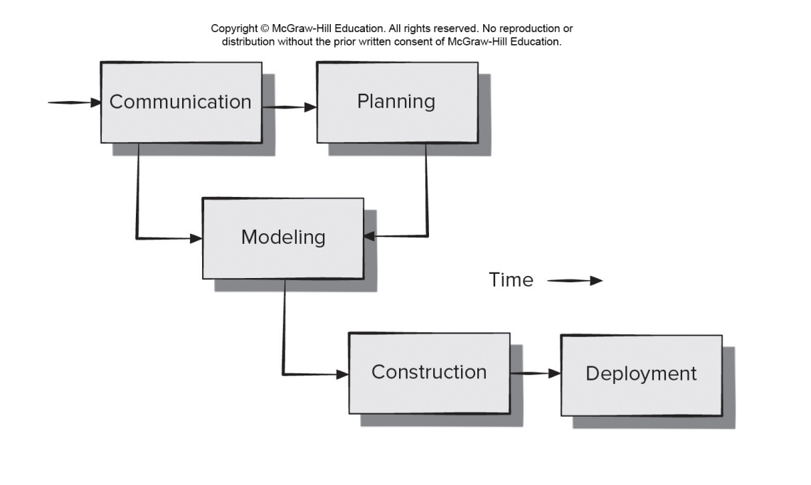
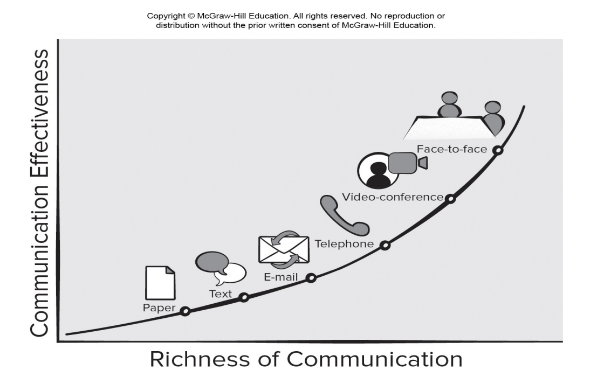
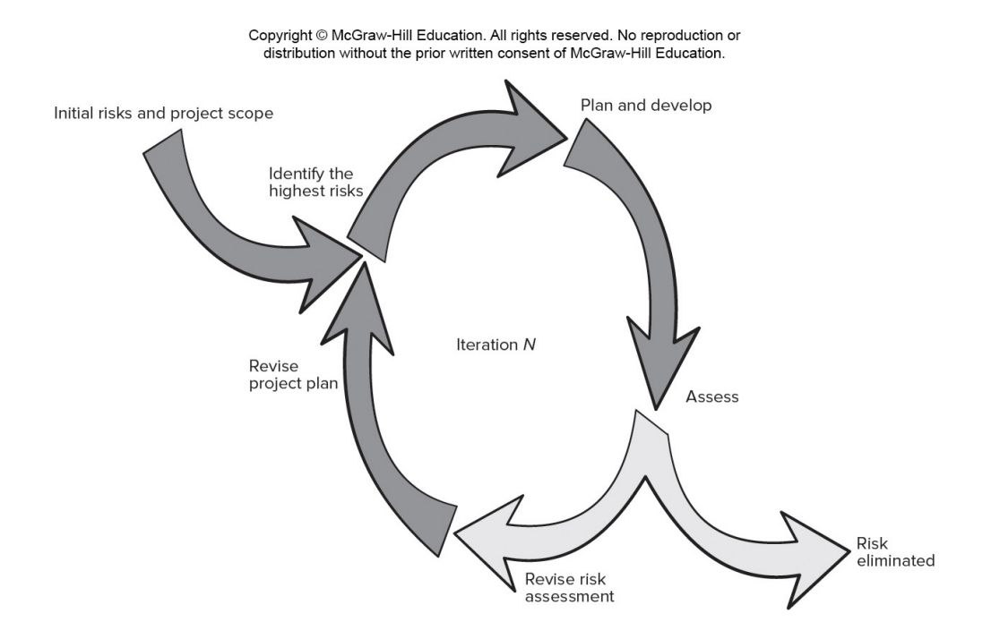
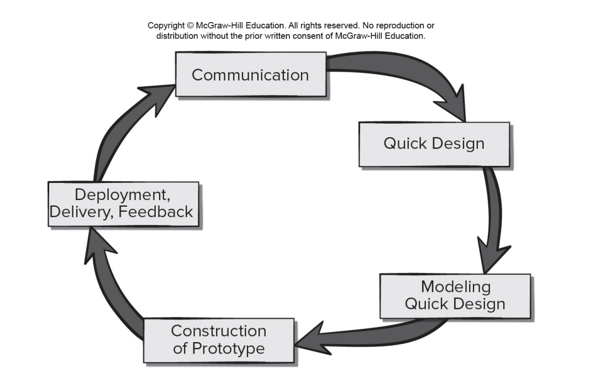
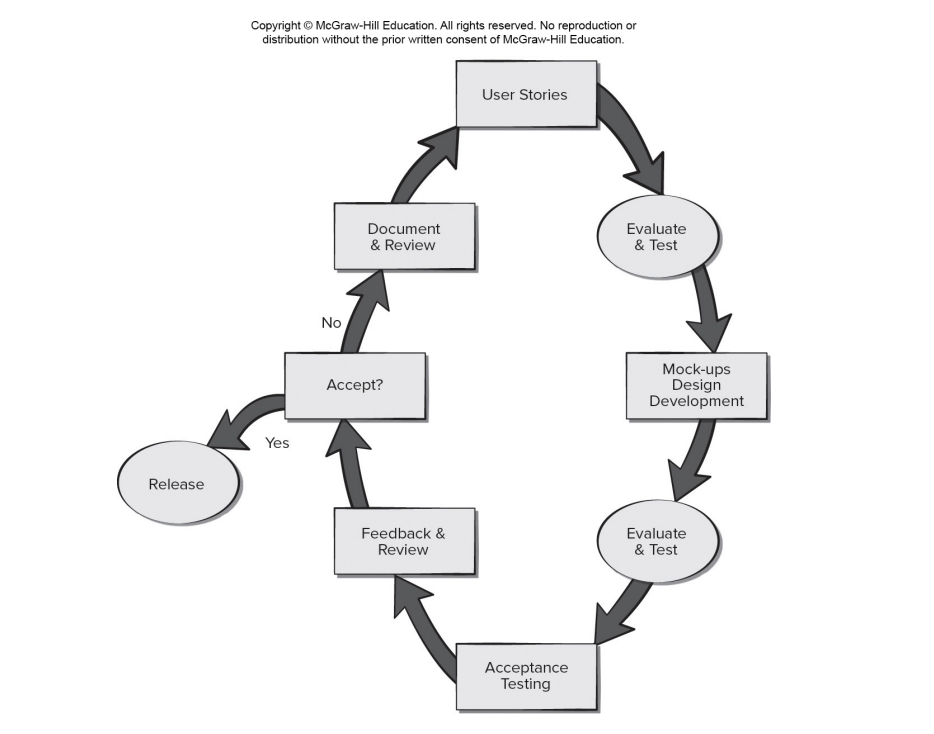
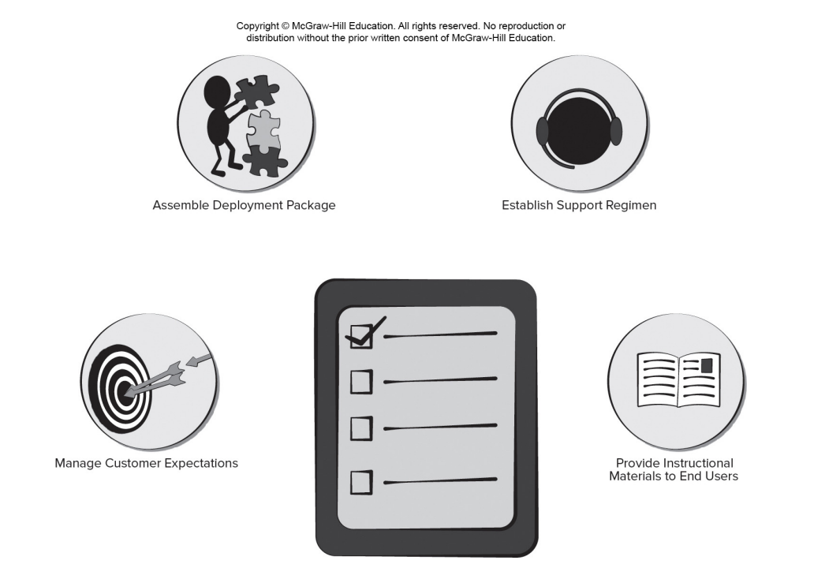

<!-- 

📋 This is the tech-news archives to help me keep track of what I am interested in!

- Reference tech news link: <https://thenextweb.com/news/blockchain-development-tech-career>
  

{{ notice-2 | markdownify }}
 -->

📋 This is my note-taking from what I learned in the class "Software Engineering Fundamentals - COMP 120-002"
{: .notice--danger}

# Principles that Guide Process (1)

- Principle #1. Be agile. Whether the process model you choose is prescriptive or agile, the basic tenets of agile development should govern your approach.
- Principle #2. Focus on quality at every step. The exit condition for every process activity, action, and task should focus on the quality of the work product produced.
- Principle #3. Be ready to adapt. Dogma has no place in software development. Adapt your approach to constraints imposed by the problem, the people, and the project itself.
- Principle #4. Build an effective team. Software engineering process and practice are important, but the bottom line is people. Build a self-organizing team.
- Principle #5. Establish mechanisms for communication and coordination. Projects fail because information falls into the cracks and/or stakeholders fail to coordinate their efforts.
- Principle #6. Manage change. Approach may formal or informal. You need mechanisms to manage how changes are requested, assessed, approved and implemented.
- Principle #7. Assess risk. Lots of things can go wrong as software is being developed, establish contingency plans.
- Principle #8. Create work products that provide value for others. Create only those work products that provide value for other process activities, actions or tasks.

 

# Principles that Guide Practice (2)

- Principle #1. Divide and conquer. Analysis and design should always emphasize separation of concerns (SoC).
- Principle #2. Understand the use of abstraction. Abstraction is a simplification of a complex system element used to communication meaning simply.
- Principle #3. Strive for consistency. A familiar context makes software easier to use.
- Principle #4. Focus on the transfer of information. Pay special attention to the analysis, design, construction, and testing of interfaces.
- Principle #5. Build software that exhibits effective modularity. Provides a mechanism for realizing the philosophy of Separation of concerns .
- Principle #6. Look for patterns. The goal of patterns is to create a body of literature to help developers resolve recurring problems encountered in software development.
- Principle #7. Use multiple viewpoints. Represent the problem and solution from different perspectives.
- Principle #8. Some consumes your work products. Remember that someone will maintain the software.

 

# Simplified Process Framework

 

# Communication Principles

<u>Communications Mode Effectiveness</u>

- Principle #1. Listen. Try to focus on the speaker’s words, not formulating your response to those words.
- Principle #2. Prepare before you communicate. Understand a problem before meeting with others.
- Principle #3. Someone should facilitate the activity. Every communication meeting should have a leader to keep the conversation moving in a productive direction.
- Principle #4. Face-to-face communication is best. Visual representations of information can be helpful.
- Principle #5. Take notes and document decisions. Someone should serve as a “recorder” and write down all important points and decisions.
- Principle #6. Strive for collaboration. Consensus occurs when collective team knowledge is combined.
- Principle #7. Stay focused, modularize your discussion. The more people involved in communication the more likely discussion will bounce between topics.
- Principle #8. If something is unclear, draw a picture.
- Principle #9. (a) Once you agree to something, move on; (b) If you can’t agree to something, move on; (c) If a feature or function is unclear and cannot be clarified at the moment, move on.
- Principle #10. Negotiation is not a contest or a game. It works best when both parties win.

 

# Planning Principles

<u>Iterative Planning Process</u>

- Principle #1. Understand the scope of the project. It’s impossible to use a road map if you don’t know where you’re going. Scope provides the software team with a destination.
- Principle #2. Involve the customer in the planning activity. The customer defines priorities and establishes project constraints.
- Principle #3. Recognize that planning is iterative. A project plan is never engraved in stone. As work begins, it very likely that things will change.
- Principle #4. Estimate based on what you know. The intent of estimation is to provide an indication of effort, cost, and task duration, based on the team’s current understanding of the work to be done.
- Principle #5. Consider risk as you define the plan. If you have identified risks that have high impact and high probability, contingency planning is necessary.
- Principle #6. Be realistic. People don’t work 100 percent of every day.
- Principle #7. Adjust granularity as you define the plan. Granularity refers to the level of detail that is introduced as a project plan is developed.
- Principle #8. Define how you intend to ensure quality. The plan should identify how the software team intends to ensure quality.
- Principle #9. Describe how you intend to accommodate change. Even the best planning can be obviated by uncontrolled change.
- Principle #10. Track the plan frequently and make adjustments as required. Software projects fall behind schedule one day at a time.

 

# Modeling Principles

<u>Software Modeling</u>

## Agile Modeling Principles

- Principle #1. The primary goal of the software team is to build software not create models.
- Principle #2. Travel light – don’t create more models than you need.
- Principle #3. Strive to produce the simplest model that will describe the problem or the software.
- Principle #4. Build models in a way that makes them amenable to change.
- Principle #5. Be able to state an explicit purpose for each model that is created.
- Principle #6. Adapt the models you create to the system at hand.
- Principle #7. Try to build useful models, forget abut building perfect models.
- Principle #8. Don’t become dogmatic about model syntax. Successful communication is key.
- Principle #9. If your instincts tell you a paper model isn’t working you may have a reason to be concerned.
- Principle #10. Get feedback as soon as you can.

 

## Requirements Modeling Principles

- Principle 1. The information domain of a problem must be represented and understood.
- Principle 2. The functions that the software performs must be defined.
- Principle 3. The behavior of the software (as a consequence of external events) must be represented.
- Principle 4. The models that depict information, function, and behavior must be partitioned in a manner that uncovers detail in a layered (or hierarchical) fashion.
- Principle 5. The analysis task should move from essential information toward implementation detail.



In software engineering work, two classes of models can be created:

1. Requirements models (also called analysis models) represent the customer requirements by depicting the software in three different domains: the information domain, the functional domain, and the behavioral domain.
2. Design models represent characteristics of the software that help practitioners to construct it effectively: the architecture, the user interface, and component-level detail.
   

{{ notice-2 | markdownify }}

 

## Design Modeling Principles

- Principle 1. Design should be traceable to the requirements model.
- Principle 2. Always consider the architecture of the system to be built.
- Principle 3. Design of data is as important as design of processing functions.
- Principle 4. Interfaces (both internal and external) must be designed with care.
- Principle 5. User interface design should be tuned to the needs of the end-user. Stress ease of use.
- Principle 6. Component-level design should be functionally independent.
- Principle 7. Components should be loosely coupled to each other than the environment.
- Principle 8. Design representations (models) should be easily understandable.
- Principle 9. The design should be developed iteratively.
- Principle 10. Creation of a design model does not preclude using an agile approach.

 

## Living Modeling Principles

- Principle 1. Stakeholder-centric models should target specific stakeholders and their tasks.
- Principle 2. Models and code should be closely coupled.
- Principle 3. Bidirectional information flow should be established between models and code.
- Principle 4. A common system view should be created.
- Principle 5. Model information should be persistent to allow tracking system changes.
- Principle 6. Information consistency across all model levels must be verified.
- Principle 7. Each model element has assigned stakeholder rights and responsibilities.
- Principle 8. The states of various model elements should be represented.

 

# Construction Principles - Coding

The construction activity encompasses a set of coding and testing tasks that lead to operational software that is ready for delivery to the customer or end-user.

Coding principles and concepts are closely aligned programming style, programming languages, and programming methods.

Testing principles and concepts lead to the design of tests that systematically uncover different classes of errors and to do so with a minimum amount of time and effort.

## Preparation Principles: Before you write one line of code, be sure you:

1. Understand of the problem you’re trying to solve.
2. Understand basic design principles and concepts.
3. Pick a programming language that meets the needs of the software to be built and the environment in which it will operate.
4. Select a programming environment that provides tools that will make your work easier.
5. Create a set of unit tests that will be applied once the component you code is completed.

## Coding Principles: As you being writing code, be sure you:

1. Constrain your algorithms by following structured programming practice.
2. Consider the use of pair programming.
3. Select data structures that will meet the needs of the design.
4. Understand the software architecture and create interfaces that are consistent with it.
5. Keep conditional logic as simple as possible.
6. Create nested loops in a way that makes them easily testable.
7. Select meaningful variable names and follow other local coding standards.
8. Write code that is self-documenting.
9. Create a visual layout (e.g., indentation and blank lines) that aids understanding.

## Validation Principles: After you've completed your first coding pass, be sure you:

1. Conduct a code walkthrough when appropriate.
2. Perform unit tests and correct errors you’ve uncovered.
3. Refactor the code to improve its quality.

## Testing Principles: Myers states these rules of testing that can also serve as testing objectives:

1. Testing is a process of executing a program with the intent of finding an error.
2. A good test case is one that has a high probability of finding an as-yet-undiscovered error.
3. A successful test is one that uncovers an as-yet-undiscovered error.

 

# Testing Principles

<u>Agile Testing</u>

Davis suggests a set of testing principles that have been added to by Everett and Meyer:

- Principle 1. All tests should be traceable to customer requirements.
- Principle 2. Tests should be planned long before testing begins.
  : - Testing is a process of executing a program with intent of finding an error,
  : - A good test case is one that has a high probability of finding an as-yet-undiscovered error.
  : - A successful test is one that uncovers an as-yet-undiscovered error.
- Principle 3. The Pareto principle applies to software testing.
- Principle 4. Testing should begin “in the small” and progress toward testing “in the large”.
- Principle 5. Exhaustive testing is not possible.
- Principle 6. Testing effort for each system module commensurate to expected fault density.
- Principle 7. Static testing can yield high results.
- Principle 8. Track defects and look for patterns in defects uncovered by testing.
- Principle 9. Include test cases that demonstrate software is behaving correctly.

 

# Deployment Principles

<u>Software Deployment Actions</u>

- Principle 1. Customer expectations for the software must be managed.
- Principle 2. A complete delivery package should be assembled and tested.
- Principle 3. A support regime must be established before the software is delivered.
- Principle 4. Appropriate instructional materials must be provided to end-users.
- Principle 5. Buggy software should be fixed first, delivered later

 

 

---

 

    🖋️ This is my self-taught blog! Feel free to let me know
    if there are some errors or wrong parts 😆

[Back to Top](#){: .btn .btn--primary }{: .align-right}
