<!-- 

📋 This is the tech-news archives to help me keep track of what I am interested in!

- Reference tech news link: <https://thenextweb.com/news/blockchain-development-tech-career>
  

{{ notice-2 | markdownify }}
 -->

📋 This is my note-taking from what I learned in the class "Software Engineering Fundamentals - COMP 120-002"
{: .notice--danger}

# Software Testing Strategies

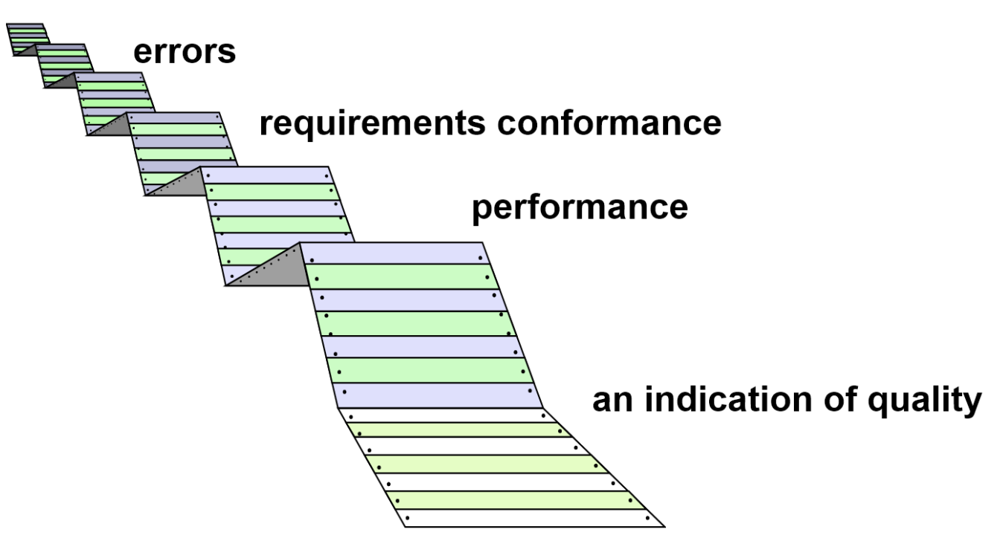

Testing is like checking a product before it's released to the customer. It involves doing things to make sure the product works properly and doesn't have any problems. Testing is something that can be organized and done in a structured way to make sure nothing is missed.

 

## Testing Strategic Approach

1. Before testing, review the technical details carefully to catch mistakes early.
2. Start testing individual parts and move towards testing the whole system.
3. Different types of software require different testing techniques at different stages.
4. Developers and sometimes a separate test group perform the testing.
5. Testing and debugging are separate activities but both are important for effective software development.

### <u>Verification and Validation</u>

- Verification: This refers to the process of making sure that software performs a particular function correctly.
  : "Are we building the product right?"
- Validation: This refers to a process that ensures that the software developed meets the requirements of the customer.
  : "Are we building the right product?"

 

## Organizing for Testing

- Software developers test their own work to make sure everything works as it should.
- An independent test group(ITG) gets involved after the software architecture is complete to avoid bias in testing.
- The independent test group's job is to find errors.
- Developers and the independent test group work together to conduct thorough testing throughout the project.

 

## Who Tests the Software?

- Developer: Developer knows how the system works and will test it carefully, but they are also focused on getting the job done efficiently. They want to show that the program is working correctly, meets customer needs, and will be finished on time and within the planned budget.
- Independent Tester: Independent Tester wants to learn about the system, but they also want to try and break it. They are motivated by making sure the system works well.

 

## Testing Strategy

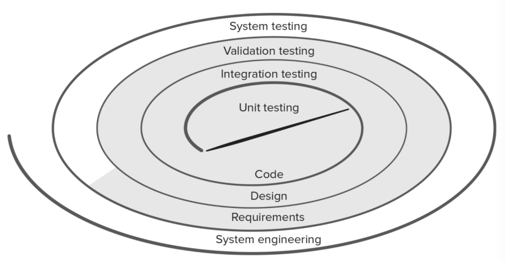

When testing software, we start by testing small pieces (like individual parts of code) and gradually work our way up to testing the entire system as a whole. This process is like spiraling outwards, with each level of testing becoming broader in scope.

At the beginning, we focus on testing individual components of the software. Then we move on to testing how those components work together (integration testing), making sure they fit together properly like puzzle pieces. After that, we test whether the software meets the requirements that were set out in the planning stages (validation testing).

Finally, we test the entire system to make sure everything works together smoothly. For object-oriented software (which is organized around classes of objects that interact with each other), our initial focus is on testing those classes and their interactions rather than individual code modules.

 

## Testing the Big Picture

The process of software testing can be divided into four stages:

1. Unit Testing: Test individual parts of the software to make sure they work correctly.
2. Integration Testing: Test how these individual parts work together.
3. Validation Testing: Test that the software meets the requirements set at the beginning of the project.
4. System Testing: Test the entire system to make sure everything works together correctly.

It's like building a puzzle - first, you check each piece, then you put them together, make sure they match the picture on the box, and finally check that everything works together as it should.

 

## Software Testing Steps

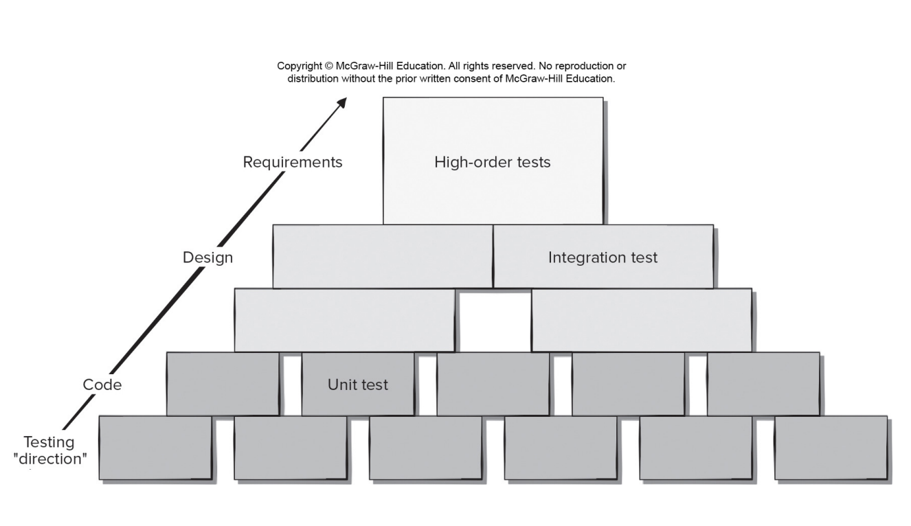

 

## When is Testing Done?

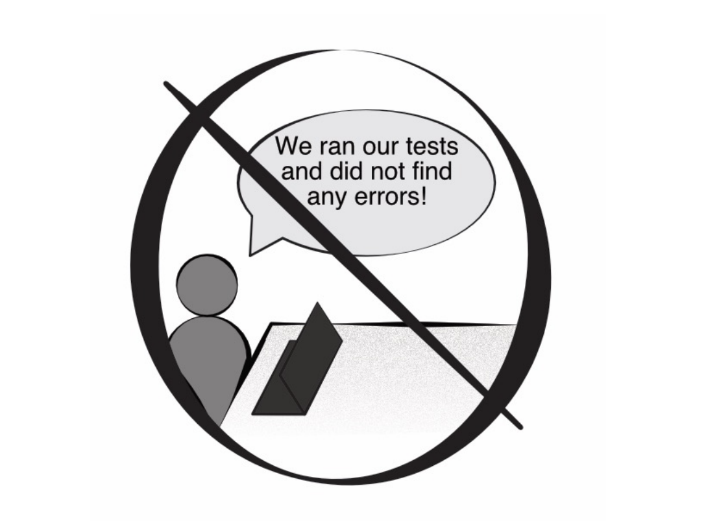

### <u>Criteria for Done</u>

1. Testing doesn't stop after the software engineer is done; it continues to make sure the software works well for the end user.
2. Time and money don't determine when testing is complete; it's important to meet the users' needs and expectations.
3. The statistical quality assurance approach suggests Testing a sample of possible program executions can give a good idea of how well the software works overall.
4. Collecting data during testing helps figure out when testing is complete based on how well the software is performing.

 

## Test Planning

1. Clearly define what the product should be able to do before starting testing.
2. State exactly what you want to achieve with each test.
3. Know who will be using the software and create a profile for each type of user.
4. Use a testing plan that emphasizes testing in small, frequent cycles.
5. Make sure the software is built in a way that allows it to test itself.
6. Use technical reviews to catch problems before testing begins.
7. Conduct technical reviews to evaluate the testing strategy and test cases themselves.
8. Have a process for continuously improving the testing process.

Overall, these tips are meant to help teams test software more effectively by focusing on clear goals, user needs, and ongoing improvement.

 

## Test Recordkeeping

Test cases can be recorded in Google Docs spreadsheet:

- Briefly describes the test case.
- Contains a pointer to the requirement being tested.
- Contains expected output from the test case data or the criteria for success.
- Indicate whether the test was passed or failed.
- Dates the test case was run.
- Should have room for comments about why a test may have failed (aids in debugging).

 

## Role of Scaffolding

- When testing software components, you can't just test them on their own - you need a framework to help you.
- This framework includes special programs called drivers and stubs.
- A driver is like the main program that takes in test data, sends it to the component being tested, and then shows the results.
- A stub is a dummy program that replaces other parts of the software that the component being tested relies on.
- Stubs follow the same interface as the real programs, do minimal data manipulation, and show that they were called.

 

## Unit Test Environment

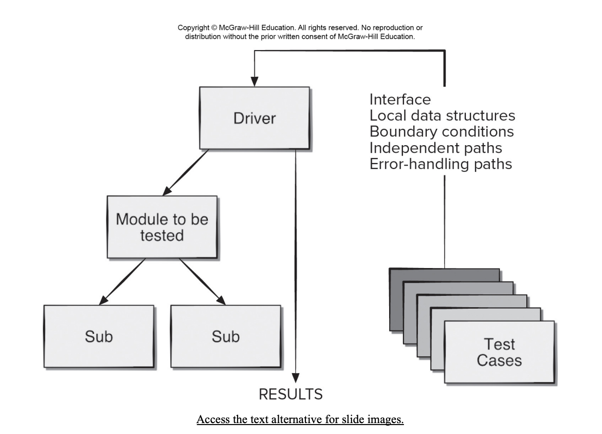

 

## Unit Testing

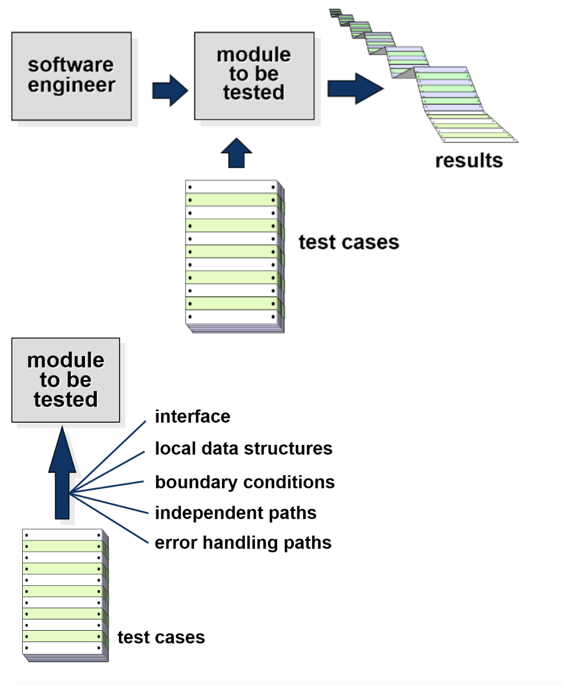

Unit testing is a type of testing where each part of a program is tested on its own to make sure it works correctly. This is done by testing different ways that the part can be used to make sure it's reliable and catches as many errors as possible.

 

## Unit-Test Procedures

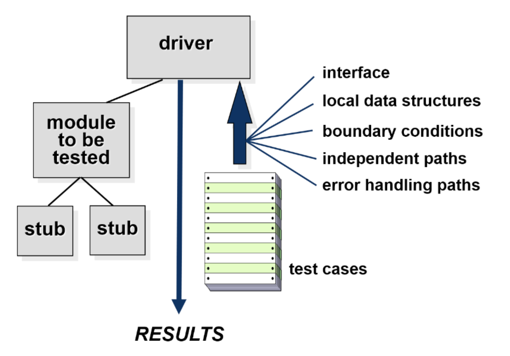

When testing a component, it's often necessary to develop driver and stub software to help with the testing. A driver is like a main program that takes in test data, sends it to the component being tested, and then displays the results. Stubs are used to replace other modules that are used by the component being tested. Stubs use the same interface as the module they are replacing, and may do minimal data manipulation, print out verification of their entry, and then return control back to the module being tested.

 

## General Testing Criteria

During each testing phase, the following areas are checked:

1. Interface integrity: Checking that everything connects correctly internally and externally.
2. Functional validity: Making sure everything works as it should.
3. Information content: Test to ensure that the data structures used by the software are accurate and consistent.
4. Performance: Test to ensure that the software meets the performance bounds established during software design.

These tests are done as each part of the software is added, to catch issues early on.

 

## Cost Effective Testing

Testing everything is a lot of work and doesn't always guarantee that something is working perfectly. It's better to focus on testing the most important and risky parts of a project to make the most of your testing resources.

 

## MobileApp Testing

When testing mobile applications, there are some important things to consider:

1. User-experience: Test the app with real users to make sure it's easy to use and works well on all types of devices.
2. Device compatibility: Check that the app works on different devices and software platforms.
3. Performance: Test how fast the app runs and how much space it takes up on the device.
4. Connectivity: Make sure the app can connect to the internet and other services reliably.
5. Security: Test the app to ensure it doesn't compromise the user's privacy or security.
6. Testing in the wild: Test the app on real devices in different environments to make sure it works well in real-life situations.
7. Certification: Make sure the app meets the standards required for distribution.

 

## High Order Testing

1. Validation testing: Focus is on software requirements.
2. System testing: Focus is on system integration.
3. Alpha/Beta testing: Alpha testing is when a small group of users try a product at the developer's place, and beta testing is when the product is tested by end-users at their own sites without the developer around. Both tests focus on how customers use the product.
4. Recovery testing: Forces the software to fail in a variety of ways and verifies that recovery is properly performed.
5. Security testing: Verifies that protection mechanisms built into into a system will, in fact, protect it from illegal penetration
6. Stress testing: Executes a system in a manner that demands resources in abnormal quantity, frequency, or volume.
7. Performance testing: Test the run-time performance of software within the context of an integrated system.

 

## Test Case Design

Before you start writing code for a component, it's a good idea to design test cases to make sure the code you write will work correctly. Here are the areas you should focus on when designing these tests:

- Make sure the component can receive and output information properly.
- Check that any data stored in the component stays accurate throughout the code's execution.
- Test every possible path through the code to make sure everything works correctly.
- Make sure the code works correctly when dealing with any limits or restrictions.
- Test all the ways the code handles errors.

 

## Module Tests

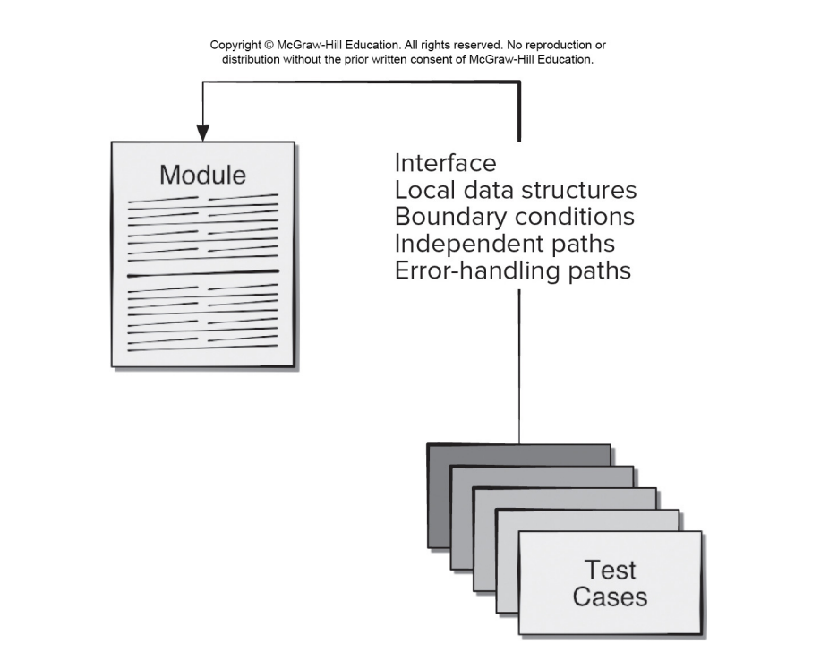

 

## Error Handling

Good design should anticipate and plan for potential errors that may occur during system operation. These errors must be tested to ensure that they can be handled properly. Some of the errors that should be tested include:

1. The error message is not clear or understandable.
2. The error message does not match the actual error that occurred.
3. The error causes the system to crash or malfunction before it can be handled.
4. The system's handling of the error is incorrect.
5. The error message does not provide enough information to identify the cause of the error.

 

## Traceability

- To be able to track and check the testing process, each test needs to be linked back to specific functional or nonfunctional requirements.
- Nonfunctional requirements should also be linked to business or architectural requirements.
- Many testing problems happen because there are missing connections between tests and requirements, inconsistent test data, or not enough testing coverage.
- When changes are made to software components, it's important to retest specific parts that could be affected (regression testing).

 

## White-box Testing

White-box testing is a method of testing software by examining its internal code and structure. It helps identify errors or bugs in the software's internal workings and improve its overall quality and functionality.

To perform white-box testing, testers create test cases that cover all possible paths and decisions within the code. This ensures that every part of the code is thoroughly tested.

The testing process focuses on four key areas. First, testers make sure that all possible paths within the code have been executed at least once. They also test logical decisions on both their true and false sides to ensure that they're working properly. Second, they test loops to make sure they're functioning correctly at their boundaries and within their operational bounds. Lastly, testers ensure that internal data structures are valid and working as intended.

 

## Basis Path Testing

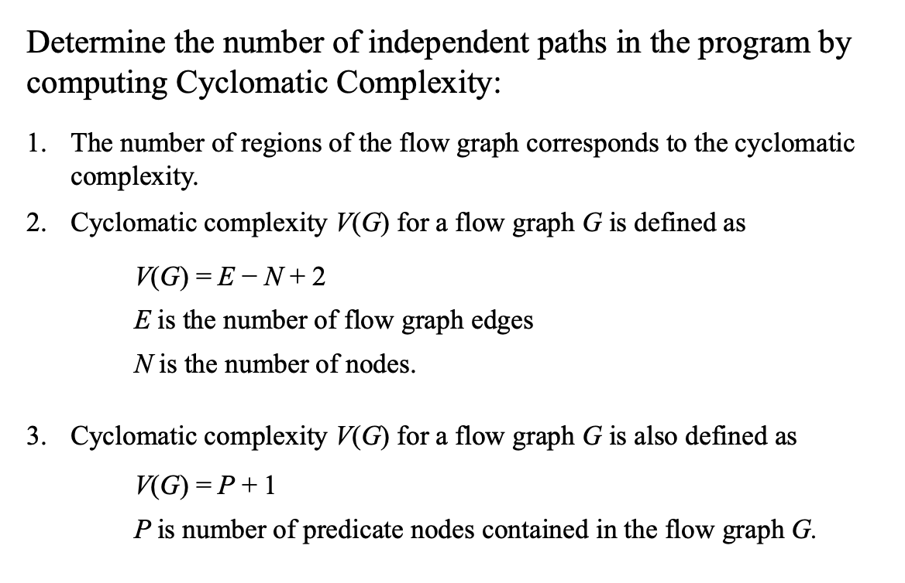

<u>Flowchart (a) and Flow Graph (b)</u>

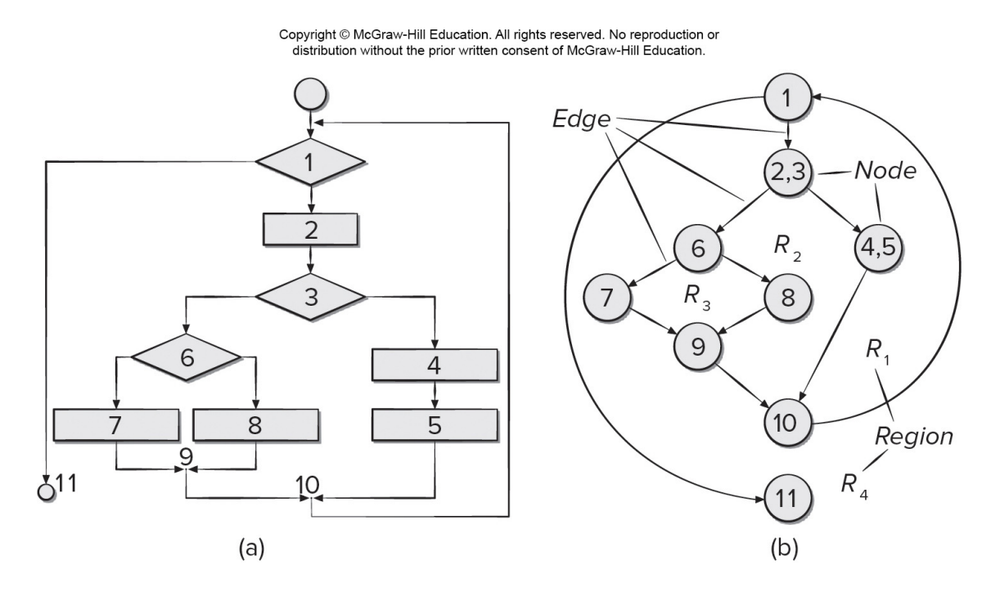

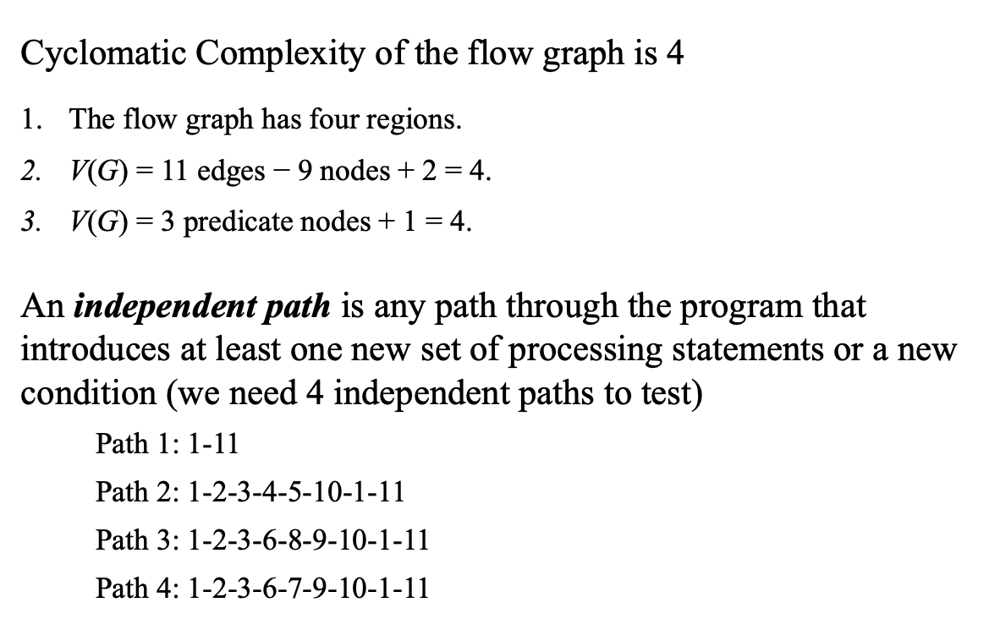
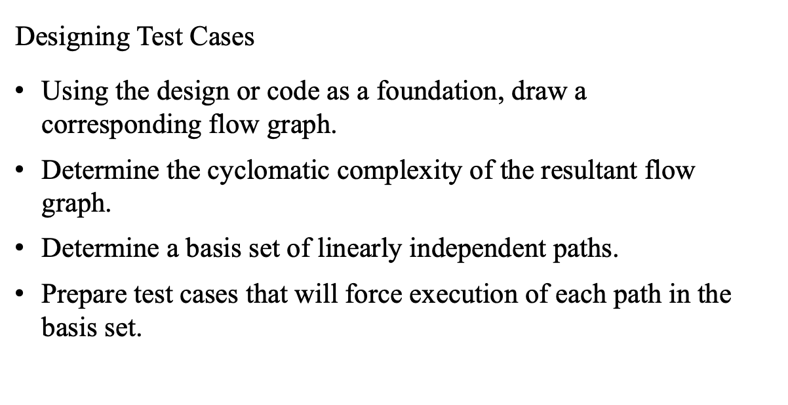

 

## Control Structure Testing

- Condition testing: This is a way of testing a program by checking if the logical conditions (like "if" statements) in a particular part of the program are working properly.
- Data flow testing: This technique tests a program by following how data is defined and used throughout the program, and selecting test cases based on that information.
- Loop testing: This technique focuses specifically on testing loops in a program to make sure they are working correctly. It tests things like whether the loop runs the correct number of times and whether it handles edge cases properly.

 

## Classes of Loops

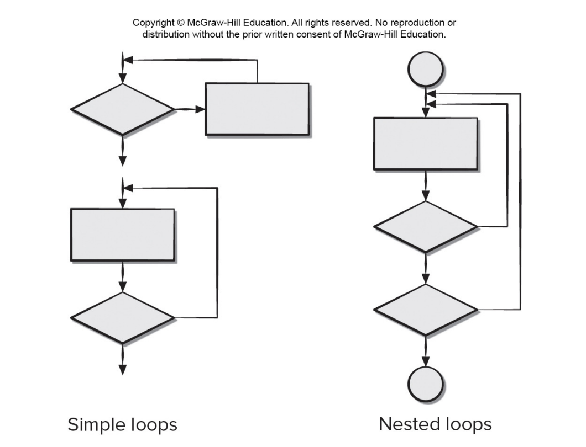

### <u>Loop Testing</u>

| Test cases for simple loops:                | Test cases for nested loops:                                                                                                                            |
| :------------------------------------------ | :------------------------------------------------------------------------------------------------------------------------------------------------------ |
| 1. Skip the loop entirely.                  | 1. Start at the innermost loop. Set all other loops to minimum values.                                                                                  |
| 2. Only one pass through the loop.          | Conduct simple loop tests for the innermost loop while holding the outer loops at their minimum iteration parameter (for example, loop counter) values. |
| 3. Two passes through the loop.             | 3. Add other tests for out-of-range or excluded values.                                                                                                 |
| 4. m passes through the loop where m < n.   | 4. Work outward, conducting tests for the next loop, but keeping all other outer loops at minimum values and other nested loops to “typical” values.    |
| 5. n − 1, n, n + 1 passes through the loop. | 5. Continue until all loops have been tested.                                                                                                           |

 

## Black Box Testing

Black-box testing is a way to test software without looking at the code. The goal is to find mistakes in the software's functions, how it interacts with other programs, how it uses data from databases, how it behaves under certain conditions, and any errors during startup or shutdown. This type of testing is usually done after white-box testing, which looks at the software's internal workings.

Black-box testing helps answer questions about how well the system works, including:

- Does it handle valid inputs correctly?
- How does it behave under different conditions?
- What types of inputs should be tested?
- Are there any inputs that the system is particularly sensitive to?
- How are the boundaries of different data types identified?
- How much data can the system handle, and at what rate?
- What happens when certain types of data are combined?

Remember, black-box testing is focused on testing the system's external behavior, without looking at its internal code or structure.

### <u>Black Box – Interface Testing</u>

- Interface testing checks if a program component can correctly receive and return information.
- Components need other programs called stubs and drivers to test their interfaces.
- Stubs and drivers might include test cases for the component or be accessed by the component.
- Debugging code may need to be added to the component to check the data passed to it.

 

## Object-Oriented Testing (OOT)

To test OO systems effectively, remember to:

- Test the analysis and design models using error discovery techniques.
- Change your testing strategy for unit and integration testing.
- Design test cases that account for the unique characteristics of OO software.

 

## Black Box – Boundary Value Analysis (BVA)

Boundary value analysis is a testing technique where you focus on values at the edges, or boundaries, of input and output ranges.

To do this, you can follow these guidelines:

1. If an input range has values a and b, test with values just above and below a and b.
2. If an input has a set number of values, test with the min, max, and values just above and below.
3. Apply guidelines 1 and 2 to output ranges too.
4. Test the boundaries of internal data structures, like arrays with a max index of 100.

Remember to focus on the boundaries and edges of input and output ranges when designing your test cases.

 

## OOT – Class Testing

Class testing in OO software is like unit testing in conventional software, but instead of focusing on algorithmic detail and data flow, it tests the behavior of a class based on its operations and state. Valid sequences of operations and their permutations are used to test class behaviors, and equivalence partitioning can reduce the number of sequences needed.

 

## OOT– Behavior Testing

- State diagrams help derive test sequences for class behavior.
- Tests should achieve full coverage by using operation sequences that cause transitions through all allowable states.
- Multiple state diagrams can be used to track system behavioral flow when collaborating with several classes.
- To traverse a state model breadth-first, test cases should exercise a single transition at a time and only use previously tested transitions when testing new ones.

 

## State Diagram for Account Class

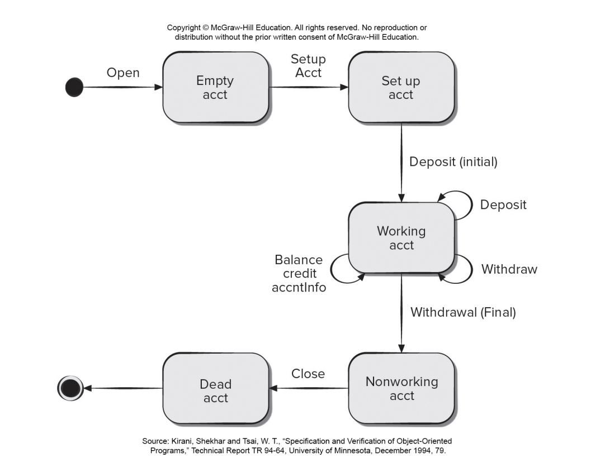

 

## White-box and black-box testing statements

Complete these statements on white-box and black-box testing and their techniques by dragging the word box to the correct space.

- Black-box testing techniques enable you to derive sets of input conditions that will fully exercise all functional requirements for a program.
- White-box testing is a design philosophy that uses the control structure to derive test cases.

- Basis path testing is a white-box testing technique that enables the test-case designer tp define a basis set of execution paths.
- Equivalence partitioning is a black-box testing method that divides the input domain of a program into classes of data.

- Data flow testing selects test paths of a program according to the locations of definitions and uses of variables in a program.
- Condition testing is a test-case design method that exercises the logical conditions in a program module.
- Loop testing is a testing technique that focuses exclusively on the validity of loop constructs.
- These are all techniques for Control structure testing.

- Boundary value analysis is a test-case design technique that leads to the selection of test cases at the 'edges' of a class.
- Interface testing checks that the program component accepts information in the proper order and data types and returns information the proper order and data format.
- These are all techniques used in black-box testing, also called Functional testing.

 

# Text Book

## Chapter 19. Software Testing - Component Level

This content discusses software component testing and the importance of having a flexible but well-planned testing strategy. The responsibility for component testing lies with individual software engineers, but the strategy is developed by the project manager, software engineers, and testing specialists. Testing should be conducted systematically to uncover errors in data and processing logic. The testing work product is a test specification, which outlines the overall testing strategy and specific testing steps. An effective test plan and procedure will lead to the discovery of errors at each stage of the construction process.

## 19.1 A strategic approach to software testing

This content discusses the importance of having a defined template for software testing, which includes conducting technical reviews, beginning testing at the component level and working outward, using different testing techniques for different software engineering approaches, involving both developers and independent test groups in testing, and accommodating debugging within the testing strategy. The testing strategy should incorporate a set of tactics for low-level and high-level tests, provide guidance for practitioners and milestones for managers, and enable measurable progress and early problem detection.

### 19.1.1 Verification and Validation

Verification and validation (V&V) is a broader topic that includes software testing and other software quality assurance activities such as technical reviews, audits, monitoring, simulation, feasibility study, documentation review, algorithm analysis, and more. Verification ensures that the software correctly implements a specific function, while validation ensures that the software built is traceable to customer requirements. Testing plays an important role in V&V, but it cannot be viewed as a safety net for quality. Quality should be incorporated into software throughout the software engineering process, and testing confirms quality that has been built into the software.

### 19.1.2 Organizing for Software Testing

The process of software testing is complicated by the inherent conflict of interest that occurs when developers test their own software. Developers have a vested interest in demonstrating that the software is error-free, meets customer requirements, and is completed on schedule and within budget. However, thorough testing requires finding errors, which is not in the developers' interest. Independent testing removes this conflict of interest and helps ensure thorough testing. Developers are still responsible for testing individual components and conducting integration testing. The independent test group (ITG) works closely with developers throughout the software development project, planning and specifying test procedures, and reporting to the software quality assurance organization.

### 19.1.3 The Big Picture

The software process is represented as a spiral that begins with system engineering, followed by software requirements analysis, design, and coding. As you move inward along the spiral, the level of abstraction decreases with each turn. The spiral illustrates the iterative nature of the software development process.

The process of software testing can be viewed as a spiral that starts with unit testing and progresses outward to integration testing, validation testing, and system testing. Testing in software engineering is a sequential series of steps, with unit testing focusing on individual components, integration testing addressing the issues of verification and program construction, and validation testing providing final assurance that the software meets all functional, behavioral, and performance requirements. Testing techniques range from specific path exercises to input and output focus to ensure coverage and maximum error detection.

After the software has been validated through integration and validation testing, it must be combined with other system elements (such as hardware, people, and databases) to form a complete computer system. System testing verifies that all elements of the system work together properly to achieve the desired system function and performance. This step falls within the broader context of computer system engineering.

### 19.1.4 Criteria for “Done”

The question of when software testing is complete is a classic one with no definitive answer. One response is that testing is never truly finished, as users will continue to test the software through its use. Another response is that testing ends when time and budget constraints are met. However, more rigorous criteria are needed, and statistical quality assurance techniques can provide guidance. By collecting metrics during testing and using statistical models, it is possible to determine when sufficient testing has been conducted.

## 19.2 Planning and Recordkeeping

Software testing strategies range from waiting until the system is fully constructed and testing the overall system to conducting tests on a daily basis whenever any part of the system is constructed. The recommended strategy is incremental testing, which begins with testing individual program units, moves to tests designed to facilitate integration of the units, and culminates with tests that exercise the constructed system. Unit testing focuses on the smallest unit of software design, testing important control paths to uncover errors within the boundary of the module. A successful testing strategy requires specifying product requirements in a quantifiable manner, stating testing objectives explicitly, understanding the users of the software, developing a testing plan emphasizing "rapid cycle testing," building "robust" software that is designed to test itself, using effective technical reviews as a filter prior to testing, conducting technical reviews to assess the test strategy and test cases themselves, and developing a continuous improvement approach for the testing process. Agile software testing also requires a test plan established before the first sprint meeting, test cases and directions reviewed by stakeholders as the code is developed, and testing results shared with all team members. Test recordkeeping can be done in online documents, such as a Google Docs spreadsheet, that contain a brief description of the test case, a pointer to the requirement being tested, expected output, indication of whether the test was passed or failed, dates the test case was run, and comments about why a test may have failed to aid in debugging.

### 19.2.1 Role of Scaffolding

Component testing is a step in software testing that focuses on verifying the smallest unit of software design, which is the component or module. Unit tests can be designed before or after the source code is generated. To establish test cases, design information is reviewed and expected results are identified. A driver and/or stub software is required to create a testing framework for each unit test. The driver is a "main program" that accepts test-case data, passes it to the component being tested, and prints relevant results. Stubs replace subordinate modules invoked by the component being tested, use the subordinate module's interface, may do minimal data manipulation, print verification of entry, and return control to the module being tested.

Drivers and stubs are used in software testing as testing overhead. They are software components that must be coded but are not included in the final software product. If drivers and stubs are kept simple, the actual overhead is low. However, in cases where components cannot be adequately tested with simple scaffolding software, complete testing is postponed until the integration test step, where drivers or stubs are also used.

### 19.2.2 Cost-Effective Testing

Exhaustive testing, which requires testing every possible combination of input values and test-case orderings, is often not worth the effort and cannot prove a component is correctly implemented. In cases where resources are limited, testers should focus on selecting crucial modules and those that are suspected to be error-prone. Techniques for minimizing the number of test cases required for effective testing are discussed in Sections 19.4 through 19.6.

### Exhaustive Testing

The content describes a 100-line C program that has nested loops and if-then-else constructs, resulting in 10^14 possible paths. It highlights the impracticality of exhaustive testing using a hypothetical magic test processor that would take 3170 years to test the program 24 hours a day, 365 days a year. The conclusion is that exhaustive testing is impossible for large software systems.

## 19.3 Test-Case Design

This content emphasizes the importance of unit testing and designing test cases before developing code for a component. Unit testing involves testing the smallest unit of software design, the software component or module, and focuses on important control paths to uncover errors within the boundary of the module. The article recommends an incremental testing strategy that begins with testing individual program units and culminates with tests that exercise the constructed system as it evolves. It also outlines the principles necessary for a software testing strategy to succeed, such as specifying product requirements in a quantifiable manner, understanding the users of the software, conducting technical reviews, and developing a continuous improvement approach. The article further suggests that it is a good idea to design unit test cases before developing code for a component to ensure that the code passes the tests. Finally, the article describes the different aspects that need to be tested during unit testing, such as the module interface, local data structures, independent paths through the control structure, boundary conditions, and error-handling paths.

This content discusses the importance of unit testing in software development and highlights key considerations in designing effective unit tests. It emphasizes the need to test data flow, local data structures, execution paths, and boundary conditions to uncover errors. The importance of testing error-handling paths is also emphasized, including the need to test every error-handling path and anticipate potential errors such as unintelligible error descriptions or incorrect exception-condition processing.

### 19.3.1 Requirements and Use Cases

The systematic creation of test cases based on use cases and analysis models can ensure good test coverage for functional requirements, while customer acceptance statements in user stories can provide the basis for writing test cases for nonfunctional requirements. Testing nonfunctional requirements may require specialized testing techniques. The primary purpose of testing is to help developers discover unknown defects, so it's important to write test cases that exercise the error-handling capabilities of a component and test that it doesn't do things it's not supposed to do, stated formally as anti-requirements. These negative test cases should be included to ensure the component behaves according to the customer's expectations.

### 19.3.2 Traceability

To ensure an auditable testing process, each test case must be traceable back to specific functional or nonfunctional requirements or anti-requirements. Agile developers may resist traceability, but many test process failures can be traced to missing traceability paths, inconsistent test data, or incomplete test coverage. Regression testing requires retesting selected components that may be affected by changes made to other software components. Making sure that test cases are traceable to requirements is an important step in component testing.

## 19.4 White-Box Testing

White-box testing is a test-case design philosophy that uses the control structure described as part of component-level design to derive test cases. White-box testing methods can derive test cases that guarantee all independent paths within a module have been exercised, exercise all logical decisions, execute all loops, and exercise internal data structures.

### 19.4.1 Basis Path Testing

Basis path testing is a white-box testing technique used to derive a logical complexity measure of a procedural design and define a basis set of execution paths for deriving test cases that exercise every statement in the program at least once during testing. This method requires the use of a flow graph to represent the control flow of the program, which allows for easier tracing of program paths. The flow graph consists of nodes representing procedural statements and edges representing flow of control. The regions bounded by edges and nodes are counted to derive a measure of the logical complexity of the program.

The concept of independent path is defined as any path through the program that introduces at least one new set of processing statements or a new condition. The number of independent paths can be determined by calculating the cyclomatic complexity, which is a software metric that provides a quantitative measure of the logical complexity of a program. Cyclomatic complexity can be calculated in three ways: the number of regions of the flow graph, E-N+2, or P+1, where E is the number of flow graph edges, N is the number of flow graph nodes, and P is the number of predicate nodes contained in the flow graph. The value for cyclomatic complexity provides an upper bound for the number of independent paths that form the basis set and an upper bound on the number of tests that must be designed and executed to guarantee coverage of all program statements. The basis set is not unique and a number of different basis sets can be derived for a given procedural design. In the example given, the cyclomatic complexity of the flow graph is 4, and we would need to define at most four test cases to exercise each independent logic path. The equations for calculating cyclomatic complexity are: V (G) = E-N+2 and V (G) = P+1.

### 19.4.2 Control Structure Testing

This section discusses control structure testing techniques that complement basis path testing, which is effective but not sufficient in itself. The techniques include condition testing, data flow testing, and loop testing. Condition testing exercises logical conditions in a program module, while data flow testing selects test paths based on variable definitions and uses. Loop testing focuses on the validity of loop constructs and can be applied to simple and nested loops.

The content discusses testing strategies for simple and nested loops in software development. For simple loops, five tests can be applied, including skipping the loop, one pass, two passes, m passes, and n-1/n/n+1 passes. For nested loops, the number of possible tests grows as the level of nesting increases. To reduce the number of tests, a suggested approach is to start at the innermost loop, conduct simple loop tests while holding outer loops at their minimum iteration parameter values, and work outward until all loops have been tested.

## 19.5 Black-Box Testing

Black-box testing is a complementary approach to white-box testing that focuses on the functional requirements of software. It attempts to find errors in categories such as incorrect or missing functions, interface errors, and initialization and termination errors. Black-box testing is typically applied during later stages of testing and is designed to answer questions about functional validity, system behavior and performance, input values, data class boundaries, data rates and volume, and the effects of specific data combinations. The goal is to derive a set of test cases that reduce the number of additional test cases needed for reasonable testing and provide information about classes of errors rather than just specific test cases.

### 19.5.1 Interface Testing

Interface testing ensures that a program component accepts and returns information in the correct order and format. It is often a part of integration testing and is necessary to ensure that a component does not break when integrated into the overall program. Stubs and drivers are important for component testing and sometimes incorporate test cases or debugging code. Some agile developers prefer to conduct interface testing using a copy of the production version of the program with additional debugging code.

### 19.5.2 Equivalence Partitioning

Equivalence partitioning is a black-box testing method that divides the input domain into classes of data from which test cases can be derived. The goal is to create an ideal test case that uncovers a class of errors that might otherwise require many test cases to be executed. Equivalence classes are based on an evaluation of input conditions, such as specific numeric values, ranges of values, sets of related values, or Boolean conditions. Guidelines for deriving equivalence classes are provided, and test cases are selected to exercise the largest number of attributes of an equivalence class at once.

1. If an input condition specifies a range, one valid and two invalid equivalence classes are defined.
2. If an input condition requires a specific value, one valid and two invalid equivalence classes are defined.
3. If an input condition specifies a member of a set, one valid and one invalid equivalence class are defined.
4. If an input condition is Boolean, one valid and one invalid class are defined.

### 19.5.3 Boundary Value Analysis

Boundary value analysis (BVA) is a testing technique that focuses on the boundaries of the input and output domains of software components. It complements equivalence partitioning by selecting test cases at the "edges" of the equivalence classes. Guidelines for BVA include testing the minimum and maximum values, values just above and below, and prescribed boundaries of input and output conditions and data structures. By applying these guidelines, software engineers can perform more complete boundary testing, which increases the likelihood of detecting errors.

## 19.6 Object-Oriented Testing

In object-oriented software, encapsulation drives the definition of classes and objects. Each class and instance of a class packages attributes and operations that manipulate these data. Encapsulated class is usually the focus of unit testing, but operations within the class are the smallest testable units. In a class hierarchy, an operation may exist as part of a number of different classes, and it is necessary to test the operation in the context of each subclass. Testing a single operation in isolation is usually ineffective in the object-oriented context.

### 19.6.1 Class Testing

Class testing for object-oriented software is equivalent to unit testing for conventional software, but it focuses on the operations and state behavior of a class rather than the algorithmic detail and data flow across module interfaces. A banking application is used as an example, with an Account class having operations such as open(), setup(), deposit(), withdraw(), balance(), summarize(), creditLimit(), and close().

A minimum test sequence (`open • setup • deposit • withdraw • close`) of operations for an account is identified, but a wide variety of other behaviors (`open • setup • deposit • [ deposit | withdraw | balance | summarize | creditLimit ]^n • withdraw • close`) can occur within this sequence. Random order tests (Test case r 1 : `open • setup • deposit • deposit • balance • summarize • withdraw • close` , Test case r 2 :`open • setup • deposit • withdraw • deposit • balance • creditLimit • withdraw • close`) are conducted to exercise different class instance life histories, and test equivalence partitioning can reduce the number of required test cases.

### 19.6.2 Behavioral Testing

The state diagram for a class, which represents the dynamic behavior of the class, can be used to derive a sequence of tests for the class and its collaborators. An example of a state diagram for the Account class is provided in Figure 19.7, which shows transitions between states such as empty acct, setup acct, working acct, nonworking acct, and dead acct. The majority of behavior for instances of the class occurs in the working acct state, and final transitions occur when a withdrawal is made or the account is closed.

The content discusses the use of state-based testing to design test cases for classes in software development. It emphasizes the importance of achieving coverage of every state in the system and provides examples of test cases for an Account class and a CreditCard object. The breadth-first approach to testing is also explained, with the recommendation to test a single transition at a time and to only use previously tested transitions.

Test case S1 : `open • setupAccnt • deposit(initial) • withdraw(final) • close`

Adding additional test sequences to the minimum sequence,

Test case S2 : `open • setupAccnt • deposit(initial) • deposit • balance • credit • withdraw(final) • close`

Test case S3 : `open • setupAccnt • deposit(initial) • deposit • withdraw • accntInfo • withdraw(final) • close`

 

---

 

    🖋️ This is my self-taught blog! Feel free to let me know
    if there are some errors or wrong parts 😆

[Back to Top](#){: .btn .btn--primary }{: .align-right}
