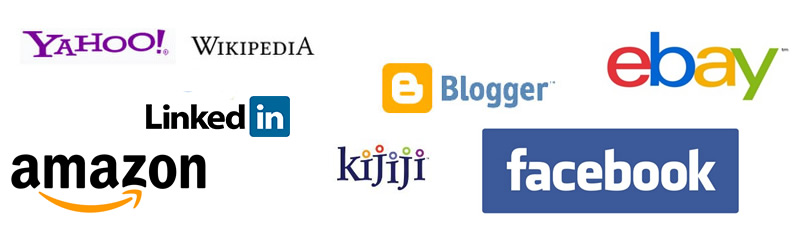
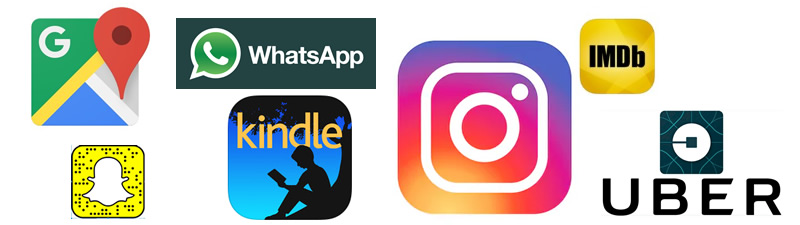
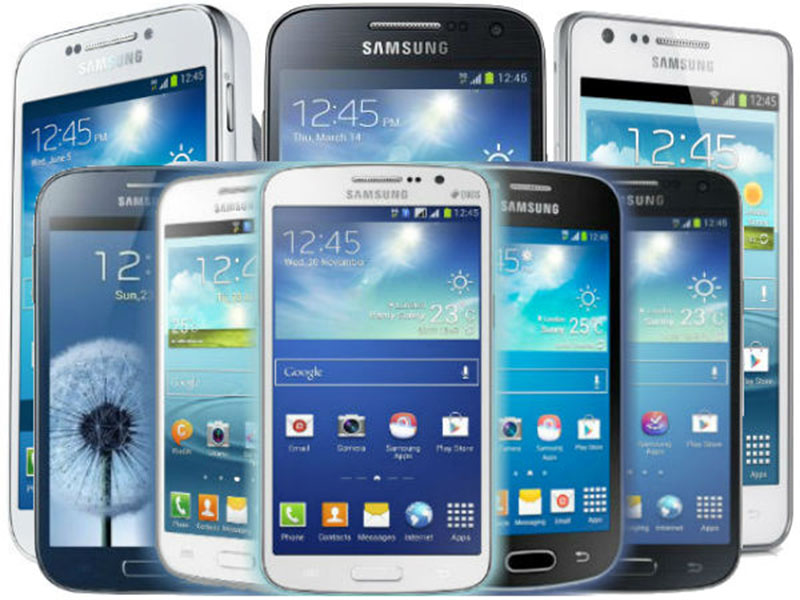

<!-- 

📋 This is the tech-news archives to help me keep track of what I am interested in!

- Reference tech news link: <https://thenextweb.com/news/blockchain-development-tech-career>
  

{{ notice-2 | markdownify }}
 -->

📋 This is my note-taking from what I learned in the class "Software Requirements Engng"
{: .notice--danger}

 

# Software

1. instructions (computer programs) that when executed provide de- sired features, function, and performance;
2. data structures that enable the programs to adequately manipulate information, and
3. descriptive information in both hard copy and virtual forms that describes the operation and use of the programs.

Software is not just about coding. In fact, Software is both a product and a vehicle for delivering a product (i.e. information). Software is engineered not manufactured, and it does not wear out, but it does deteriorate. The industry is moving toward component-based software construction, but most software is still custom-built.{: .notice--danger}

 

# Legacy Software (Older Programs)

You might end up working in an organization with old software referred to as legacy software.

## Definition:

- Legacy software systems... were developed decades ago and have been continually modified to meet changes in business requirements and computing platforms. The proliferation of such systems is causing headaches for large organizations who find them costly to maintain and risky to evolve. &rarr; Dayani-Fard and his colleagues
- legacy systems remain supportive to core business functions and are ‘indispensable’ to the business. Hence, legacy software is characterized by longevity and business criticality. &rarr; Liu and his colleagues

## Reasons for Legacy system evolution:

- Software must be adapted to meet needs of new computing environments or technology
- Software must be enhanced to implement new business requirements
- Software must be extended to make it interoperable with more modern system components
- Software must be re-architected to make it viable within a network environment

 

# Software Application Domains

## System software (Support and service other software)

- Operating systems like Windows, Mac Os
- Database management systems like SQL server, Oracle, MySQL
- Compliers like Visual studio
- Editors like textedit, textwranggler

## Application software (Geared towards business)

- ATM software
- Medical Software

## Engineering or Scientific Software (Heavy on calculations)

- Automotive stress analysis
- Astronomy
- Genetic Analysis

## Embedded software (resides within a product or system and controls certain features or functions)

- Keypad control for a microwave
- Fuel control for a car
- Dashboard displays

## Product-line software, includes entertainment software (Builds on the advantage of economics commonalities and limiting variations)

- Mobile software
- Inventory management software

## Web-Applications & Mobile-Apps (network-centric software category)

- Web Applications: Amazon.com, E-bay, Facebook
- Mobile based: Uber, Google Maps, WhatsApp

## Artificial intelligence software (makes use of nonnumerical algorithms to solve complex problems)

- Pattern recognition (image and voice)
- Games
- Expert systems

 

# Software Evolving Categories

Four broad categories of software are evolving to dominate the industry. And yet, these categories were in their infancy little more than a decade ago.

## Web Applications (Web Apps)

- Network intensive
- Concurrency
- Unpredictable load
- Availability (24/7/365)
- Data driven
- Content sensitive
- Continuous evolution
- Immediacy (short time to market)
- Security
- Aesthetics (the study of the mind and emotions in relation to the sense of beauty)

## Mobile Applications (Mobile Apps)

- Reside on mobile platforms such as cell phones or tablets
- Contain user interfaces that take both device characteristics and location attributes
- Often provide access to a combination of web-based resources and local device processing and storage capabilities
- Provide persistent storage capabilities within the platform

## Cloud Computing

- Provide distributed data storage and processing resources to networked computing devices
- Front-end services include the client devices and application software to allow access
- Back-end services include servers, data storage, and server-resident applications
- Cloud architectures can be segmented to restrict access to private data

| Application   | Platform       | InfraStructure |
| :------------ | :------------- | :------------- |
| Content       | Identity       | Compute        |
| Finance       | Queue          | Network        |
| Collaboration | Object Storage | Block Storage  |
| Monitoring    | Database       |                |
| Communication | Runtime        |                |

## Product Line Software

- Set of software-intensive systems that share a common set of features and satisfy the needs of a particular market.
- These software products are developed using the same application and data architectures using a common core of reusable software components.
- A software product line shares a set of assets that include requirements, architecture, design patterns, reusable components, test cases, and other work products.

 

---

 

    🖋️ This is my self-taught blog! Feel free to let me know
    if there are some errors or wrong parts 😆

[Back to Top](#){: .btn .btn--primary }{: .align-right}
