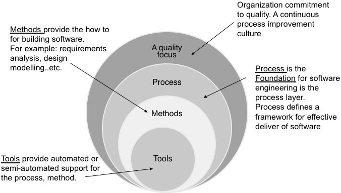
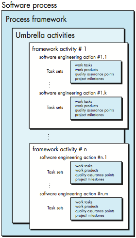
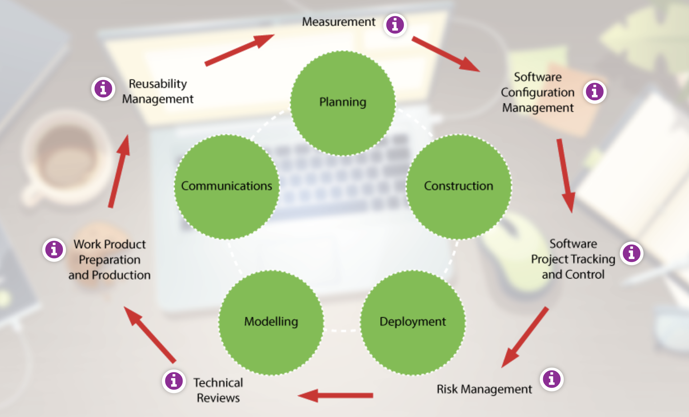
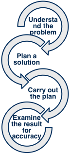

<!-- 

📋 This is the tech-news archives to help me keep track of what I am interested in!

- Reference tech news link: <https://thenextweb.com/news/blockchain-development-tech-career>
  

{{ notice-2 | markdownify }}
 -->

📋 This is my note-taking from what I learned in the class "Software Requirements Engng"
{: .notice--danger}

 

# Software Engineering

(1) The application of a systematic, disciplined, quantifiable approach to the development, operation, and maintenance of software; that is, the application of engineering to software. (2) The study of approaches as in (1).

Software engineering is a layered technology.

From the above figure the foundation for software engineering is the software process. Let's start by defining a process:

- A process is a collection of activities, actions and tasks carried out when some work product is required.
- An activity strives to achieve a broad objective (e.g., communication with stakeholders) and is applied regardless of the application domain, size of the project, complexity of the effort, or degree of rigor with which software engineering is to be applied.
- An action (e.g., architectural design) encompasses a set of tasks that produce a major work product (e.g., an architectural model).
- A task focuses on a small, but well-defined objective (e.g., conducting a unit test) that produces a tangible outcome.
- A process framework establishes the foundation for a complete software engineering process by identifying a small number of framework activities that are applicable to all software projects, regardless of their size or complexity.

Make sure not to confuse process with phase.{: .notice--danger}

 

# Software Engineering generic process framework

## Generic process framework

A generic process framework for software engineering encompasses five activities:

- Communications
  : Before any technical work starts, it is critically important to communicate and collaborate with the customer (and other stakeholders) The intent is to understand stakeholders objectives for the project and to gather requirements that help define the software features and functions.
- Planning
  : Establishes engineering work plan, describes technical risks, lists resources required, work products produced, and defines work schedule.
- Modelling
  : Creation of models to help developers and customers understand the requirements and software design.
- Construction
  : Code generation and testing.
- Deployment
  : Software delivered for customer evaluation and feedback.

Software Engineering process framework activities are complemented by a number of umbrella activities.{: .notice--danger}

## Software Engineering Umbrella Activities

- Measurement
  : Define and collect process, project and product measures to assist team in delivering software, meeting customer needs.
- Software Configuration Management
  : Manage effects of change
- Software Project Tracking and Control
  : Allows team to assess progress and take corrective action to maintain schedule.
- Risk Management
  : Assess risks that may affect project outcomes or quality.
- Technical Reviews
  : Assess engineering work products to uncover and remove errors before they propagate to next activity.
- Work Product Preparation and Production
  : Activities to create models, documents, logs, forms, lists, etc.
- Reusability Management
  : Defines criteria for work product reuse and establish mechanisms to achieve component reuse.

The software engineering process is not a rigid prescription that must be followed dogmatically by a software team. Rather, it should be agile and adaptable (to the problem, to the project, to the team, and to the organizational culture). Therefore, a process adopted for one project might be significantly different than a process adopted for another project.{: .notice--danger}

 

# Software Engineering: the essence of practice

- Understand the Problem
  : - Who are the stakeholders?
  : - What functions and features are required to solve the problem?
  : - Is it possible to create smaller problems that are easier to understand?
  : - Can a graphic analysis model be created?
- Plan the Solution
  : - Have you seen similar problems before?
  : - Has a similar problem been solved?
  : - Can readily solvable sub-problems be defined?
  : - Can a design model be created?
- Carry Out the Plan
  : - Does solution conform to the plan?
  : - Is each solution component provably correct?
- Examine the Result
  : - Is it possible to test each component part of the solution?
  : - Does the solution produce results that conform to the data, functions, and features required?

 

# Software Practice Core Principles

The following are Core Principles to keep in mind:

1. Software exists to provide value to its users
2. Keep it simple stupid (KISS)
3. Clear vision is essential to the success of any software project
4. Always specify, design, and implement knowing that someone else will have to understand what you have done to carry out his or her tasks
5. Be open to future changes, don’t code yourself into a corner
6. Planning ahead for reuse reduces the cost and increases the value of both the reusable components and the systems that require them
7. Placing clear complete thought before any action almost always produces better results

 

---

 

    🖋️ This is my self-taught blog! Feel free to let me know
    if there are some errors or wrong parts 😆

[Back to Top](#){: .btn .btn--primary }{: .align-right}
