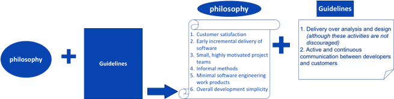
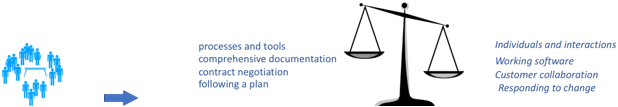
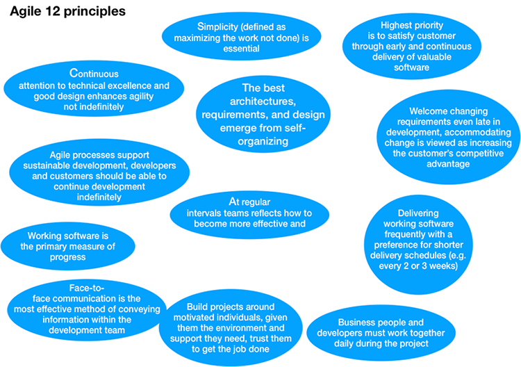
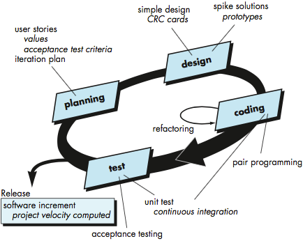

<!-- 

📋 This is the tech-news archives to help me keep track of what I am interested in!

- Reference tech news link: <https://thenextweb.com/news/blockchain-development-tech-career>
  

{{ notice-2 | markdownify }}
 -->

📋 This is my note-taking from what I learned in the class "Software Requirements Engng"
{: .notice--danger}

 

# Agility in Software Development

> What is Agile development?

Agile development is a philosophy in addition to a set of guidelines. The philosophy encourages customer satisfaction and early incremental delivery of software; small, highly motivated project teams; informal methods; minimal software engineering work products; and overall development simplicity. The development guidelines stress delivery over analysis and design (although these activities are not discouraged), and active and continuous communication between developers and customers.

In 2001, Kent Beck and 16 other noted software developers, writers, and consultants (referred to as the “Agile Alliance”) signed the “Manifesto for Agile Software Development.”

 

# Agile Alliance

> What is "Agility" in the context of Software Engineering?
>
> &rarr; Embrace change; software engineering should be quick on their feet.

Agile processes are based on three key assumptions:

- It is difficult to predict in advance which requirements or customer priorities will change and which will not.
- For many types of software design and construction activities are interleaved (construction is used to prove the design).
- Analysis, design, and testing are not as predictable from a planning perspective as one might like them to be.

Agile processes must be adapted incrementally to manage unpredictability. Incremental adaptation requires customer feedback based on evaluation of delivered software increments (executable prototypes) over short time periods.

Agile 12 principles, the principles define an agile spirit that is maintained in each of the process models:

1. Highest priority is to satisfy customer through early and continuous delivery of valuable software.
2. Welcome changing requirements, even late in development; accommodating change is viewed as increasing the customer’s competitive advantage.
3. Delivering working software frequently with a preference for shorter delivery schedules (e.g. every 2 or 3 weeks).
4. Business people and developers must work together daily during the project.
5. Build projects around motivated individuals. Give them the right environment and the support they need and trust them to get the job done.
6. Face-to-face communication is the most effective method of conveying information within the development team.
7. Working software is the primary measure of progress.
8. Agile processes support sustainable development. Developers and customers should be able to continue development indefinitely.
9. Continuous attention to technical excellence and good design will enhance agility.
10. Simplicity (defined as maximizing the work not done) is essential.
11. The best architectures, requirements, and design emerge from self-organizing teams.
12. At regular intervals teams should reflect on how to become more effective and then adjust behavior accordingly.

Not every agile process model applies these 12 principles with equal weight, and some models choose to ignore (or at least downplay) the importance of one or more of the principles.

 

# Agile process models in Software Development

Agile process models in Software Development

## 1. Extreme Programming (XP)

- Relies on object-oriented approach
- Values:
  : - Communication (close, informal between developers and stakeholders)
  : - Simplicity (developers design for current needs, not future needs)
  : - Feedback (implemented software - unit tests, customer - user stories guide acceptance tests, software team - iterative planning)
  : - Courage (design for today not tomorrow)
  : - Respect (stakeholders and team members for the software product)
- Key activities
  : - Planning (user stories, watch the video below on user stories) created and ordered by customer values
  : - Design (simple designs preferred, "Class Responsibilities and collaborations" (CRC) cards and design prototypes are only work products, encourages use of refactoring). (CRC) cards identify and organize the object-oriented classes. More details about CRC are covered later in the course.
  : - Coding (focuses on unit tests to exercise stories, emphasizes use of pairs programming to create story code, continuous integration and smoke testing is utilized)
  : - Testing (unit tests are created before coding is implemented using an automated testing framework to encourage use of regression testing, integration and validation testing done on daily basis, acceptance tests focus on system features and functions viewable by the customer).
- Extreme programming (XP) Issues:
  : - Requirement volatility (can easily lead for scope creep that causes changes to earlier work design for the then current needs)
  : - Conflicting customer needs (many projects with many customers make it hard to assimilate all customer needs)
  : - Requirements expressed informally (with only user stories and acceptance tests, it's hard to avoid omissions and inconsistencies)
  : - Lack of formal design (complex systems may need a formal architectural design to ensure a product that exhibits quality and maintainability)
- User Stories
  : - A user story is an informal, natural language description of one or more features of a software system. User stories are often written from the perspective of an or user of a system. They are often recorded on index cards.
  : - User stories are reflected as follows &rarr; As a <role> I want to <goal> so that <benefit>

 

## 2. Industrial Extreme Programming (IXP)

Industrial Extreme Programming is a variant of XP which refines XP and targets the agile process specifically for use with large organizations. (IXP) focuses on the following:

- Readiness acceptance
  : - Does an appropriate development environment exist to support IXP?
  : - Will the team be populated by stakeholders?
  : - Does the organization have a distinct quality program that support continuous process improvement?
  : - Will the organizational culture support new values of the agile team?
  : - Will the broader project community be populated appropriately?
- Project community (finding the right people for the project team)
- Project chartering (determining whether or not an appropriate business justification exists to justify the project)
- Test-driven management (used to establish measurable destinations and criteria for determining when each is reached)
- Retrospectives (specialized technical review focusing on issues, events, and lessons-learned across a software increment or entire software release)
- Continuous learning (vital part of continuous process improvement)

 

## 3. Scrum

- Scrum principles
  : - A small working team is used to maximize communication, minimize overhead, and maximize sharing of informal knowledge
  : - The process must be adaptable to both technical and business challenges to ensure the best product is produced
  : - The process yields frequent increments that can be inspected, adjusted, tested, documented and built on
  : - The development work and the people performing it are partitioned into defined, low coupling partitions
  : - Testing and documentation is performed as the product is built
  : - Provides the ability to declare the product is 'done' whenever required
- Process patterns that define development activities
- Backlog (prioritized list of requirements or features the provide business value to customer, items can be added at any time)
- Sprints (work units required to achieve one of the backlog items, must fit into a predefined time-box, affected backlog items frozen)
- Scrum meetings (15-minute daily meetings), the following three questions are asked to each team member.
  : - What was done since last meeting?
  : - What obstacles were encountered?
  : - What will be done by the next meeting?
- Demos (deliver software increment to customer for evaluation)

 

## 4. Agile Modeling (AM)

- Practice-based methodology for effective modeling and documentation of software systems in a light-weight manner
- Modeling principles
- Model with a purpose
- Use multiple models
- Travel light (only keep models with long-term value)
- Content is more important than representation
- Know the models and tools you use to create them
- Adapt locally
- Requirements gathering and analysis modeling
- Work collaboratively to find out what customer wants to do
- Once requirements model is built collaborative analysis modeling continues with the customer
- Architectural modeling
- Derives preliminary architecture from analysis model
- Architectural model mist be realistic for the environment and must be understandable by developers

 

## 5. Agile Unified Process (AUP)

Applying "Agile" to the unified process is possible. (AUP) in summary as follows:

- Adopts classic UP phased activities (inception, elaboration, construction, transition) to enable team to visualize overall software project flow
- Within each activity team iterates to achieve agility and delivers meaningful software increments to end-users as rapidly as possible
- Each AUP iteration addresses
- Modeling (UML representations of business and problem domains)
- Implementation (models translated into source code)
- Testing (uncover errors and ensure source code meets requirements)
- Deployment (software increment delivery and acquiring feedback)
- Configuration and project management (change management, risk management, persistent work product control)
- Environment management (standards, tools, technology)

 

# Tools that support the Agile process

The tool-set that supports agile processes focuses more on people issues than it does on technology issues.

The tool-sets focus on communications and collaboration between the Agile team and could be classified in two categories:

1. Low tech.: Whiteboards, poster sheets, index cards, sticky notes, proximity of teams.
2. Modern social networks techniques.

 

---

 

    🖋️ This is my self-taught blog! Feel free to let me know
    if there are some errors or wrong parts 😆

[Back to Top](#){: .btn .btn--primary }{: .align-right}
