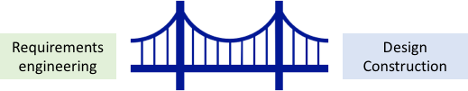

<!-- 

📋 This is the tech-news archives to help me keep track of what I am interested in!

- Reference tech news link: <https://thenextweb.com/news/blockchain-development-tech-career>
  

{{ notice-2 | markdownify }}
 -->

📋 This is my note-taking from what I learned in the class "Software Requirements Engng"
{: .notice--danger}

 

# Understanding Requirements

- Requirements engineering helps software engineers better understand the problems they are trying to solve.
- Building an elegant computer solution that ignores the customer’s needs helps no one.
- It is very important to understand the customer’s wants and needs before you begin designing or building a computer-based solution.
- The requirements engineering process begins with inception, moves on to elicitation, negotiation, problem specification, and ends with review or validation of the specification.
- The intent of requirements engineering is to produce a written understanding of the customer’s problem.
- Several different work products might be used to communicate this understanding (user scenarios, function and feature lists, analysis models, or specifications).

Requirements engineering builds a bridge to design and construction.

Requirements engineering establishes a solid base for design and construction. Without it, the resulting software has a high probability of not meeting customer’s needs.

 

---

 

    🖋️ This is my self-taught blog! Feel free to let me know
    if there are some errors or wrong parts 😆

[Back to Top](#){: .btn .btn--primary }{: .align-right}
