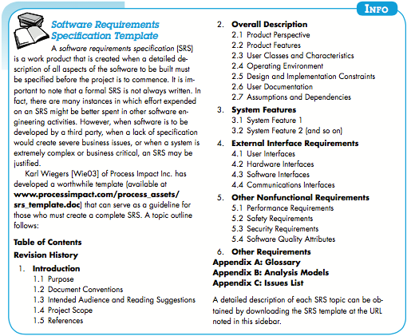
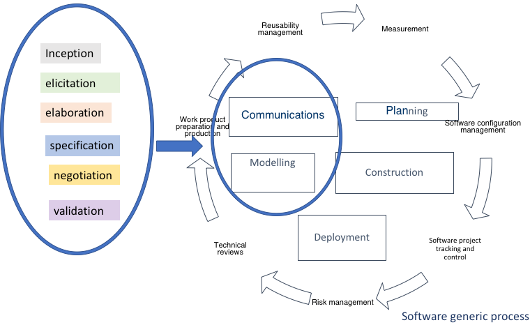

<!-- 

📋 This is the tech-news archives to help me keep track of what I am interested in!

- Reference tech news link: <https://thenextweb.com/news/blockchain-development-tech-career>
  

{{ notice-2 | markdownify }}
 -->

📋 This is my note-taking from what I learned in the class "Software Requirements Engng"
{: .notice--danger}

 

# Requirements Engineering Tasks

Requirements engineering is the term for the broad spectrum of tasks and techniques that lead to an understanding of the requirements.

## An Overview of the Requirements Engineering Tasks

1. Inception:
   : Software engineers use context-free questions to establish a basic understanding of the problem, the people who want a solution, the nature of the solution, and the effectiveness of the collaboration between customers and developers.
2. Elicitation:
   : Find out from customers what the product objectives are, what is to be done, how the product fits into business needs, and how the product is used on a day to day basis.
3. Elaboration:
   : Focuses on developing a refined technical model of software function, behavior, and information.
4. Negotiation:
   : Requirements are categorized and organized into subsets, relations among requirements identified, requirements reviewed for correctness, requirements prioritized based on customer needs. Intent is to develop a project plan that meets stakeholder needs and real-world constraints (time, people, budget) placed on the software team.
   : Negotiation activities:
   : - Identification of system key stakeholders
   : - Determination of stakeholders’ “win conditions”
   : - Negotiate to reconcile stakeholders’ win conditions into “win-win” result for all stakeholders (including developers)
   : The Goal is to produce a win-win result before proceeding to subsequent software engineering activities.
5. Specification:
   : Written work products produced describing the function, performance, and development constraints for a computer-based system.
   : 
6. Requirements Validation:
   : Formal technical reviews used to examine the specification work products to ensure requirement quality and that all work products conform to the agreed upon standards for the process, project, and products.

 

# Requirements Validation Checklist

The below is a useful set of questions to ask:

1. Are requirements stated clearly? Can they be misinterpreted?
2. Is the source (e.g., a person, a regulation, a document) of the requirement identified? Has the final statement of the requirement been examined by or against the original source?
3. Is the requirement bounded in quantitative terms?
4. What other requirements relate to this requirement? Are they clearly noted via a cross-reference matrix or other mechanism?
5. Does the requirement violate any system domain constraints?
6. Is the requirement testable? If so, can we specify tests (sometimes called validation criteria) to exercise the requirement?
7. Is the requirement traceable to any system model that has been created?
8. Is the requirement traceable to overall system/ product objectives?
9. Is the specification structured in a way that leads to easy understanding, easy reference, and easy translation into more technical work products?
10. Has an index for the specification been created?
11. Have requirements associated with performance, behavior, and operational characteristics been clearly stated? What requirements appear to be implicit?



A key concern during requirements validation is consistency (something you need to look at as you develop your project).

An Example of In-consistency:

- If in one document you use the word "customer" to indicate a stakeholder and in another document, you use the word "client" that might cause confusion to anyone trying to read and understand your written requirements.
  

{{ notice-2 | markdownify }}

 

# Requirements management

Activities that help the project team to identify, control, and track requirements and changes as project proceeds, similar to software configuration management (SCM) techniques.

Requirement engineering tasks begin during the software engineering `"communications activity"` and continue into the `"modelling activity"`.

 

---

 

    🖋️ This is my self-taught blog! Feel free to let me know
    if there are some errors or wrong parts 😆

[Back to Top](#){: .btn .btn--primary }{: .align-right}
