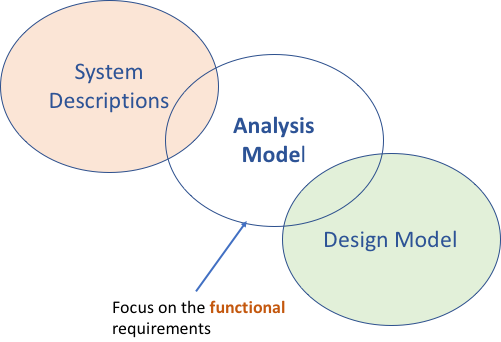
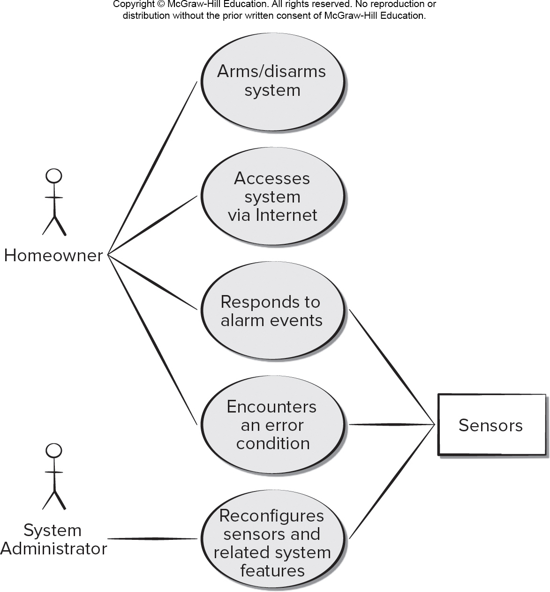
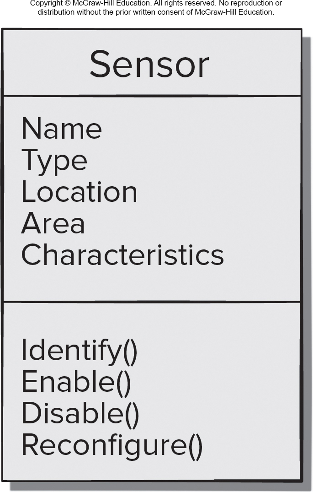
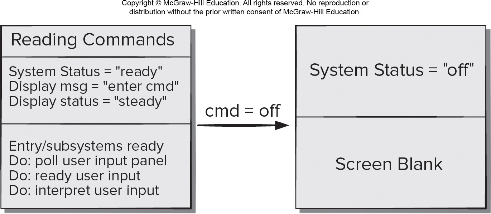

<!-- 

📋 This is the tech-news archives to help me keep track of what I am interested in!

- Reference tech news link: <https://thenextweb.com/news/blockchain-development-tech-career>
  

{{ notice-2 | markdownify }}
 -->

📋 This is my note-taking from what I learned in the class "Software Requirements Engng"
{: .notice--danger}

 

# Analysis Model

The Intent of the analysis model is to provide descriptions of required `informational`, `functional`, and `behavioral` domains for computer-based systems:

## Analysis Model Elements

1. Scenario-based elements (use cases describe system from user perspective)
   : They are the first part of the model developed. For example user stories and their corresponding use case diagrams my evolve into more elaborate template based use cases. As such they serve as `input` for creation for the creation of `other modeling elements`. Below is a use case diagram illustrating example illustrating some goal functionalities required by the Homeowner and the system administrator in addition notice the external device.
   : 
2. Class-based elements (relationships among objects manipulated by actors and their attributes are depicted as classes)
   : Each usage scenario implies a `set of objects` that are manipulated as an `actor interacts` with the system. These objects are categorized into classes, a collection of things that have similar attributes and common behaviors. Example, a UML class diagram can be used to depict a Sensor class for the SafeHome security function. Note that the diagram below lists the attributes of sensors (e.g., name, type) and the operations (e.g., identify, enable) that can be applied to modify these attributes. In addition to class diagrams, other analysis modeling elements depict the manner in which classes collaborate with one another and the relationships and interactions between classes.
   : 
3. Behavioral elements (depict system and class behavior as states and transitions between states)
   : The behavior of a computer-based system can have a profound effect on the design that is chosen and the implementation approach that is applied. Therefore, `the requirements model` must provide modeling elements that depict behavior. The `state diagram` is one method for representing the behavior of a system by depicting its states and the events that cause the system to change state. A state is any observable mode of behavior. In addition, the state diagram indicates what actions (e.g., process activation) are taken as a consequence of a particular event. To illustrate the use of a state diagram, consider software embedded within the SafeHome control panel that is responsible for reading user input. A simplified UML state diagram is shown below.
   : 

The model changes as you learn more about the system to be built. For that reason the analysis model is a `snapshot of the requirements` at any given time.

 

# Analysis Patterns

Any who has done requirements engineering on many projects notices that certain problems reoccur across all projects with a specific application domain. Analysis patterns suggest solutions for example a class or a function or a behavior within the application domain that can be reused when modeling other applications.

 

---

 

    🖋️ This is my self-taught blog! Feel free to let me know
    if there are some errors or wrong parts 😆

[Back to Top](#){: .btn .btn--primary }{: .align-right}
