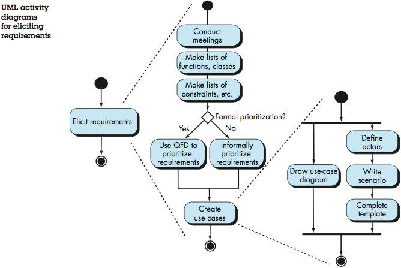

<!-- 

📋 This is the tech-news archives to help me keep track of what I am interested in!

- Reference tech news link: <https://thenextweb.com/news/blockchain-development-tech-career>
  

{{ notice-2 | markdownify }}
 -->

📋 This is my note-taking from what I learned in the class "Software Requirements Engng"
{: .notice--danger}

 

# Defining Functional Requirements

Defining the functional requirements of the new computer-based system starts within the requirements elicitation task and gets refined within the elaboration task. The list of functional requirements is reviewed with the stakeholders to come up with priorities for deployment and then usage scenarios are developed.

Usage scenarios are one of the work products of the elicitation process.

To reach usage scenario software engineers need to interact with the stakeholders to understand how the stakeholder especial the end users (operational stakeholders) would interact with the system. This usually happens through meetings and workshops sometimes a facilitator is in charge of these meetings.

Once usage scenarios are identified, the next step is to come up with the preliminary use case.



Use Case:

A use case tells a stylized story about how an end user (actor) playing one of a number of possible roles who interacts with the system under a specific set of circumstances.

The story may be narrative text, an outline of tasks or interactions, a template-based description, or a diagrammatic representation.

Regardless of its form, a use case depicts the software or system from the end user’s point of view.


{{ notice-2 | markdownify }}

The activity diagram below illustrates the eliciting requirements task and how the requirements can evolve into use cases.

 

---

 

    🖋️ This is my self-taught blog! Feel free to let me know
    if there are some errors or wrong parts 😆

[Back to Top](#){: .btn .btn--primary }{: .align-right}
