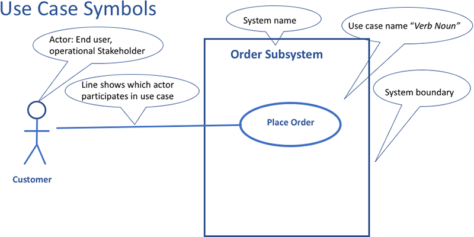
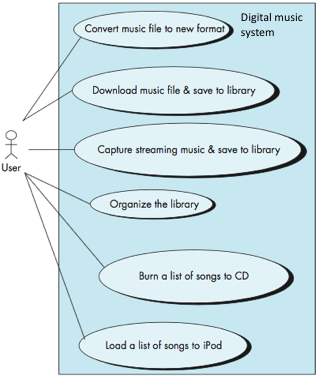
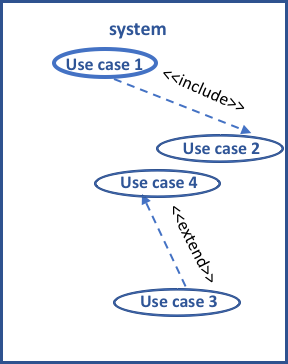

<!-- 

📋 This is the tech-news archives to help me keep track of what I am interested in!

- Reference tech news link: <https://thenextweb.com/news/blockchain-development-tech-career>
  

{{ notice-2 | markdownify }}
 -->

📋 This is my note-taking from what I learned in the class "Software Requirements Engng"
{: .notice--danger}

 

# Unified Modelling Language (UML)

The Unified Modeling Language (UML) is `a standard language for writing software blueprints. UML may be used to visualize, specify, construct, and document the artifacts of a software-intensive system`.

Using UML many analysis models may be developed. Below are the main diagrams produced during Analysis:

- Use case diagrams
- Class diagrams
- Communication diagrams
- State diagrams

Once usage scenarios have been identified and use case brief descriptions have been agreed upon or formal use case templates filled, a UML use case diagram can be sketched.

`A UML use-case diagram is an overview of all the use cases and how they are related.`

`It provides a big picture of the functionality of the system.`

UML use case diagrams are very simple to draw. The main components/symbols of a UML use case diagram are shown in the below figure:

 

## Example

Let's create a use case diagram for a software application for managing an online digital music store. Some of the things the software might do include:

- Download an MP3 music file and store it in the application’s library.
- Capture streaming music and store it in the application’s library.
- Manage the application’s library (e.g., delete songs or organize them in playlists).
- Burn a list of the songs in the library onto a CD.
- Load a list of the songs in the library onto an iPod or MP3 player.
- Convert a song from MP3 format to AAC format and vice versa.

 

## The use case diagram would look as below

 

## There are two types of use cases

1. `Goal` or `Base` use case: Invoked directly by actor to achieve an observable goal.
2. `Abstract` use case: Invoked by another use case and is not a complete goal from user’s perspective.

 

## Use case relationships

1. The Include Relationship
   : - Include relationships are used when two or more use cases share some common portion in a flow of events.
   : - This common portion is then grouped and extracted to form an inclusion use case for sharing among two or more use cases.
2. The Extend Relationship
   : - Extend relationships are used when two use cases are similar, but one does a bit more than the other.
   : - For example, you may have a use case that captures the typical case (the "goal" or "base" use case) and use extensions to describe variations.
   : - It is a `conditional relationship`, i.e. if the condition happens then the use case is extended.
   : 

 

---

 

    🖋️ This is my self-taught blog! Feel free to let me know
    if there are some errors or wrong parts 😆

[Back to Top](#){: .btn .btn--primary }{: .align-right}
