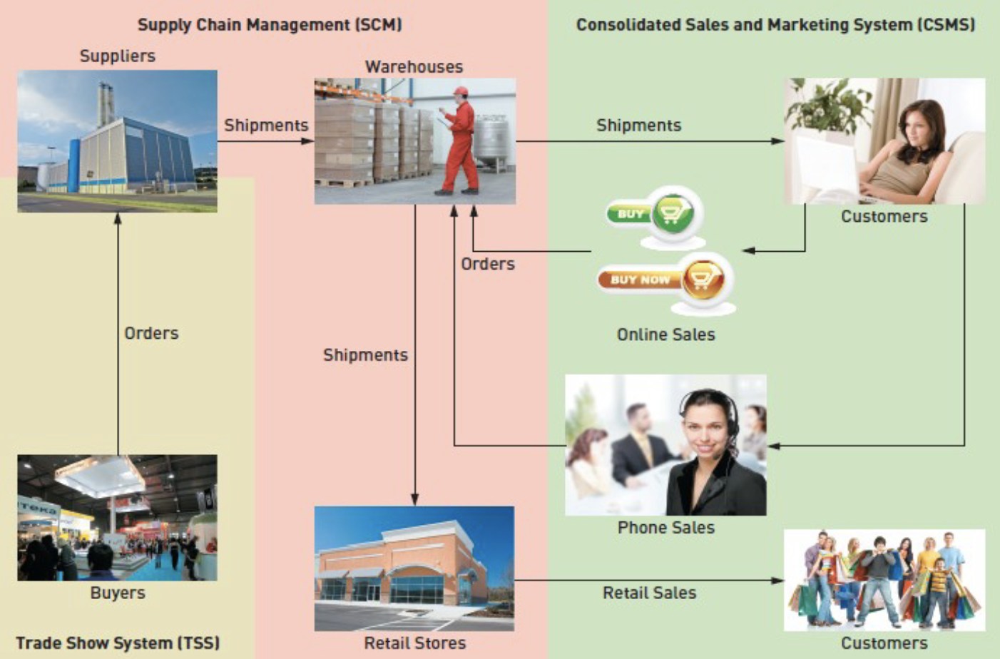
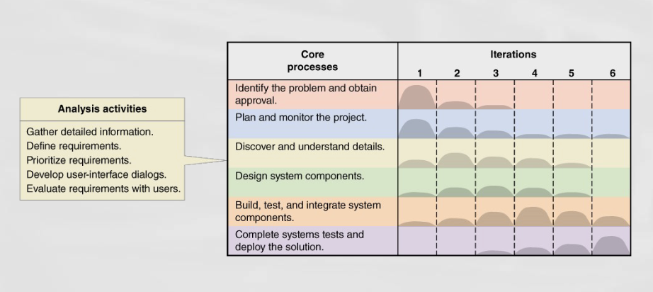
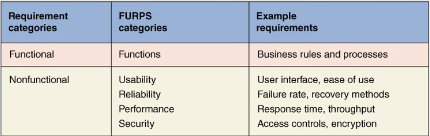
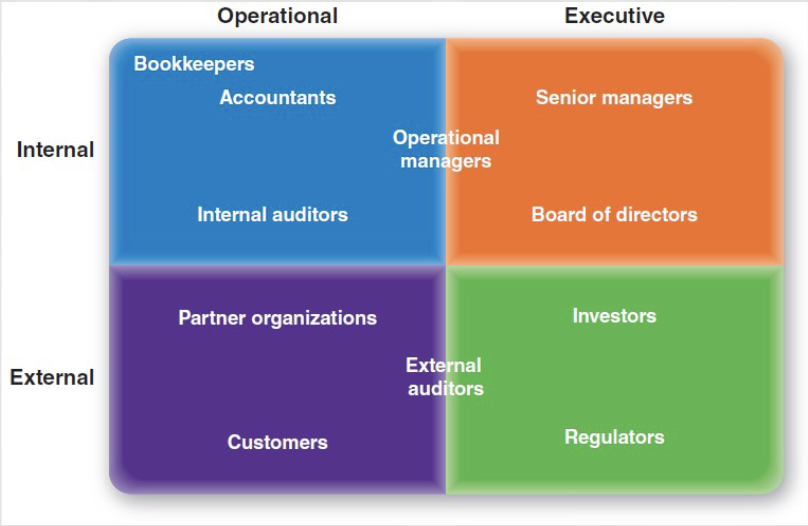
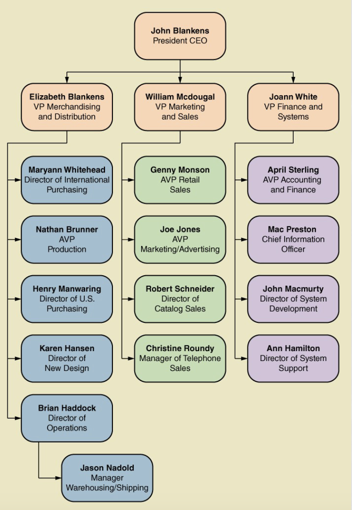
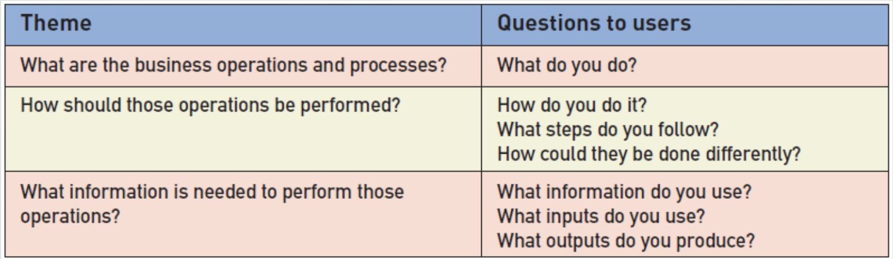

<!-- 

📋 This is the tech-news archives to help me keep track of what I am interested in!

- Reference tech news link: <https://thenextweb.com/news/blockchain-development-tech-career>
  

{{ notice-2 | markdownify }}
 -->

📋 This is my note-taking from what I learned in the class "Software Requirements Engng"
{: .notice--danger}

 

# Learning Objectives

- Describe the activities of systems analysis
- Explain the difference between functional and nonfunctional requirements
- Identify and understand different kinds of stakeholders and their contributions to requirements definition
- Describe information-gathering techniques and determine when each is best applied
- Describe the role of models in systems analysis
- Develop UML activity diagrams to model workflows

 

# Ridgeline Mountain Outfitters (RMO)

- RMO has an elaborate set of information systems that support operations and management
- Customer expectations, modern technological capabilities, and competitive pressures led RMO to believe it is time to upgrade support for sales and marketing
- A new Consolidated Sales and Marketing System was proposed
- This is a major project that grew out of the RMO strategic planning process

 

# RMO Information Systems Strategic Plan

- `Technology architecture` &rarr; the set of computing hardware, network hardware and topology, and system software employed by the organization
- `Application architecture` &rarr; the information systems that supports the organization (information systems, subsystems, and supporting technology)

 

# RMO Existing Application Architecture

- Supply Chain Management (SCM)
  : - 5 years old; Java/Oracle
  : - Trade Show system will interface with SCM
- Phone/Mail Order System
  : - 12 years old; Visual Studio/MS SQL
  : - Reached capacity; minimal integration
- Retail Store System
  : - Older package solution; minimal integration
- Customer Support System (CSS)
  : - Web based system; evolved over the years, minimal integration

 

# Proposed Application Architecture: Integrate SCM and New CSMS

 

# New Consolidated Sales and Marketing System (CSMS)

- Sales Subsystem
  : Integrates online, phone, and retail stores
- Order Fulfillment Subsystem
  : Track shipments, rate products and services
- Customer Account Subsystem
  : Shopping history, linkups, “mountain bucks” rewards
- Marketing Subsystem
  : Promotional packages, partner relationships, more complete merchandise information and reporting

 

# Systems Analysis Activities

- The New Consolidated Sales and Marketing System (CSMS) will require discovering and understanding extensive and complex business processes and business rules
- The SDLC indicates the project starts with identifying the problem, obtaining approval, and planning the project
- To get to the heart of systems analysis, this text skips right to analysis activities generally and the specifically for the RMO CSMS project (Core Process #3)
- Project planning and project management

## Involve discovery and understanding

- Gather Detailed Information
  : Interviews, questionnaires, documents, observing business processes, researching vendors, comments and suggestions
- Define Requirements
  : Modeling functional requirements and non-functional requirements
- Prioritize Requirements
  : Essential, important, vs. nice to have
- Develop User-Interface Dialogs
  : Flow of interaction between user and system
- Evaluate Requirements with Users
  : User involvement, feedback, adapt to changes

 

# What Are Requirements?

- System Requirements
  : - Functional requirements
  : - Non-functional requirements
- Functional Requirements - the activities the system must perform
  : - Business uses, functions the users carry out
  : - Shown as use cases
- Non-Functional Requirements – other system characteristics
  : - Constraints and performance goals

 

# FURPS+ Requirements Acronym

- `F`unctional requirements
- `U`sability requirements
- `R`eliability requirements
- `P`erformance requirements
- `S`ecurity requirements
- `+` even more categories...

 

# Additional Requirements Categories

- Design constraints
  : Specific restrictions for hardware and software
- Implementation requirements
  : Specific languages, tools, protocols, etc.
- Interface requirements
  : Interface links to other systems
- Physical requirements
  : Physical facilities and equipment constraints
- Supportability requirements
  : Automatic updates and enhancement methods

 

# Stakeholders - `Who do you involve and talk to?`

- Stakeholders: persons who have an interest in the successful implementation of the system
- Internal Stakeholders: persons within the organization
- External stakeholders: persons outside the organization
- Operational stakeholders: persons who regularly interact with the system
- Executive stakeholders: persons who don’t directly interact, but use the information or have financial interest

 

# Stakeholders `of a comprehensive accounting system for public company`

 

# Stakeholders `For RMO CSMS Project`

- Phone/mail sales order clerks
- Warehouse and shipping personnel
- Marketing personnel who maintain online catalog information
- Marketing, sales, accounting, and financial managers
- Senior executives
- Customers
- External shippers (e.g., UPS and FedEx)

 

# RMO Internal Stakeholders

 

# Information Gathering Techniques

- Interviewing users and other stakeholders
- Distributing and collecting questionnaires
- Reviewing inputs, outputs, and documentation
- Observing and documenting business procedures
- Researching vendor solutions
- Collecting active user comments and suggestions

 

# Interviewing Users and Other Stakeholders

- Prepare detailed questions
- Meet with individuals or groups of users
- Obtain and discuss answers to the questions
- Document the answers
- Follow up as needed in future meetings or interviews

 

# Themes for Information Gathering Questions

 

---

 

    🖋️ This is my self-taught blog! Feel free to let me know
    if there are some errors or wrong parts 😆

[Back to Top](#){: .btn .btn--primary }{: .align-right}
